# 🧬 SOTA ARCHITECTURE & DEPENDENCY GRAPH (AST LEVEL 5)
> **Contexto Base**: `[CONTEX] C_Users_Windows_Desktop_main_simplificado_escuta_e_servidor_rodando 11-01-2026 21-49-27.txt `
> **Precisão**: AST (Abstract Syntax Tree) para Python + Advanced Regex para JS/TS/Go
> **Timestamp**: 2026-01-11 21:49:36

---

## 1. 🕸️ Grafo de Dependências Real
Quem importa quem. Esta visão é gerada analisando imports no código.

```mermaid
graph TD
    subgraph Configuration [Configuration]
    configpy[config.py]
    configpy[config.py]
    configjson[config.json]
    configjson[config.json]
    configpy[config.py]
    end
    strategiespy -->|imports| stats
    strategiespy -->|imports| fft
    strategiespy -->|imports| model
    mainpy -->|imports| app_controller
    mainpy -->|imports| main_window
    app_controllerpy -->|imports| game_state
    app_controllerpy -->|imports| simulation
    app_controllerpy -->|imports| core
    game_statepy -->|imports| core
    game_statepy -->|imports| logic
    game_statepy -->|imports| persistence
    game_statepy -->|imports| cinematica
    game_statepy -->|imports| microservico
    simulationpy -->|imports| core
    simulationpy -->|imports| game_state
    persistencepy -->|imports| core
    logicpy -->|imports| core
    diagnosticopy -->|imports| core
    diagnosticopy -->|imports| core
    diagnosticopy -->|imports| core
    diagnosticopy -->|imports| gui
    diagnosticopy -->|imports| gui
    extrator_apostas_guipy -->|imports| service
    extrator_apostas_guipy -->|imports| options
    extrator_apostas_guipy -->|imports| by
    extrator_apostas_guipy -->|imports| ui
    extrator_apostas_guipy -->|imports| support
    extrator_iframe_guipy -->|imports| service
    extrator_iframe_guipy -->|imports| options
    extrator_iframe_guipy -->|imports| by
    extrator_iframe_guipy -->|imports| ui
    extrator_iframe_guipy -->|imports| support
    extrator_manual_guipy -->|imports| service
    extrator_manual_guipy -->|imports| options
    extrator_manual_guipy -->|imports| by
    extrator_manual_guipy -->|imports| chrome
    extrator_selenium_guipy -->|imports| service
    extrator_selenium_guipy -->|imports| options
    extrator_selenium_guipy -->|imports| by
    extrator_selenium_guipy -->|imports| ui
    extrator_selenium_guipy -->|imports| support
    run_guipy -->|imports| gui
    testar_sistemapy -->|imports| core
    testar_sistemapy -->|imports| gui
    test_guipy -->|imports| gui
    test_guipy -->|imports| styles
    test_guipy -->|imports| config
    test_guipy -->|imports| url_input
    test_guipy -->|imports| progress_bar
    bridgepy -->|imports| game_state
    bridgepy -->|imports| simulation
    main_windowpy -->|imports| url_input
    main_windowpy -->|imports| progress_bar
    main_windowpy -->|imports| log_viewer
    main_windowpy -->|imports| options_panel
    main_windowpy -->|imports| results_panel
    test_agente_07py -->|imports| options
    element_capturepy -->|imports| by
    element_capturepy -->|imports| webelement
    examplepy -->|imports| options
    examplepy -->|imports| options
    examplepy -->|imports| options
    full_page_capturepy -->|imports| by
    click_capturerpy -->|imports| by
    click_capturerpy -->|imports| action_chains
    focus_capturerpy -->|imports| by
    focus_capturerpy -->|imports| keys
    hover_capturerpy -->|imports| by
    hover_capturerpy -->|imports| action_chains
    scroll_capturerpy -->|imports| by
    servicepy -->|imports| by
    servicepy -->|imports| by
    legacypy -->|imports| stats
    legacypy -->|imports| fft
    legacypy -->|imports| model
    legacypy -->|imports| logic
    legacypy -->|imports| core
    stylespy -->|imports| core
    input_panelpy -->|imports| core
    input_panelpy -->|imports| simulation
    input_panelpy -->|imports| simulation
    results_panelpy -->|imports| styles
    results_panelpy -->|imports| core
    analysis_tabpy -->|imports| styles
    microservice_tabpy -->|imports| styles
    microservice_tabpy -->|imports| core
    strategies_tabpy -->|imports| styles
    subgraph External [Dependências Externas]
    requests[requests]
    numpy[numpy]
    end
```

---

## 2. 🧪 Definições e Símbolos (AST Extractions)
Principais classes e funções detectadas com precisão de compilador:

### 📄 `analisador_screenshot.py`
- `Const: SCREENSHOT_DATA = ...`
- `Func: calcular_posicao_temporal(linha_idx: int, col_idx: int) -> int`
- `Func: analisar_estatisticas_linhas()`
- `Func: identificar_estrutura()`
- `Func: extrair_sequencia_resultados()`
- `Func: main()`

### 📄 `analisar_historico.py`
- `Func: analisar_janelas(forcas, nome)`

### 📄 `analise_resultados_backtest.py`
- `Func: analisar_resultados()`

### 📄 `app_controller.py`
- `Class: AppController`
  - `Method: __init__()`
  - `Method: register_ui(main_window)`
  - `Method: start_simulation()`
  - `Method: stop_simulation()`
  - `Method: atualizar_ui(ultimo_numero: dict, resultado_analise: dict)`
- `Func: __init__()`
- `Func: register_ui(main_window)`
- `Func: start_simulation()`
- `Func: stop_simulation()`
- `Func: atualizar_ui(ultimo_numero: dict, resultado_analise: dict)`

### 📄 `backtest_completo_modelos.py`
- `Const: CUSTO_POR_NUMERO = 0.5`
- `Const: PAYOUT_FACTOR = 36`
- `Const: NUMEROS_POR_ESTRATEGIA = ...`
- `Class: ResultadoEstrategia`
  - `Field: jogada_idx: int`
  - `Field: numero_sorteado: int`
  - `Field: estrategia: str`
  - `Field: filtro: Optional[str]`
  - `Field: acertou: bool`
- `Class: MetricasEstrategia`
  - `Field: nome: str`
  - `Field: filtro: Optional[str]`
  - `Field: total_jogadas: int`
  - `Field: acertos: int`
  - `Field: erros: int`
  - `Method: adicionar_resultado(resultado: ResultadoEstrategia)`
  - `Method: calcular_roi_medio(janela: int) -> float`
  - `Method: calcular_win_rate(janela: int) -> float`
  - `Method: calcular_sharpe_ratio(janela: int) -> float`
  - `Method: calcular_momentum(janela: int) -> float`
- `Enum: ModeloSelecao`
  - `Value: ROI_MEDIO_SIMPLES_4 = 'roi_medio_4'`
  - `Value: ROI_MEDIO_SIMPLES_6 = 'roi_medio_6'`
  - `Value: ROI_MEDIO_SIMPLES_9 = 'roi_medio_9'`
  - `Value: ROI_MEDIO_SIMPLES_12 = 'roi_medio_12'`
  - `Value: ENSEMBLE = 'ensemble'`
- `Func: adicionar_resultado(resultado: ResultadoEstrategia)`
- `Func: calcular_roi_medio(janela: int) -> float`
- `Func: calcular_win_rate(janela: int) -> float`
- `Func: calcular_sharpe_ratio(janela: int) -> float`
- `Func: calcular_momentum(janela: int) -> float`

### 📄 `causalidade_reversa_filter.py`
- `Const: CYCLE_LENGTH = 45`
- `Const: MODO_APRENDIZADO_THRESHOLD = 5`
- `Const: SIGNATURE_RADIUS = 5`
- `Class: AssinaturaJerk`
  - `Field: centro: int`
  - `Field: votos: int`
  - `Field: ultimo_visto: int`
  - `Field: forca_antes: Optional[int]`
  - `Field: forca_depois: Optional[int]`
  - `Method: esta_perto(jerk: int, raio: int) -> bool`
  - `Method: reforcar(jerk_novo: int, step: int, f_antes: int)`
  - `Method: is_confiavel() -> bool`
  - `Method: to_dict() -> Dict`
- `Class: VereDict`
  - `Field: indice: int`
  - `Field: forca_original: int`
  - `Field: accel_original: int`
  - `Field: jerk_original: int`
  - `Field: jerk_valido: bool`
- `Class: BatchResult`
  - `Field: forcas_originais: List[int]`
  - `Field: accels_originais: List[int]`
  - `Field: jerks_originais: List[int]`
  - `Field: forcas_validadas: List[int]`
  - `Field: accels_validadas: List[int]`
  - `Method: to_dict() -> Dict`
- `Class: CausalidadeReversaFilter`
  - `Method: __init__(sentido: str, cycle_length: int)`
  - `Method: _encontrar_assinatura_proxima(jerk: int) -> Optional[int]` (private)
  - `Method: _encontrar_assinatura_livre() -> Optional[int]` (private)
  - `Method: _encontrar_assinatura_mais_fraca() -> int` (private)
  - `Method: _encontrar_assinatura_mais_proxima_confiavel(jerk: int) -> Optional[Tuple[?]]` (private)
- `Class: CausalidadeReversaPipeline`
  - `Method: __init__(cycle_length: int)`
  - `Method: processar_batch(forcas: List[int], accels: List[int], jerks: List[int]) -> BatchResult`
  - `Method: get_status() -> Dict`
  - `Method: reset_completo(motivo: str) -> None`
  - `Method: print_status() -> None`
- `Func: esta_perto(jerk: int, raio: int) -> bool`
- `Func: reforcar(jerk_novo: int, step: int, f_antes: int)`
- `Func: is_confiavel() -> bool`
- `Func: to_dict() -> Dict`
- `Func: to_dict() -> Dict`

### 📄 `cinematica_db.py`
- `Const: MAX_ITEMS = 45`
- `Const: ARQUIVO_PERSISTENCIA = 'cinematica_db.json'`
- `Class: SeriesCinematica`
  - `Field: nome: str`
  - `Field: sentido: str`
  - `Field: tipo: str`
  - `Field: dados: List[float]`
  - `Field: max_items: int`
  - `Method: adicionar(valor: float) -> None`
  - `Method: obter_ultimos(n: int) -> List[float]`
  - `Method: obter_todos() -> List[float]`
  - `Method: tamanho() -> int`
  - `Method: to_dict() -> Dict`
- `Class: CinematicaDB`
  - `Value: ARQUIVO_PERSISTENCIA = 'cinematica_db.json'`
  - `Method: __init__(caminho_arquivo: str)`
  - `Method: adicionar_jogada(forca: float, sentido: str) -> Dict`
  - `Method: obter_series(sentido: str) -> Dict[?]`
  - `Method: obter_ultimas(sentido: str, n_forcas: int, n_accs: int) -> Dict`
  - `Method: sincronizar_com_banco_completo(banco_de_dados_completo: List[Dict]) -> None`
- `Func: adicionar(valor: float) -> None`
- `Func: obter_ultimos(n: int) -> List[float]`
- `Func: obter_todos() -> List[float]`
- `Func: tamanho() -> int`
- `Func: to_dict() -> Dict`

### 📄 `comparativo_memoria.py`
- `Const: ROULETTE_WHEEL_ORDER = ...`
- `Func: get_vizinhos(numero, raio)`
- `Func: calcular_destino(posicao_inicial, forca, sentido)`
- `Func: prever_SEM_memoria(forcas_sentido, posicao_atual, sentido_int)`
- `Func: prever_COM_memoria(forcas_sentido, todas_forcas_sentido, posicao_atual)`

### 📄 `config.py`
- `Const: SUPPORTED_FORMATS = ...`
- `Const: DEFAULT_OUTPUT_DIR = 'output/reports'`
- `Const: MAX_FILES_IN_TABLE = 100`

### 📄 `diagnostico.py`
- `Func: log(msg)`

### 📄 `exemplo_fluxo_dados.py`
- `Const: ROULETTE_WHEEL_ORDER = ...`

### 📄 `firebase_manager.py`
- `Const: FIREBASE_AVAILABLE = True`
- `Const: FIREBASE_AVAILABLE = False`
- `Class: FirebaseManager`
  - `Method: __init__(output_queue: Queue)`
  - `Method: initialize() -> bool`
  - `Method: _on_snapshot(doc_snapshot, changes, read_time)` (private)
  - `Method: start_listener()`
  - `Method: stop_listener()`
- `Func: __init__(output_queue: Queue)`
- `Func: initialize() -> bool`
- `Func: _on_snapshot(doc_snapshot, changes, read_time)`
- `Func: start_listener()`
- `Func: stop_listener()`

### 📄 `force_clustering.py`
- `Class: ClusterResult`
  - `Field: centro: int`
  - `Field: range_min: int`
  - `Field: range_max: int`
  - `Field: membros: List[int]`
  - `Field: count: int`
- `Class: ForceClustering`
  - `Method: __init__(gravidade: int, minimo: int)`
  - `Method: _encontrar_melhor_cluster(forcas: List[int], excluir: List[int]) -> Optional[ClusterResult]` (private)
  - `Method: classificar(forcas: List[int]) -> Dict`
  - `Method: classificar_forca(forca: int, clusters: Dict) -> Tuple[?]`
  - `Method: obter_predominantes(clusters: Dict) -> List[str]`
- `Func: __init__(gravidade: int, minimo: int)`
- `Func: _encontrar_melhor_cluster(forcas: List[int], excluir: List[int]) -> Optional[ClusterResult]`
- `Func: classificar(forcas: List[int]) -> Dict`
- `Func: classificar_forca(forca: int, clusters: Dict) -> Tuple[?]`
- `Func: obter_predominantes(clusters: Dict) -> List[str]`

### 📄 `force_cluster_analyzer.py`
- `Const: PESO_BASE = 0.35`
- `Const: PESO_TENDENCIA = 0.5`
- `Const: PESO_JERK = 0.15`
- `Class: ClusterForca`
  - `Method: __init__(nome: str, centro: float, membros: List[float])`
- `Class: AnalisadorClustersBidirecional`
  - `Method: __init__(raio_gravitacional: float)`
  - `Method: _identificar_clusters_sentido(forcas: List[float], sentido: str) -> Dict[?]` (private)
  - `Method: identificar_clusters_bidirecionais(forcas_horario: List[float], forcas_anti_horario: List[float]) -> Dict[?]`
  - `Method: _classificar_forca(forca: float, clusters: Dict[?]) -> str` (private)
  - `Method: gerar_sequencias_ui(forcas_horario: List[float], forcas_anti_horario: List[float], n: int) -> Dict[?]`
- `Func: __init__(nome: str, centro: float, membros: List[float])`
- `Func: __init__(raio_gravitacional: float)`
- `Func: _identificar_clusters_sentido(forcas: List[float], sentido: str) -> Dict[?]`
- `Func: identificar_clusters_bidirecionais(forcas_horario: List[float], forcas_anti_horario: List[float]) -> Dict[?]`
- `Func: _classificar_forca(forca: float, clusters: Dict[?]) -> str`

### 📄 `force_kalman.py`
- `Const: F = self._criar_matriz_transicao(...)`
- `Const: Q = self._criar_matriz_ruido_processo(...)`
- `Const: S = ...`
- `Class: KalmanState`
  - `Field: x: np.ndarray`
  - `Field: P: np.ndarray`
- `Class: KalmanFilter`
  - `Method: __init__(ruido_processo: float, ruido_medicao: float, dt_default: float)`
  - `Method: _criar_matriz_transicao(dt: float) -> np.ndarray` (private)
  - `Method: _criar_matriz_ruido_processo(dt: float) -> np.ndarray` (private)
  - `Method: inicializar(posicao: float, velocidade: float, aceleracao: float)`
  - `Method: predict(dt: Optional[float]) -> np.ndarray`
- `Func: __init__(ruido_processo: float, ruido_medicao: float, dt_default: float)`
- `Func: _criar_matriz_transicao(dt: float) -> np.ndarray`
- `Func: _criar_matriz_ruido_processo(dt: float) -> np.ndarray`
- `Func: inicializar(posicao: float, velocidade: float, aceleracao: float)`
- `Func: predict(dt: Optional[float]) -> np.ndarray`

### 📄 `force_kalman_integration.py`
- `Const: PESO_VPS = 2.0`
- `Const: USAR_MEMORIA_PADROES = False`
- `Class: RegistroCircular`
  - `Field: timestamp: datetime`
  - `Field: posicao_inicial: int`
  - `Field: posicao_parada: int`
  - `Field: angulo_inicial: float`
  - `Field: angulo_parada: float`
  - `Method: to_dict() -> dict`
- `Class: MemoriaCircularBidirecional`
  - `Method: __init__(capacidade_maxima: int)`
  - `Method: _criar_estrutura_stats() -> dict` (private)
  - `Method: adicionar_observacao(registro: RegistroCircular)`
  - `Method: _atualizar_estatisticas(linha: deque, stats: dict)` (private)
  - `Method: buscar_padroes_similares(posicao_inicial: int, sentido: int, forcas_atuais: List[float]) -> List[RegistroCircular]`
- `Class: FiltroKalmanCircularComMemoria`
  - `Method: __init__(num_posicoes: int, janela_gravitacional: int)`
  - `Method: sincronizar_memoria(dados_sistema: list)`
  - `Method: _criar_estado_inicial() -> dict` (private)
  - `Method: _posicao_para_angulo(posicao: int) -> float` (private)
  - `Method: _angulo_para_posicao(theta: float) -> int` (private)
- `Func: to_dict() -> dict`
- `Func: __init__(capacidade_maxima: int)`
- `Func: _criar_estrutura_stats() -> dict`
- `Func: adicionar_observacao(registro: RegistroCircular)`
- `Func: _atualizar_estatisticas(linha: deque, stats: dict)`

### 📄 `force_predictor.py`
- `Class: ResultadoPredicao`
  - `Field: posicao_prevista: int`
  - `Field: posicao_absoluta_prevista: float`
  - `Field: forcas_predominantes: List[str]`
  - `Field: padrao: str`
  - `Field: confianca: float`
- `Class: ForcePredictor`
  - `Method: __init__(db_path: str)`
  - `Method: _desenrolar_posicao(posicao_final: int, direcao: int) -> Tuple[?]` (private)
  - `Method: _calcular_derivadas(jogada: Jogada) -> Derivada` (private)
  - `Method: _atualizar_clusters()` (private)
  - `Method: _classificar_jogada(jogada: Jogada) -> Tuple[?]` (private)
- `Func: __init__(db_path: str)`
- `Func: _desenrolar_posicao(posicao_final: int, direcao: int) -> Tuple[?]`
- `Func: _calcular_derivadas(jogada: Jogada) -> Derivada`
- `Func: _atualizar_clusters()`
- `Func: _classificar_jogada(jogada: Jogada) -> Tuple[?]`

### 📄 `force_predictor_db.py`
- `Const: DEFAULT_CONFIG = ...`
- `Class: Jogada`
  - `Field: id: Optional[int]`
  - `Field: timestamp: int`
  - `Field: posicao_inicial: int`
  - `Field: posicao_final: int`
  - `Field: voltas_por_segundo: Optional[float]`
- `Class: Derivada`
  - `Field: jogada_id: int`
  - `Field: delta_t: float`
  - `Field: velocidade: float`
  - `Field: aceleracao: float`
  - `Field: arranco: float`
- `Class: Cluster`
  - `Field: id: int`
  - `Field: nome: str`
  - `Field: centro: Optional[int]`
  - `Field: range_min: Optional[int]`
  - `Field: range_max: Optional[int]`
- `Class: EstadoKalman`
  - `Field: id: int`
  - `Field: posicao_estimada: float`
  - `Field: velocidade_estimada: float`
  - `Field: aceleracao_estimada: float`
  - `Field: matriz_P: str`
- `Class: Predicao`
  - `Field: id: Optional[int]`
  - `Field: timestamp_predicao: int`
  - `Field: jogada_alvo: Optional[int]`
  - `Field: posicao_prevista: int`
  - `Field: forca_prevista: str`
- `Class: ForcePredictorDB`
  - `Method: __init__(db_path: str)`
  - `Method: _connect()` (private)
  - `Method: _create_tables()` (private)
  - `Method: _initialize_config()` (private)
  - `Method: _initialize_clusters()` (private)
- `Func: __init__(db_path: str)`
- `Func: _connect()`
- `Func: _create_tables()`
- `Func: _initialize_config()`
- `Func: _initialize_clusters()`

### 📄 `force_predictor_integration.py`
- `Const: GRAVIDADE = 5`
- `Const: RAIO = ...`
- `Const: MINIMO = 2`
- `Class: ForcePredictorIntegrationV2`
  - `Field: _instance: Optional[ForcePredictorIntegrationV2]`
  - `Method: get_instance() -> ForcePredictorIntegrationV2`
  - `Method: __init__()`
  - `Method: sincronizar_com_historico(banco_de_dados_completo: List[Dict])`
  - `Method: processar_jogada(posicao_estator: int, direcao: str, is_outlier: bool) -> ResultadoPredicaoV2`
  - `Method: get_clusters_para_direcao_alvo(direcao_alvo: str) -> Dict`
- `Func: get_instance() -> ForcePredictorIntegrationV2`
- `Func: __init__()`
- `Func: sincronizar_com_historico(banco_de_dados_completo: List[Dict])`
- `Func: processar_jogada(posicao_estator: int, direcao: str, is_outlier: bool) -> ResultadoPredicaoV2`
- `Func: get_clusters_para_direcao_alvo(direcao_alvo: str) -> Dict`

### 📄 `force_predictor_v2.py`
- `Class: ResultadoPredicaoV2`
  - `Field: direcao: str`
  - `Field: posicao_prevista: int`
  - `Field: posicao_absoluta_prevista: float`
  - `Field: forcas_predominantes: List[str]`
  - `Field: padrao: str`
- `Class: LinhaDirecional`
  - `Method: __init__(direcao: str, partes_estator: int)`
  - `Method: processar_jogada(posicao_estator: int, is_outlier: bool, delta_t: float) -> Dict`
  - `Method: prever_proxima(delta_t_futuro: float) -> Dict`
  - `Method: get_clusters() -> Dict`
  - `Method: get_estado() -> Dict`
- `Class: ForcePredictorV2`
  - `Method: __init__(partes_estator: int)`
  - `Method: _get_linha(direcao: str) -> LinhaDirecional` (private)
  - `Method: processar_jogada(posicao_estator: int, direcao: str, is_outlier: bool) -> ResultadoPredicaoV2`
  - `Method: get_previsao_direcao(direcao: str) -> Dict`
  - `Method: get_estado_completo() -> Dict`
- `Func: __init__(direcao: str, partes_estator: int)`
- `Func: processar_jogada(posicao_estator: int, is_outlier: bool, delta_t: float) -> Dict`
- `Func: prever_proxima(delta_t_futuro: float) -> Dict`
- `Func: get_clusters() -> Dict`
- `Func: get_estado() -> Dict`

### 📄 `limpar_cache.py`
- `Func: limpar_cache()`

### 📄 `logic.py`
- `Class: RouletteLogic`
  - `Method: __init__()`
  - `Method: calcular_distancia_giro(num_anterior: int, num_atual: int, direcao: str) -> Optional[int]`
  - `Method: calcular_centro_alvo(num_anterior: int, forca: int, direcao_alvo: str) -> int`
  - `Method: get_roulette_region(center_number: int, num_neighbors: int) -> List[int]`
  - `Method: get_roulette_region_visual(center_number: int, num_neighbors: int) -> str`
- `Func: __init__()`
- `Func: calcular_distancia_giro(num_anterior: int, num_atual: int, direcao: str) -> Optional[int]`
- `Func: calcular_centro_alvo(num_anterior: int, forca: int, direcao_alvo: str) -> int`
- `Func: get_roulette_region(center_number: int, num_neighbors: int) -> List[int]`
- `Func: get_roulette_region_visual(center_number: int, num_neighbors: int) -> str`

### 📄 `main.py`
- `Func: setup_logging()`
- `Func: load_config() -> dict`
- `Func: async main()`
- `Func: on_new_result(data)`
- `Func: signal_handler(sig, frame)`

### 📄 `managers.py`
- `Class: NovaJogadaInfo`
  - `Field: numero: int`
  - `Field: fonte: str`
  - `Field: direcao: str`
  - `Field: dealer: str`
  - `Field: modelo: str`
- `Class: LogContext`
  - `Field: numero_sorteado: int`
  - `Field: aposta_realizada: bool`
  - `Field: vitoria: bool`
  - `Field: resultado_financeiro: float`
  - `Field: fonte: str`
- `Class: SimulationManager`
  - `Method: __init__(ui_builder, game_state_manager)`
  - `Method: _simulation_loop()` (private)
  - `Method: toggle_simulacao()`
- `Class: GameStateManager`
  - `Method: __init__(ui_builder, logic_module, persistence_module)`
  - `Method: registrar_estrategia(estrategia_obj)`
  - `Method: load_initial_state()`
  - `Method: apply_loaded_ui_state()`
  - `Method: on_closing()`
- `Func: __init__(ui_builder, game_state_manager)`
- `Func: _simulation_loop()`
- `Func: toggle_simulacao()`
- `Func: __init__(ui_builder, logic_module, persistence_module)`
- `Func: registrar_estrategia(estrategia_obj)`

### 📄 `microservico_db.py`
- `Const: DB_FILE = 'microservico_datalake.db'`
- `Const: MAX_HISTORICO = 45`
- `Class: PrevisaoMicroservico`
  - `Field: id: int`
  - `Field: timestamp: str`
  - `Field: sentido: str`
  - `Field: posicao_partida: int`
  - `Field: forca_vicio: float`
  - `Method: to_dict() -> dict`
- `Class: EstatisticasSentido`
  - `Field: sentido: str`
  - `Field: total_previsoes: int`
  - `Field: total_acertos: int`
  - `Field: total_erros: int`
  - `Field: acertos_vicio: int`
  - `Method: taxa_acerto() -> float`
  - `Method: roi() -> float`
- `Class: MicroservicoDB`
  - `Method: __init__(db_file: str)`
  - `Method: _init_database()` (private)
  - `Method: gravar_previsao(previsao: PrevisaoMicroservico) -> int`
  - `Method: _limpar_historico_antigo(conn, sentido: str)` (private)
  - `Method: atualizar_resultado(previsao_id: int, numero_real: int) -> Dict`
- `Func: to_dict() -> dict`
- `Func: taxa_acerto() -> float`
- `Func: roi() -> float`
- `Func: __init__(db_file: str)`
- `Func: _init_database()`

### 📄 `persistence.py`
- `Class: DataPersistence`
  - `Method: __init__(sda_vetor_names: List[str])`
  - `Method: _get_db_conn()` (private)
  - `Method: setup_datalake()`
  - `Method: log_performance_vetores(registro_completo: Dict[?])`
  - `Method: save_data(state: Dict[?])`
- `Func: __init__(sda_vetor_names: List[str])`
- `Func: _get_db_conn()`
- `Func: setup_datalake()`
- `Func: log_performance_vetores(registro_completo: Dict[?])`
- `Func: save_data(state: Dict[?])`

### 📄 `processador_dados_completo.py`
- `Class: ResultadoJogada`
  - `Field: pos_temporal: int`
  - `Field: linha: int`
  - `Field: coluna: int`
  - `Field: numero: int`
  - `Field: resultado: str`
- `Class: HistoricoEstrategia`
  - `Field: nome: str`
  - `Field: resultados: List[ResultadoJogada]`
  - `Field: roi_historico: List[float]`
  - `Field: historico_gatilhos: List[bool]`
  - `Method: calcular_roi_medio(janela: int) -> float`
  - `Method: calcular_win_rate(janela: int) -> float`
- `Func: calcular_roi_medio(janela: int) -> float`
- `Func: calcular_win_rate(janela: int) -> float`
- `Func: processar_dados_screenshot() -> Dict[?]`
- `Func: exportar_dados_para_analise()`
- `Func: main()`

### 📄 `realtime_jerk_filter.py`
- `Const: BUFFER_SIZE = 12`
- `Const: CYCLE_LENGTH = 45`
- `Const: WHEEL_SIZE = 37`
- `Class: VagaEstacionamento`
  - `Field: centro: int`
  - `Field: votos: int`
  - `Field: ultima_ocorrencia: int`
  - `Method: esta_perto(forca: int, raio: int) -> bool`
  - `Method: reforcar(forca_nova: int, step: int) -> None`
  - `Method: is_confiavel() -> bool`
- `Class: PointResult`
  - `Field: cycle_step: int`
  - `Field: sentido: str`
  - `Field: phase: str`
  - `Field: vagas_status: List[Dict]`
  - `Field: is_anomaly: bool`
  - `Method: to_dict() -> Dict`
- `Class: SingleDirectionFilter`
  - `Method: __init__(sentido: str, cycle_length: int)`
  - `Method: reset_ciclo(motivo: str) -> None`
  - `Method: reset_completo(motivo: str) -> None`
  - `Method: _encontrar_vaga_proxima(forca: int) -> Optional[int]` (private)
  - `Method: _encontrar_vaga_livre() -> Optional[int]` (private)
- `Class: RealTimeJerkFilter`
  - `Method: __init__(cycle_length: int)`
  - `Method: input_point(new_force: int, new_accel: int, new_jerk: int) -> PointResult`
  - `Method: get_status() -> Dict`
  - `Method: print_status() -> None`
  - `Method: reset_completo(motivo: str) -> None`
- `Func: esta_perto(forca: int, raio: int) -> bool`
- `Func: reforcar(forca_nova: int, step: int) -> None`
- `Func: is_confiavel() -> bool`
- `Func: to_dict() -> Dict`
- `Func: normalizar_forca(forca_raw: float) -> int`

### 📄 `setup_dev.py`
- `Func: run_command(cmd, description)`
- `Func: check_python_version()`
- `Func: check_venv()`
- `Func: main()`

### 📄 `simulador_modelos_ia.py`
- `Const: SCREENSHOT_DATA = ...`
- `Const: CUSTO_POR_NUMERO = 0.5`
- `Const: PAYOUT_FACTOR = 36`
- `Class: ResultadoEstrategia`
  - `Field: numero_sorteado: int`
  - `Field: estrategia: str`
  - `Field: acertou: bool`
  - `Field: roi: float`
  - `Field: score_clusters: Optional[int]`
- `Class: MetricasEstrategia`
  - `Field: nome: str`
  - `Field: total_jogadas: int`
  - `Field: acertos: int`
  - `Field: erros: int`
  - `Field: roi_total: float`
  - `Method: calcular_roi_medio(janela: int) -> float`
  - `Method: calcular_win_rate(janela: int) -> float`
  - `Method: calcular_sharpe_ratio(janela: int) -> float`
  - `Method: calcular_momentum(janela: int) -> float`
- `Enum: ModeloSelecao`
  - `Value: ROI_MEDIO_SIMPLES = 'roi_medio_simples'`
  - `Value: ENSEMBLE = 'ensemble'`
  - `Value: UCB = 'ucb'`
  - `Value: THOMPSON = 'thompson'`
  - `Value: VOTACAO = 'votacao'`
- `Func: calcular_roi_medio(janela: int) -> float`
- `Func: calcular_win_rate(janela: int) -> float`
- `Func: calcular_sharpe_ratio(janela: int) -> float`
- `Func: calcular_momentum(janela: int) -> float`
- `Func: extrair_dados_do_screenshot() -> Tuple[?]`

### 📄 `strategies.py`
- `Const: WHEEL_SIZE_FORCA = 37`
- `Const: GRAVIDADE = 4`
- `Const: GRAVIDADE_VARIACAO = 3`
- `Class: ContextoAnalise`
  - `Field: modo_leitura_forca: str`
  - `Field: vitoria_anterior: Optional[bool]`
  - `Field: sda_min_cluster_score: int`
  - `Field: sda_min_cluster_score_7: int`
  - `Field: sda_min_cluster_score_9: int`
- `Class: EstrategiaBase (ABC)`
  - `Method: __init__(nome: str, descricao: str, logic_module: RouletteLogic)`
  - `Method: analisar(historico: list[dict], contexto: ContextoAnalise) -> tuple[?]`
  - `Method: get_state() -> dict`
  - `Method: reset_from_saved_state(state: dict)`
- `Class: EstrategiaPelaForca (EstrategiaBase)`
  - `Method: __init__(logic_module: RouletteLogic)`
  - `Method: analisar(historico: list[dict], contexto: ContextoAnalise) -> tuple[?]`
- `Class: EstrategiaInerciaPreditiva (EstrategiaBase)`
  - `Method: __init__(logic_module: RouletteLogic)`
  - `Method: analisar(historico: list[dict], contexto: ContextoAnalise) -> tuple[?]`
- `Class: EstrategiaRessonanciaPolinomial (EstrategiaBase)`
  - `Method: __init__(logic_module: RouletteLogic)`
  - `Method: get_state()`
  - `Method: reset_from_saved_state(state: dict)`
  - `Method: _atualizar_confianca(vitoria_anterior: Optional[bool])` (private)
  - `Method: analisar(historico: list[dict], contexto: ContextoAnalise) -> tuple[?]`
- `Class: EstrategiaHibridaAdaptativa (EstrategiaBase)`
  - `Method: __init__(logic_module: RouletteLogic)`
  - `Method: _motor_cacador_de_padroes(forcas: List[int]) -> List[int]` (private)
  - `Method: _motor_ancora_de_sobrevivencia(forcas_alvo: List[int], forcas_opostas: List[int]) -> List[int]` (private)
  - `Method: _aplicar_deconflito_hierarquico(centros_candidatos: List[int], forcas: List[int], direcao_alvo: str) -> List[int]` (private)
  - `Method: analisar(historico: list[dict], contexto: ContextoAnalise) -> tuple[?]`
- `Class: EstrategiaHibridaAdaptativaAMPLA (EstrategiaHibridaAdaptativa)`
  - `Method: __init__(logic_module: RouletteLogic)`
  - `Method: analisar(historico: list[dict], contexto: ContextoAnalise) -> tuple[?]`
- `Class: EstrategiaSinergiaPreditiva (EstrategiaBase)`
  - `Method: __init__(logic_module: RouletteLogic)`
  - `Method: _calcular_centro_e_excluir_cesta(forca_candidata: int, forcas_disponiveis: Set[int], gravidade: int) -> Tuple[?]` (private)
  - `Method: _resolver_deconflito_regional_18_numeros(centros_candidatos: List[int], num_anterior: int, direcao_alvo: str) -> List[int]` (private)
  - `Method: analisar(historico: list[dict], contexto: ContextoAnalise) -> tuple[?]`
- `Class: EstrategiaSinergiaDirecionalAvancada (EstrategiaBase)`
  - `Method: __init__(logic_module: RouletteLogic, persistence_module: DataPersistence, raio_gravidade: int)`
  - `Method: _formatar_detalhes_ui_cluster_forca(forcas_alvo: List[int], nucleo_aposta: int, melhor_forca: int) -> Dict[?]` (private)
  - `Method: analisar(historico: list[dict], contexto: ContextoAnalise) -> tuple[?]`
  - `Method: _analisar_com_variacoes(historico: list[dict], contexto: ContextoAnalise) -> tuple[?]` (private)
  - `Method: _analisar_variacao_unica(historico: list[dict], contexto: ContextoAnalise) -> tuple[?]` (private)
- `Class: EstrategiaSDAGemea (EstrategiaBase)`
  - `Value: WHEEL_SIZE_FORCA = 37`
  - `Value: GRAVIDADE = 4`
  - `Value: GRAVIDADE_VARIACAO = 3`
  - `Method: __init__(logic_module: RouletteLogic)`
  - `Method: _calcular_variacao_circular(forca_anterior: int, forca_atual: int) -> int` (private)
  - `Method: _calcular_variacoes(forcas: List[int]) -> List[int]` (private)
  - `Method: _detectar_e_remover_outliers(forcas: List[int], limiar: int) -> Tuple[?]` (private)
  - `Method: _calcular_distancia_circular_forca(f1: int, f2: int) -> int` (private)
- `Class: EstrategiaSinergiaDirecionalAvancadaEspelho (EstrategiaBase)`
  - `Method: __init__(logic_module: RouletteLogic)`
  - `Method: _buscar_regiao_proxima_sem_conflito(centro_original: int, regioes_ocupadas: set, num_vizinhos: int) -> int` (private)
  - `Method: _resolver_deconflito_espelho(centros_candidatos: List[int], num_anterior: int, direcao_alvo: str) -> List[int]` (private)
  - `Method: analisar(historico: list[dict], contexto: ContextoAnalise) -> tuple[?]`
  - `Method: atualizar_performance_espelho(numero_sorteado: int, numeros_apostados: List[int], ganho: float)`
- `Class: KalmanFilter`
  - `Method: __init__(x0, P, R)`
  - `Method: process(Z)`
- `Func: __init__(nome: str, descricao: str, logic_module: RouletteLogic)`
- `Func: analisar(historico: list[dict], contexto: ContextoAnalise) -> tuple[?]`
- `Func: get_state() -> dict`
- `Func: reset_from_saved_state(state: dict)`
- `Func: __init__(logic_module: RouletteLogic)`

### 📄 `strategy_bridge.py`
- `Const: MAX_FORCAS_EXTRAIR = 12`
- `Class: DadosExtraidos`
  - `Field: forcas_horario: List[float]`
  - `Field: forcas_antihorario: List[float]`
  - `Field: total_jogadas: int`
  - `Field: total_outliers: int`
  - `Field: sentido_mais_recente: Optional[str]`
  - `Method: to_dict() -> dict`
- `Class: BridgeOutput`
  - `Field: target_forces: List[float]`
  - `Field: forcas_usadas: List[float]`
  - `Field: sentido_usado: str`
  - `Field: sanitizer_output: Optional[Dict]`
  - `Field: profiler_output: Optional[Dict]`
  - `Method: to_dict() -> dict`
  - `Method: to_json(indent: int) -> str`
- `Class: DataExtractor`
  - `Method: __init__(max_forcas: int)`
  - `Method: extrair(banco_de_dados_completo: List[Dict]) -> DadosExtraidos`
  - `Method: obter_forcas_para_sentido(dados: DadosExtraidos, sentido: str) -> List[float]`
- `Class: StrategyBridge`
  - `Method: __init__()`
  - `Method: executar_pipeline(banco_de_dados_completo: List[Dict], sentido_proxima_jogada: str) -> BridgeOutput`
  - `Method: executar_ambos_sentidos(banco_de_dados_completo: List[Dict]) -> Dict[?]`
- `Func: to_dict() -> dict`
- `Func: to_dict() -> dict`
- `Func: to_json(indent: int) -> str`
- `Func: __init__(max_forcas: int)`
- `Func: extrair(banco_de_dados_completo: List[Dict]) -> DadosExtraidos`

### 📄 `strategy_microservice.py`
- `Const: ROULETTE_WHEEL_ORDER = ...`
- `Const: SANITIZER_CLUSTER_RADIUS = 5`
- `Const: SANITIZER_MIN_CLUSTER_SIZE = 2`
- `Enum: Sentido`
  - `Value: HORARIO = 'horario'`
  - `Value: ANTIHORARIO = 'antihorario'`
  - `Method: from_string(value: str) -> Sentido`
- `Class: ClusterJerk`
  - `Field: nome: str`
  - `Field: centro: float`
  - `Field: membros: List[float]`
  - `Field: indices: List[int]`
  - `Method: tamanho() -> int`
  - `Method: densidade() -> float`
  - `Method: to_dict() -> dict`
- `Class: SanitizerOutput`
  - `Field: clean_forces: List[float]`
  - `Field: clean_accs: List[float]`
  - `Field: clean_jerks: List[float]`
  - `Field: last_valid_force: float`
  - `Field: cluster_a: Optional[ClusterJerk]`
  - `Method: clusters_validos() -> List[ClusterJerk]`
  - `Method: to_dict() -> dict`
  - `Method: to_json(indent: int) -> str`
- `Class: Sanitizer`
  - `Method: __init__(cluster_radius: int, min_cluster_size: int, max_clusters: int)`
  - `Method: sanitize(raw_forces: List[float], sentido: str) -> SanitizerOutput`
  - `Method: _calcular_aceleracoes(forces: List[float]) -> List[float]` (private)
  - `Method: _calcular_jerks(accs: List[float]) -> List[float]` (private)
  - `Method: _clusterizar_jerks(jerks: List[float]) -> Tuple[?]` (private)
- `Class: ProfilerOutput`
  - `Field: habit_force_signature: float`
  - `Field: acc_trend_primary: float`
  - `Field: acc_trend_secondary: float`
  - `Field: habit_cluster_size: int`
  - `Field: habit_cluster_members: List[float]`
  - `Method: to_dict() -> dict`
  - `Method: to_json(indent: int) -> str`
- `Class: Profiler`
  - `Method: __init__(cluster_radius: int, habit_window: int, min_cluster_size: int)`
  - `Method: profile(sanitizer_output: SanitizerOutput) -> ProfilerOutput`
  - `Method: _encontrar_maior_cluster(valores: List[float]) -> Tuple[?]` (private)
- `Class: TargetForce`
  - `Field: nome: str`
  - `Field: forca: float`
  - `Field: origem: str`
  - `Field: componentes: Dict[?]`
  - `Method: to_dict() -> dict`
- `Class: ProjectorOutput`
  - `Field: force_rotina: TargetForce`
  - `Field: target_forces: List[float]`
  - `Field: regime: str`
  - `Field: outlier_idx: int`
  - `Field: deltas: List[int]`
  - `Method: to_dict() -> dict`
  - `Method: to_json(indent: int) -> str`
- `Class: Projector`
  - `Method: __init__(force_min: float, force_max: float)`
  - `Method: project(profiler_output: ProfilerOutput, sanitizer_output: SanitizerOutput) -> ProjectorOutput`
- `Class: StrategyPipeline`
  - `Method: __init__()`
  - `Method: execute(raw_forces: List[float], sentido: str) -> dict`
- `Func: get_circular_multiplier(anterior: float, atual: float) -> float`
- `Func: classify_trend(multiplicador: float) -> str`
- `Func: _pre_filter_extreme_multipliers(movimentos: List[Dict[?]]) -> List[Dict[?]]`
- `Func: arbitrate_trends(lista_4_movimentos: List[Dict[?]]) -> Tuple[?]`
- `Func: predict_next(ultima_forca: float, multiplicadores_vencedores: List[float]) -> int`

### 📄 `transicao_estados_filter.py`
- `Const: MAX_ASSINATURAS_FORCA = 5`
- `Const: FORCA_RAIO = 3`
- `Const: FORCA_CONFIAVEL_VOTOS = 2`
- `Class: AssinaturaForca`
  - `Field: centro: int`
  - `Field: votos: int`
  - `Field: ultima_visita: int`
  - `Method: esta_perto(forca: int) -> bool`
  - `Method: reforcar(forca: int, ciclo: int) -> None`
  - `Method: eh_confiavel() -> bool`
- `Class: RotaRegistro`
  - `Field: origem: int`
  - `Field: destino: int`
  - `Field: jerks_historico: List[int]`
  - `Field: accels_historico: List[int]`
  - `Field: contagem: int`
  - `Method: jerk_medio() -> float`
  - `Method: accel_media() -> float`
  - `Method: registrar(jerk: int, accel: int) -> None`
- `Class: VereDict`
  - `Field: indice: int`
  - `Field: forca_original: int`
  - `Field: accel_original: int`
  - `Field: jerk_original: int`
  - `Field: caso: str`
- `Class: BatchResult`
  - `Field: forcas_originais: List[int]`
  - `Field: accels_originais: List[int]`
  - `Field: jerks_originais: List[int]`
  - `Field: forcas_corrigidas: List[int]`
  - `Field: accels_corrigidas: List[int]`
  - `Method: to_dict() -> Dict`
- `Class: TransicaoEstadosFilter`
  - `Method: __init__(sentido: str, cycle_length: int)`
  - `Method: _encontrar_assinatura_proxima(forca: int) -> Optional[int]` (private)
  - `Method: _encontrar_assinatura_mais_proxima(forca: int) -> Tuple[?]` (private)
  - `Method: _encontrar_slot_livre() -> Optional[int]` (private)
  - `Method: _encontrar_assinatura_mais_fraca() -> int` (private)
- `Class: TransicaoEstadosPipeline`
  - `Method: __init__(cycle_length: int)`
  - `Method: processar_batch(forcas: List[int], accels: List[int], jerks: List[int]) -> BatchResult`
  - `Method: get_status() -> Dict`
  - `Method: reset_completo(motivo: str) -> None`
- `Func: esta_perto(forca: int) -> bool`
- `Func: reforcar(forca: int, ciclo: int) -> None`
- `Func: eh_confiavel() -> bool`
- `Func: jerk_medio() -> float`
- `Func: accel_media() -> float`

### 📄 `ui_builder.py`
- `Const: WHEEL_SIZE = 37`
- `Const: NUM_VIZINHOS_PAINEL1 = 3`
- `Const: NUM_VIZINHOS_PAINEL2 = 2`
- `Class: UIBuilder`
  - `Method: __init__(root: tk.Tk)`
  - `Method: set_controller(controller)`
  - `Method: build()`
  - `Method: _init_tk_variables()` (private)
  - `Method: _init_kalman_debug_vars()` (private)
- `Func: debug_print()`
- `Func: __init__(root: tk.Tk)`
- `Func: set_controller(controller)`
- `Func: build()`
- `Func: _init_tk_variables()`

### 📄 `game_state.py`
- `Class: GameStateManager`
  - `Method: __init__(app_controller)`
  - `Method: _init_strategies()` (private)
  - `Method: _load_state()` (private)
  - `Method: processar_novo_numero(info_jogada)`
  - `Method: _atualizar_microservico_pipeline(jogada_atual)` (private)
- `Func: __init__(app_controller)`
- `Func: _init_strategies()`
- `Func: _load_state()`
- `Func: processar_novo_numero(info_jogada)`
- `Func: _atualizar_microservico_pipeline(jogada_atual)`

### 📄 `simulation.py`
- `Class: NovaJogadaInfo`
  - `Field: numero: int`
  - `Field: fonte: str`
  - `Field: direcao: str`
  - `Field: dealer: str`
  - `Field: modelo: str`
- `Class: SimulationManager`
  - `Method: __init__(game_state_manager)`
  - `Method: _simulation_loop(ui_ref)` (private)
  - `Method: start_simulation(ui_ref)`
  - `Method: stop_simulation()`
- `Func: __init__(game_state_manager)`
- `Func: _simulation_loop(ui_ref)`
- `Func: start_simulation(ui_ref)`
- `Func: stop_simulation()`

### 📄 `cinematica.py`
- `Const: MAX_ITEMS = 45`
- `Const: ARQUIVO_PERSISTENCIA = 'cinematica_db.json'`
- `Class: SeriesCinematica`
  - `Field: nome: str`
  - `Field: sentido: str`
  - `Field: tipo: str`
  - `Field: dados: List[float]`
  - `Field: max_items: int`
  - `Method: adicionar(valor: float) -> None`
  - `Method: obter_ultimos(n: int) -> List[float]`
  - `Method: obter_todos() -> List[float]`
  - `Method: tamanho() -> int`
  - `Method: to_dict() -> Dict`
- `Class: CinematicaDB`
  - `Value: ARQUIVO_PERSISTENCIA = 'cinematica_db.json'`
  - `Method: __init__(caminho_arquivo: str)`
  - `Method: adicionar_jogada(forca: float, sentido: str) -> Dict`
  - `Method: obter_series(sentido: str) -> Dict[?]`
  - `Method: sincronizar_com_banco_completo(banco_de_dados_completo: List[Dict]) -> None`
  - `Method: _recalcular_derivadas() -> None` (private)
- `Func: adicionar(valor: float) -> None`
- `Func: obter_ultimos(n: int) -> List[float]`
- `Func: obter_todos() -> List[float]`
- `Func: tamanho() -> int`
- `Func: to_dict() -> Dict`

### 📄 `microservico.py`
- `Const: DB_FILE = 'microservico_datalake.db'`
- `Const: MAX_HISTORICO = 45`
- `Class: PrevisaoMicroservico`
  - `Field: id: int`
  - `Field: timestamp: str`
  - `Field: sentido: str`
  - `Field: posicao_partida: int`
  - `Field: forca_vicio: float`
  - `Method: to_dict() -> dict`
- `Class: EstatisticasSentido`
  - `Field: sentido: str`
  - `Field: total_previsoes: int`
  - `Field: total_acertos: int`
  - `Field: total_erros: int`
  - `Field: acertos_vicio: int`
  - `Method: taxa_acerto() -> float`
  - `Method: roi() -> float`
- `Class: MicroservicoDB`
  - `Method: __init__(db_file: str)`
  - `Method: _init_database()` (private)
  - `Method: gravar_previsao(previsao: PrevisaoMicroservico) -> int`
  - `Method: _limpar_historico_antigo(conn, sentido: str)` (private)
  - `Method: atualizar_resultado(previsao_id: int, numero_real: int) -> Dict`
- `Func: to_dict() -> dict`
- `Func: taxa_acerto() -> float`
- `Func: roi() -> float`
- `Func: __init__(db_file: str)`
- `Func: _init_database()`

### 📄 `build.py`
- `Func: verificar_pyinstaller()`
- `Func: limpar_builds_anteriores()`
- `Func: criar_executavel_cli()`
- `Func: criar_executavel_gui()`
- `Func: mostrar_resultado()`

### 📄 `extrator_apostas_gui.py`
- `Class: ExtratorApostasGUI`
  - `Method: __init__(root)`
  - `Method: criar_interface()`
  - `Method: extrair_thread()`
  - `Method: criar_pasta_saida()`
  - `Method: extrair_completo()`
- `Func: __init__(root)`
- `Func: criar_interface()`
- `Func: extrair_thread()`
- `Func: criar_pasta_saida()`
- `Func: extrair_completo()`

### 📄 `extrator_html.py`
- `Func: extrair_html(url, salvar_arquivo, mostrar_preview)`
- `Func: main()`

### 📄 `extrator_html_gui.py`
- `Class: ExtratorHTMLGUI`
  - `Method: __init__(root)`
  - `Method: criar_interface()`
  - `Method: extrair_thread()`
  - `Method: extrair_html()`
  - `Method: salvar_automatico()`
- `Func: __init__(root)`
- `Func: criar_interface()`
- `Func: extrair_thread()`
- `Func: extrair_html()`
- `Func: salvar_automatico()`

### 📄 `extrator_iframe_gui.py`
- `Class: ExtratorIframeGUI`
  - `Method: __init__(root)`
  - `Method: criar_interface()`
  - `Method: extrair_thread()`
  - `Method: extrair_html()`
  - `Method: criar_pasta_saida()`
- `Func: __init__(root)`
- `Func: criar_interface()`
- `Func: extrair_thread()`
- `Func: extrair_html()`
- `Func: criar_pasta_saida()`

### 📄 `extrator_manual_gui.py`
- `Class: ExtratorManualGUI`
  - `Method: __init__(root)`
  - `Method: criar_interface()`
  - `Method: abrir_chrome_debug()`
  - `Method: conectar_chrome()`
  - `Method: capturar_thread()`
- `Func: __init__(root)`
- `Func: criar_interface()`
- `Func: abrir_chrome_debug()`
- `Func: conectar_chrome()`
- `Func: capturar_thread()`

### 📄 `extrator_selenium_gui.py`
- `Class: ExtratorSeleniumGUI`
  - `Method: __init__(root)`
  - `Method: criar_interface()`
  - `Method: extrair_thread()`
  - `Method: extrair_html()`
  - `Method: salvar_automatico()`
- `Func: __init__(root)`
- `Func: criar_interface()`
- `Func: extrair_thread()`
- `Func: extrair_html()`
- `Func: salvar_automatico()`

### 📄 `run_gui.py`
- `Func: main()`

### 📄 `test_gui.py`
- `Func: test_imports()`
- `Func: test_report_generator()`
- `Func: test_styles()`
- `Func: test_structure()`
- `Func: main()`

### 📄 `config_manager.py`
- `Class: ConfigManager`
  - `Method: __init__(config_path: str)`
  - `Method: _load() -> Dict` (private)
  - `Method: _default_config() -> Dict` (private)
  - `Method: get(key: str, default: Any) -> Any`
  - `Method: set(key: str, value: Any)`
- `Func: __init__(config_path: str)`
- `Func: _load() -> Dict`
- `Func: _default_config() -> Dict`
- `Func: get(key: str, default: Any) -> Any`
- `Func: set(key: str, value: Any)`

### 📄 `logger.py`
- `Class: Logger`
  - `Method: __init__(name: str, log_dir: str)`
  - `Method: info(message: str)`
  - `Method: debug(message: str)`
  - `Method: warning(message: str)`
  - `Method: error(message: str)`
- `Func: __init__(name: str, log_dir: str)`
- `Func: info(message: str)`
- `Func: debug(message: str)`
- `Func: warning(message: str)`
- `Func: error(message: str)`

### 📄 `orchestrator.py`
- `Const: INIT = 'init'`
- `Const: CONNECT = 'connect'`
- `Const: ANALYZE = 'analyze'`
- `Enum: ExtractionPhase`
  - `Value: INIT = 'init'`
  - `Value: CONNECT = 'connect'`
  - `Value: ANALYZE = 'analyze'`
  - `Value: CRAWL = 'crawl'`
  - `Value: EXTRACT_HTML = 'extract_html'`
- `Class: ExtractionConfig`
  - `Field: url: str`
  - `Field: output_dir: str`
  - `Field: max_depth: int`
  - `Field: download_images: bool`
  - `Field: download_fonts: bool`
- `Class: ExtractionProgress`
  - `Field: phase: ExtractionPhase`
  - `Field: progress: float`
  - `Field: message: str`
  - `Field: details: Optional[Dict]`
- `Class: Orchestrator`
  - `Method: __init__(config_path: str)`
  - `Method: _load_config(path: str) -> Dict` (private)
  - `Method: register_service(name: str, service: Any)`
  - `Method: on_progress(callback: Callable[?])`
  - `Method: _emit_progress(phase: ExtractionPhase, progress: float, message: str)` (private)
- `Func: __init__(config_path: str)`
- `Func: _load_config(path: str) -> Dict`
- `Func: register_service(name: str, service: Any)`
- `Func: on_progress(callback: Callable[?])`
- `Func: _emit_progress(phase: ExtractionPhase, progress: float, message: str)`

### 📄 `background.js`
- `Class: DataLoader`
- `Class: TabConnection`
- `Class: BettingWindowManager`
- `Class: EscutaMonitor`
- `Class: ExecutionEngine`
- `Func: state()`
- `Func: result()`
- `Func: mapped()`
- `Func: connection()`
- `Func: result()`

### 📄 `popup.js`
- `Class: NUMBER_COLORS (React.Component)`
- `Func: output()`
- `Func: log()`
- `Func: connectToTab()`
- `Func: getRegionMetadata()`
- `Func: map()`

### 📄 `test_dashboard.js`
- `Func: atualizarDashboard()`
- `Func: state()`
- `Func: testeAberto()`
- `Func: testeFechado()`
- `Func: testeAguardando()`

### 📄 `content-detector.js`
- `Class: BettingWindowDetector`
- `Func: method()`
- `Func: selector()`
- `Func: elements()`
- `Func: timeMatch()`
- `Func: seconds()`

### 📄 `content-extractor.js`
- `Class: NUMBER_COLORS (React.Component)`
- `Func: frameUrl()`
- `Func: data()`
- `Func: endTime()`
- `Func: betSpotsResult()`
- `Func: id()`

### 📄 `executor.js`
- `Class: BetExecutor`
- `Func: element()`
- `Func: centerY()`
- `Func: element()`
- `Func: event()`
- `Func: executor()`

### 📄 `bridge.py`
- `Class: RoletaV11Bridge`
  - `Method: __init__(roleta_path: str)`
  - `Method: connect_to_roleta() -> bool`
  - `Method: process_message(data: dict)`
  - `Method: _process_single_result(data: dict)` (private)
  - `Method: _process_batch(resultados: List[dict])` (private)
- `Func: __init__(roleta_path: str)`
- `Func: connect_to_roleta() -> bool`
- `Func: process_message(data: dict)`
- `Func: _process_single_result(data: dict)`
- `Func: _process_batch(resultados: List[dict])`

### 📄 `websocket_server.py`
- `Class: WebSocketServer`
  - `Method: __init__(host: str, port: int)`
  - `Method: on_message(callback: Callable)`
  - `Method: async handler(websocket)`
  - `Method: async _process_message(message: str, websocket)` (private)
  - `Method: async _call_callback(data: dict)` (private)
- `Func: __init__(host: str, port: int)`
- `Func: on_message(callback: Callable)`
- `Func: async handler(websocket)`
- `Func: async _process_message(message: str, websocket)`
- `Func: async _call_callback(data: dict)`

### 📄 `app.py`
- `Func: run()`

### 📄 `main_window.py`
- `Class: MainWindow`
  - `Method: __init__(root, app_controller)`
  - `Method: setup_variables()`
  - `Method: setup_window()`
  - `Method: build_layout()`
  - `Method: _build_header(parent)` (private)
- `Func: __init__(root, app_controller)`
- `Func: setup_variables()`
- `Func: setup_window()`
- `Func: build_layout()`
- `Func: _build_header(parent)`

### 📄 `styles.py`
- `Const: COLORS = ...`
- `Const: FONT_BUTTONS_TOP_NUM = ...`
- `Const: FONT_SUGESTAO_PRINCIPAL_TEXT = ...`
- `Class: Theme`
  - `Value: COLORS = ...`
  - `Value: FONT_BUTTONS_TOP_NUM = ...`
  - `Value: FONT_SUGESTAO_PRINCIPAL_TEXT = ...`
  - `Value: FONT_ANALISE = ...`
  - `Value: FONT_HISTORICO_TITULO = ...`
  - `Method: apply_global_styles(root)`
  - `Method: get_color(name: str)`
- `Func: apply_global_styles(root)`
- `Func: get_color(name: str)`

### 📄 `log_viewer.py`
- `Class: LogViewer (tk.Frame)`
  - `Method: __init__(parent, height: int)`
  - `Method: _create_widgets(height)` (private)
  - `Method: log(message: str, level: str)`
  - `Method: info(message: str)`
  - `Method: success(message: str)`
- `Func: __init__(parent, height: int)`
- `Func: _create_widgets(height)`
- `Func: log(message: str, level: str)`
- `Func: info(message: str)`
- `Func: success(message: str)`

### 📄 `options_panel.py`
- `Class: OptionsPanel (tk.LabelFrame)`
  - `Method: __init__(parent)`
  - `Method: _create_widgets()` (private)
  - `Method: get_options() -> dict`
- `Func: __init__(parent)`
- `Func: _create_widgets()`
- `Func: get_options() -> dict`

### 📄 `progress_bar.py`
- `Class: ProgressBar (tk.Frame)`
  - `Method: __init__(parent)`
  - `Method: _create_widgets()` (private)
  - `Method: set_progress(value: float, status: str, details: str)`
  - `Method: set_status(status: str, color: str)`
  - `Method: reset()`
- `Func: __init__(parent)`
- `Func: _create_widgets()`
- `Func: set_progress(value: float, status: str, details: str)`
- `Func: set_status(status: str, color: str)`
- `Func: reset()`

### 📄 `results_panel.py`
- `Class: ResultsPanel`
  - `Method: __init__(parent, controller, theme)`
  - `Method: build()`
  - `Method: update_display(historico_recente)`
- `Func: __init__(parent, controller, theme)`
- `Func: build()`
- `Func: update_display(historico_recente)`

### 📄 `url_input.py`
- `Class: URLInput (tk.Frame)`
  - `Method: __init__(parent, on_submit)`
  - `Method: _create_widgets()` (private)
  - `Method: _on_enter(event)` (private)
  - `Method: _on_click()` (private)
  - `Method: get_url() -> str`
- `Func: __init__(parent, on_submit)`
- `Func: _create_widgets()`
- `Func: _on_enter(event)`
- `Func: _on_click()`
- `Func: get_url() -> str`

### 📄 `test_agente_07.py`
- `Func: test_screenshot_service(driver, output_base)`
- `Func: test_state_capturer(driver, output_base)`
- `Func: test_responsive_capturer(driver, output_base)`
- `Func: main()`

### 📄 `element_capture.py`
- `Class: ElementCapture`
  - `Method: __init__(driver: webdriver.Chrome)`
  - `Method: capture(selector: str, element: WebElement, output_path: str) -> Optional[bytes]`
  - `Method: capture_with_padding(selector: str, padding: int, output_path: str) -> Optional[bytes]`
- `Func: __init__(driver: webdriver.Chrome)`
- `Func: capture(selector: str, element: WebElement, output_path: str) -> Optional[bytes]`
- `Func: capture_with_padding(selector: str, padding: int, output_path: str) -> Optional[bytes]`

### 📄 `example.py`
- `Func: example_basic()`
- `Func: example_detailed()`
- `Func: example_individual_formats()`

### 📄 `full_page_capture.py`
- `Class: FullPageCapture`
  - `Method: __init__(driver: webdriver.Chrome)`
  - `Method: capture(output_path: str) -> bytes`
  - `Method: _stitch_images(images: list, width: int, total_height: int) -> Image.Image` (private)
- `Func: __init__(driver: webdriver.Chrome)`
- `Func: capture(output_path: str) -> bytes`
- `Func: _stitch_images(images: list, width: int, total_height: int) -> Image.Image`

### 📄 `service.py`
- `Class: ReportGenerator`
  - `Method: __init__(output_dir: Optional[str])`
  - `Method: generate_html_report(data: Dict, filename: str) -> str`
  - `Method: _generate_badge_styles() -> str` (private)
  - `Method: _generate_files_section(files: List[Dict]) -> str` (private)
  - `Method: _generate_files_rows(files: List[Dict]) -> str` (private)
- `Func: __init__(output_dir: Optional[str])`
- `Func: generate_html_report(data: Dict, filename: str) -> str`
- `Func: _generate_badge_styles() -> str`
- `Func: _generate_files_section(files: List[Dict]) -> str`
- `Func: _generate_files_rows(files: List[Dict]) -> str`

### 📄 `viewport_capture.py`
- `Class: ViewportCapture`
  - `Method: __init__(driver: webdriver.Chrome)`
  - `Method: capture(output_path: str) -> bytes`
  - `Method: capture_above_fold(output_path: str) -> bytes`
- `Func: __init__(driver: webdriver.Chrome)`
- `Func: capture(output_path: str) -> bytes`
- `Func: capture_above_fold(output_path: str) -> bytes`

### 📄 `click_capturer.py`
- `Class: ClickCapturer`
  - `Method: __init__(driver: webdriver.Chrome)`
  - `Method: capture_before_after(selector: str, output_dir: str) -> Tuple[?]`
  - `Method: capture_active_state(selector: str, output_path: str) -> Optional[bytes]`
  - `Method: get_active_styles(selector: str) -> Optional[dict]`
- `Func: __init__(driver: webdriver.Chrome)`
- `Func: capture_before_after(selector: str, output_dir: str) -> Tuple[?]`
- `Func: capture_active_state(selector: str, output_path: str) -> Optional[bytes]`
- `Func: get_active_styles(selector: str) -> Optional[dict]`

### 📄 `focus_capturer.py`
- `Class: FocusCapturer`
  - `Method: __init__(driver: webdriver.Chrome)`
  - `Method: capture_focus(selector: str, output_path: str) -> Optional[bytes]`
  - `Method: get_focus_styles(selector: str) -> Optional[Dict]`
  - `Method: capture_input_focus(selector: str, sample_text: str, output_path: str) -> Optional[bytes]`
- `Func: __init__(driver: webdriver.Chrome)`
- `Func: capture_focus(selector: str, output_path: str) -> Optional[bytes]`
- `Func: get_focus_styles(selector: str) -> Optional[Dict]`
- `Func: capture_input_focus(selector: str, sample_text: str, output_path: str) -> Optional[bytes]`

### 📄 `hover_capturer.py`
- `Class: HoverCapturer`
  - `Method: __init__(driver: webdriver.Chrome)`
  - `Method: capture_hover(selector: str, output_path: str) -> Optional[bytes]`
  - `Method: get_hover_styles(selector: str) -> Optional[Dict]`
  - `Method: capture_hover_with_context(selector: str, output_path: str) -> Optional[bytes]`
- `Func: __init__(driver: webdriver.Chrome)`
- `Func: capture_hover(selector: str, output_path: str) -> Optional[bytes]`
- `Func: get_hover_styles(selector: str) -> Optional[Dict]`
- `Func: capture_hover_with_context(selector: str, output_path: str) -> Optional[bytes]`

### 📄 `scroll_capturer.py`
- `Class: ScrollCapturer`
  - `Method: __init__(driver: webdriver.Chrome)`
  - `Method: capture_scroll_states(positions: List[int], output_dir: str) -> List[str]`
  - `Method: capture_sticky_elements(selector: str, output_dir: str) -> List[str]`
  - `Method: detect_scroll_animations(selector: str) -> Optional[dict]`
- `Func: __init__(driver: webdriver.Chrome)`
- `Func: capture_scroll_states(positions: List[int], output_dir: str) -> List[str]`
- `Func: capture_sticky_elements(selector: str, output_dir: str) -> List[str]`
- `Func: detect_scroll_animations(selector: str) -> Optional[dict]`

### 📄 `breakpoint_manager.py`
- `Const: BOOTSTRAP_BREAKPOINTS = ...`
- `Const: TAILWIND_BREAKPOINTS = ...`
- `Const: MATERIAL_UI_BREAKPOINTS = ...`
- `Class: BreakpointManager`
  - `Value: BOOTSTRAP_BREAKPOINTS = ...`
  - `Value: TAILWIND_BREAKPOINTS = ...`
  - `Value: MATERIAL_UI_BREAKPOINTS = ...`
  - `Value: COMMON_DEVICES = ...`
  - `Method: __init__()`
  - `Method: add_breakpoint(name: str, width: int, height: int)`
  - `Method: add_breakpoints(breakpoints: List[Breakpoint])`
  - `Method: get_framework_breakpoints(framework: str) -> List[Breakpoint]`
  - `Method: get_device_breakpoints(device_type: str) -> List[Breakpoint]`
- `Func: __init__()`
- `Func: add_breakpoint(name: str, width: int, height: int)`
- `Func: add_breakpoints(breakpoints: List[Breakpoint])`
- `Func: get_framework_breakpoints(framework: str) -> List[Breakpoint]`
- `Func: get_device_breakpoints(device_type: str) -> List[Breakpoint]`

### 📄 `comparison_generator.py`
- `Class: ComparisonGenerator`
  - `Method: __init__(output_dir: str)`
  - `Method: create_side_by_side(images: List[str], labels: List[str], output_filename: str) -> str`
  - `Method: create_grid(images: List[str], labels: List[str], columns: int) -> str`
  - `Method: create_comparison_report(breakpoint_data: Dict[?], output_filename: str) -> str`
  - `Method: create_animated_comparison(images: List[str], output_filename: str, duration: int) -> str`
- `Func: __init__(output_dir: str)`
- `Func: create_side_by_side(images: List[str], labels: List[str], output_filename: str) -> str`
- `Func: create_grid(images: List[str], labels: List[str], columns: int) -> str`
- `Func: create_comparison_report(breakpoint_data: Dict[?], output_filename: str) -> str`
- `Func: create_animated_comparison(images: List[str], output_filename: str, duration: int) -> str`

### 📄 `legacy.py`
- `Const: WHEEL_SIZE_FORCA = 37`
- `Const: GRAVIDADE = 4`
- `Const: GRAVIDADE_VARIACAO = 3`
- `Class: ContextoAnalise`
  - `Field: modo_leitura_forca: str`
  - `Field: vitoria_anterior: Optional[bool]`
  - `Field: sda_min_cluster_score: int`
  - `Field: sda_min_cluster_score_7: int`
  - `Field: sda_min_cluster_score_9: int`
- `Class: EstrategiaBase (ABC)`
  - `Method: __init__(nome: str, descricao: str, logic_module: RouletteLogic)`
  - `Method: analisar(historico: list[dict], contexto: ContextoAnalise) -> tuple[?]`
  - `Method: get_state() -> dict`
  - `Method: reset_from_saved_state(state: dict)`
- `Class: EstrategiaPelaForca (EstrategiaBase)`
  - `Method: __init__(logic_module: RouletteLogic)`
  - `Method: analisar(historico: list[dict], contexto: ContextoAnalise) -> tuple[?]`
- `Class: EstrategiaInerciaPreditiva (EstrategiaBase)`
  - `Method: __init__(logic_module: RouletteLogic)`
  - `Method: analisar(historico: list[dict], contexto: ContextoAnalise) -> tuple[?]`
- `Class: EstrategiaRessonanciaPolinomial (EstrategiaBase)`
  - `Method: __init__(logic_module: RouletteLogic)`
  - `Method: get_state()`
  - `Method: reset_from_saved_state(state: dict)`
  - `Method: _atualizar_confianca(vitoria_anterior: Optional[bool])` (private)
  - `Method: analisar(historico: list[dict], contexto: ContextoAnalise) -> tuple[?]`
- `Class: EstrategiaHibridaAdaptativa (EstrategiaBase)`
  - `Method: __init__(logic_module: RouletteLogic)`
  - `Method: _motor_cacador_de_padroes(forcas: List[int]) -> List[int]` (private)
  - `Method: _motor_ancora_de_sobrevivencia(forcas_alvo: List[int], forcas_opostas: List[int]) -> List[int]` (private)
  - `Method: _aplicar_deconflito_hierarquico(centros_candidatos: List[int], forcas: List[int], direcao_alvo: str) -> List[int]` (private)
  - `Method: analisar(historico: list[dict], contexto: ContextoAnalise) -> tuple[?]`
- `Class: EstrategiaHibridaAdaptativaAMPLA (EstrategiaHibridaAdaptativa)`
  - `Method: __init__(logic_module: RouletteLogic)`
  - `Method: analisar(historico: list[dict], contexto: ContextoAnalise) -> tuple[?]`
- `Class: EstrategiaSinergiaPreditiva (EstrategiaBase)`
  - `Method: __init__(logic_module: RouletteLogic)`
  - `Method: _calcular_centro_e_excluir_cesta(forca_candidata: int, forcas_disponiveis: Set[int], gravidade: int) -> Tuple[?]` (private)
  - `Method: _resolver_deconflito_regional_18_numeros(centros_candidatos: List[int], num_anterior: int, direcao_alvo: str) -> List[int]` (private)
  - `Method: analisar(historico: list[dict], contexto: ContextoAnalise) -> tuple[?]`
- `Class: EstrategiaSinergiaDirecionalAvancada (EstrategiaBase)`
  - `Method: __init__(logic_module: RouletteLogic, persistence_module: DataPersistence, raio_gravidade: int)`
  - `Method: _formatar_detalhes_ui_cluster_forca(forcas_alvo: List[int], nucleo_aposta: int, melhor_forca: int) -> Dict[?]` (private)
  - `Method: analisar(historico: list[dict], contexto: ContextoAnalise) -> tuple[?]`
  - `Method: _analisar_com_variacoes(historico: list[dict], contexto: ContextoAnalise) -> tuple[?]` (private)
  - `Method: _analisar_variacao_unica(historico: list[dict], contexto: ContextoAnalise) -> tuple[?]` (private)
- `Class: EstrategiaSDAGemea (EstrategiaBase)`
  - `Value: WHEEL_SIZE_FORCA = 37`
  - `Value: GRAVIDADE = 4`
  - `Value: GRAVIDADE_VARIACAO = 3`
  - `Method: __init__(logic_module: RouletteLogic)`
  - `Method: _calcular_variacao_circular(forca_anterior: int, forca_atual: int) -> int` (private)
  - `Method: _calcular_variacoes(forcas: List[int]) -> List[int]` (private)
  - `Method: _detectar_e_remover_outliers(forcas: List[int], limiar: int) -> Tuple[?]` (private)
  - `Method: _calcular_distancia_circular_forca(f1: int, f2: int) -> int` (private)
- `Class: EstrategiaSinergiaDirecionalAvancadaEspelho (EstrategiaBase)`
  - `Method: __init__(logic_module: RouletteLogic)`
  - `Method: _buscar_regiao_proxima_sem_conflito(centro_original: int, regioes_ocupadas: set, num_vizinhos: int) -> int` (private)
  - `Method: _resolver_deconflito_espelho(centros_candidatos: List[int], num_anterior: int, direcao_alvo: str) -> List[int]` (private)
  - `Method: analisar(historico: list[dict], contexto: ContextoAnalise) -> tuple[?]`
  - `Method: atualizar_performance_espelho(numero_sorteado: int, numeros_apostados: List[int], ganho: float)`
- `Class: KalmanFilter`
  - `Method: __init__(x0, P, R)`
  - `Method: process(Z)`
- `Func: __init__(nome: str, descricao: str, logic_module: RouletteLogic)`
- `Func: analisar(historico: list[dict], contexto: ContextoAnalise) -> tuple[?]`
- `Func: get_state() -> dict`
- `Func: reset_from_saved_state(state: dict)`
- `Func: __init__(logic_module: RouletteLogic)`

### 📄 `microservice.py`
- `Const: ROULETTE_WHEEL_ORDER = ...`
- `Const: SANITIZER_CLUSTER_RADIUS = 5`
- `Const: SANITIZER_MIN_CLUSTER_SIZE = 2`
- `Enum: Sentido`
  - `Value: HORARIO = 'horario'`
  - `Value: ANTIHORARIO = 'antihorario'`
  - `Method: from_string(value: str) -> Sentido`
- `Class: ClusterJerk`
  - `Field: nome: str`
  - `Field: centro: float`
  - `Field: membros: List[float]`
  - `Field: indices: List[int]`
  - `Method: tamanho() -> int`
  - `Method: densidade() -> float`
  - `Method: to_dict() -> dict`
- `Class: SanitizerOutput`
  - `Field: clean_forces: List[float]`
  - `Field: clean_accs: List[float]`
  - `Field: clean_jerks: List[float]`
  - `Field: last_valid_force: float`
  - `Field: cluster_a: Optional[ClusterJerk]`
  - `Method: clusters_validos() -> List[ClusterJerk]`
  - `Method: to_dict() -> dict`
  - `Method: to_json(indent: int) -> str`
- `Class: Sanitizer`
  - `Method: __init__(cluster_radius: int, min_cluster_size: int, max_clusters: int)`
  - `Method: sanitize(raw_forces: List[float], sentido: str) -> SanitizerOutput`
  - `Method: _calcular_aceleracoes(forces: List[float]) -> List[float]` (private)
  - `Method: _calcular_jerks(accs: List[float]) -> List[float]` (private)
  - `Method: _clusterizar_jerks(jerks: List[float]) -> Tuple[?]` (private)
- `Func: get_circular_multiplier(anterior: float, atual: float) -> float`
- `Func: classify_trend(multiplicador: float) -> str`
- `Func: _pre_filter_extreme_multipliers(movimentos: List[Dict[?]]) -> List[Dict[?]]`
- `Func: arbitrate_trends(lista_4_movimentos: List[Dict[?]]) -> Tuple[?]`
- `Func: predict_next(ultima_forca: float, multiplicadores_vencedores: List[float]) -> int`

### 📄 `input_panel.py`
- `Class: InputPanel`
  - `Method: __init__(parent, controller, theme)`
  - `Method: build()`
  - `Method: _create_number_button(parent, number, bg_color)` (private)
  - `Method: _on_number_click(number)` (private)
  - `Method: _on_undo_click()` (private)
- `Func: __init__(parent, controller, theme)`
- `Func: build()`
- `Func: _create_number_button(parent, number, bg_color)`
- `Func: _on_number_click(number)`
- `Func: _on_undo_click()`

### 📄 `analysis_tab.py`
- `Class: AnalysisTab`
  - `Method: __init__(parent, controller, theme)`
  - `Method: build()`
  - `Method: _clear_log()` (private)
  - `Method: log_message(message)`
- `Func: __init__(parent, controller, theme)`
- `Func: build()`
- `Func: _clear_log()`
- `Func: log_message(message)`

### 📄 `microservice_tab.py`
- `Class: MicroserviceTab`
  - `Method: __init__(parent, controller, theme)`
  - `Method: setup_variables()`
  - `Method: build()`
  - `Method: _build_force_history_panel()` (private)
  - `Method: _build_force_variation_panel()` (private)
- `Func: __init__(parent, controller, theme)`
- `Func: setup_variables()`
- `Func: build()`
- `Func: _build_force_history_panel()`
- `Func: _build_force_variation_panel()`

### 📄 `strategies_tab.py`
- `Class: StrategiesTab`
  - `Method: __init__(parent, controller, theme)`
  - `Method: build()`
  - `Method: _build_strategy_page(parent, nome)` (private)
- `Func: __init__(parent, controller, theme)`
- `Func: build()`
- `Func: _build_strategy_page(parent, nome)`

### 📄 `conftest.py`
- `Func: sample_historico()`
- `Func: mock_config()`

### 📄 `test_config.py`
- `Class: TestConfig`
  - `Method: test_roulette_wheel_order()`
  - `Method: test_roulette_number_definitions()`
  - `Method: test_sda_config()`
  - `Method: test_custo_por_numero()`
- `Func: test_roulette_wheel_order()`
- `Func: test_roulette_number_definitions()`
- `Func: test_sda_config()`
- `Func: test_custo_por_numero()`

### 📄 `test_strategies.py`
- `Class: TestContextoAnalise`
  - `Method: test_init_default()`
  - `Method: test_init_custom()`
- `Class: TestEstrategiaBase`
  - `Method: test_init()`
  - `Method: test_get_state_default()`
- `Class: EstrategiaTeste (EstrategiaBase)`
  - `Method: analisar(historico, contexto)`
- `Class: EstrategiaTeste (EstrategiaBase)`
  - `Method: analisar(historico, contexto)`
- `Func: test_init_default()`
- `Func: test_init_custom()`
- `Func: test_init()`
- `Func: analisar(historico, contexto)`
- `Func: test_get_state_default()`

---

## 3. 🌉 Bridges & Integrações (I/O)
Onde o código "toca" o mundo exterior (Sistemas de Terceiros).

| Módulo | Destino | Tipo de Bridge | Chamada |
|:-------|:--------|:---------------|:--------|
| `cinematica_db.py` | Database | adicionar_jogada | `db.adicionar_jogada` |
| `force_clustering.py` | Database | append | `clusters_db.append` |
| `force_predictor_db.py` | Database | connect | `sqlite3.connect` |
| `microservico_db.py` | Database | connect | `sqlite3.connect` |
| `persistence.py` | Database | connect | `sqlite3.connect` |
| `test_db_query.py` | Database | connect | `sqlite3.connect` |
| `microservico.py` | Database | connect | `sqlite3.connect` |
| `extrator_html.py` | HTTP Outbound | GET | `requests.get` |
| `extrator_html_gui.py` | HTTP Outbound | GET | `requests.get` |

---

## 4. 🧠 Tech & Patterns Detectados

### Stack Tecnológico
| Categoria | Tecnologia | Evidência |
|:----------|:-----------|:----------|
| **Data Processing** | NumPy | Import detectado |
| **HTTP Client** | Requests | Import detectado |

### Padrões Arquiteturais Detectados
- ✅ **Monolith** - Estrutura monolítica simples

---

## 5. 🗄️ Data Architecture (ERD Inferido)
Estrutura de dados inferida a partir dos Models no código (sem acesso ao banco).

```mermaid
erDiagram
    ResultadoEstrategia {
        int jogada_idx
        int numero_sorteado
        string estrategia
        any filtro
        bool acertou
        float roi
        any score_clusters
        any numeros_apostados
    }
    MetricasEstrategia {
        string nome
        any filtro
        int total_jogadas
        int acertos
        int erros
        float roi_total
        any roi_historico
        any historico_gatilhos
    }
    AssinaturaJerk {
        int centro
        int votos
        int ultimo_visto
        any forca_antes
        any forca_depois
    }
    VereDict {
        int indice
        int forca_original
        int accel_original
        int jerk_original
        bool jerk_valido
        string motivo
        int forca_para_uso
        int accel_para_uso
    }
    BatchResult {
        any forcas_originais
        any accels_originais
        any jerks_originais
        any forcas_validadas
        any accels_validadas
        any jerks_validados
        any indices_outlier_forcas
        any indices_outlier_accels
    }
    SeriesCinematica {
        string nome
        string sentido
        string tipo
        any dados
        int max_items
        string ultima_atualizacao
    }
    ClusterResult {
        int centro
        int range_min
        int range_max
        any membros
        int count
    }
    KalmanState {
        any x
        any P
    }
    RegistroCircular {
        datetime timestamp
        int posicao_inicial
        int posicao_parada
        float angulo_inicial
        float angulo_parada
        int sentido
        float voltas_por_segundo
        any forcas
    }
    ResultadoPredicao {
        int posicao_prevista
        float posicao_absoluta_prevista
        any forcas_predominantes
        string padrao
        float confianca
        string tendencia
        int outliers_recentes
        any estado
    }
    Jogada {
        any id PK
        int timestamp
        int posicao_inicial
        int posicao_final
        any voltas_por_segundo
        int direcao
        int posicao_absoluta
        int forca_bruta
    }
    Derivada {
        int jogada_id FK
        float delta_t
        float velocidade
        float aceleracao
        float arranco
    }
    Cluster {
        int id PK
        string nome
        any centro
        any range_min
        any range_max
        int membros_count
        int atualizado_em
    }
    EstadoKalman {
        int id PK
        float posicao_estimada
        float velocidade_estimada
        float aceleracao_estimada
        string matriz_P
        int atualizado_em
    }
    Predicao {
        any id PK
        int timestamp_predicao
        any jogada_alvo
        int posicao_prevista
        string forca_prevista
        float confianca
        any posicao_real
        any acertou
    }
    ResultadoPredicaoV2 {
        string direcao
        int posicao_prevista
        float posicao_absoluta_prevista
        any forcas_predominantes
        string padrao
        float confianca
        string tendencia
        any estado
    }
    NovaJogadaInfo {
        int numero
        string fonte
        string direcao
        string dealer
        string modelo
        string provedor
        float voltas
        float segundos
    }
    LogContext {
        int numero_sorteado
        bool aposta_realizada
        bool vitoria
        float resultado_financeiro
        string fonte
        string direcao
        string dealer
        string modelo
    }
    PrevisaoMicroservico {
        int id PK
        string timestamp
        string sentido
        int posicao_partida
        float forca_vicio
        int centro_vicio
        string regiao_vicio
        any numero_real
    }
    EstatisticasSentido {
        string sentido
        int total_previsoes
        int total_acertos
        int total_erros
        int acertos_vicio
        any historico_12
    }
    ResultadoJogada {
        int pos_temporal
        int linha
        int coluna
        int numero
        string resultado
        any estrategia
        any score_clusters
    }
    HistoricoEstrategia {
        string nome
        any roi_historico
        any historico_gatilhos
    }
    VagaEstacionamento {
        int centro
        int votos
        int ultima_ocorrencia
    }
    PointResult {
        int cycle_step
        string sentido
        string phase
        any vagas_status
        bool is_anomaly
        string correction_reason
        int distance_to_pattern
        int clean_force
    }
    ResultadoEstrategia {
        int numero_sorteado
        string estrategia
        bool acertou
        float roi
        any score_clusters
    }
    MetricasEstrategia {
        string nome
        int total_jogadas
        int acertos
        int erros
        float roi_total
        any roi_historico
        any historico_gatilhos
    }
    ContextoAnalise {
        string modo_leitura_forca
        any vitoria_anterior
        int sda_min_cluster_score
        int sda_min_cluster_score_7
        int sda_min_cluster_score_9
        int sda_min_cluster_score_11
        int sda_min_cluster_score_17
        bool usar_sda_espelho
    }
    DadosExtraidos {
        any forcas_horario
        any forcas_antihorario
        int total_jogadas
        int total_outliers
        any sentido_mais_recente
        any ultima_jogada
    }
    BridgeOutput {
        any target_forces
        any forcas_usadas
        string sentido_usado
        any sanitizer_output
        any profiler_output
        any projector_output
        any dados_extraidos
        bool sucesso
    }
    ClusterJerk {
        string nome
        float centro
        any membros
        any indices
    }
    SanitizerOutput {
        any clean_forces
        any clean_accs
        any clean_jerks
        float last_valid_force
        any indices_forces_validos
        any indices_forces_outliers
        any indices_jerks_outliers
        string sentido
    }
    ProfilerOutput {
        float habit_force_signature
        float acc_trend_primary
        float acc_trend_secondary
        int habit_cluster_size
        any habit_cluster_members
        int acc_primary_cluster_size
        any acc_primary_cluster_members
        int acc_secondary_cluster_size
    }
    TargetForce {
        string nome
        float forca
        string origem
        any componentes
    }
    ProjectorOutput {
        any target_forces
        string regime
        int outlier_idx
        any deltas
        float last_valid_force_used
    }
    AssinaturaForca {
        int centro
        int votos
        int ultima_visita
    }
    RotaRegistro {
        int origem
        int destino
        any jerks_historico
        any accels_historico
        int contagem
    }
    VereDict {
        int indice
        int forca_original
        int accel_original
        int jerk_original
        string caso
        bool valido
        string motivo
        int forca_corrigida
    }
    BatchResult {
        any forcas_originais
        any accels_originais
        any jerks_originais
        any forcas_corrigidas
        any accels_corrigidas
        any jerks_corrigidos
        any indices_outlier_forcas
        any indices_outlier_accels
    }
    NovaJogadaInfo {
        int numero
        string fonte
        string direcao
        string dealer
        string modelo
        string provedor
        any voltas
        any segundos
    }
    SeriesCinematica {
        string nome
        string sentido
        string tipo
        any dados
        int max_items
        string ultima_atualizacao
    }
    PrevisaoMicroservico {
        int id PK
        string timestamp
        string sentido
        int posicao_partida
        float forca_vicio
        int centro_vicio
        string regiao_vicio
        any numero_real
    }
    EstatisticasSentido {
        string sentido
        int total_previsoes
        int total_acertos
        int total_erros
        int acertos_vicio
        any historico_12
    }
    ExtractionConfig {
        string url
        string output_dir
        int max_depth
        bool download_images
        bool download_fonts
        bool download_css
        bool download_js
        bool capture_states
    }
    ExtractionProgress {
        float progress
        string message
        any details
    }
    ScreenshotConfig {
        string output_dir
        string image_format
        int quality
        float scroll_wait
        float render_wait
        int default_padding
        bool full_page_by_default
    }
    StateCaptureConfig {
        string output_dir
        float hover_wait
        float click_wait
        float focus_wait
        float scroll_wait
        bool capture_hover_context
        int max_interactive_elements
    }
    ElementStates {
        string selector
        any default
        any hover
        any active
        any focus
    }
    ResponsiveCaptureConfig {
        string output_dir
        float resize_wait
        bool full_page
        bool generate_comparisons
        string framework
        string device_type
    }
    Breakpoint {
        string name
        int width
        int height
    }
    ContextoAnalise {
        string modo_leitura_forca
        any vitoria_anterior
        int sda_min_cluster_score
        int sda_min_cluster_score_7
        int sda_min_cluster_score_9
        int sda_min_cluster_score_11
        int sda_min_cluster_score_17
        bool usar_sda_espelho
    }
    ClusterJerk {
        string nome
        float centro
        any membros
        any indices
    }
    SanitizerOutput {
        any clean_forces
        any clean_accs
        any clean_jerks
        float last_valid_force
        any indices_forces_validos
        any indices_forces_outliers
        any indices_jerks_outliers
        string sentido
    }
    MetricasEstrategia ||--o{ ResultadoEstrategia : "has many"
    BatchResult ||--o{ VereDict : "has many"
    HistoricoEstrategia ||--o{ ResultadoJogada : "has many"
    SanitizerOutput ||--o| ClusterJerk : "has optional"
    ProjectorOutput ||--|| TargetForce : "has one"
    ExtractionProgress ||--|| ExtractionPhase : "has one"
    ResponsiveCaptureConfig ||--o{ Breakpoint : "has many"
```

### 📊 Entidades Detectadas
| Entidade | Tipo | Arquivo | Campos | Relacionamentos |
|:---------|:-----|:--------|:------:|:---------------:|
| `ResultadoEstrategia` | Dataclass | backtest_completo_modelos.py | 8 | 0 |
| `MetricasEstrategia` | Dataclass | backtest_completo_modelos.py | 9 | 1 |
| `AssinaturaJerk` | Dataclass | causalidade_reversa_filter.py | 5 | 0 |
| `VereDict` | Dataclass | causalidade_reversa_filter.py | 12 | 0 |
| `BatchResult` | Dataclass | causalidade_reversa_filter.py | 15 | 1 |
| `SeriesCinematica` | Dataclass | cinematica_db.py | 6 | 0 |
| `ClusterResult` | Dataclass | force_clustering.py | 5 | 0 |
| `KalmanState` | Dataclass | force_kalman.py | 2 | 0 |
| `RegistroCircular` | Dataclass | force_kalman_integration.py | 13 | 0 |
| `ResultadoPredicao` | Dataclass | force_predictor.py | 8 | 0 |
| `Jogada` | Dataclass | force_predictor_db.py | 10 | 0 |
| `Derivada` | Dataclass | force_predictor_db.py | 5 | 0 |
| `Cluster` | Dataclass | force_predictor_db.py | 7 | 0 |
| `EstadoKalman` | Dataclass | force_predictor_db.py | 6 | 0 |
| `Predicao` | Dataclass | force_predictor_db.py | 8 | 0 |
| `ResultadoPredicaoV2` | Dataclass | force_predictor_v2.py | 8 | 0 |
| `NovaJogadaInfo` | Dataclass | managers.py | 8 | 0 |
| `LogContext` | Dataclass | managers.py | 17 | 0 |
| `PrevisaoMicroservico` | Dataclass | microservico_db.py | 13 | 0 |
| `EstatisticasSentido` | Dataclass | microservico_db.py | 6 | 0 |
| `ResultadoJogada` | Dataclass | processador_dados_completo.py | 7 | 0 |
| `HistoricoEstrategia` | Dataclass | processador_dados_completo.py | 3 | 1 |
| `VagaEstacionamento` | Dataclass | realtime_jerk_filter.py | 3 | 0 |
| `PointResult` | Dataclass | realtime_jerk_filter.py | 13 | 0 |
| `ResultadoEstrategia` | Dataclass | simulador_modelos_ia.py | 5 | 0 |
| `MetricasEstrategia` | Dataclass | simulador_modelos_ia.py | 7 | 0 |
| `ContextoAnalise` | Dataclass | strategies.py | 8 | 0 |
| `DadosExtraidos` | Dataclass | strategy_bridge.py | 6 | 0 |
| `BridgeOutput` | Dataclass | strategy_bridge.py | 9 | 0 |
| `ClusterJerk` | Dataclass | strategy_microservice.py | 4 | 0 |
| `SanitizerOutput` | Dataclass | strategy_microservice.py | 13 | 3 |
| `ProfilerOutput` | Dataclass | strategy_microservice.py | 11 | 0 |
| `TargetForce` | Dataclass | strategy_microservice.py | 4 | 0 |
| `ProjectorOutput` | Dataclass | strategy_microservice.py | 5 | 1 |
| `AssinaturaForca` | Dataclass | transicao_estados_filter.py | 3 | 0 |
| `RotaRegistro` | Dataclass | transicao_estados_filter.py | 5 | 0 |
| `VereDict` | Dataclass | transicao_estados_filter.py | 13 | 0 |
| `BatchResult` | Dataclass | transicao_estados_filter.py | 16 | 1 |
| `NovaJogadaInfo` | Dataclass | simulation.py | 8 | 0 |
| `SeriesCinematica` | Dataclass | cinematica.py | 6 | 0 |
| `PrevisaoMicroservico` | Dataclass | microservico.py | 13 | 0 |
| `EstatisticasSentido` | Dataclass | microservico.py | 6 | 0 |
| `ExtractionConfig` | Dataclass | orchestrator.py | 9 | 0 |
| `ExtractionProgress` | Dataclass | orchestrator.py | 3 | 1 |
| `ScreenshotConfig` | Dataclass | config.py | 7 | 0 |
| `StateCaptureConfig` | Dataclass | config.py | 7 | 0 |
| `ElementStates` | Dataclass | service.py | 5 | 0 |
| `ResponsiveCaptureConfig` | Dataclass | config.py | 6 | 1 |
| `Breakpoint` | Dataclass | service.py | 3 | 0 |
| `ContextoAnalise` | Dataclass | legacy.py | 8 | 0 |
| `ClusterJerk` | Dataclass | microservice.py | 4 | 0 |
| `SanitizerOutput` | Dataclass | microservice.py | 13 | 3 |

---

*Relatório gerado por SOTA Architecture Mapper v2.1*
*Método: AST Analysis + Pattern Recognition + ERD Inference*
*Timestamp: 2026-01-11 21:49:36*
*Target LLM: Claude/GPT/Gemini*