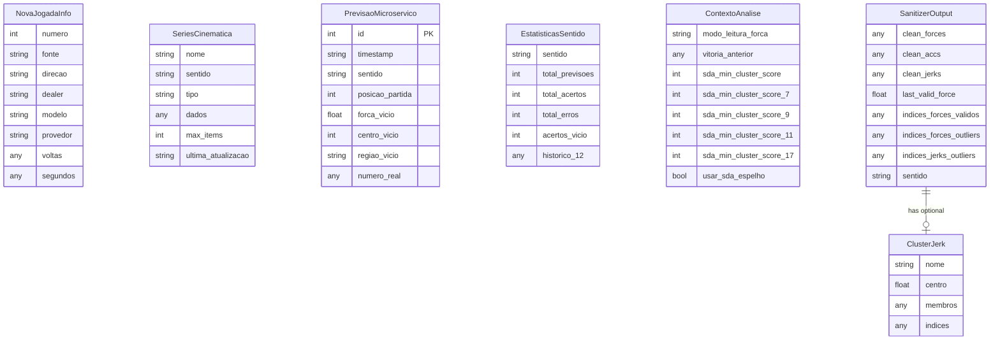

# 🧬 SOTA ARCHITECTURE & DEPENDENCY GRAPH (AST LEVEL 5)
> **Contexto Base**: `[CONTEX] C_Users_Windows_Desktop_main_simplificado_RoletaV11 11-01-2026 09-10-05.txt `
> **Precisão**: AST (Abstract Syntax Tree) para Python + Advanced Regex para JS/TS/Go
> **Timestamp**: 2026-01-11 09:10:15

---

## 1. 🕸️ Grafo de Dependências Real
Quem importa quem. Esta visão é gerada analisando imports no código.

```mermaid
graph TD
    subgraph Configuration [Configuration]
    configpy[config.py]
    end
    mainpy -->|imports| app_controller
    mainpy -->|imports| main_window
    app_controllerpy -->|imports| game_state
    app_controllerpy -->|imports| simulation
    app_controllerpy -->|imports| core
    game_statepy -->|imports| core
    game_statepy -->|imports| logic
    game_statepy -->|imports| persistence
    game_statepy -->|imports| cinematica
    game_statepy -->|imports| microservico
    simulationpy -->|imports| core
    simulationpy -->|imports| game_state
    persistencepy -->|imports| core
    logicpy -->|imports| core
    legacypy -->|imports| stats
    legacypy -->|imports| fft
    legacypy -->|imports| model
    legacypy -->|imports| logic
    legacypy -->|imports| core
    main_windowpy -->|imports| styles
    main_windowpy -->|imports| core
    main_windowpy -->|imports| results_panel
    main_windowpy -->|imports| input_panel
    main_windowpy -->|imports| microservice_tab
    stylespy -->|imports| core
    input_panelpy -->|imports| core
    input_panelpy -->|imports| simulation
    results_panelpy -->|imports| styles
    results_panelpy -->|imports| core
    analysis_tabpy -->|imports| styles
    microservice_tabpy -->|imports| styles
    microservice_tabpy -->|imports| core
    strategies_tabpy -->|imports| styles
    subgraph External [Dependências Externas]
    numpy[numpy]
    end
```

---

## 2. 🧪 Definições e Símbolos (AST Extractions)
Principais classes e funções detectadas com precisão de compilador:

### 📄 `main.py`
- `Func: main()`

### 📄 `app_controller.py`
- `Class: AppController`
  - `Method: __init__()`
  - `Method: register_ui(main_window)`
  - `Method: start_simulation()`
  - `Method: stop_simulation()`
  - `Method: atualizar_ui(ultimo_numero: dict, resultado_analise: dict)`
- `Func: __init__()`
- `Func: register_ui(main_window)`
- `Func: start_simulation()`
- `Func: stop_simulation()`
- `Func: atualizar_ui(ultimo_numero: dict, resultado_analise: dict)`

### 📄 `config.py`
- `Const: NOME_ARQUIVO_DADOS_JSON = 'roleta_dados_salvos.json'`
- `Const: NOME_ARQUIVO_LOG_TXT = 'log_de_apostas_completo.txt'`
- `Const: CAMINHO_CREDENCIAL = 'firebase-credentials.json'`

### 📄 `game_state.py`
- `Class: GameStateManager`
  - `Method: __init__(app_controller)`
  - `Method: _init_strategies()` (private)
  - `Method: _load_state()` (private)
  - `Method: processar_novo_numero(info_jogada)`
  - `Method: _atualizar_microservico_pipeline(jogada_atual)` (private)
- `Func: __init__(app_controller)`
- `Func: _init_strategies()`
- `Func: _load_state()`
- `Func: processar_novo_numero(info_jogada)`
- `Func: _atualizar_microservico_pipeline(jogada_atual)`

### 📄 `simulation.py`
- `Class: NovaJogadaInfo`
  - `Field: numero: int`
  - `Field: fonte: str`
  - `Field: direcao: str`
  - `Field: dealer: str`
  - `Field: modelo: str`
- `Class: SimulationManager`
  - `Method: __init__(game_state_manager)`
  - `Method: _simulation_loop(ui_ref)` (private)
  - `Method: start_simulation(ui_ref)`
  - `Method: stop_simulation()`
- `Func: __init__(game_state_manager)`
- `Func: _simulation_loop(ui_ref)`
- `Func: start_simulation(ui_ref)`
- `Func: stop_simulation()`

### 📄 `cinematica.py`
- `Const: MAX_ITEMS = 45`
- `Const: ARQUIVO_PERSISTENCIA = 'cinematica_db.json'`
- `Class: SeriesCinematica`
  - `Field: nome: str`
  - `Field: sentido: str`
  - `Field: tipo: str`
  - `Field: dados: List[float]`
  - `Field: max_items: int`
  - `Method: adicionar(valor: float) -> None`
  - `Method: obter_ultimos(n: int) -> List[float]`
  - `Method: obter_todos() -> List[float]`
  - `Method: tamanho() -> int`
  - `Method: to_dict() -> Dict`
- `Class: CinematicaDB`
  - `Value: ARQUIVO_PERSISTENCIA = 'cinematica_db.json'`
  - `Method: __init__(caminho_arquivo: str)`
  - `Method: adicionar_jogada(forca: float, sentido: str) -> Dict`
  - `Method: obter_series(sentido: str) -> Dict[?]`
  - `Method: sincronizar_com_banco_completo(banco_de_dados_completo: List[Dict]) -> None`
  - `Method: _recalcular_derivadas() -> None` (private)
- `Func: adicionar(valor: float) -> None`
- `Func: obter_ultimos(n: int) -> List[float]`
- `Func: obter_todos() -> List[float]`
- `Func: tamanho() -> int`
- `Func: to_dict() -> Dict`

### 📄 `microservico.py`
- `Const: DB_FILE = 'microservico_datalake.db'`
- `Const: MAX_HISTORICO = 45`
- `Class: PrevisaoMicroservico`
  - `Field: id: int`
  - `Field: timestamp: str`
  - `Field: sentido: str`
  - `Field: posicao_partida: int`
  - `Field: forca_vicio: float`
  - `Method: to_dict() -> dict`
- `Class: EstatisticasSentido`
  - `Field: sentido: str`
  - `Field: total_previsoes: int`
  - `Field: total_acertos: int`
  - `Field: total_erros: int`
  - `Field: acertos_vicio: int`
  - `Method: taxa_acerto() -> float`
  - `Method: roi() -> float`
- `Class: MicroservicoDB`
  - `Method: __init__(db_file: str)`
  - `Method: _init_database()` (private)
  - `Method: gravar_previsao(previsao: PrevisaoMicroservico) -> int`
  - `Method: _limpar_historico_antigo(conn, sentido: str)` (private)
  - `Method: atualizar_resultado(previsao_id: int, numero_real: int) -> Dict`
- `Func: to_dict() -> dict`
- `Func: taxa_acerto() -> float`
- `Func: roi() -> float`
- `Func: __init__(db_file: str)`
- `Func: _init_database()`

### 📄 `persistence.py`
- `Class: DataPersistence`
  - `Method: __init__(sda_vetor_names: List[str])`
  - `Method: _get_db_conn()` (private)
  - `Method: setup_datalake()`
  - `Method: log_performance_vetores(registro_completo: Dict[?])`
  - `Method: save_data(state: Dict[?])`
- `Func: __init__(sda_vetor_names: List[str])`
- `Func: _get_db_conn()`
- `Func: setup_datalake()`
- `Func: log_performance_vetores(registro_completo: Dict[?])`
- `Func: save_data(state: Dict[?])`

### 📄 `logic.py`
- `Class: RouletteLogic`
  - `Method: __init__()`
  - `Method: calcular_distancia_giro(num_anterior: int, num_atual: int, direcao: str) -> Optional[int]`
  - `Method: calcular_centro_alvo(num_anterior: int, forca: int, direcao_alvo: str) -> int`
  - `Method: get_roulette_region(center_number: int, num_neighbors: int) -> List[int]`
  - `Method: get_roulette_region_visual(center_number: int, num_neighbors: int) -> str`
- `Func: __init__()`
- `Func: calcular_distancia_giro(num_anterior: int, num_atual: int, direcao: str) -> Optional[int]`
- `Func: calcular_centro_alvo(num_anterior: int, forca: int, direcao_alvo: str) -> int`
- `Func: get_roulette_region(center_number: int, num_neighbors: int) -> List[int]`
- `Func: get_roulette_region_visual(center_number: int, num_neighbors: int) -> str`

### 📄 `legacy.py`
- `Const: WHEEL_SIZE_FORCA = 37`
- `Const: GRAVIDADE = 4`
- `Const: GRAVIDADE_VARIACAO = 3`
- `Class: ContextoAnalise`
  - `Field: modo_leitura_forca: str`
  - `Field: vitoria_anterior: Optional[bool]`
  - `Field: sda_min_cluster_score: int`
  - `Field: sda_min_cluster_score_7: int`
  - `Field: sda_min_cluster_score_9: int`
- `Class: EstrategiaBase (ABC)`
  - `Method: __init__(nome: str, descricao: str, logic_module: RouletteLogic)`
  - `Method: analisar(historico: list[dict], contexto: ContextoAnalise) -> tuple[?]`
  - `Method: get_state() -> dict`
  - `Method: reset_from_saved_state(state: dict)`
- `Class: EstrategiaPelaForca (EstrategiaBase)`
  - `Method: __init__(logic_module: RouletteLogic)`
  - `Method: analisar(historico: list[dict], contexto: ContextoAnalise) -> tuple[?]`
- `Class: EstrategiaInerciaPreditiva (EstrategiaBase)`
  - `Method: __init__(logic_module: RouletteLogic)`
  - `Method: analisar(historico: list[dict], contexto: ContextoAnalise) -> tuple[?]`
- `Class: EstrategiaRessonanciaPolinomial (EstrategiaBase)`
  - `Method: __init__(logic_module: RouletteLogic)`
  - `Method: get_state()`
  - `Method: reset_from_saved_state(state: dict)`
  - `Method: _atualizar_confianca(vitoria_anterior: Optional[bool])` (private)
  - `Method: analisar(historico: list[dict], contexto: ContextoAnalise) -> tuple[?]`
- `Class: EstrategiaHibridaAdaptativa (EstrategiaBase)`
  - `Method: __init__(logic_module: RouletteLogic)`
  - `Method: _motor_cacador_de_padroes(forcas: List[int]) -> List[int]` (private)
  - `Method: _motor_ancora_de_sobrevivencia(forcas_alvo: List[int], forcas_opostas: List[int]) -> List[int]` (private)
  - `Method: _aplicar_deconflito_hierarquico(centros_candidatos: List[int], forcas: List[int], direcao_alvo: str) -> List[int]` (private)
  - `Method: analisar(historico: list[dict], contexto: ContextoAnalise) -> tuple[?]`
- `Class: EstrategiaHibridaAdaptativaAMPLA (EstrategiaHibridaAdaptativa)`
  - `Method: __init__(logic_module: RouletteLogic)`
  - `Method: analisar(historico: list[dict], contexto: ContextoAnalise) -> tuple[?]`
- `Class: EstrategiaSinergiaPreditiva (EstrategiaBase)`
  - `Method: __init__(logic_module: RouletteLogic)`
  - `Method: _calcular_centro_e_excluir_cesta(forca_candidata: int, forcas_disponiveis: Set[int], gravidade: int) -> Tuple[?]` (private)
  - `Method: _resolver_deconflito_regional_18_numeros(centros_candidatos: List[int], num_anterior: int, direcao_alvo: str) -> List[int]` (private)
  - `Method: analisar(historico: list[dict], contexto: ContextoAnalise) -> tuple[?]`
- `Class: EstrategiaSinergiaDirecionalAvancada (EstrategiaBase)`
  - `Method: __init__(logic_module: RouletteLogic, persistence_module: DataPersistence, raio_gravidade: int)`
  - `Method: _formatar_detalhes_ui_cluster_forca(forcas_alvo: List[int], nucleo_aposta: int, melhor_forca: int) -> Dict[?]` (private)
  - `Method: analisar(historico: list[dict], contexto: ContextoAnalise) -> tuple[?]`
  - `Method: _analisar_com_variacoes(historico: list[dict], contexto: ContextoAnalise) -> tuple[?]` (private)
  - `Method: _analisar_variacao_unica(historico: list[dict], contexto: ContextoAnalise) -> tuple[?]` (private)
- `Class: EstrategiaSDAGemea (EstrategiaBase)`
  - `Value: WHEEL_SIZE_FORCA = 37`
  - `Value: GRAVIDADE = 4`
  - `Value: GRAVIDADE_VARIACAO = 3`
  - `Method: __init__(logic_module: RouletteLogic)`
  - `Method: _calcular_variacao_circular(forca_anterior: int, forca_atual: int) -> int` (private)
  - `Method: _calcular_variacoes(forcas: List[int]) -> List[int]` (private)
  - `Method: _detectar_e_remover_outliers(forcas: List[int], limiar: int) -> Tuple[?]` (private)
  - `Method: _calcular_distancia_circular_forca(f1: int, f2: int) -> int` (private)
- `Class: EstrategiaSinergiaDirecionalAvancadaEspelho (EstrategiaBase)`
  - `Method: __init__(logic_module: RouletteLogic)`
  - `Method: _buscar_regiao_proxima_sem_conflito(centro_original: int, regioes_ocupadas: set, num_vizinhos: int) -> int` (private)
  - `Method: _resolver_deconflito_espelho(centros_candidatos: List[int], num_anterior: int, direcao_alvo: str) -> List[int]` (private)
  - `Method: analisar(historico: list[dict], contexto: ContextoAnalise) -> tuple[?]`
  - `Method: atualizar_performance_espelho(numero_sorteado: int, numeros_apostados: List[int], ganho: float)`
- `Class: KalmanFilter`
  - `Method: __init__(x0, P, R)`
  - `Method: process(Z)`
- `Func: __init__(nome: str, descricao: str, logic_module: RouletteLogic)`
- `Func: analisar(historico: list[dict], contexto: ContextoAnalise) -> tuple[?]`
- `Func: get_state() -> dict`
- `Func: reset_from_saved_state(state: dict)`
- `Func: __init__(logic_module: RouletteLogic)`

### 📄 `microservice.py`
- `Const: ROULETTE_WHEEL_ORDER = ...`
- `Const: SANITIZER_CLUSTER_RADIUS = 5`
- `Const: SANITIZER_MIN_CLUSTER_SIZE = 2`
- `Enum: Sentido`
  - `Value: HORARIO = 'horario'`
  - `Value: ANTIHORARIO = 'antihorario'`
  - `Method: from_string(value: str) -> Sentido`
- `Class: ClusterJerk`
  - `Field: nome: str`
  - `Field: centro: float`
  - `Field: membros: List[float]`
  - `Field: indices: List[int]`
  - `Method: tamanho() -> int`
  - `Method: densidade() -> float`
  - `Method: to_dict() -> dict`
- `Class: SanitizerOutput`
  - `Field: clean_forces: List[float]`
  - `Field: clean_accs: List[float]`
  - `Field: clean_jerks: List[float]`
  - `Field: last_valid_force: float`
  - `Field: cluster_a: Optional[ClusterJerk]`
  - `Method: clusters_validos() -> List[ClusterJerk]`
  - `Method: to_dict() -> dict`
  - `Method: to_json(indent: int) -> str`
- `Class: Sanitizer`
  - `Method: __init__(cluster_radius: int, min_cluster_size: int, max_clusters: int)`
  - `Method: sanitize(raw_forces: List[float], sentido: str) -> SanitizerOutput`
  - `Method: _calcular_aceleracoes(forces: List[float]) -> List[float]` (private)
  - `Method: _calcular_jerks(accs: List[float]) -> List[float]` (private)
  - `Method: _clusterizar_jerks(jerks: List[float]) -> Tuple[?]` (private)
- `Func: get_circular_multiplier(anterior: float, atual: float) -> float`
- `Func: classify_trend(multiplicador: float) -> str`
- `Func: _pre_filter_extreme_multipliers(movimentos: List[Dict[?]]) -> List[Dict[?]]`
- `Func: arbitrate_trends(lista_4_movimentos: List[Dict[?]]) -> Tuple[?]`
- `Func: predict_next(ultima_forca: float, multiplicadores_vencedores: List[float]) -> int`

### 📄 `main_window.py`
- `Class: MainWindow`
  - `Method: __init__(root, app_controller)`
  - `Method: setup_variables()`
  - `Method: setup_window()`
  - `Method: build_layout()`
  - `Method: _build_header(parent)` (private)
- `Func: __init__(root, app_controller)`
- `Func: setup_variables()`
- `Func: setup_window()`
- `Func: build_layout()`
- `Func: _build_header(parent)`

### 📄 `styles.py`
- `Const: COLORS = ...`
- `Const: FONT_BUTTONS_TOP_NUM = ...`
- `Const: FONT_SUGESTAO_PRINCIPAL_TEXT = ...`
- `Class: Theme`
  - `Value: COLORS = ...`
  - `Value: FONT_BUTTONS_TOP_NUM = ...`
  - `Value: FONT_SUGESTAO_PRINCIPAL_TEXT = ...`
  - `Value: FONT_ANALISE = ...`
  - `Value: FONT_HISTORICO_TITULO = ...`
  - `Method: apply_global_styles(root)`
  - `Method: get_color(name: str)`
- `Func: apply_global_styles(root)`
- `Func: get_color(name: str)`

### 📄 `input_panel.py`
- `Class: InputPanel`
  - `Method: __init__(parent, controller, theme)`
  - `Method: build()`
  - `Method: _create_number_button(parent, number, bg_color)` (private)
  - `Method: _on_number_click(number)` (private)
  - `Method: _on_undo_click()` (private)
- `Func: __init__(parent, controller, theme)`
- `Func: build()`
- `Func: _create_number_button(parent, number, bg_color)`
- `Func: _on_number_click(number)`
- `Func: _on_undo_click()`

### 📄 `results_panel.py`
- `Class: ResultsPanel`
  - `Method: __init__(parent, controller, theme)`
  - `Method: build()`
  - `Method: update_display(historico_recente)`
- `Func: __init__(parent, controller, theme)`
- `Func: build()`
- `Func: update_display(historico_recente)`

### 📄 `analysis_tab.py`
- `Class: AnalysisTab`
  - `Method: __init__(parent, controller, theme)`
  - `Method: build()`
  - `Method: _clear_log()` (private)
  - `Method: log_message(message)`
- `Func: __init__(parent, controller, theme)`
- `Func: build()`
- `Func: _clear_log()`
- `Func: log_message(message)`

### 📄 `microservice_tab.py`
- `Class: MicroserviceTab`
  - `Method: __init__(parent, controller, theme)`
  - `Method: setup_variables()`
  - `Method: build()`
  - `Method: _build_force_history_panel()` (private)
  - `Method: _build_force_variation_panel()` (private)
- `Func: __init__(parent, controller, theme)`
- `Func: setup_variables()`
- `Func: build()`
- `Func: _build_force_history_panel()`
- `Func: _build_force_variation_panel()`

### 📄 `strategies_tab.py`
- `Class: StrategiesTab`
  - `Method: __init__(parent, controller, theme)`
  - `Method: build()`
  - `Method: _build_strategy_page(parent, nome)` (private)
- `Func: __init__(parent, controller, theme)`
- `Func: build()`
- `Func: _build_strategy_page(parent, nome)`

---

## 3. 🌉 Bridges & Integrações (I/O)
Onde o código "toca" o mundo exterior (Sistemas de Terceiros).

| Módulo | Destino | Tipo de Bridge | Chamada |
|:-------|:--------|:---------------|:--------|
| `microservico.py` | Database | connect | `sqlite3.connect` |
| `persistence.py` | Database | connect | `sqlite3.connect` |

---

## 4. 🧠 Tech & Patterns Detectados

### Stack Tecnológico
| Categoria | Tecnologia | Evidência |
|:----------|:-----------|:----------|
| **Data Processing** | NumPy | Import detectado |

### Padrões Arquiteturais Detectados
- ✅ **Monolith** - Estrutura monolítica simples

---

## 5. 🗄️ Data Architecture (ERD Inferido)
Estrutura de dados inferida a partir dos Models no código (sem acesso ao banco).

### 📊 Entidades Detectadas
| Entidade | Tipo | Arquivo | Campos | Relacionamentos |
|:---------|:-----|:--------|:------:|:---------------:|
| `NovaJogadaInfo` | Dataclass | simulation.py | 8 | 0 |
| `SeriesCinematica` | Dataclass | cinematica.py | 6 | 0 |
| `PrevisaoMicroservico` | Dataclass | microservico.py | 13 | 0 |
| `EstatisticasSentido` | Dataclass | microservico.py | 6 | 0 |
| `ContextoAnalise` | Dataclass | legacy.py | 8 | 0 |
| `ClusterJerk` | Dataclass | microservice.py | 4 | 0 |
| `SanitizerOutput` | Dataclass | microservice.py | 13 | 3 |

---

*Relatório gerado por SOTA Architecture Mapper v2.1*
*Método: AST Analysis + Pattern Recognition + ERD Inference*
*Timestamp: 2026-01-11 09:10:15*
*Target LLM: Claude/GPT/Gemini*