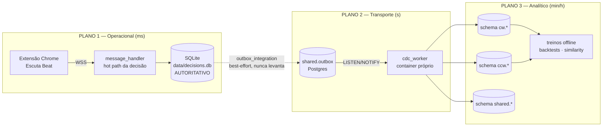

# Arquitetura de Dados × Estratégia — Roleta Cloud

> **Documento vivo** — criado em 03/08 como fecho da fundação de dados (sprints H1–H7,
> ver `evolução_03_08.md`). Ele responde a três perguntas: **onde vive cada dado**,
> **onde vive cada fase da estratégia atual**, e **como novas estratégias nascem
> em cima desses bancos** sem tocar o caminho crítico da decisão.
> Blueprint geral do sistema: `fluxo_mental_24.md`. Rituais: `Manutenabilidade_iso.md`.

---

## 1. Os três planos de dados (e por que três)

O software tem **um caminho crítico de milissegundos** (decidir a aposta antes do
próximo giro) e **um caminho analítico de minutos/horas** (aprender com o que
aconteceu). A arquitetura separa fisicamente esses dois mundos, com um plano de
transporte no meio:

| Plano | Tecnologia | Papel | Regra de ouro |
|---|---|---|---|
| **Operacional** | SQLite WAL (`data/decisions.db`) | Verdade autoritativa; toda decisão, resultado e DNA nascem aqui | O hot path NUNCA espera rede/PG |
| **Transporte** | `shared.outbox` (PG) + `cdc_worker` | Espelho assíncrono, at-least-once, idempotente | Falha de espelho NUNCA afeta a decisão (best-effort) |
| **Analítico** | PostgreSQL 15 + **pgvector** (imagem upstream `pgvector/pgvector:pg15`) | Feature stores, vetores, DNA agregado — onde a estratégia aprende | CW e CCW **fisicamente separados** por schema |

**Por que SQLite como autoridade?** Latência de escrita local ≈ 0, zero dependência
de rede no momento da aposta, e round-trip garantido (`save()`/`load()`/`reset_session()`
— inviolável). O PG é *derivado*: pode ser reconstruído do SQLite + outbox replay.

**Por que Postgres+pgvector para análise?** Janelas SQL, índices HNSW para
similaridade de regime O(log n), e agregações que o SQLite não faz sem travar o
hot path. Desde 03/08 a stack é a imagem **upstream oficial** — Apache AGE e
TimescaleDB foram removidos (nunca saíram do `CREATE EXTENSION`; higiene H7).

**SaaS externo (único):** Backblaze B2 (bucket `roletacloubucket`) recebe
WAL-G (PITR do PG, cron */30) e o backup diário do SQLite. Não há nenhuma outra
dependência paga — auditoria 03/08 confirmou (a suspeita "workana" não existe
no código).

---

## 2. Inventário — onde vive cada dado

### 2.1 SQLite `data/decisions.db` (autoritativo)

| Tabela | O que guarda | Quem escreve | Quem lê |
|---|---|---|---|
| `sessions` | Sessões de jogo (start/end, mesa) | `database/service.py` | analytics, replays |
| `decisions` | 1 linha por aposta: centro, cobertura, stake, gale, resultado, `calibration_error`, `result_region` | `sqlite_repo.save()` no hot path; `update_result` no giro seguinte | `check_prediction`, backtests |
| `decision_dna` | **DNA da decisão**: 1 linha por (decisão × feature) com `feature_value` JSON (`raw` + `bucket`), `direction`, `hit`, `wheel_dist`, `realized_lift_pp` | `dna_logger.dna_log_feature()` (hot path, fila assíncrona) + `dna_update_realized()` + **`dna_realize_lifts()` (H1, a cada N resultados)** | `/api/dna_summary`, region_bandit, análise de lift |

### 2.2 PostgreSQL — schemas com fronteira física por sentido

**Inegociável (§4.0 `evolução_03_08.md`):** CW (horário) e CCW (anti-horário) são
**fenômenos físicos distintos** — dealer, atrito e fase diferem. Cada análise
roda **isolada por sentido**; o corte não é um `WHERE direction=...` opcional,
é fronteira de **schema**:

| Schema.tabela | O que guarda | Escrito por | Índices-chave |
|---|---|---|---|
| `cw.spins_vectors` / `ccw.spins_vectors` | Vetor 6d por giro (`raw_features`: spin_force, tr_c4/m6/l12 rates, sda_score, sda_predicted_force) + `ae_latent` 4d comprimido | `cdc_worker._apply_spin_features` (evento `spin_features`) | **UNIQUE parcial `decision_id`** (H2) · **HNSW cosine em `raw_features` e `ae_latent`** (H6) |
| `cw.spin_features` / `ccw.spin_features` | Lag features por giro: `recent_acc_10/50`, `streak_hit/miss`, `last_20_hits[]`, **`session_id`** (H3) | `cdc_worker._apply_spin_result` (evento `spin_result`) | UNIQUE parcial `decision_id` (H2) · `(session_id, id DESC)` (H3) |
| `shared.decision_dna` | Espelho do DNA SQLite + `realized_lift_pp` por bucket | eventos `dna_feature`/`dna_realized`/**`dna_lift_bucket`** (H1) | `(feature_name, direction)` |
| `shared.outbox` | Fila de eventos (at-least-once) | `outbox_publisher` (lado SQLite) | `processed_at IS NULL` |

### 2.3 Artefatos de modelo (volume, nunca no git)

| Artefato | Origem | Consumidor |
|---|---|---|
| `models/spin_autoencoder_cw.joblib` / `_ccw.joblib` | `scripts/train_autoencoder.py` (offline, **1 por sentido**, Pipeline StandardScaler→PCA-whiten 6→4) | `SpinEncoder.encode` → `ae_latent` |
| Backfill `ae_latent` | `scripts/backfill_ae_latent.py` (idempotente) | matching de regime (E3) |

---

## 3. A estratégia atual, fase por fase — e onde cada fase vive

A estratégia em produção é o **SDA17 + TripleRate + Block-Gale** com INV-3
(SEMPRE indica `APOSTAR`; vetos entram como `min()` no stake, nunca suprimem).
Cada fase do ciclo de vida de uma aposta tem endereço fixo:

| # | Fase | Código | Dados que consome | Dados que produz |
|---|---|---|---|---|
| 1 | **Captura** do giro | extensão → `server/websocket.py` → `message_handler.handle_new_result` | DOM do site (números, sentido, força) | `SpinInput` validado |
| 2 | **Resolução** da aposta anterior | `check_prediction` + `_engine_resolve` | `decisions` (última pendente) | `hit_result`, `update_result` no SQLite |
| 3 | **Aprendizado imediato** | `dna_update_realized` + `dna_log_feature(hit_region)` | resultado real, atribuição de região | `decision_dna.hit/wheel_dist` + feature `hit_region` |
| 4 | **Realização de lift** (H1, novo) | `dna_realize_lifts()` a cada N resultados (flag `SDA_DNA_REALIZE`) | `decision_dna` com hit realizado | `realized_lift_pp` **por sentido** no SQLite + espelho PG (`dna_lift_bucket`) |
| 5 | **Análise** do giro atual | `SDA17.analyze` (estratégia), `TripleRateAdvisor` (c4/m6/l12), `state/timeline` | estado em memória (GameState), física da roda (`core/roulette`) | centro previsto + score |
| 6 | **Gates e staking** | INV-3 + Block-Gale + staking em `message_handler` | score, streaks, gale state | stake final (`min()` de vetos) |
| 7 | **Persistência + broadcast** | `store_prediction` → `sqlite_repo` → outbox hooks | Decision completa | linha em `decisions` + eventos outbox |
| 8 | **Espelhamento analítico** | `cdc_worker` (container separado) | `shared.outbox` | `spins_vectors`, `spin_features` (com `session_id`), `shared.decision_dna` |
| 9 | **Aprendizado offline** | `train_autoencoder.py`, `backtest_from_db`, `regime_similarity` | schemas cw/ccw completos | modelos .joblib, relatórios, scores de regime |

**Fases 1–7 vivem no plano operacional** (SQLite + memória, ms).
**Fases 8–9 vivem no plano analítico** (PG, assíncrono).
A fase 4 é a ponte: computa no SQLite (autoridade) e espelha ao PG por evento.

---

## 4. O que a fundação 03/08 destravou (H1–H7 → E1–E5)

Antes de 03/08 o plano analítico tinha 7 falhas de fundação (F1–F7, auditoria em
`evolução_03_08.md` §4). Com H1–H7 aplicados, cada evolução estratégica abaixo
tem os dados de que precisa **já populados, únicos e indexados**:

| Evolução destravada | Pré-requisito criado hoje | Como nasce (sem tocar hot path) |
|---|---|---|
| **E1 — Lift-aware staking**: pesar o stake pelo `realized_lift_pp` do bucket ativo | H1 (lifts por sentido, contínuos) | Novo gate lê `decision_dna` agregado; entra como `min()` no stake (INV-3 preservado) |
| **E2 — Feature pruning honesto**: matar features de DNA que não separam | H1 + H4 (estatísticas frescas) | Análise SQL de `realized_lift_pp` por (feature, bucket, sentido) no PG |
| **E3 — Regime matching**: "este momento parece com quando acertávamos?" | H5 (ae_latent por sentido) + H6 (HNSW) | `regime_similarity` consulta k-NN cosine em `<=>` — agora O(log n) |
| **E4 — Modelos por sessão**: features sem vazamento entre sessões | H3 (`session_id` nas janelas) | Treinos agrupam por `session_id`; acurácias de início de sessão ficam limpas |
| **E5 — Backtest de novas estratégias**: replay determinístico | H2 (idempotência real — replay não duplica) | `backtest_from_db` + replay do outbox em ambiente descartável |

---

## 5. Como uma NOVA estratégia nasce nesta arquitetura (receita semântica)

O padrão para toda evolução estratégica futura, alinhado a negócio (maximizar
lift por aposta) e aos invioláveis:

1. **Hipótese como feature de DNA** — antes de qualquer código de decisão, logue
   a hipótese como feature: `dna_log_feature(did, "minha_hipotese", {"raw": x, "bucket": b}, direction=...)`.
   Custo: 1 linha no hot path (fila assíncrona). A partir daí ela é medida
   automaticamente (hit, wheel_dist, lift por sentido via H1).
2. **Valide no plano analítico** — semanas de dados depois, o PG responde:
   `SELECT direction, feature_value->>'bucket', AVG(realized_lift_pp), COUNT(*) FROM shared.decision_dna WHERE feature_name='minha_hipotese' GROUP BY 1,2` —
   **sempre com `direction` no GROUP BY** (fenômenos distintos).
3. **Backtest** — `tools/backtest_from_db.py` sobre `decisions` + replay
   determinístico (H2 garante que replay não duplica).
4. **Promova atrás de flag default-OFF** — comportamento novo entra em
   `docker-compose.yml` como `SDA_X=${SDA_X:-0}`, leitura por-chamada em
   `app_config/settings.py`, ligado via `.env` do host. Rollback = flag OFF.
5. **Veto nunca suprime** — se a estratégia nova quer "não apostar", ela entra
   como `min()` no stake (INV-3).
6. **Persistência round-trip** — campo de motor novo entra em
   `save()`+`load()`+`reset_session()`; migração Alembic **aditiva**.

O ciclo completo: **hipótese → DNA → lift por sentido → backtest → flag → produção**,
com cada etapa vivendo no banco certo (SQLite = decisão, PG = evidência).

---

## 6. Mapa de deploy (o que roda onde)

| Componente | Onde | Imagem | Sobe com |
|---|---|---|---|
| `roleta-cloud` (engine WS) | Debian `xmaiajpvm`, Docker | build local `Dockerfile` | deploy timer (systemd, pull de `origin/main` ~2min) + **`alembic upgrade head` automático** |
| `roleta-pg` | idem | **`pgvector/pgvector:pg15`** (upstream, H7) | `docker-compose.pg.yml` (manual) |
| `roleta-cdc-worker` | idem | build local `docker/cdc-worker` | `--profile cdc --env-file .env.pg` (manual) |
| Stack obs (Prometheus/Grafana/Alertmanager) | idem | upstream | `docker-compose.obs.yml` |
| Backups | B2 `roletacloubucket` | wal-g (PG, PITR) + cron SQLite | cron do host |

Flags de dados ativas em produção (via `.env` do host, defaults OFF no git):
`dual_write_pg` (feature flag DB) · `SDA_DNA_REALIZE=1` + `SDA_DNA_REALIZE_EVERY=20`
(H1) · `CDC_ANALYZE_EVERY_N=50` (H4, no `.env.pg`).
