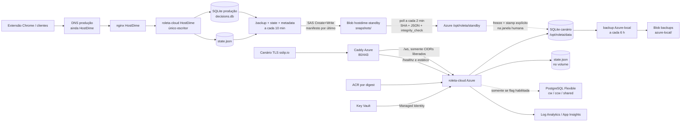

# Memorial descritivo — arquitetura de dados Azure

**Arquivo:** `azure_05_08_arquitetura.md`  
**Sistema:** Roleta Cloud  
**Data da fotografia:** 05/08/2026, aproximadamente 21:25 BRT
(`2026-08-06T00:25:08Z`)  
**Estado:** pré-cutover; HostDime ainda é a produção e o único escritor  
**Origem:** HostDime `187.45.181.75`  
**Destino:** Azure VM `vm-roleta-app-01`, IP `20.226.77.194`,
Brazil South

> Este memorial descreve o estado observado, não um estado desejado. A Azure
> possui um canário ativo e um standby populado continuamente, mas o banco
> ativo do canário ainda não é a cópia corrente da produção. A promoção para
> `/opt/roleta/data` continua sendo uma operação explícita de cutover.

## 1. Resumo executivo

O fluxo atual tem uma única fonte autoritativa: o SQLite da aplicação na
HostDime. A Azure recebe snapshots unidirecionais desse SQLite no Blob Storage,
valida cada pacote e restaura o conteúdo em `/opt/roleta/standby`. Esse
diretório não é montado no processo da aplicação e, portanto, não cria
split-brain nem um segundo escritor.

Na Azure, a aplicação roda em Docker sobre uma VM Debian. O Caddy nativo
termina HTTP/TLS e encaminha `/ws` para o processo WebSocket em loopback. O
SQLite ativo da VM permanece como canário. O PostgreSQL Flexible Server tem a
extensão pgvector instalada, mas `dual_write_pg=false`, o `cdc-worker` não está
rodando e as tabelas analíticas ainda estão vazias. A HostDime, por outro lado,
possui PostgreSQL 15 com pgvector instalado e populado como espelho analítico.

## 2. Fluxo de dados completo



### 2.1 Interação de uma jogada

1. A extensão ou cliente envia eventos pelo WebSocket, incluindo o contexto do
   giro, direção, foto/vision quando aplicável e o resultado recebido.
2. `server/message_handler.py` resolve o estado do motor, SDA/TR, direção,
   seleção, stake e regra de gale.
3. Uma decisão é materializada em `database.models.Decision` e persistida por
   `SQLiteDecisionRepository.save_decision()`.
4. A inserção recebe `id` autoincremental e grava o contexto completo: número,
   direção, força, centros SDA, taxas TR, ação final, gale, vision, dealer,
   sessão e fase.
5. Quando o número efetivo é conhecido, `DatabaseService.update_result()` altera
   o mesmo `decision_id`, preenchendo `result_hit`, `result_actual`,
   `result_region`, `calibration_error` e, quando aplicável, `pnl_units`.
6. O P&L calculado é agregado em `sessions.total_profit`. Em paralelo,
   `window_plays` registra a jogada individual e `gale_windows` acompanha a
   janela de Martingale.
7. O estado operacional do motor é salvo em `state.json`; ele não substitui o
   histórico relacional do SQLite.
8. O hook PostgreSQL só tenta publicar se a flag lida em
   `shared.feature_flags` estiver habilitada. A DSN existir no ambiente não
   basta para ligar o dual-write.

## 3. Inventário dos recursos Azure

| Recurso | Estado observado | Função no fluxo |
|---|---|---|
| `vm-roleta-app-01` | Running, `Standard_L2as_v4` | Host Docker, Caddy, timers e standby |
| IP público | `20.226.77.194` | Canário e futuro destino DNS |
| Caddy | Active | TLS, frontend, `/healthz` e proxy WebSocket |
| `roleta-cloud` | Running/healthy | Motor Python em `127.0.0.1:8765` e health em `8766` |
| `acrroletaprod` | Basic, admin desabilitado | Imagem imutável por digest |
| `kv-roleta-prod` | Soft delete ativo | API key, DSN/host PG, domínio e e-mail Caddy |
| `stroletaprod` | StorageV2, Standard_LRS, HTTPS-only | Snapshots e backups |
| `pg-roleta-prod` | PostgreSQL 16, Ready, B1ms, 32 GB | Onda 2; não é fonte atual |
| `law-roleta-prod` | Retenção observada de 30 dias | Logs operacionais |
| `ai-roleta-prod` | Application Insights, kind `web` | Telemetria Azure |
| NSG `nsg-app-prod` | 80/443 Allow | Entrada pública somente no proxy |

O volume Docker da aplicação é `roleta_roleta-data`, com bind:

```text
/opt/roleta/data  ->  /app/data
STATE_FILE=/app/data/state.json
```

O caminho `/mnt` da série L é efêmero e não é usado como fonte de persistência.

## 4. Bancos e repositórios de dados

### 4.1 SQLite — fonte autoritativa atual

**Arquivo em produção:** `decisions.db` no volume da HostDime.  
**Arquivo canário Azure:** `/opt/roleta/data/decisions.db`.  
**Standby Azure:** `/opt/roleta/standby/decisions.db`.

O SQLite é o único armazenamento que hoje recebe a sequência normal de
decisões da produção. O repositório abre o banco em WAL, com `busy_timeout`,
foreign keys e circuit breaker de I/O.

#### Entidades observadas

| Tabela | Finalidade | Campos temporais |
|---|---|---|
| `decisions` | Uma decisão do motor por giro, com contexto SDA/TR, ação, gale, vision, direção e resultado | `timestamp` |
| `window_plays` | Uma jogada individual dentro de uma janela de gale | `timestamp` |
| `gale_windows` | Janela de Martingale por direção, nível, hits e transição | `started_at`, `ended_at` |
| `sessions` | Agrupamento de giros, apostas, hits e P&L | `start_time`, `end_time` |

Os dados vivos da HostDime, medidos às `00:24:52Z`, estavam assim:

| Tabela | Linhas |
|---|---:|
| `decisions` | 11.298 |
| `window_plays` | 9.461 |
| `gale_windows` | 2.250 |
| `sessions` | 359 |

#### Conteúdo de `decisions`

- **Identificação:** `id`, `session_id`, `timestamp`, `spin_seq`.
- **Giro:** `spin_number`, `spin_direction`, `spin_force`.
- **Triple Rate:** `tr_should_bet`, `tr_confidence`, `tr_reason`,
  `tr_c4_rate`, `tr_m6_rate`, `tr_l12_rate`.
- **SDA:** `sda_should_bet`, `sda_score`, `sda_center`, `sda_centers`,
  `sda_numbers`, `sda_predicted_force`, `sda_offset`, `sda_offset_type`,
  `sda_regions`.
- **Ação e gale:** `final_action`, `action_reason`, `gale_level`,
  `gale_window_hits`, `gale_window_count`, `gale_bet_value`.
- **Resultado:** `result_hit`, `result_actual`, `result_region`,
  `calibration_error`, `pnl_units`.
- **Origem/vision:** `dealer`, `dealer_table`, `provider`, `round_id`,
  `wheel_model`, `vision_confidence`, `vision_source`.
- **Direção/fase:** `direction_source`, `direction_confidence`,
  `direction_next`, `phase_uncertain`.
- **Snapshots:** `performance_snapshot`.

`sda_centers`, `sda_numbers`, `sda_regions` e `performance_snapshot` são
representações JSON dentro de colunas SQLite; não são tabelas independentes.

### 4.2 PostgreSQL Flexible Server Azure — preparado para a Onda 2

**Servidor:** `pg-roleta-prod`  
**Banco:** `roleta`  
**Versão observada:** PostgreSQL 16.14  
**Tamanho observado:** 11 MB  
**Acesso público:** desabilitado  
**Alta disponibilidade:** não habilitada  
**Estado:** Ready

Extensões observadas no servidor:

```text
pg_cron 1.6
pg_partman 5.3.1
pg_stat_statements 1.10
pgcrypto 1.3
plpgsql 1.0
uuid-ossp 1.1
vector 0.8.2
```

#### Schemas e tabelas

| Schema/tabela | Função | Estado atual |
|---|---|---:|
| `cw.spin_features` | Features agregadas da direção clockwise | 0 |
| `ccw.spin_features` | Features agregadas da direção counter-clockwise | 0 |
| `cw.spins_vectors` | Vetores `raw_features`/`ae_latent` para similaridade | 0 |
| `ccw.spins_vectors` | Vetores da direção counter-clockwise | 0 |
| `shared.decision_dna` | Features DNA e lift realizado | 0 |
| `shared.dealers` | Catálogo/estatísticas de dealer e mesa | 0 |
| `shared.outbox` | Fila de eventos para CDC | 0 |
| `shared.feature_flags` | Flags, percentual e payload de rollout | 5 |
| `shared.strategy_versions` | Registro de versão/identidade da estratégia | 1 |

O registro de estratégia vivo é `smart_gale`, versão/tag `v4.4.0`. As cinco
flags observadas estão desligadas: `cold_regions`, `dual_write_pg`,
`new_decision_engine`, `outlier_filter` e `shadow_predictor`.

**Conclusão:** o PostgreSQL está disponível e estruturado, mas não é uma cópia
do histórico SQLite. `cw.*`, `ccw.*`, `shared.decision_dna` e `shared.outbox`
estavam vazios na inspeção. A presença de `ROLETA_PG_DSN` no container é
preparação operacional; `dual_write_pg=false` mantém SQLite como fonte.

O repositório contém migrações Alembic até `0013_hnsw_vectors`, mas a inspeção
viva não encontrou uma tabela `alembic_version`. Portanto, o head efetivamente
aplicado no servidor PG não deve ser afirmado apenas por documentação histórica;
deve ser reconciliado antes da Onda 2.

### 4.2.1 PostgreSQL HostDime — espelho pgvector atualmente populado

**Container observado:** `roleta-pg`
**Imagem:** `pgvector/pgvector:pg15`
**Banco/role observados:** `roleta` / `roleta`
**Extensão:** `vector` (pgvector) `0.8.2`
**Head Alembic observado:** `0013_hnsw_vectors`

Na HostDime, a extensão não é apenas uma instalação disponível: as tabelas
estão recebendo dados:

| Tabela | Linhas observadas |
|---|---:|
| `cw.spin_features` | 3.299 |
| `ccw.spin_features` | 3.062 |
| `cw.spins_vectors` | 3.927 |
| `ccw.spins_vectors` | 3.702 |
| `shared.decision_dna` | 47.465 |
| `shared.outbox` | 65.367, todas `processed` na leitura |

As colunas vetoriais são `raw_features` e `ae_latent` em
`cw.spins_vectors`/`ccw.spins_vectors`. Os registros mais recentes consultados
estavam entre `2026-08-06T00:56:34Z` e `2026-08-06T00:57:16Z`.

O registro vivo de `shared.feature_flags` mostrou
`dual_write_pg=true` e `pct=0`. O código do hook consulta o campo `enabled`;
portanto, a configuração da HostDime está preparada para publicar no espelho,
enquanto o SQLite continua sendo a fonte autoritativa do histórico e do caminho
crítico.

### 4.2.2 Comparação direta

| Item | HostDime | Azure |
|---|---|---|
| Engine | PostgreSQL 15 em Docker | PostgreSQL Flexible 16.14 |
| pgvector | `vector 0.8.2`, instalado | `vector 0.8.2`, instalado |
| Tabelas de vetores | Populadas | Vazias |
| `decision_dna` | 47.465 | 0 |
| `shared.outbox` | 65.367 processados | 0 |
| `dual_write_pg` | `enabled=true`, `pct=0` | `enabled=false`, `pct=0` |
| Papel atual | Espelho analítico em uso | Estrutura preparada para Onda 2 |

O pipeline de réplica Azure descrito neste memorial copia SQLite e `state.json`
via Blob. Ele **não** copia PostgreSQL, outbox, DNA ou vetores. Levar o conteúdo
pgvector da HostDime para a Azure exige uma migração PostgreSQL separada
(dump/restore ou backfill validado), seguida de reconciliação de contagens,
timestamps, `decision_id` e índices HNSW.

### 4.3 Blob Storage — repositório de pacotes, não banco transacional

O Storage Account `stroletaprod` contém dois namespaces funcionais:

| Container/prefixo | Conteúdo | Escritor |
|---|---|---|
| `hostdime-standby/snapshots/` | Cópia autoritativa da HostDime, DB, estado, metadata e manifesto | HostDime via SAS restrito |
| `backups/azure-local/` | Backup periódico do SQLite local Azure | Managed Identity da VM |

Cada snapshot contém:

1. `decisions_<STAMP>.db.gz`;
2. `state_<STAMP>.json`;
3. `metadata_<STAMP>.json`;
4. `manifest_<STAMP>.sha256`, enviado por último.

O manifesto é o commit lógico do pacote. O restore só aplica o conjunto quando
o manifesto existe, os hashes conferem, o JSON é válido e o SQLite retorna
`integrity_check=ok`.

Proteções observadas: versionamento, soft delete de blobs/containers por 30
dias e lifecycle com `cool` após 7 dias e exclusão após 30 dias para os
prefixos gerenciados.

### 4.4 `state.json` — estado operacional do motor

`state.json` não é um banco relacional. Ele contém o estado serializado do
motor, incluindo a sequência do giro, estado de direção, fase, gale e
contadores. Na Azure ele vive no mesmo volume persistente do SQLite para que
`os.replace()` seja atômico no mesmo filesystem.

### 4.5 Serviços que não são bancos

- **ACR:** armazena imagens Docker; não armazena jogadas.
- **Key Vault:** armazena segredos de configuração; não armazena histórico.
- **Log Analytics/App Insights:** telemetria e logs; não são fonte de resultados.
- Não foi encontrado, no Resource Group auditado, um Azure SQL Database,
  Cosmos DB, Redis ou MySQL participando desse fluxo.

## 5. Réplica quente e backup

### 5.1 HostDime para Blob

O unit `roleta-hostdime-snapshot.service`:

1. identifica o mount real do container;
2. executa `sqlite3 .backup`, sem copiar um WAL inconsistente;
3. valida `PRAGMA integrity_check`;
4. valida e copia `state.json`;
5. calcula metadata e SHA-256;
6. envia DB, estado e metadata;
7. envia o manifesto por último.

O timer está ativo em UTC a cada 10 minutos, com `AccuracySec=1s` e sem jitter.
A SAS usada é Create+Write, HTTPS-only, limitada ao IP da HostDime e vinculada
à stored access policy revogável `hostdime-migration-push`.

### 5.2 Blob para standby Azure

O unit `roleta-standby-sync.service` roda a cada 2 minutos. Ele:

- lista somente `manifest_*` com paginação completa;
- escolhe o stamp mais recente, salvo quando um stamp explícito é exigido;
- recusa rollback automático;
- recusa snapshot com idade superior a 900 segundos;
- baixa somente os arquivos relacionados ao mesmo stamp;
- verifica SHA-256, JSON e SQLite;
- normaliza o banco para `journal_mode=DELETE`;
- troca `decisions.db` e `state.json` atomicamente;
- falha se WAL/SHM residual aparecer.

Última prova observada:

```text
stamp:              20260806T002000Z
restored_at:        2026-08-06T00:22:06.399722Z
decisions_count:    11290
decisions_max_id:   11290
decisions_max_ts:   2026-08-06T00:19:41.779480
snapshot_age_sec:   122
state_spin_seq:     31
integrity_check:    ok
```

O standby continua isolado: ele não está montado no `roleta-cloud` ativo.

### 5.3 Backup do canário Azure

`roleta-azure-backup.timer` executa aproximadamente a cada 6 horas e grava em
`backups/azure-local/`. O manifesto mais recente verificado foi
`manifest_20260806T001200Z.sha256`, com execução concluída com sucesso.

## 6. Resultados mais recentes da produção

A tabela abaixo é uma amostra capturada diretamente do SQLite autoritativo da
HostDime às `2026-08-06T00:25:08Z`. Os timestamps armazenados são UTC sem
offset; a coluna BRT é apenas conversão de apresentação.

| ID | Timestamp UTC | Timestamp BRT | Seq. | Spin | Direção | Ação | Resultado | Hit | Região | P&L |
|---:|---|---|---:|---:|---|---|---:|---|---|---:|
| 11298 | 00:24:52.669198 | 21:24:52.669198 | 39 | 11 | anti-horário | APOSTAR | — | pendente | — | — |
| 11297 | 00:24:15.585952 | 21:24:15.585952 | 38 | 23 | horário | APOSTAR | 11 | sim | C2 | 2.2353 |
| 11296 | 00:24:15.294833 | 21:24:15.294833 | 37 | 7 | anti-horário | APOSTAR | 23 | não | miss | -17 |
| 11295 | 00:23:26.877610 | 21:23:26.877610 | 36 | 7 | anti-horário | APOSTAR | 7 | sim | C2 | 19 |
| 11294 | 00:22:42.782525 | 21:22:42.782525 | 35 | 10 | horário | APOSTAR | 7 | sim | C3 | 19 |
| 11293 | 00:21:58.848564 | 21:21:58.848564 | 34 | 30 | anti-horário | APOSTAR | 10 | sim | C1 | 1.4286 |
| 11292 | 00:21:11.795977 | 21:21:11.795977 | 33 | 6 | horário | APOSTAR | 30 | sim | C2 | 2.2353 |
| 11291 | 00:20:26.925721 | 21:20:26.925721 | 32 | 13 | anti-horário | APOSTAR | 6 | não | miss | -17 |

Nos últimos 10 resultados já resolvidos no momento da captura: **7 hits,
3 misses e +9.3278 unidades**. A sessão corrente `9759ecf5` tinha 18 spins,
16 apostas, 7 hits e `total_profit=39.5631`.

O `id=11298` aparece sem resultado porque a arquitetura atribui o resultado
do giro anterior quando o próximo evento chega. Isso é esperado no registro de
uma decisão ainda pendente.

## 7. Existe hora vinculada a cada jogada?

**Sim, com uma ressalva importante.**

### 7.1 O que possui timestamp

Na fotografia viva, todos os registros tinham timestamp preenchido:

| Tabela | Campo | Cobertura observada |
|---|---|---:|
| `decisions` | `timestamp` | 11.298/11.298 |
| `window_plays` | `timestamp` | 9.461/9.461 |
| `gale_windows` | `started_at` | 2.250/2.250 |
| `sessions` | `start_time` | 359/359 |

`gale_windows.ended_at` e `sessions.end_time` são opcionais porque a janela
ou sessão pode ainda estar aberta.

O código usa `datetime.now(timezone.utc).replace(tzinfo=None)`. Por isso o
valor é semanticamente UTC, porém armazenado sem o sufixo `Z` nem offset:

```text
2026-08-06T00:24:52.669198
```

Consumidores devem tratar esses valores como UTC, não como horário local do
servidor.

### 7.2 O que não possui timestamp próprio

A tabela `decisions` não possui `result_at`, `result_timestamp` ou equivalente.
`update_result()` atualiza o mesmo registro pelo `decision_id`, preenchendo
resultado, região, calibração e P&L, mas não grava a hora em que essa atualização
ocorreu.

Assim:

- a hora da **decisão** é `decisions.timestamp`;
- a hora da **jogada rastreada na janela de gale** é `window_plays.timestamp`;
- a hora do **resultado aplicado à decisão** é inferida pela próxima entrada ou
  pelo `window_plays.timestamp`, não por um campo `result_at` dedicado;
- o vínculo principal é `decision_id`/`id` e a ordem `spin_seq`.

Se for necessário medir latência entre decisão e resultado com precisão
auditável, a evolução correta é uma migração aditiva para `decisions.result_at`
e, opcionalmente, `result_source_event_id`. Isso não faz parte do cutover atual.

## 8. Estado de consistência e limites

1. **Fonte atual:** HostDime SQLite; o PostgreSQL/pgvector HostDime é espelho,
   não a fonte autoritativa.
2. **Canário ativo Azure:** banco observado com 10.949 linhas e último timestamp
   `2026-08-04T17:47:34.156274`; ele é histórico de ensaio e não deve ser
   confundido com a réplica corrente.
3. **Standby corrente Azure:** snapshot HostDime, isolado em
   `/opt/roleta/standby`, com `integrity_check=ok`.
4. **PostgreSQL:** HostDime tem pgvector populado; Azure tem a extensão e os
   schemas preparados, mas sem dados de `spin_features`, vetores, DNA ou outbox;
   `dual_write_pg=false` na Azure.
5. **INV-3:** o caminho de estratégia continua indicando `APOSTAR`; um veto
   reduz stake por `min()` e não suprime a indicação.
6. **Cutover:** exige freeze do escritor HostDime, snapshot final, promoção de
   stamp explícito, abertura pública do WSS, DNS e fencing da origem.

## 9. Fontes técnicas utilizadas

- `deploy/azure/compose.azure.yml` — runtime, volume, flags e profile CDC.
- `deploy/azure/Caddyfile` — proxy, frontend, health e gate WebSocket.
- `deploy/azure/hostdime-push-snapshot.sh` — origem da réplica.
- `deploy/azure/restore-sqlite-from-blob.sh` — validação e instalação do standby.
- `deploy/azure/backup-sqlite-to-blob.sh` — backup Azure-local.
- `deploy/azure/systemd/` — cadência dos timers.
- `database/models.py` — semântica de `Decision`, `Session`, `GaleWindow` e
  `WindowPlay`.
- `database/sqlite_repo.py` — schema SQLite, gravação e atualização de
  resultados.
- `database/outbox_integration.py` — gate de dual-write e eventos PG.
- `server/message_handler.py` — sequência decisão → resultado.
- `migrations/versions/0001_baseline.py` e `0013_hnsw_vectors.py` — desenho
  versionado do PostgreSQL.
- `graphify-out/graph.json` — mapa estrutural local consultado antes da leitura.

**Conclusão:** a arquitetura Azure está preparada para receber a produção sem
alterar a semântica do motor. Hoje, porém, “dados atuais da Azure” significa
standby replicado e validado; o volume ativo da aplicação ainda é canário, e o
PostgreSQL é infraestrutura preparada. A hora da jogada existe e está
preenchida no SQLite, mas a hora exata da aplicação do resultado ainda não é
persistida em coluna própria.
