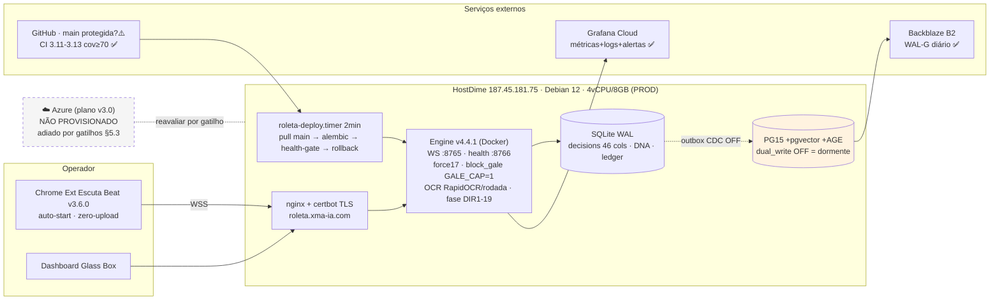

# Balanço de Evolução — Roleta Cloud · agosto/2026

> **Data:** 02/08/2026 · **HEAD:** `ac145c4` (main, 25/06/2026) · **Suíte:** 730 passed / 9 skipped / 1 xfailed · **Produção:** HostDime `187.45.181.75` (HTTPS 200, WSS OK)
>
> Documento produzido por análise completa de: git log (jan→jun), `Manutenabilidade_iso.md` (todos os ADENDOs), `fluxo_mental_24.md`, `evolução_24_junho.md`, `evolução_sentido(_25).md`, `auditoria_24_junho.md`, `analise_400_junho.md`, `resultados_22_junho.md`, `resultados_bancos_junho.md`, `foto_roleta_junho.md`, `auditoria_pos_foto_21_junho.md`, `detalhamento_estrutura_escuta.md`, `organizacao_de_arquivos.md`, `sprints/BOARD.md`, `server_snapshot/*`, `docs/runbooks/*`, `archive/sessoes/*` (plano 24/05 + solicitação Azure v2), `maquina_azure_agora_25.md`, grafo graphify (980 nós / 99 comunidades) e verificação ao vivo (site, WSS, CI, docker local).

---

## 0. Sumário executivo

O projeto executou entre **maio e junho/2026 um ciclo denso de evolução** (264 commits, suíte de 105→730 testes): implantou a stack v4.5-hardening no HostDime (PG15+pgvector+AGE, WAL-G→Backblaze, Grafana Cloud, deploy automático por timer), construiu o pipeline de **visão OCR por rodada**, corrigiu a semântica de direção, e entregou **19 sprints de sentido-fase (DIR1–DIR19) em um único dia** (25/06, PRs #22–#37). Em paralelo, projetou uma migração completa para Azure (3 versões de plano) — **que nunca foi executada** — e uma metodologia de sprints Diretor↔Executor com board de 23 sprints de produto + 14 de metodologia — **que nunca saiu do TODO**.

Desde **25/06 o repositório está dormente** (~37 dias). A produção segue saudável e o maior problema conhecido **não é infra: é edge de estratégia** (flat ROI −4,71%, pior que aleatório −2,70%), cuja solução já está mapeada no board (SPR-G2 → S1/S2) e cuja única alavanca +EV conhecida (gate dealer×sentido: JAMES×anti +9,3%, OLIVER×horário +7,8%) está **dormente atrás de flag**, com os dados já fluindo desde 22/06.

**Veredito Azure: adiar.** O próprio projeto refutou a necessidade em 24/05 (95% do roadmap roda no HostDime upgradado por ~metade do custo), o upgrade foi feito, o bloqueio AVX2 foi contornado (`numpy<2`, sklearn em vez de torch) e as cargas que exigiriam nuvem (pgvector/AGE/LanceDB/treino pesado) estão todas dormentes. Reavaliar apenas por gatilho objetivo (§5.3).

---

## 1. Linha do tempo — o que foi feito nos últimos meses

| Período | Commits | Marcos |
|---|---|---|
| **Jan–Mar/26** | 81 | Fundação: engine WebSocket+SQLite, extensão Escuta Beat, staking, baseline ISO **8.5/10** (02/04, v4.3.2) |
| **Abr/26** | 2 | Pausa |
| **Mai/26** | 129 | **Sessão 24/05** (plano de mudança tecnológica + auditoria): upgrade HostDime (2→4 vCPU, 8 GB, 80 GB), stack v4.5: PG15+pgvector+AGE via Docker, outbox CDC, **WAL-G→Backblaze B2 operacional** (smoke restore OK, <US$1/mês), **Grafana Cloud ativo**, deploy pull-based (`roleta-deploy.timer`, ~2 min, alembic+health-gate+rollback). Solicitação Azure v2 redigida (23/05) e plano `maquina_azure_agora_25.md` v3.0 (25/05) — **não executados** |
| **Jun/26 (1ª quinzena)** | ~60 | Auto-start/zero-upload da extensão (v3.4.x), correção do closure bug (dealer deixou de ser 100% unknown), incidente 13/06 "MASTER deadlock ~16h sem spins" → fix `1446166` (**hoje já no main**), migração SP-13 (colunas dealer em `decisions`), CI cov≥70% |
| **17–22/06** | ~40 | Era das geometrias: CSelection+BlockGale (14# `c2c3`) → **force17** (17#/união~15) `SDA_BET_PAIR=force17`, `GALE_CAP=1` (gale abolido por backtest: −77u vs +99u flat); **pipeline visão OCR server-side por rodada** (RapidOCR, `SDA_VISION_OCR=1`); fill-forward dealer/modelo/provider (~12%→**100%** cobertura/sessão); correção semântica de direção provada 405/405; análise dos 400 (anti-horário pós-RED +3% ROI; horário = abster); auditoria 24/06: **edge flat −4,71% < aleatório −2,70%** |
| **24–25/06** | ~75 | Metodologia Diretor↔Executor implantada (`.github/agents`, skills, `sprints/BOARD.md` com 23 sprints); **arco sentido-fase completo: DIR1–DIR8 + DIR9–DIR19 todos entregues** (PRs #22–#37), incluindo fix P0 `#S` (seed_parity em reset → `SDA_RESET_REANCORA=1`), migração Alembic **0010** (fix #L), métricas de fase no Prometheus (DIR12), lock total (DIR13), shadow mode (DIR18). Suíte **730**. Último commit: `ac145c4` (25/06) |
| **Jul–02/08** | 0 | **Dormência.** Produção segue de pé (verificado hoje: HTTPS 200, WSS conecta, CI main verde, certbot renovou sozinho) |

## 2. O que está EM PRODUÇÃO hoje (verificado)

- **Engine v4.4.1** no HostDime, 8 containers healthy (snapshot 10–12/06) — app ~60 MB RAM, PG ~13 MB.
- **Flags ON** (compose = fonte canônica): `VISION_OCR`, `REGIONS_V4`, `DEALER_FILL_FORWARD`, `HISTORICO_NAO_DIRECIONAL`, `SENTIDO_AUTORITATIVO`(+SHADOW), `PHASE_RECONCILE`, `DEDUP_SEQ`, `RESET_REANCORA`, `UNCERTAIN_REANCORA`, `LOCK_TOTAL`, staking `block_gale`+`GALE_CAP=1`, `BET_PAIR=force17`.
- **Flags OFF/dormentes**: `FORCE17_EXACT`, `DEDUP_PHANTOM`, `DEALER_FORCE_PROFILE`, `DIRECTION_VISION` (DIR7, stand-by planejado), `GALE_ONLY_AFTER_GREEN`, `C_SELECTION_AUTO_PROMOTE`, `dual_write_pg=false` (PG espelho não recebe decisões).
- **Infra viva**: WAL-G→B2 (cron 02:00 UTC), Grafana Cloud, deploy timer 2 min com rollback, alertas (`RoletaNoMaster` incluído).
- **Schema**: Alembic 0001→**0010** (`0010_dir3_phase_columns`); prod estava em 0008 no snapshot, timer aplica `upgrade head` no deploy.
- **Extensão** Escuta Beat v3.6.0 (bump DIR); requer reload manual no Chrome do operador a cada versão.

## 3. Projetado × Entregue (matriz)

| Frente | Projetado | Entregue | Saldo |
|---|---|---|---|
| Infra v4.5 (24/05) | PG+pgvector+AGE, WAL-G, Grafana, deploy auto | ✅ 100% | AGE instalada mas **sem uso no código**; dual-write OFF |
| Visão foto→dados | OCR/rodada, dealer+mesa+provider+força | ✅ (BUG-A/B/1/5/6 fixados) | Fase 2 (offscreen/WebGPU/CNN/VLM) não iniciada — ok, era P2 |
| Sentido-fase | DIR1–DIR8 (rev.4) + DIR9–DIR19 (rev.5) | ✅ **19/19** em 25/06 | DIR7 vídeo stand-by (planejado) |
| Estratégia | Gates: ONLY_AFTER_RED, corte CW, CUT score=4, dealer×sentido, stop-loss persistente | ❌ **nada implementado** | É o backlog SPR-S1..S6 — parado |
| Metodologia | 14 sprints SPR-M (hooks, branch protection, CI ISO, GO, fleet) | ⚠️ superfícies criadas (agents/skills/board); **0 de 14 sprints M executados** | Guardrails são convenção, não enforcement |
| Board produto | 23 sprints (G/S/T/X/O) | ❌ 1 READY (SPR-G2), 22 TODO, **0 iniciados** | Parado desde 24/06 |
| Azure | Solicitação v2 (23/05) + plano v3.0 (25/05) | ❌ **nenhum recurso provisionado** (token az expirado; sem doc de entrega; prod = HostDime) | Ver §5 |
| Segurança | Hardening SSH, sops/age | ❌ root+senha ON, sem firewall, 118 updates pendentes (snapshot 06); sops DEFERRED | **Maior risco operacional atual** |

## 4. O que faltou fazer (consolidado)

1. **Edge de estratégia** — o problema nº 1 do produto. Nenhum dos 8 remédios da auditoria de 24/06 foi aplicado: congelar 17#, gravar `geometry_tag`/`flags_snapshot` (SPR-G2, único READY), cortar full-stake CW (−6,3%), CUT `score=4∧TR=0%`, **gate dealer×sentido em sombra** (única alavanca +EV conhecida; dados fluem desde 22/06), stop-loss persistente, quarentenar 19/06 (dia corrompido, numero=8 45×~12σ), aceitar teto honesto.
2. **Backlog inteiro parado** — 23 sprints de produto + 14 de metodologia sem execução; board sem movimento desde a criação.
3. **Hardening do HostDime** — SSH root+senha, sem nftables/fail2ban, updates pendentes. Não existe sprint no board para isso (lacuna!).
4. **PG espelho sem propósito ativo** — `dual_write_pg=false`; pgvector com ~18 linhas; AGE sem uso; decisão go/no-go (SPR-T3) nunca tomada.
5. **Dívidas técnicas conhecidas**: dois caminhos de deploy concorrentes (timer × tag, SPR-G3), versões divergentes (`VERSION 4.4.1` × ext × README, SPR-G1/G6), `message_handler` ~1200 LOC (SPR-T7), 0 testes JS na extensão (SPR-X3), provider `host:*` legado sem backfill `--apply` (SPR-T4).
6. **Docs desatualizados**: runbook `sem-apostas-master-slave.md` diz que o fix `1446166` "precisa de push" — **falso, já está no main**; `plano_implentacao_pos_sessao_24_05.md` foi deletado do repo mas runbooks ainda o referenciam; docs de 25/06-manhã (rev.5) listam DIR9-19 como pendentes quando foram entregues à tarde.

## 5. Auditoria do plano Azure

### 5.1 O que foi planejado (3 iterações)
- **v1/v2** (`archive/sessoes/solicitação_de_estrutura_azure.md`, 23/05): VM D2as_v5 + VM B4ms para PG em Docker (AGE não é permitida no Flexible Server — achado B32), KV, ACR, VNet, LAW, Blob, WAL-G→Blob, ~**US$151/mês**.
- **v3.0** (`maquina_azure_agora_25.md`, 25/05): simplificada — VM D2as_v5 + **PG Flexible B1ms PG16** (aceitando perder AGE), OIDC CI→ACR, cutover D-7..D+7 com testes T01–T35, ~**US$121/mês**. Motivação central: CPU QEMU do HostDime sem SSE4.2/AVX2 → bloqueia `numpy≥2`/torch/faiss (treino PCA/embeddings).

### 5.2 Fatos apurados
| # | Evidência | Fonte |
|---|---|---|
| 1 | Plano de 24/05 (véspera!) concluiu: **~95% do roadmap roda no HostDime upgradado** por ~US$52–82/mês; único item cloud = backup off-site → resolvido com Backblaze (~US$1–2/mês) | `archive/sessoes/plano_mudança_tecnologica_24_05.md` |
| 2 | O upgrade **foi feito** (4 vCPU / 6,9 GB / 79 GB) e a stack completa está no HostDime, saudável | `server_snapshot/01,03` |
| 3 | O bloqueio AVX2 foi **contornado**: `numpy>=1.26,<2` fixado; autoencoder usa sklearn MLPRegressor; torch/faiss **não estão** em `requirements.txt`; lancedb comentado ("ativar quando volume > 5k decisões") | `requirements.txt` |
| 4 | As cargas que justificariam a VM nova estão **dormentes**: `dual_write_pg=false`, pgvector ~18 linhas, AGE sem uso (AZ-BUG-02), similarity OFF | migração 0002, snapshot 05 |
| 5 | **Nada foi provisionado**: token az expirado (inativo >90 dias), sem `entrega_azure_maquina_v3.md`, produção segue HostDime | `az` CLI (verificado 02/08) |
| 6 | O gargalo real do produto é **edge de estratégia**, não capacidade de infra | `auditoria_24_junho.md` |

### 5.3 Veredito
> **NÃO migrar agora.** A migração otimizaria o que não é gargalo, custaria 2×/mês e re-introduziria risco de cutover num sistema estável. O plano v3.0 é bom e fica **arquivado como opção pronta**.
>
> **Gatilhos objetivos de reavaliação** (2+ disparados → reativar plano v3):
> - **G1 — ML pesado vira prioridade**: precisar de fato de torch/faiss/numpy≥2 (treino PCA/embeddings/CNN da Fase 2 de visão).
> - **G2 — Volume**: >5k decisões com uso real de pgvector/LanceDB (hoje: ~18 vetores).
> - **G3 — HostDime degradar**: custo >US$100/mês, incidentes de SLA recorrentes, ou fim do suporte ao plano atual.
> - **G4 — Operação crescer**: 2º operador / staging separado / exigência de IAM+secrets gerenciados (também destrava sops→Key Vault).
>
> **Pré-requisito para qualquer retomada**: reautenticar `az login` e provisionar via OIDC/service principal, nunca credencial pessoal em VM.

## 6. Blueprint — estado atual

## 7. Próximos passos sugeridos

### P0 — semana 1 (segurança + retomada)
| # | Ação | Por quê |
|---|---|---|
| 1 | **Criar e rodar SPR-SEC1: hardening HostDime** (SSH sem root/senha, chave ed25519, nftables+fail2ban, updates) | Maior risco real hoje; não existe no board |
| 2 | **Rodar SPR-G2** (`flags_snapshot`/`geometry_tag`/`coverage_n` em `decisions`) | Único READY; desbloqueia S1/S2; sem ele toda análise infere geometria |
| 3 | **Sincronizar docs**: runbook master-slave (fix já no main), BOARD (DIR1-19 = DONE), README/DEPLOY (timer × tag) | Docs mentindo custam horas de auditoria |

### P1 — semanas 2–3 (estancar sangria + única alavanca +EV)
| # | Ação | Por quê |
|---|---|---|
| 4 | SPR-S6 (quarentenar 19/06) + SPR-S3 (cortar full-stake CW) + SPR-S4 (CUT score=4∧TR=0%) | Cortes de −EV comprovados na auditoria 24/06 |
| 5 | **SPR-S2: gate dealer×sentido em sombra** | JAMES×anti +9,3%, OLIVER×horário +7,8%; dados já fluem; INV-3 preservado (veto = min() no stake) |
| 6 | SPR-S5: stop-loss persistente entre sessões | Hoje o bleed recomeça a cada reconexão |
| 7 | SPR-G3: um único caminho de deploy autoritativo | Timer × tag podem se sobrescrever |

### P2 — mês 2 (dívida e decisões estruturais)
| # | Ação | Por quê |
|---|---|---|
| 8 | SPR-G1+G6 (versão única + README) e SPR-G4 (consolidar Alembic, aposentar ALTERs in-loco) | Rastreabilidade |
| 9 | **Decidir o PG** (SPR-T3): ligar `dual_write_pg` para valer (pré-requisito de pgvector/similarity) **ou** aposentar o espelho | Hoje paga custo cognitivo sem retorno |
| 10 | SPR-T7 (extrair DecisionPipeline do `message_handler` ~1200 LOC) + SPR-X3 (testes JS) | Modificabilidade ISO |
| 11 | SPR-M4+M5 (git hooks + branch protection server-side) | Guardrails viram enforcement |
| 12 | Azure: **nenhuma ação** além de revisar os gatilhos §5.3 trimestralmente | Plano v3 fica pronto na gaveta |

## 8. Fontes
`git log` (jan–jun/26) · `Manutenabilidade_iso.md` (ADENDOs 12/06→25/06, escore ~8.6/10) · `fluxo_mental_24.md` §6-§12 · `evolução_24_junho.md` · `evolução_sentido.md` rev.4 + `_25.md` rev.5 · `auditoria_24_junho.md` · `analise_400_junho.md` · `resultados_22_junho.md` · `resultados_bancos_junho.md` · `foto_roleta_junho.md` · `auditoria_pos_foto_21_junho.md` · `detalhamento_estrutura_escuta.md` · `organizacao_de_arquivos.md` · `sprints/BOARD.md` + `SPR-G2.md` · `server_snapshot/01-08,10` · `docs/runbooks/*` (9) · `archive/sessoes/plano_mudança_tecnologica_24_05.md` · `archive/sessoes/solicitação_de_estrutura_azure.md` v2 · `maquina_azure_agora_25.md` v3.0 · `requirements.txt` · `docker-compose.yml` · `migrations/versions/0001-0010` · graphify (980 nós/1.171 arestas/99 comunidades @ `ac145c48`) · verificação ao vivo 02/08 (HTTPS/WSS/CI/az/Test-NetConnection).
