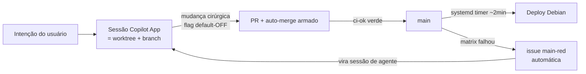

# blueprint_roleta_atual.md — Como operamos HOJE (Roleta Cloud × GitHub Copilot App)

> **AS-IS auditado em 07/08/2026.** Este documento fotografa o modelo de trabalho agêntico
> REAL deste repo — camadas de instrução, agentes, skills, MCPs, chamamento e esteira.
> Contrato normativo: [`AGENTS.md`](AGENTS.md). Invioláveis:
> [`.github/copilot-instructions.md`](.github/copilot-instructions.md).
> Evidência do modelo: **12 PRs integrados em 48h (06–07/08) sem um único merge manual.**

## 1. Modelo de execução — sessão = worktree

Cada sessão do GitHub Copilot App abre um **worktree isolado** em
`copilot-worktrees/Roleta Cloud/<slug>` com branch próprio a partir de `origin/main`.
O checkout principal (`Desktop\Roleta Cloud`) nunca é tocado por agente.

- **Merge:** exclusivamente auto-merge (`gh pr merge --auto --squash`); required check único
  agregador `ci-ok`; branch protection `strict=OFF` (auto-merge flui sem "update branch").
- **Deploy:** servidor Debian é consumidor cego (`timer → pull origin/main → deploy ~2min →
  healthcheck → rollback`). Nenhum agente acessa o servidor; produção se lê por
  `/health` e `/metrics`.
- **Rede de segurança:** tudo nasce flag-OFF + revert barato (~4min) + `main-red-alert`.

## 2. Camadas de instrução (ordem de carga e precedência)

| # | Artefato | Escopo | Papel |
|---|---|---|---|
| 1 | `.github/copilot-instructions.md` | repo | invioláveis compactos — **auto-carregado em toda sessão**; vence em conflito |
| 2 | `AGENTS.md` (raiz) | repo | contrato operacional completo (3 camadas, ciclo, anti-conflito) — padrão cross-ferramenta |
| 3 | `.github/agents/` | repo | papéis invocáveis: `sprint-director` (orquestra, NÃO implementa), `sprint-executor` (1 sprint → PR) |
| 4 | `.github/skills/` | repo | rituais do projeto: `methodology-go`, `sprint-executor`, `sprint-status` |
| 5 | `~/.copilot/AGENTS.md` + `settings.json` | máquina | protocolo YOLO global + roteamento de modelos por função |
| 6 | `~/.copilot/agents/` | máquina | agentes pessoais: `yolo-orchestrator`, `strategic-planner` |
| 7 | `~/.copilot/skills/` | máquina | hábitos cross-projeto: `graphify-first`, `bootstrap-governanca`, `verification-before-completion`, `mcp-radar`, `parallel-deep-dive`, `pyspy-debug`, `ws-handshake`, `filesystem-discipline` |

Regra anti-drift: **repo define domínio; máquina define hábito; nada de projeto vive só local.**

## 3. MCPs ativos (8) e disciplina de uso

| MCP | Uso neste projeto | Disciplina |
|---|---|---|
| `graphify` | grafo de conhecimento do código; PR triage (`list_prs`, `get_pr_impact`) | **grafo local primeiro** (`graphify query --graph graphify-out/graph.json`); global só cross-repo; `graphify update .` após editar código; NUNCA commitar `graphify-out/` |
| `memory` | memória durável entre sessões | entidades prefixadas `RoletaCloud-*`; gravar a cada marco (merge, incidente, lição) |
| `filesystem` | leitura/edição fora do cwd quando preciso | least-privilege; `edit_file` com dryRun em operação arriscada |
| `sequential-thinking` | raciocínio estruturado em problemas longos | sob demanda |
| `context7` | docs atualizadas de libs | resolve-library-id → query |
| `brave-search` | pesquisa web | fatos externos/atuais |
| `pdf-parser` | PDFs → markdown | sob demanda |
| `agent-browser` | automação de browser | validação visual/e2e leve |

## 4. Chamamento (como os agentes são invocados)

- **Sessão nova no App:** carrega automaticamente camadas 1–7; o usuário fala em linguagem
  natural; skills disparam por gatilho de frase ("GO", "status", "executar SPR-X"…).
- **Delegação:** `task` tool com `agent_type` (`sprint-executor`, `explore`, `general-purpose`…)
  e override de modelo quando a função pede (ex.: revisor-debatedor em `gpt-5.6-sol`);
  fan-out paralelo só com locks disjuntos.
- **Sessões-filhas:** `create_session`/`open_pr_session` (1 sessão por sprint/PR); mensagens
  cross-sessão para coordenação Diretor↔Executor.
- **CLI:** `copilot --agent <nome>` no diretório do projeto equivale ao seletor do App.

## 5. Rituais que mantêm o zero-humano saudável

1. **Lock check pré-PR:** `gh pr list` + arquivos dos PRs abertos; colisão → serializa.
2. **ADENDO ISO = arquivo novo** em `docs/iso/adendos/AAAA-MM-DD-<slug>.md`; singleton
   `Manutenabilidade_iso.md` congelado (append era o maior ímã de conflito do repo).
3. **BOARD só o Diretor escreve** (em lote, pós-integração).
4. **Flag nova na compose → espelho Azure no MESMO PR** (contrato de teste força).
5. **Workflow com secrets externos nasce gateado** por repo variable default-OFF.
6. **Ativação é PR** (`flag/ativar-<slug>`), nunca "ação humana pendente".
7. **Conflito/DIRTY:** worktree detached → merge main → preservar lados complementares →
   suíte → `git push origin HEAD:<branch>`. **Run zumbi:** `gh pr update-branch`.
8. **Fechamento de sessão:** suíte + lints → PR → `graphify update .` → memory MCP.

## 6. Métricas e lições da janela 06–07/08

- 12 PRs auto-integrados (#54–#66), 0 merges manuais, deploy ~2min pós-merge.
- 4 incidentes → 4 regras nativas (silos de append → adendos; CI matrix serializada →
  concurrency; workflow ACR sem secrets → gate por variable; conflito R2×PG-CTX →
  preservar canais complementares).
- Único degrau humano restante: instalação física da extensão Chrome (fora do alcance da esteira).

## 7. Limitações conhecidas

- Fila de runners do GitHub intermitente (mitigada por concurrency + `update-branch`).
- `tests/test_obs_reload.py` trava em Windows local (CI Ubuntu ok) — rodar com `--ignore`.
- Segurança fora de escopo por diretriz do owner (registrado no ISO §6).
