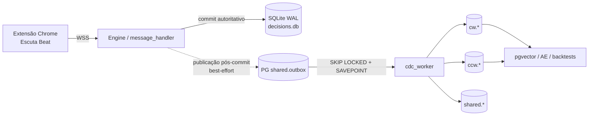
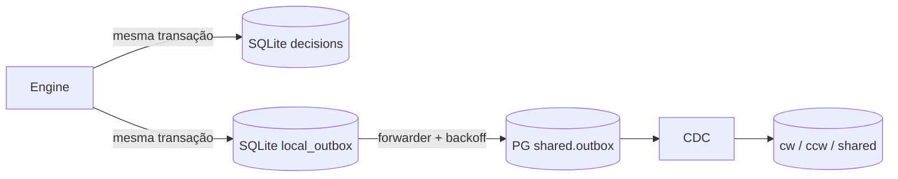

# Estruturação do sentido — estado, lacunas e decisão de arquitetura em 06/08

**Corte da auditoria:** 06/08/2026 17:47 UTC  
**Código auditado:** `main@ebc89e8`  
**Servidor auditado:** Debian `xmaiajpvm`, somente leitura  
**Fontes:** `Manutenabilidade_iso.md`, `evolução_03_08.md`,
`arquitetura_dados_estrategia.md`, `sprints/BOARD.md`, briefs `SPR-V*`,
composes, migrations, código do produtor/CDC, GitHub e evidência direta do host.

> O nome deste arquivo preserva exatamente o nome solicitado. Em documentos
> futuros, recomenda-se o nome normalizado `estruturacao_sentido_AAAA_MM_DD.md`.

---

## 1. Resposta executiva

**Não está tudo 100% implantado e funcional.** O núcleo operacional está
saudável: extensão → WebSocket → motor → SQLite → espelho PG/pgvector voltou a
receber giros, o leitor de resultados resolve a decisão anterior, o CDC está sem
fila e o servidor tem ampla folga. Porém, quatro classes de trabalho continuam
abertas:

1. **Código presente, mas dormente:** V4 audit/shadow, partes do V1, V3-B,
   V6A, V5 de vídeo, V7 e V8 dependem de flags, evidência humana ou gates.
2. **Código pronto, mas fora da `main`:** o PR #60 corrige a projeção de
   contexto para `spin_features`, mas ainda não foi mergeado nem ativado.
3. **Defeitos operacionais ativos:** janelas temporais SQL incorretas, métrica
   de no-spin cega após restart sem giro, WAL-G sem permissão de listagem/retenção
   e exporters mal expostos/sem scrape.
4. **Drift documental:** o BOARD ainda mostra V1–V4 como não entregues e os
   relógios dos gates não foram preenchidos.

### Decisão recomendada

**Manter agora a máquina, o SQLite autoritativo e o PostgreSQL/pgvector
co-localizado.** Não há evidência de gargalo de CPU, RAM, disco, banco ou
conexões que justifique troca por capacidade.

Antes de mover banco ou máquina:

1. restaurar e medir a ingestão;
2. corrigir telemetria e janelas temporais;
3. provar restore;
4. completar a projeção do PR #60;
5. criar um **outbox local durável no SQLite**.

Depois disso, se houver motivo de disponibilidade ou ISA, migrar primeiro a
**máquina inteira mantendo a topologia co-localizada**. PostgreSQL gerenciado
fica como decisão posterior e independente, motivada por HA/PITR — não por
desempenho. Não se recomenda uma VM separada apenas para o PostgreSQL.

---

## 2. Como interpretar os estados

| Estado | Significado |
|---|---|
| **ATIVO** | Código em `main`, implantado no Debian e comportamento ligado |
| **DORMENTE** | Código em `main`, mas flag OFF ou gate ainda não iniciado |
| **PRONTO FORA DA MAIN** | Implementado/testado em PR, sem deploy |
| **PENDENTE HUMANO** | Depende de Chrome, mesa real, decisão GO/NO-GO ou janela |
| **DEFEITO ATIVO** | Evidência reproduzida de dado/telemetria/operação incorreta |

**Regra de evidência:** “existe no código” não significa “está ativo”. O estado
ativo foi classificado por compose + ambiente real do host, não pelo default de
uma função Python. Exemplo: `SDA_V5_SIG4` e `SDA_V5_FLIP_PURO` têm default OFF no
código, mas default ON no compose e estão ON no Debian.

---

## 3. Arquitetura real em 06/08



### 3.1 O que cada plano garante

| Plano | Tecnologia | Papel | Garantia real |
|---|---|---|---|
| Operacional | SQLite WAL | Verdade da decisão, resultado, sessão e DNA | Local, rápido e independente do PG |
| Transporte | `shared.outbox` no PG | Fila consumida pelo CDC | At-least-once **depois que o evento entrou no PG** |
| Analítico | PostgreSQL 15 + pgvector | Vetores, features e análise por sentido | Derivado; não decide a aposta |

### 3.2 Correção conceitual importante

O caminho SQLite → `shared.outbox` **não é um outbox transacional completo**:

- primeiro a decisão é commitada no SQLite;
- depois o publisher tenta inserir o evento no PostgreSQL;
- se o PG estiver indisponível, a decisão continua correta, mas o espelho pode
  ficar com um buraco permanente;
- a flag `dual_write_pg` também é lida no próprio PG e falha fechada;
- após tentativas repetidas de inicialização, o publisher pode permanecer
  desabilitado até restart do processo;
- a fila de DNA em memória não é durável em restart.

Isto protege o hot path, mas **não garante completude analítica**. Por isso mover
o PG para outra rede antes de existir spool local aumenta o risco de lacunas.

---

## 4. Fotografia final do Debian

**Horário:** 17:47:06 UTC. A ingestão estava ativa no corte.

| Componente | Evidência | Estado |
|---|---:|---|
| Repo do host | `main@ebc89e8`, árvore limpa | **ATIVO** |
| Deploy | timer ~2 min; launcher versionado | **ATIVO** |
| App | healthy, 0 restarts; 2 WS, 1 MASTER | **ATIVO** |
| Último giro | 17:46:41 UTC, 26 s antes do corte | **ATIVO** |
| SQLite `decisions` | 11.481 linhas; ID máximo 11.481 | **ATIVO** |
| Outbox PG | 67.677 processados; 0 pending; 0 failed | **ATIVO** |
| Vetores CW | 4.004; 38 `ae_latent` NULL | **ATIVO COM LAG AE** |
| Vetores CCW | 3.777; 37 `ae_latent` NULL | **ATIVO COM LAG AE** |
| Features CW | 3.370; `session_id` em 373 | **PARCIAL** |
| Features CCW | 3.132; `session_id` em 362 | **PARCIAL** |
| Contexto PG | dealer/mesa/visão/fase/centro/gale = 0% | **DEFEITO CONHECIDO** |
| Alertas firing | PnL baixo e volatilidade extrema | **2 ativos** |

### 4.1 Capacidade

| Recurso | Medição |
|---|---:|
| Host | Debian 12, 4 vCPU |
| RAM | 6,8 GiB; 5,1 GiB disponíveis |
| Disco raiz | 15% usado |
| PostgreSQL | 15.18; banco 69 MiB; PGDATA 214 MiB |
| Conexões PG | 10/100; 0 idle-in-transaction |
| Consulta local `SELECT 1` | ~0,125–0,231 ms |
| Extensões PG | `vector 0.8.2`, `pgcrypto`, `pg_stat_statements` |
| AGE / Timescale | não instalados |

Não há evidência de pressão de capacidade. Parte das medições foi feita durante
uma pausa de ingestão, portanto **não substitui baseline de carga de 7 dias**.

### 4.2 Pausa de ingestão observada

- último giro anterior: 01:49:27 UTC;
- app reiniciou às 05:33 UTC e ficou com MASTER conectado, mas sem
  `novo_resultado`;
- a ingestão retomou às 16:45 UTC sem mutação da auditoria;
- às 17:47 UTC seguia ativa.

**Fato:** servidor, WS e banco estavam saudáveis; o processo não recebeu giro.  
**Inferência, não prova:** aba/mesa/extractor do cliente estava inativo ou
logicamente stale. V6A deve tornar esse estado observável.

---

## 5. O que foi implantado — e por quê

### 5.1 Estratégia de aposta ativa

| Peça | Estado | Por que entrou |
|---|---|---|
| `SDA_BET_PAIR=v5_1721` | **ATIVO** | Seleção 17/21 por resultado do sentido-alvo |
| `SDA_V5_SIG4=1` | **ATIVO** | Assinatura-4 e diagnóstico de regiões |
| `SDA_V5_FLIP_PURO=1` | **ATIVO** | Última jogada do sentido decide 17/21 |
| `SDA_LOCK_TOTAL=1` | **ATIVO** | Evita correções conflitantes de fase |
| `SDA_VISION_OCR=1` | **ATIVO** | Extrai dealer/mesa/visão |
| INV-3 | **PRESERVADO** | Toda estratégia segue indicando `APOSTAR`; vetos só modulam stake |

**Não confundir:** “V5.2” acima é a estratégia de aposta 17/21. O
**SPR-V5 do seletor** é outro projeto: sensor físico por vídeo, ainda bloqueado.

### 5.2 Seletor de sentido

| Sprint | Entrega em `main` | Estado real | Por que não avançou além |
|---|---|---|---|
| SPR-V1 | buffer sync, overlap, gate temporal, métrica de alternância | estágio 1 ativo; overlap e gate temporal OFF | ativação sequencial para evitar popup espelhado |
| SPR-V2 | extensão 3.10.0, sem giro fantasma/flip local | código mergeado; versão do Chrome não verificável remotamente | exige reload/inspeção humana |
| SPR-V3-A | probes, replay e protocolo de vídeo | `WAITING_HUMAN_EVIDENCE` | instrumento pronto; mundo real ainda não medido |
| SPR-V4 | `direction_event` + `phase_events` | código/schema ativos; audit e shadow OFF; 0 eventos | shadow só começa após ativação deliberada |
| SPR-V6A | alertas, client health e confirmação de seed | não implementado | depende de V1/V2/V4 operacionais |
| SPR-V5 | sensor por vídeo | bloqueado | exige GO do V3-B + V6A |
| SPR-V6B | monitor estatístico de espelho | bloqueado | exige 30 dias limpos a partir de relógio formal |
| SPR-V8 | autenticação/role | brief ainda não escrito | pré-requisito duro de V7 |
| SPR-V7 | correção limitada da âncora futura | bloqueado | exige V5, V8 e gate T4 |

### 5.3 Fundação de dados H1–H7

| Item | Estado live | Observação |
|---|---|---|
| H1 lift por sentido | `SDA_DNA_REALIZE=1`, a cada 20 resultados | ativo |
| H2 idempotência | UNIQUE parcial + `ON CONFLICT` | ativo |
| H3 sessão nas features | coluna/índice + janela por sessão | ativo; cobertura histórica parcial |
| H4 ANALYZE | `CDC_ANALYZE_EVERY_N=50` | ativo; último ciclo observado às 16:52 |
| H5 AE por sentido | modelos CW/CCW + backfill nightly efêmero | eventual, não em tempo real |
| H6 HNSW | índices de `raw_features` e `ae_latent` | ativo |
| H7 higiene | imagem oficial `pgvector/pgvector:pg15`; AGE/Timescale removidos | concluído |

O app não carrega `joblib/scikit-learn` por desenho. O script
`scripts/ae-latent-nightly.sh` usa container efêmero e preenche somente NULL.
Assim, os 75 vetores novos sem latente são **lag de batch**, não prova de perda.
É necessário definir SLO explícito: por exemplo, `ae_latent` completo em até
24 h, ou aumentar a frequência se análise quase em tempo real for necessária.

### 5.4 Observabilidade e deploy

- correção do inode Prometheus implantada;
- mount de diretório `/root/roleta-cloud/obs → /etc/prometheus`;
- 23/23 regras carregadas e saudáveis;
- app e Prometheus healthy;
- `main` continua sendo produção e deploya automaticamente.

Isto foi implantado porque resolve uma falha concreta sem alterar aposta e
mantém rollback por PR.

---

## 6. O que não foi implantado — e por quê

### 6.1 PR #60 — contexto de `spin_features`

**Estado no corte:** OPEN, `MERGEABLE/CLEAN`, SHA `b1cc7e5`, CI 6/6 verde.

Entrega:

- evento `spin_result` autocontido;
- `dealer_table → "table"` explícito;
- dealer, provider, visão, fase, centro e gale projetados;
- proteção contra NaN/Inf/float fora do `REAL`;
- contrato de paridade corrigido;
- backfill UPDATE-only, idempotente e dry-run por default.

**Não está em produção** porque ainda não foi mergeado. A flag
`SDA_PG_FEATURE_CONTEXT` nem existe nas imagens atuais. Por isso o PG continua
com 0% dos contextos.

**Ordem obrigatória de rollout:**

1. mergear o PR;
2. recriar o CDC worker com flag ON;
3. provar que a flag chegou ao container;
4. congelar `max(decisions.id)` e horário do corte;
5. só então recriar o app com flag ON;
6. reconciliar apenas decisões posteriores ao corte;
7. decidir o backfill histórico em aprovação separada.

O `--apply` do backfill **não deve ser acoplado ao merge**.

### 6.2 PR #58 — dealer-aware + Error Engine

**Estado às 16:54 UTC:** OPEN, MERGEABLE, `BLOCKED`; `ci-ok` falhou e quatro
checks foram cancelados.

Não deve ser promovido enquanto:

- o CI não for reexecutado/explicado;
- o defeito de janelas temporais do dealer não for corrigido;
- o modo shadow não produzir evidência.

### 6.3 PR #43 — MIG-0 / Azure pre-cutover

**Estado no corte:** OPEN, `CONFLICTING/DIRTY`, base antiga.

O PR contém mecanismos úteis de persistência e shadow de máquina, mas não é
autorização de cutover. Exige rebase e gates humanos. Não deve ser mergeado só
porque uma Azure VM ou banco já existe.

### 6.4 Backfills históricos

Não foram aplicados automaticamente porque:

- linha ausente não pode ser inventada;
- valor existente não pode ser sobrescrito;
- a origem deve ser o SQLite;
- todo backfill deve começar em dry-run;
- perdas anteriores ao horizonte confiável precisam ser declaradas, não
  imputadas.

---

## 7. Defeitos e riscos ativos

### 7.1 Janelas temporais incorretas — impacto sistêmico

As decisões são gravadas com timestamp ISO contendo `T`, enquanto consultas
usam `datetime('now', ...)`, que retorna espaço. A comparação textual deixa de
representar minutos/horas e tende a abranger o dia.

Superfícies afetadas:

- `strategies/dealer_offset.py`;
- `strategies/dealer_force_profile.py`;
- estatísticas de calibração/dealer em `database/sqlite_repo.py`;
- métrica `roleta_decisions_with_result_1h`.

O CI não detectou porque um teste semeia timestamp com `datetime(...)`, no
formato de espaço — diferente do caminho de produção.

**Correção recomendada:**

1. teste de regressão deve inserir pela mesma função usada em produção;
2. consultas devem usar `julianday(timestamp) >= julianday(...)` ou normalização
   canônica única;
3. corrigir primeiro métricas/relatórios;
4. alterações que mudem `dealer_offset`/`dealer_force_profile` precisam de
   backtest e flag default-OFF, pois podem mudar aposta.

### 7.2 Blind window após restart

Quando o processo inicia e ainda não recebeu spin, `last_spin_ts=None`; o Gauge
`roleta_seconds_since_last_spin` mantém zero inicial. O alerta de no-spin fica
cego **somente entre o restart e o primeiro spin**.

Correção proposta:

- inicializar a idade pelo último giro persistido no SQLite; ou
- expor `roleta_no_spin_since_boot=1` e idade desde o start;
- manter o caminho atual depois do primeiro spin.

### 7.3 WAL-G e restaurabilidade

| Evidência | Estado |
|---|---|
| `backup-push` | conclui e escreve backup |
| WAL archiver | ativo |
| `backup-list` | HTTP 403 |
| `delete retain FULL 48` | HTTP 403 |
| restore drill | script existe; sem evidência live bem-sucedida |

Consequências:

- não é possível enumerar/validar o backup remoto;
- retenção não executa e o armazenamento remoto pode crescer sem controle;
- o drill com `LATEST` fica bloqueado pela listagem.

**Ordem:** corrigir permissão de listagem/retenção → listar backups → executar
restore drill isolado → registrar RPO/RTO e métrica de idade.

### 7.4 Exposição e scrape

- porta 9100 do node-exporter está pública em host sem UFW;
- PostgreSQL, app, Prometheus, Grafana e exporters restantes estão em loopback;
- node/PG exporters rodam, mas não estão entre os targets do Prometheus;
- `alertmanager.yml` ainda usa bind de arquivo, mesma classe do incidente de
  inode já corrigido no Prometheus.

Prioridade: bind de 9100 em loopback/rede interna, scrape explícito dos
exporters e mount de diretório para Alertmanager.

### 7.5 Finite guard dos vetores crus

O PR #60 protege confidências de contexto, mas `_extract_raw_features()` ainda
aceita NaN/Inf. Um valor hostil pode impedir o evento ou contaminar a distância
vetorial. Corrigir produtor e worker, com contador e teste de mutação, em PR
separado.

---

## 8. Documentação e governança

### 8.1 BOARD incorreto

O `sprints/BOARD.md` ainda registra V1/V2 como READY e V3/V4 como TODO, apesar
dos merges. Isto pode gerar sprint duplicado.

Também faltam:

- `ativado_V1V2`: só deve ser preenchido quando buffer sync estiver ON **e** a
  extensão 3.10.0 tiver sido confirmada no Chrome;
- `ativado_audit_shadow`: só começa com audit + shadow ON.

Sem esses relógios:

- os 30 dias do V6B não começaram formalmente;
- os 7 dias do gate T4/V7 não começaram;
- “tempo decorrido” sem denominador não conta.

### 8.2 Documentos de 03/08 ficaram históricos

`evolução_03_08.md` precisa de correção datada porque hoje:

- AGE e Timescale não estão instalados;
- H1 e H4 estão ativos no host;
- AE foi backfillado, mas novos vetores aguardam batch nightly;
- `spin_features` é fresco em linhas, porém vazio em contexto;
- o fluxo SQLite → PG é best-effort pós-commit, não outbox transacional único.

O ADENDO do PR #60 só entrará no `Manutenabilidade_iso.md` quando o PR for
mergeado.

---

## 9. Backups, RPO e RTO

| Dado | Mecanismo atual | Evidência | Situação |
|---|---|---|---|
| SQLite + state | snapshot a cada 10 min para Azure Blob write-only | último observado 16:50, `integrity_check=ok` | upload provado; restore/retenção não provados |
| SQLite | backup diário local + offsite | 06/08 03:15 OK; retenção local 7 dias | saudável |
| PostgreSQL | WAL-G basebackup + WAL | push OK; list/retention 403 | recuperabilidade não provada |

### Metas propostas

| Camada | RPO alvo | RTO alvo |
|---|---:|---:|
| SQLite autoritativo + state | ≤15 min | ≤20 min |
| PostgreSQL analítico | ≤5 min | ≤60 min |
| Retorno do produto | — | ≤10 min |

Backup sem restore não satisfaz a meta. Executar mensalmente:

- drill SQLite com `integrity_check`, contagem e SHA;
- drill PostgreSQL em container isolado;
- alerta se a última prova de restore tiver mais de 35 dias.

---

## 10. Decisão de máquina e banco

### 10.1 Matriz

| Opção | Confiabilidade | Latência | Complexidade | Reversibilidade | Decisão |
|---|---:|---:|---:|---:|---|
| A. Manter e endurecer o host atual | 4 | 5 | 4 | 5 | **AGORA** |
| A'. Migrar stack inteira para VM nova, PG co-localizado | 4 | 5 | 3 | 4 | **CONDICIONAL** |
| B. PG em VM separada autogerida | 3 | 3 | 2 | 3 | **NÃO RECOMENDADO** |
| C. PG gerenciado | 4 após gates | 3 | 3 | 3 | **CONDICIONAL A HA/PITR** |
| D. Substituir SQLite no hot path | 1 | 1 | 1 | 1 | **REJEITADO** |

### 10.2 Por que não trocar agora

- banco lógico de 69 MiB;
- 10/100 conexões;
- query local sub-milisegundo;
- RAM, disco e CPU com folga;
- zero backlog CDC;
- SQLite com apenas 11.481 decisões;
- os problemas atuais são contrato, observabilidade e restore.

A CPU virtual não expõe SSE4.2/AVX/AVX2. O workload atual funciona com NumPy
1.26.4; Torch/Faiss/NumPy 2 não foram testados. Isto é limitação potencial, não
prova de bloqueio.

### 10.3 Quando migrar a máquina inteira

Exigir pelo menos uma condição material:

- CPU >70% sustentada sob ingestão ativa;
- p95 de decisão >250 ms ou p99 >500 ms por 7 dias;
- RAM >60% ou disco >70%;
- dependência aprovada exigir ISA indisponível e falhar em teste;
- disponibilidade do host ficar abaixo do SLO;
- restore/rollback da nova VM ensaiado em ≤15 min.

Mesmo neste caso, mover primeiro app + SQLite + PG juntos reduz variáveis no
cutover.

### 10.4 Quando considerar PostgreSQL gerenciado

Somente após:

1. outbox local durável ativo por ≥30 dias;
2. completude do espelho ≥99,9%;
3. TLS `verify-full`;
4. `alembic upgrade head` completo em ambiente limpo;
5. pgvector/HNSW compatível;
6. `LISTEN/NOTIFY` validado por 24 h;
7. restore lógico com contagem exata;
8. PITR ensaiado com RTO ≤60 min;
9. rollback de DSN + replay do spool com zero perdas;
10. conexões <60% do limite e p99 de publicação ≤20 ms.

O motivo deve ser HA/PITR/isolamento de falha. Se for só capacidade, permanecer
co-localizado.

### 10.5 Quando substituir SQLite

Não agora. Reavaliar apenas com evidência de:

- múltiplos writers obrigatórios;
- lock p95 >50 ms;
- corrupção ou restore falho recorrente;
- arquivo/crescimento fora do SLO operacional;
- requisito de consulta distribuída no hot path.

Trocar SQLite hoje faria a disponibilidade da aposta depender de rede e
contrariaria a separação operacional/analítica.

---

## 11. Proposta de evolução da arquitetura de dados

### 11.1 Inserir um Plano 1.5: outbox local durável



Contrato:

- tabela aditiva;
- evento e decisão commitados juntos;
- `event_uuid` idempotente;
- forwarder separado, com backoff;
- flag `SDA_OUTBOX_LOCAL_SPOOL=0` default-OFF;
- a habilitação do spool **não pode depender de flag lida no PG**;
- métricas de profundidade, idade, falha e descarte;
- teste de caos: PG indisponível por 10 min, aposta continua, spool cresce e
  drena a zero após retorno, sem perda.

Este é o pré-requisito que torna banco remoto seguro e rollback de DSN
reproduzível.

### 11.2 Contratos de dados

- todo evento ganha `schema_version`;
- manifesto de paridade deve ser validado contra migrations e mapas de projeção;
- CI falha se uma coluna obrigatória ficar sem produtor/destino;
- migrations continuam aditivas; deploy nunca faz downgrade;
- backfill permanece UPDATE-only, dry-run, idempotente e com watermark;
- linha sem origem recuperável permanece NULL.

### 11.3 SLOs mínimos

| Indicador | Meta |
|---|---:|
| Spins com indicação (INV-3) | ≥99,5% |
| Espelho PG completo em ≤60 s | ≥99,9% |
| Lag CDC p95 / máximo | ≤5 s / ≤60 s |
| Outbox failed | 0 |
| Spool local, idade máxima | ≤120 s em regime normal |
| Decisão p95 / p99 | ≤250 ms / ≤500 ms |
| Backup SQLite | idade ≤90 min |
| Restore drill | idade ≤35 dias |
| `ae_latent` | completo no SLO batch definido |

Métricas necessárias: pending/failed/lag do outbox, completude do espelho,
profundidade/idade do spool, latência de decisão/publicação, idade de backup e
restore, floats não finitos e frescor do AE.

---

## 12. Plano recomendado

### 12.1 Próximas 72 horas — restaurar verdade operacional

1. **Cliente/extensão:** confirmar no Chrome versão 3.10.0, aba da mesa,
   extractor e `client_health`; não ligar o gate temporal antes disso.
2. **BOARD:** atualizar V1–V4 e preencher relógios somente com evidência.
3. **Tempo SQL:** abrir correção separando métricas de superfícies estratégicas;
   teste deve usar timestamp criado pelo caminho de produção.
4. **No-spin:** corrigir blind window após restart e provar alerta.
5. **WAL-G:** corrigir permissão de listagem/retenção; depois rodar restore drill.
6. **PR #60:** concluir merge e rollout worker-first; sem backfill apply.
7. **Rede/obs:** fechar 9100 público, adicionar scrape dos exporters e corrigir
   mount do Alertmanager.

### 12.2 De 7 a 30 dias — completar dados e gates

1. executar SPR-V6A;
2. observar V1/V2 e iniciar formalmente `ativado_V1V2`;
3. ligar audit/shadow V4 somente com plano de retenção e registrar
   `ativado_audit_shadow`;
4. corrigir finite guard dos vetores crus;
5. definir SLO e alerta de atraso do AE nightly;
6. revisar dry-run do backfill do PR #60 e aprovar lote pequeno separadamente;
7. instrumentar completude, lag e latências;
8. desenhar/implementar o outbox local sob flag OFF;
9. corrigir PR #58 apenas depois da semântica temporal, CI verde e shadow.

### 12.3 De 30 a 90 dias — decidir topologia

1. provar o spool com PG indisponível;
2. provar restores SQLite/PG e rollback;
3. coletar baseline de carga por 7–30 dias;
4. rebasear o PR #43 somente se o gate de máquina justificar;
5. se ISA/DR justificar, migrar a stack inteira para nova VM mantendo PG local;
6. avaliar PG gerenciado em projeto separado, nunca simultâneo ao cutover de
   máquina;
7. manter o host anterior morno por pelo menos 30 dias.

---

## 13. Ordem de decisão proposta

| Ordem | Decisão | Recomendação |
|---:|---|---|
| 1 | Corrigir ingestão/telemetria/restore | **SIM, imediatamente** |
| 2 | Merge + rollout PR #60 | **SIM, worker-first** |
| 3 | Backfill histórico | **SÓ após dry-run e aprovação separada** |
| 4 | V6A + relógios dos gates | **SIM** |
| 5 | PR #58 | **NÃO enquanto CI/tempo SQL não estiverem resolvidos** |
| 6 | PR #43 / troca de máquina | **ADIAR até gate mensurável** |
| 7 | PG em VM separada | **NÃO** |
| 8 | PG gerenciado | **CONDICIONAL após spool/TLS/drills** |
| 9 | Substituir SQLite | **NÃO** |

---

## 14. Como revalidar este documento

Estados de PR, flags e produção mudam. Antes de qualquer decisão:

```bash
# GitHub
gh pr view 60 --json state,headRefOid,mergeable,mergeStateStatus,statusCheckRollup
gh pr view 58 --json state,headRefOid,mergeable,mergeStateStatus,statusCheckRollup
gh pr view 43 --json state,headRefOid,mergeable,mergeStateStatus,statusCheckRollup

# Host
cd /root/roleta-cloud
git rev-parse HEAD
docker ps
docker exec roleta-cloud printenv | grep -E 'SDA_PHASE|SDA_DIRECTION|SDA_DNA'
docker exec roleta-cdc-worker printenv | grep -E 'CDC_ANALYZE|SDA_PG_FEATURE'

# Frescor
sqlite3 -readonly data/decisions.db \
  "SELECT count(*), max(id), max(timestamp) FROM decisions;"
```

Para PG, executar em sessão `default_transaction_read_only=on`:

- contagens `cw/ccw.spins_vectors` e `spin_features`;
- nulos de `ae_latent`;
- fill de dealer, `"table"`, visão, direção, centro e gale;
- outbox por status e idade do evento mais antigo.

---

## 15. Conclusão

A arquitetura base continua correta: **SQLite local para decidir; PostgreSQL e
pgvector para aprender; CW e CCW separados; comportamento novo atrás de flag;
INV-3 preservado**.

O próximo salto não é comprar outra máquina nem trocar banco. É tornar a
arquitetura existente **observável, restaurável e sem lacuna silenciosa**.

Prioridade final:

1. verdade operacional (extensão, tempo SQL, no-spin);
2. recuperabilidade (WAL-G + drills);
3. completude analítica (PR #60 + finite guard + AE);
4. governança (BOARD, clocks, V6A);
5. durabilidade real (outbox local);
6. só então decisão de VM ou PostgreSQL gerenciado.

