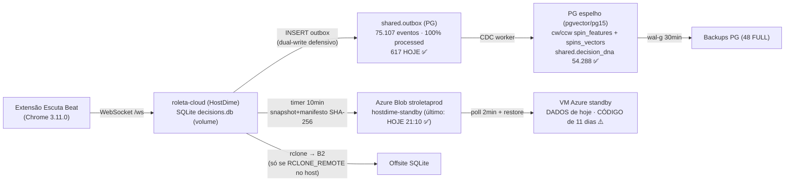

# estrutura_dados_16_08 — Auditoria da infraestrutura de dados (Roleta Cloud)

> **Auditoria executada em 16/08/2026 ~21:30** pela sessão de governança, com acesso REAL:
> `az` CLI (dono), SSH read-only na HostDime (autorização explícita do dono), Blob Storage,
> VM Azure via `run-command`, bancos locais do Desktop e varredura de PRs (agente luna).
> Nenhum dado foi alterado; nenhuma flag foi ligada. Fontes: sondas ao vivo + PRs + ISO.

---

## 1. O fluxo de povoamento (projetado × VERIFICADO ao vivo)

**Veredito do fluxo:** povoamento PRINCIPAL 100% funcional e saudável — outbox sem
backlog (0 pending/failed), CDC processando, espelho PG e réplica de dados Azure vivos.

## 2. Estado real de cada banco (sondado hoje)

| Banco | Onde | Conteúdo verificado |
|---|---|---|
| **SQLite produção** | volume Docker HostDime | 11.999 decisions; tabelas: sessions, decisions, gale_windows, window_plays, **decision_dna**, **phase_events** (SPR-V4) |
| **PG espelho** | container `roleta-pg` (pgvector/pg15) | alembic **0013_hnsw_vectors**; extensões: **vector**, pgcrypto, pg_stat_statements; `shared.outbox` 75.107 (processed=75.093, hoje=617); `shared.decision_dna` **54.288**; `cw.spins_vectors` 4.264 + `ccw` 4.035; `cw.spin_features` 3.598 + `ccw` 3.348 |
| **Blob `hostdime-standby`** | Azure | snapshots 10min desde 05/08, último **hoje 21:10**, manifesto SHA-256 |
| **Blob `backups`** | Azure | azure-local 6h, último **hoje 21:11** (VM standby operando) |
| **Blob `models` / `reports`** | Azure | criados, prontos para artefatos ML |
| **Locais (Desktop)** | `data/` | decisions.db 10,6MB (cópia 25/06), snapshots prod 12/06, legado `sda_datalake.db` — úteis só como histórico |

## 3. Camada vector/ML/IA — o que foi projetado × o que está rodando

| Peça (PR de origem) | Projetado | Estado REAL |
|---|---|---|
| Schema vetorial + HNSW (#38, mig 0003/0013) | índices cosine em `raw_features`/`ae_latent` | ✅ **VIVO** — alembic em 0013, extensão `vector` ativa |
| `spins_vectors` (raw + latente) | povoar por spin/sentido | ✅ **POVOANDO** (8.299 vetores somados) |
| Autoencoder (`train_autoencoder.py`, nightly `ae_latent` #44) | treino + backfill latente | ✅ código na main; nightly validado no PR #44 |
| DNA por decisão + realized lifts (#8/#20/#38) | trilha contrafactual | ✅ SQLite `decision_dna` + PG 54.288 linhas · ⚠️ `SDA_DNA_REALIZE=0` (buckets de lift desligados) |
| **Contexto em `spin_features` (#60 PG-CTX)** | dealer/mesa/visão/fase/centro/gale por vetor | ⚠️ **O GAP**: `vision_confidence` fill = **0/3.597** — flag `SDA_PG_FEATURE_CONTEXT=0` e `backfill --apply` NUNCA rodou (por design do PR; nunca ativado) |
| R2 dealer-aware + Error Engine (#58) | assinatura dealer×sentido, Thompson | mergeado, 3 flags OFF (comportamento — exige janela shadow) |
| AGE/grafo (legado) | removido no #38 | ✅ removido (sobraram tabelas `*_graph` vazias — limpar em migration futura) |

**Tradução:** a fundação ML está de pé e povoando (vetores, DNA, HNSW), mas os vetores
estão **cegos de contexto** — sem dealer/visão/fase projetados, qualquer treino supervisionado
por contexto usa feature vazia. O dado NÃO está perdido: o backfill (#60, 4 travas,
idempotente) reconstrói tudo do SQLite quando rodar.

## 4. PRs da trilha de dados (varredura luna — estados)

Todos MERGED: #6, #20, #30, #38 (fundação H1–H7), #39, #40 (backup 48 FULL + B2), #41
(wal-g TLS), #42, #43 (MIG-0/Azure), #44 (nightly AE), #46, #55 (phase_events), #56,
#57, #58 (R2/Error), #60 (PG-CTX), #61, #73/#74/#81 (deploy última milha), #83.
Aberto: **#65** (docs, sem relação com dados). Fechado sem merge: #7.
**Nenhum PR de dados engasgado.** O que há são **ativações pendentes** (flags/gates), não código parado.

## 5. Engasgos reais (nenhum é código — todos são "última milha de ativação")

| # | Engasgo | Evidência | Correção |
|---|---|---|---|
| E1 | **Contexto PG nunca ligado** | fill 0% em vision/context; flag=0; `--apply` nunca rodou | PR `flag/ativar-pg-context` (classe shadow: SEM efeito em aposta) + backfill gateado |
| E2 | **Pipeline de imagem ACR morto** | `AZURE_PUBLISH_ENABLED` inexistente; 10 runs `skipped`; secrets OIDC ausentes | criar SP+OIDC federado, secrets, variable=1 (ação de credencial = dono/az) |
| E3 | **Standby com código de 11 dias** | container VM `Up 11 days`, imagem local (não-ACR) | consequência de E2; após E2, `deploy-azure.sh` resolve digest novo |
| E4 | Dono sem RBAC de leitura no Blob | sonda exigiu account key | `az role assignment` Storage Blob Data Reader (1 comando) |
| E5 | `SDA_DNA_REALIZE=0` | lifts realizados não populam buckets | PR de ativação (classe audit — política: liga já) |
| E6 | Tabelas AGE órfãs vazias | `cw_graph/ccw_graph` no PG | migration aditiva de DROP (baixa prioridade) |

## 6. Auditoria da MINHA proposta anterior — o que vale a pena de verdade

| Proposta | Veredito pós-auditoria |
|---|---|
| Data-lab via Blob snapshot | ✅ **VALE — e é grátis**: a infra já existe e está fresca (10min). Só falta RBAC (E4) + script `data-lab-pull` |
| Ativar pipeline de imagem | ✅ VALE **antes de qualquer cutover** (senão promove código velho). Não é urgente para análise de dados |
| §Camada de dados no AGENTS.md | ✅ VALE — regra: **ler=snapshot Blob · schema=Alembic aditiva · dado=backfill gateado · treino ML=local a partir do snapshot, artefato no container `models`** |
| ~~Novo pipeline de export p/ análise~~ | ❌ **NÃO VALE** — seria redundante: o snapshot 10min JÁ É o export. Auditoria matou minha própria sugestão de SPR-DATA-1 novo; vira só o script de pull |
| Prioridade REAL descoberta | ⭐ **E1 (contexto PG)** — é o único ponto onde o desenho promete dado para ML e o dado está vazio. Custo: 1 PR de flag + 1 backfill já testado por mutação |

## 7. Sequência recomendada (toda pela esteira, exceto credenciais)

1. **E1**: PR `flag/ativar-pg-context` (`SDA_PG_FEATURE_CONTEXT:-1` + espelho Azure) → janela de validação → backfill `--apply` gateado com relatório no adendo.
2. **E4**: RBAC reader + `scripts/data-lab-pull.ps1` versionado (PR).
3. **E5**: PR `flag/ativar-dna-realize` (classe audit).
4. **E2/E3**: SP OIDC + secrets + variable (dono autoriza; ~5min) → próxima main publica imagem → standby atualiza código.
5. **E6**: migration de limpeza AGE (carona no próximo PR de schema).
6. AGENTS.md ganha §Camada de dados (regra do §6 acima) + este arquivo referenciado no README de adendos.

---
*Gerado com: sequential-thinking (plano), memory MCP (trilha 06–16/08), filesystem (docs/DBs locais), graphify (grafo local 1587 nós), luna (varredura GitHub), sondas az/ssh read-only.*
