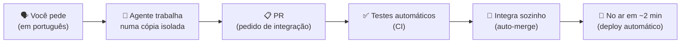

# instruções_15_08 — Guia do dono (para quem NÃO é programador)

> **Para quem é este arquivo:** você, Ivandir — ou qualquer pessoa leiga que precise
> operar essa infraestrutura. Sem jargão sem explicação. Atualizado em 15/08/2026.
> Documentos técnicos (se um dia quiser aprofundar): `blueprint_roleta_atual.md` (este repo),
> `blueprint_copilot_app.md` e `agente_atual.md` (repo `xmaiatec/Software-House`).

---

## 1. A ideia em uma frase

**Você fala o que quer em português; os agentes de IA fazem o resto — escrevem o código,
testam, revisam, integram e colocam no ar sozinhos.** Você é o dono que decide O QUÊ;
a esteira decide COMO e executa.

## 2. As três camadas (onde as coisas vivem)

| Camada | O que é | Analogia | Você mexe? |
|---|---|---|---|
| **Seu computador** | onde os agentes trabalham (cópias descartáveis do projeto) | bancada de trabalho | Só conversando com o Copilot App |
| **GitHub** | a ÚNICA verdade: código, regras, histórico | cartório + linha de montagem | Só por PR (o agente faz) |
| **Servidor (produção)** | roda o sistema de verdade; se atualiza sozinho a cada ~2 min | vitrine da loja | **NUNCA. Ninguém mexe — nem você, nem agente** |

**Regra de ouro:** se algo só existe no seu computador, não existe. Se está no GitHub
(na `main`), está no ar em ~2 minutos.

## 3. Como usar o GitHub Copilot App (o dia a dia)

1. **Abra o app** e escolha o projeto (ex.: *Roleta Cloud*).
2. **Nova sessão** — cada sessão é uma bancada limpa e isolada. Pode abrir várias ao
   mesmo tempo sem medo: elas não se atrapalham (cada uma trabalha numa cópia própria).
3. **Fale em português, como falaria com um funcionário sênior.** Não precisa termo
   técnico. Diga a DOR ou o DESEJO, não a solução:
   - ✅ "os giros estão demorando para aparecer no painel"
   - ❌ "otimize o websocket handler" (deixe o agente decidir o como)
4. **O agente devolve um plano ou executa.** Se ele perguntar algo, responda — é a única
   "aprovação" que existe.
5. **Fim natural de toda tarefa = um PR com integração automática.** Você não precisa
   apertar nada: quando os testes passam, integra e vai pro ar sozinho.

### Frases prontas que funcionam (copie e cole)

| Você quer… | Diga na sessão… |
|---|---|
| Saber como está tudo | `status` |
| Corrigir um problema | `Dor: <descreva o que está errado ou incomodando>` |
| Uma melhoria/ideia nova | `Plano para <sua ideia>` (ele propõe sprints antes de mexer) |
| Executar um sprint já planejado | `Rodar SPR-X` |
| Rodar vários trabalhos em paralelo | `GO` (dispara a metodologia de sprints) |
| Entender qualquer coisa do sistema | `Me explique como funciona <tema>` |
| Auditar/melhorar a governança | `bootstrap de governança no repo <nome>` |

## 4. Quem são os agentes (e quem chama quem)

Você não precisa escolher agente — **fale normal e o orquestrador roteia sozinho**.
Mas saber quem existe ajuda a entender o que está acontecendo:

### No Roleta Cloud
| Agente | Papel | Como acionar |
|---|---|---|
| **Diretor de Sprints** | planeja, abre briefs, acompanha o board — NÃO programa | `Dor: …`, `Plano para …`, `status` |
| **Executor de Sprint** | pega UM sprint e leva até o PR integrado | `Rodar SPR-X` (o Diretor delega sozinho) |

### Na empresa (xmaiatec/Software-House)
| Agente | Papel | Como acionar |
|---|---|---|
| **arquiteto-plataforma** | desenha/audita a arquitetura, mantém o blueprint | "audite a governança", "repo novo" |
| **executor-core** | implementa uma tarefa e entrega por PR | qualquer pedido de implementação |
| **evolucao-continua** | transforma lições aprendidas em melhorias das regras | "destile as lições da semana" |

## 5. Repositório por repositório — como interagir

### 🎰 `ivandirfilho/roleta-cloud` (o produto principal)
- **O que é:** backend da roleta em tempo real + extensão Chrome. **A `main` É a produção**
  — servidor Debian puxa e deploya sozinho a cada ~2 min.
- **Como pedir mudanças:** abra sessão no projeto *Roleta Cloud* e use as frases da §3.
  Toda mudança de comportamento nasce DESLIGADA (atrás de "flag") e é ligada depois por
  outro PR automático — por isso é seguro pedir qualquer coisa.
- **Acompanhar:** pergunte `status` (cruza board, PRs e testes) — ou olhe
  `sprints/BOARD.md` no GitHub.
- **Se quebrar:** o próprio sistema abre uma issue chamada `main-red` e qualquer agente
  a trata como prioridade máxima. Você não precisa fazer nada além de, se quiser,
  abrir uma sessão e dizer "resolva a main-red".

### 🏭 `xmaiatec/Software-House` (a fábrica da empresa)
- **O que é:** a plataforma-modelo com os 3 agentes da empresa, os blueprints e a
  linha de montagem (workflows numerados 00–99).
- **Como pedir:** issues criadas lá seguem um rito (o robô orienta com comentário se
  faltar algo — não fica mais vermelho à toa). Para trabalho grande: abra sessão e
  descreva; o agente cria a issue no formato certo sozinho.

### 🗂️ Demais repos da xmaiatec (`Agente_Github`, `AWS_Managment`, `Azure_Terraform`, `xmaia-sentinel`, `sistema-de-gesto-de`)
- Todos já têm o "kit de governança" instalado (contrato de agentes + testes + proteção).
- Interação idêntica: abra sessão no repo → fale o que quer → PR automático.
- `xmaiatec/.github` guarda os padrões da empresa — repo novo? Diga
  `bootstrap de governança` que o agente instala o kit e o repo nasce no padrão.

## 6. As 7 regras de ouro do dono

1. **Nunca peça para "mexer direto na main" ou "entrar no servidor".** Os agentes vão
   recusar — é por design. Tudo passa pela esteira (PR → testes → auto-merge → deploy).
2. **Não aprove nada manualmente no GitHub.** Se um PR está parado, a pergunta certa na
   sessão é: "por que o PR #X não integrou?"
3. **Uma sessão = um assunto.** Quer 3 coisas? Abra 3 sessões (ou diga `GO` e deixe o
   Diretor paralelizar com segurança).
4. **Erro em produção não é emergência sua.** Vira issue `main-red` automática; reverter
   leva ~4 min. Você só orienta prioridade se quiser.
5. **E-mails do GitHub:** falha VERMELHA só importa se for na `main` (aí já existe issue
   cuidando). O resto é informativo — a política anti-ruído mantém ≤1 aviso por PR.
6. **Decisões de negócio são SUAS** (ligar comportamento novo, arquivar repo, dar acesso
   a alguém). Os agentes preparam tudo e te perguntam — responder a pergunta É a aprovação.
7. **Tudo fica registrado sozinho** (adendos, board, memória dos agentes). Não precisa
   anotar nada — pergunte "o que foi feito ontem?" em qualquer sessão.

## 7. Se algo parecer estranho — roteiro de 3 passos

1. Abra uma sessão no projeto e pergunte: **`status`**
2. Se houver problema, diga: **"investigue e resolva pela esteira"** (ele acha a causa,
   corrige por PR e te mostra o resultado)
3. Nada resolve? Diga: **"reverta a última mudança"** — voltar atrás é barato (~4 min)
   e sempre seguro.

## 8. Glossário de bolso

| Termo | Tradução |
|---|---|
| **PR (Pull Request)** | pedido formal de integração — o "pacote" de uma mudança |
| **Merge / auto-merge** | aceitar o pacote na linha oficial — aqui é automático quando os testes passam |
| **CI / ci-ok** | bateria de testes automáticos; `ci-ok` verde = aprovado |
| **main** | a linha oficial do código = o que está em produção |
| **Deploy** | colocar no ar (aqui: automático, ~2 min após o merge) |
| **Flag** | interruptor de comportamento; tudo novo nasce desligado |
| **Worktree / sessão** | bancada isolada onde o agente trabalha sem afetar o resto |
| **Issue `main-red`** | alarme automático de "produção quebrou" — já nasce com dono |
| **Sprint / brief** | pacote de trabalho planejado (`sprints/SPR-*.md`) |
| **Adendo** | registro histórico de uma mudança (`docs/iso/adendos/`) |
