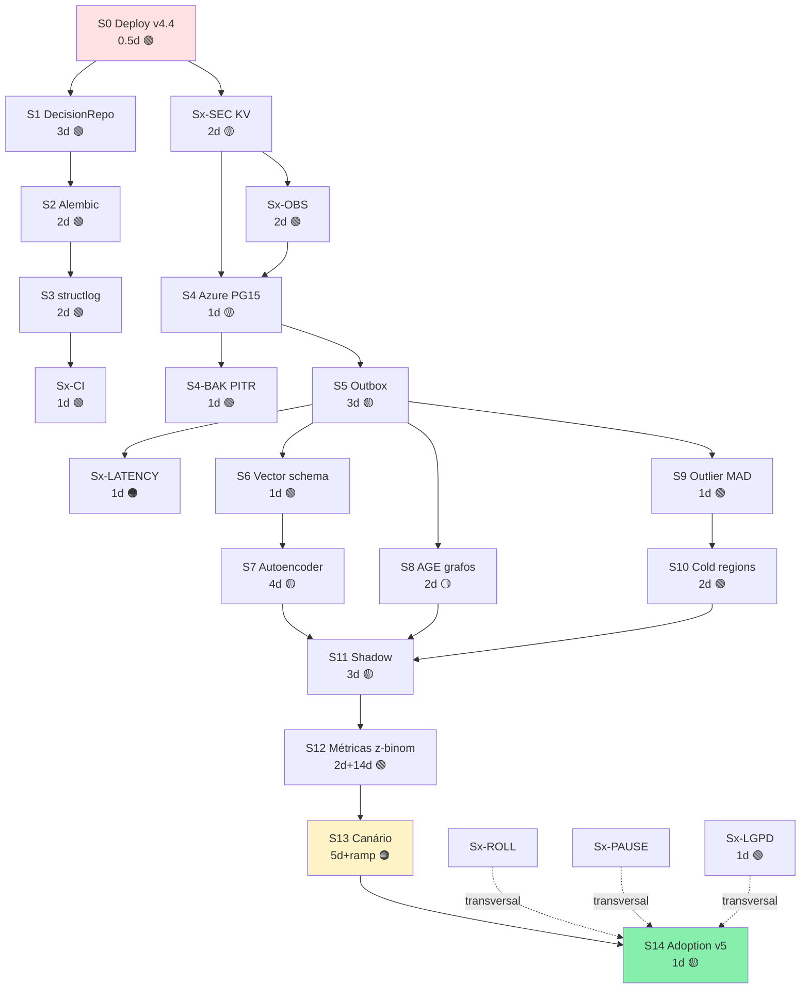

# 🚀 Plano de Implantação Pós-Sessão 24-05

> **Origem:** `sessão_24_05.md` (Parte D — 15 sprints S0→S14 + 10 pontos de refactor pré-vector P1→P10)  
> **Stack alvo:** Quick Wins v4.4 em prod → DecisionRepo + Alembic → Azure PG Flexible (pgvector + Apache AGE + TimescaleDB) → vector recall + grafo + outlier MAD → shadow → canário → adoption  
> **Inegociável:** CW e CCW como universos totalmente isolados em TODA mudança  
> **Processo deste documento:**
> 1. **Versão 1 — Draft inicial** (escrita honesta na primeira passada)
> 2. **Auditoria 1** (bugs, gaps, conflitos detectados)
> 3. **Versão 2 — Reescrita** (incorpora correções da auditoria 1)
> 4. **Auditoria 2** (segunda passada crítica)
> 5. **Versão Final** (consolidada e definitiva)

---

# 📋 VERSÃO 1 — DRAFT INICIAL

## V1.0 Premissas operacionais

| # | Premissa |
|---|---|
| 1 | Branch `main` no GitHub é a única fonte da verdade. |
| 2 | Toda mudança vai via PR + CI Python 3.12/3.13 verde antes de merge. |
| 3 | Deploy em Debian é por **tag git `v*`** que dispara `.github/workflows/deploy.yml`. |
| 4 | Servidor Debian PROD `187.45.181.75` está em `/root/roleta-cloud` (deploy.yml hoje aponta `/opt` — bug pré-existente a corrigir em S0). |
| 5 | Azure PG Flexible Server B-series é coberto pelos créditos Azure existentes. |
| 6 | Toda nova feature por sentido tem 2 implementações físicas separadas (CW e CCW) — zero crossover. |
| 7 | Toda sprint termina com **auditoria interna** (testes + lint + smoke) ANTES de PR. |
| 8 | Toda sprint que toca produção tem rollback plan documentado. |

## V1.1 Sprints (15 sprints, S0 a S14)

### S0 — Deploy Quick Wins v4.4 em produção
- **O QUE:** Mergear PR #5, criar tag `v4.4.0`, corrigir path `/opt` → `/root` em `deploy.yml`, executar deploy.
- **POR QUE:** Sem QWs em prod, nada do restante do plano vale. QW-7 Drift Freeze teria evitado o drawdown de hoje (blocos 5-6 = 30% hit).
- **COMO:**
  1. `gh pr merge 5 --squash --delete-branch`
  2. `git checkout main && git pull`
  3. Editar `.github/workflows/deploy.yml` linha que usa `/opt/roleta-cloud` → `/root/roleta-cloud`.
  4. Commit fix + push.
  5. `git tag v4.4.0 && git push origin v4.4.0`
  6. Acompanhar Actions deploy.yml.
  7. SSH `root@187.45.181.75` validar `docker ps` e `docker logs roleta-cloud --tail 50 | grep -E '\[QW-[12]|DRIFT-DETECTED'`.
- **GANHO:** Estimativa contrafactual D-1 = +5 a +15 pp hit-rate em dias com drift severo. Proteção real ao drawdown.

### S1 — DecisionRepo interface
- **O QUE:** Criar `repos/decision_repo.py` com interface ABC `DecisionRepo`, impl `SqliteDecisionRepo`. Refatorar callers (`server/message_handler.py`, `strategies/sda17.py`) para receber `repo` por injeção.
- **POR QUE:** Sem abstração, não dá para trocar SQLite por PG sem reescrever lógica de negócio.
- **COMO:**
  1. Branch `refactor/decision-repo`.
  2. Criar `repos/__init__.py` + `repos/decision_repo.py` (ABC + Sqlite impl).
  3. Substituir `sqlite3.connect(...)` direto por `repo.save_decision(...)` / `repo.load_recent(n, direction)`.
  4. Testes unitários com `FakeDecisionRepo`.
  5. CI verde + PR.
- **GANHO:** Engine swap sem alterar negócio. Habilita mocking em testes.

### S2 — Alembic migrations
- **O QUE:** Adicionar Alembic. Baseline com schema atual. Primeira migration: campos QW extras (`stake_mode`, `stake_multiplier`, `mg_reset_count`).
- **POR QUE:** Schema drift entre dev/prod/replica é risco real. Sem versionamento, qualquer mudança vira "esqueci o ALTER".
- **COMO:**
  1. `pip install alembic`. Atualizar `requirements.txt`.
  2. `alembic init migrations`.
  3. `env.py`: configurar para ler URL de env var.
  4. Baseline manual replicando schema atual.
  5. Migration 0001: adicionar colunas QW.
  6. `alembic upgrade head` no startup do container.
- **GANHO:** Schema versionado. Rollback trivial. Compatibilidade SQLite + PG.

### S3 — Logs estruturados JSON + strategy_versions table
- **O QUE:** Trocar `print("[QW-1] ...")` por `structlog` JSON. Criar tabela `strategy_versions(id, name, version, params_json, created_at)`.
- **POR QUE:** Logs por print não são queryable. Sem `strategy_versions` não dá A/B.
- **COMO:**
  1. `pip install structlog`.
  2. Configurar `JSONRenderer`.
  3. Substituir prints relevantes.
  4. Migration 0002: criar `strategy_versions`. Seed da v4.4.0.
  5. Adicionar coluna `decisions.strategy_version_id` (FK).
- **GANHO:** Queries diretas em logs (Loki/CloudWatch futuro). A/B viável.

### S4 — Provisionar Azure PG Flexible Server
- **O QUE:** Criar PG Flexible B-series. Habilitar extensões `pgvector`, `age`, `timescaledb`. Criar usuários `app_rw`, `app_ro`, `admin`. VNet privada + firewall.
- **POR QUE:** Plataforma única para decisions + vectors + grafo.
- **COMO:**
  1. Azure CLI: `az postgres flexible-server create --name roleta-cloud-pg --tier Burstable --sku-name Standard_B2s --version 16 --location eastus2`.
  2. `az postgres flexible-server parameter set --name azure.extensions --value 'PGVECTOR,AGE,TIMESCALEDB'`.
  3. `CREATE EXTENSION vector; CREATE EXTENSION age; CREATE EXTENSION timescaledb;` no DB.
  4. `CREATE ROLE app_rw LOGIN PASSWORD '...';` etc.
  5. Firewall: liberar IP do Debian; liberar IP do dev local.
- **GANHO:** Plataforma pronta. Backup PITR habilitado automaticamente.

### S5 — Dual-write SQLite → PG (CDC)
- **O QUE:** Cron job a cada 5min replica novos `decisions` para PG. Validação row count.
- **POR QUE:** Convergência de dados sem big-bang.
- **COMO:**
  1. Script `tools/cdc_sqlite_to_pg.py`: `SELECT * FROM decisions WHERE id > (SELECT max(id) FROM pg.decisions)`.
  2. Cron entrada `*/5 * * * * /usr/bin/python3 /root/roleta-cloud/tools/cdc_sqlite_to_pg.py`.
  3. Backfill inicial: `dump SQLite → COPY into PG`.
  4. Smoke test: row counts iguais 24h.
- **GANHO:** PG sempre fresh. Permite shadow ler de PG.

### S6 — Schema vector por sentido (pgvector)
- **O QUE:** Tabelas `spin_features_cw` e `spin_features_ccw`, ambas com coluna `force_vec_6 vector(384)`. HNSW indexes separados.
- **POR QUE:** Universos isolados — schemas separados garantem isolamento físico.
- **COMO:**
  1. Migration 0003:
     ```sql
     CREATE TABLE spin_features_cw (
       spin_id BIGINT PRIMARY KEY,
       force_vec_6 vector(384),
       outlier_z REAL,
       created_at TIMESTAMPTZ
     );
     CREATE INDEX ON spin_features_cw USING hnsw (force_vec_6 vector_cosine_ops);
     ```
  2. Idem `_ccw`.
- **GANHO:** Base do recall top-K.

### S7 — Embedding MLP simples + recompute job
- **O QUE:** MLP 6→64→384 (PyTorch ou pure NumPy). Treinar offline em todos os `force_seq_6` históricos. Job nightly recomputa novos.
- **POR QUE:** Embedding alimenta o HNSW.
- **COMO:**
  1. Script `embedding/train_mlp.py` lê PG.decisions por sentido.
  2. Loss: triplet (anchor=spin, positive=spin com hit similar, negative=spin com miss).
  3. Salvar peso em `embedding/model_cw.pt` + `model_ccw.pt`.
  4. Job nightly: para cada novo spin, computar e inserir em `spin_features_*`.
- **GANHO:** Vectors populados, prontos para recall.

### S8 — Apache AGE: grafo por sentido
- **O QUE:** Criar 2 grafos AGE: `roleta_cw`, `roleta_ccw`. Nodes `:Spin`, `:Region`, `:Strategy`. Edges `:NEXT`, `:LANDED_IN`, `:USED`.
- **POR QUE:** Queries de transição via Cypher (legibilidade + performance).
- **COMO:**
  1. `SELECT create_graph('roleta_cw');` e `'roleta_ccw'`.
  2. Backfill: cada spin vira `:Spin`, ordem cronológica por id cria `:NEXT`.
  3. View Python: `g.query("MATCH (s:Spin {dir:'cw'})-[:NEXT*1..6]->(s2) ...")`.
- **GANHO:** Recurso grafo no mesmo DB.

### S9 — Outlier filter MAD por sentido
- **O QUE:** Function `mad_outlier(force, direction) → boolean`. Aplicado antes de alimentar buffer rolante da estratégia.
- **POR QUE:** Hoje força <5 ou ≥35 = 0% hit; contaminam médias.
- **COMO:**
  1. Janela rolante 200 spins por sentido.
  2. `median + MAD` computados sob demanda (cache 60s).
  3. Marcar `is_outlier=true` em `decisions` mas não usar em features.
- **GANHO:** +1 a +3 pp hit-rate (estimativa baseada em A.7).

### S10 — Cold regions feature (default OFF)
- **O QUE:** Calcular `age_D[i] = current_idx - last_visit_D[i]` por sentido. Feature `cold_proximity_D` opcional.
- **POR QUE:** Hipótese: dealer humano (Evolution) tem viés mecânico → regiões frias podem ser positivas.
- **COMO:**
  1. View materializada `last_visit_per_region_per_dir` refresh a cada spin.
  2. Feature exposta no overlay glass-box, MAS *não usada* na decisão.
  3. Toggle em `strategy.toml`: `[sda17.cold_regions] enabled = false`.
- **GANHO:** Zero por enquanto (default OFF). Habilita validação 30d em S12.

### S11 — Shadow predictor
- **O QUE:** Componente paralelo: para cada spin, query top-K=10 do HNSW, computa prediction por consenso, **só loga**. Não altera decisão real.
- **POR QUE:** Validar valor do vector sem risco.
- **COMO:**
  1. Async task no `message_handler` após decisão real.
  2. Output em `decisions.shadow_prediction_json` (nova coluna nullable).
  3. Métricas Prometheus por sentido.
- **GANHO:** Dataset para decisão go/no-go.

### S12 — Métricas shadow + dashboard
- **O QUE:** Comparar `shadow_prediction.hit` vs `decision.hit` por sentido. Dashboard Grafana.
- **POR QUE:** Sem números, sem decisão.
- **COMO:**
  1. Job hourly agrega shadow vs real por sentido.
  2. Grafana panels: hit-rate diff, confidence interval, drift detection.
  3. Decision gate: shadow_cw_hit ≥ real_cw_hit + 3pp AND shadow_ccw_hit ≥ real_ccw_hit + 3pp para 14 dias consecutivos.
- **GANHO:** Decisão A/B baseada em dados.

### S13 — Canário 10% → 50%
- **O QUE:** Feature flag por usuário/sessão. 10% das jogadas usam shadow predictor como decisão real. Ramp para 50% se métricas mantêm.
- **POR QUE:** Validação produção sem riscar 100%.
- **COMO:**
  1. Flag em `strategy.toml`: `[ab] vector_predictor_pct = 10`.
  2. `hash(session_id) % 100 < pct` decide.
  3. Telemetria separada `decision_source = "vector" | "sda17"`.
- **GANHO:** Validação real, contained blast radius.

### S14 — Adoption full
- **O QUE:** Se S13 vence, virar `vector_predictor_pct = 100` e renomear `decision_source` default.
- **POR QUE:** Materializar ganho.
- **COMO:**
  1. Update strategy.toml prod.
  2. Tag `v5.0.0`.
  3. Comunicação.
- **GANHO:** +5 a +10 pp consistente.

---

# 🔍 AUDITORIA 1 — Bugs, gaps, conflitos detectados em V1

Releio o Draft com olho crítico. Encontrei os seguintes problemas:

## A1.1 — Bugs e erros lógicos

| ID | Sprint | Tipo | Descrição |
|---|---|---|---|
| B01 | S0 | **CRÍTICO** | `gh pr merge 5 --squash --delete-branch` não faz fix do path `/opt` antes da tag. Se tag for criada antes do fix, deploy falha. **Ordem errada.** |
| B02 | S1 | Médio | Falta plano de testes específicos para garantir paridade comportamental antes/depois do refactor. Risco de regressão silenciosa. |
| B03 | S2 | Médio | Migration 0001 "adicionar colunas QW" — mas QW v4.4 atual NÃO usa colunas extras (sessão anterior decidiu não tocar schema decisions). Migration vazia ou desnecessária. |
| B04 | S4 | Alto | Faltou definir região Azure compatível com créditos do usuário. `eastus2` chutado. Também: B2s pode ser undersized para AGE + TimescaleDB simultâneos. |
| B05 | S4 | Alto | `CREATE EXTENSION age` requer `LOAD 'age'; SET search_path TO ag_catalog, "$user", public;` em cada sessão. Setup mais complexo do que o draft sugere. |
| B06 | S5 | **CRÍTICO** | CDC por `WHERE id > max(id)` quebra se SQLite tem rows reordenadas ou auto-increment com gaps. Falta WAL streaming ou idempotência por UUID. |
| B07 | S6 | Alto | `vector(384)` arbitrário. Embedding S7 é 6→64→384 mas nunca justificado por que 384 vs 64 vs 128. **Dimensão alta para feature pequena = overfitting / sparsity.** |
| B08 | S7 | **CRÍTICO** | Triplet loss "positive=spin com hit similar" — em roleta de RNG memoryless, **dois spins parecidos NÃO implicam mesmo resultado**. Loss mal definida → modelo aprende ruído. |
| B09 | S8 | Médio | AGE backfill cronológico — mas `:NEXT` em "ordem por id" inclui transições entre sentidos. Quebra isolamento se grafo não filtrar `WHERE dir=...`. |
| B10 | S9 | Baixo | MAD com janela 200 — para CCW com 56 spins/dia, janela leva ~3.5 dias para popular. Cold start indefinido. |
| B11 | S11 | Médio | "Async task após decisão real" — se backend já respondeu, shadow não tem timeout. Pode acumular tasks. |
| B12 | S12 | Alto | "shadow_cw_hit ≥ real_cw_hit + 3pp" sem teste de **significância estatística**. Com 56-62 jogadas/dia/sentido, +3pp é facilmente ruído. |
| B13 | S13 | Alto | `hash(session_id) % 100` — mas o sistema de roleta ao vivo é **single-session** (uma mesa por vez). Não dá para AB por session. Tem que ser por **spin_id % 100** ou janela temporal. |
| B14 | S14 | Médio | Tag `v5.0.0` sem changelog/migration path para usuários downstream (se houver). |
| B15 | Global | Alto | **Faltou sprint dedicado a backup/restore Azure PG** (PITR config explícita, retention, teste de restore). |
| B16 | Global | Alto | **Faltou sprint de observabilidade base** (Prometheus exporter PG, alerts, log shipping) — S12 assume Grafana já existe. |
| B17 | Global | Médio | Sem sprint de **rollback** explícito (e se PG cair? Voltar para SQLite-only?). |
| B18 | S0 | Médio | Falta confirmação se PR #5 ainda está mergeable após mudanças do servidor (limpeza Debian foi sessão anterior; pode ter conflito). |
| B19 | S6 | Médio | Schema `spin_features_*` referencia `spin_id BIGINT PRIMARY KEY` mas SQLite usa `id INTEGER`. Tipo divergente. |
| B20 | S7 | Médio | "PyTorch" adicionado sem justificar custo (200+ MB no container Docker). Alternativa scikit/numpy pode bastar. |

## A1.2 — Gaps de cobertura

| ID | Gap |
|---|---|
| G01 | Sem sprint para **atualizar `Manutenabilidade_iso.md`** ao longo do plano (norma de qualidade exige documentação contínua) |
| G02 | Sem sprint **GitHub Actions update** (CI precisa rodar contra PG container para testar migrations) |
| G03 | Sem **secret management** (PG creds em env var → onde guardar? Azure Key Vault? GitHub Secrets?) |
| G04 | Sem **plano de testes E2E** atravessando SQLite + PG dual-write |
| G05 | Sem definição de **owner por sprint** (mesmo sendo solo dev, registrar responsabilidades) |
| G06 | Sem **critério de pausa** (kill switch do plano se métricas degradarem) |

## A1.3 — Conflitos com decisões prévias

| ID | Conflito |
|---|---|
| C01 | Sprint S0 menciona fix `/opt → /root` em deploy.yml — mas isso é um commit separado que **NÃO foi feito na sessão anterior** quando deveria. Risco de esquecer. |
| C02 | Premissa "deploy é só por tag git" conflita com S5 que sugere cron direto no servidor. Cron precisa ser deployado como artefato do projeto (não SSH manual). |
| C03 | Tabela `strategy_versions` (S3) duplica responsabilidade do arquivo `VERSION`. Decidir fonte da verdade única. |

---

# ✍️ VERSÃO 2 — REESCRITA INCORPORANDO AUDITORIA 1

## V2.0 Premissas atualizadas

| # | Premissa (mudou?) |
|---|---|
| 1 | Mesma de V1 |
| 2 | Mesma de V1 |
| 3 | Mesma de V1 |
| 4 | Mesma de V1 |
| 5 | **NOVO:** Azure region = `eastus` ou `brazilsouth` (a confirmar com `az account list-locations` antes de S4). |
| 6 | Mesma de V1 |
| 7 | Mesma de V1 |
| 8 | Mesma de V1 |
| 9 | **NOVO (B15+B16+B17):** Existem 3 sprints transversais não-funcionais: **Sx-OBS** (observabilidade), **Sx-BAK** (backup/PITR), **Sx-ROLL** (rollback) — atravessam várias sprints técnicas. |
| 10 | **NOVO (G03):** Secrets vão para Azure Key Vault, referenciados via GitHub Secrets para CI/CD e via env var injetada por systemd no Debian. |

## V2.1 Sprints corrigidas

### S0 — Deploy Quick Wins v4.4 (REVISADO)
- **O QUE:** **Ordem corrigida:**
  1. Verificar PR #5 ainda mergeable (B18).
  2. Mergear PR #5.
  3. Em branch nova `fix/deploy-path`, corrigir `/opt → /root` em `deploy.yml`. PR + merge.
  4. **Só agora** criar tag `v4.4.0`.
- **POR QUE:** Sem fix do path antes da tag, deploy.yml falha no servidor.
- **COMO:** ver acima + smoke test pós-deploy: `docker logs --tail 100 | grep -E '\[QW-(MINIMIZER|WEIGHT|DRIFT)'`.
- **GANHO:** Mesmo de V1.
- **ROLLBACK:** Se deploy falhar, `docker compose down && git checkout v4.3.2 && docker compose up -d --build`.

### S1 — DecisionRepo + paridade testada (REVISADO B02)
- **O QUE:** V1 + suite de **paridade**: 20 testes capturam snapshot do output (`decision_dict`) antes do refactor; pós-refactor reproduzem snapshot idêntico.
- **POR QUE:** Refactor sem regressão silenciosa.
- **COMO:** Adicionar `tests/test_decision_parity.py` com fixture salvando golden file ANTES das mudanças.
- **GANHO:** Refactor seguro + suíte que blinda futuras mudanças.

### S2 — Alembic + baseline limpo (REVISADO B03)
- **O QUE:** V1 sem migration 0001 fictícia. Baseline = schema atual EXATO. Próxima migration só quando necessária (S6).
- **POR QUE:** Não adicionar colunas que ninguém usa.
- **COMO:** `alembic revision --autogenerate -m "baseline"`. Diff vs schema vivo = vazio.
- **GANHO:** Versionamento sem código morto.

### S3 — structlog + strategy_versions unificado VERSION (REVISADO C03)
- **O QUE:** V1 + decisão: tabela `strategy_versions` é fonte da verdade de **parâmetros**; arquivo `VERSION` é tag git. Linkagem `strategy_versions.git_tag = VERSION`.
- **POR QUE:** Eliminar duplicação semântica.
- **COMO:** Migration cria tabela; seed inicial puxa VERSION via subprocess `git describe`.
- **GANHO:** Auditável por SQL, alinhado com git.

### S4 — Azure PG Flexible (REVISADO B04+B05)
- **O QUE:**
  1. Tier upgrade: `Standard_B4ms` (4 vCPU, 16 GB RAM) — suporta AGE + TimescaleDB + pgvector simultâneos.
  2. Region: `brazilsouth` (latência menor para Debian HostDime SP).
  3. Após `CREATE EXTENSION age;`, criar SQL `init_session.sql` que aplicações executam ao conectar: `LOAD 'age'; SET search_path TO ag_catalog, public;`.
  4. Connection pooling via **pgbouncer** (Azure tem nativo no Flexible).
- **POR QUE:** B2s subdimensionado para 3 extensões pesadas; AGE exige search_path por sessão.
- **COMO:** Azure CLI conforme V1 + adicionar `--storage-size 32 --high-availability Disabled` (HA dobra custo; nosso uso não justifica).
- **GANHO:** Plataforma dimensionada corretamente.
- **ROLLBACK:** PG é destacável — se falhar, app volta a SQLite-only mudando connection string.

### S4-BAK — Backup PITR + teste restore (NOVO B15)
- **O QUE:** Configurar PITR Azure PG: retention 14 dias, geo-redundant backup ON. Teste mensal de restore para instância scratch.
- **POR QUE:** Backup que nunca foi restaurado = backup que não existe.
- **COMO:** Azure portal: `Backup → Configure` 14 days + Geo-redundant. Script `tools/test_restore.sh` rodado mensalmente via Actions schedule.
- **GANHO:** RPO < 5 min, RTO testado.

### S5 — Dual-write idempotente (REVISADO B06 + C02)
- **O QUE:** Trocar CDC por delta-id ingênua por **outbox pattern**:
  1. App escreve `decision` em SQLite + `outbox` na mesma tx.
  2. Worker `outbox_drain.py` (asyncio loop, parte do código deployado, NÃO cron externo) lê `outbox WHERE not_sent`, escreve em PG, marca sent.
  3. Idempotência por `outbox.event_uuid`.
- **POR QUE:** id-based CDC quebra com gaps/reordenamentos; cron externo viola "deploy só por tag".
- **COMO:** Migration adiciona `outbox` table. Service worker em `services/outbox_drain.py`, iniciado pelo `main.py` em background task.
- **GANHO:** Convergência confiável + zero artefato fora do git.
- **ROLLBACK:** Worker desabilitável via flag `strategy.toml` `[outbox] enabled = false`.

### S6 — Schema vector dimensionado (REVISADO B07 + B19)
- **O QUE:**
  1. `vector(64)` (não 384) — feature de entrada tem 6 dim; 64 latente é overhead suficiente sem sparsity.
  2. `spin_id BIGINT` mantido em PG, mas tipo `INTEGER` SQLite cabe em BIGINT (cast no dual-write).
  3. HNSW params: `m=16, ef_construction=64` (defaults pgvector razoáveis).
- **POR QUE:** Dimensão proporcional ao sinal evita ruído e acelera HNSW.
- **COMO:** Migration ajustada. Embedding S7 redefine output_dim=64.
- **GANHO:** Vector mais saudável + memória menor (~6×).

### S7 — Embedding com loss apropriada (REVISADO B08 + B20)
- **O QUE:**
  1. **Trocar PyTorch por scikit-learn** (`MLPRegressor` ou `Pipeline` numpy puro). Container 200 MB menor.
  2. **Trocar triplet loss** por **autoencoder reconstrução** (`force_seq_6 → 64 → force_seq_6`). Loss = MSE. **Não assume causalidade entre spins similares.**
  3. Vector é "contexto" para retrieval, não "predição de hit".
- **POR QUE:** Triplet "positive=mesmo hit" assume estrutura que NÃO existe em RNG.
- **COMO:** `sklearn.neural_network.MLPRegressor(hidden_layer_sizes=(64,))` ou `MLPClassifier` se virar problema discreto. Treinamento offline em batch.
- **GANHO:** Modelo honesto + container leve.

### S8 — AGE com isolamento físico (REVISADO B09)
- **O QUE:** V1 + **proibir queries cross-graph**. 2 grafos físicos `roleta_cw` e `roleta_ccw`. Code review checklist inclui "nenhum MATCH atravessa grafos".
- **POR QUE:** Inegociável.
- **COMO:** Wrapper `GraphRepo` força `set_graph(direction)` antes de qualquer query.
- **GANHO:** Isolamento físico, não só lógico.

### S9 — MAD com cold-start safe (REVISADO B10)
- **O QUE:** V1 + fallback: enquanto janela tem <50 spins do sentido, **não filtra outliers** (passa tudo). Threshold dinâmico.
- **POR QUE:** Cold start não pode quebrar feature.
- **COMO:** `if len(window) < 50: return False  # not outlier`.
- **GANHO:** Comportamento previsível desde spin 1.

### S10 — Cold regions opt-in com warning (mantido)
- Sem mudança vs V1.

### S11 — Shadow com timeout + circuit breaker (REVISADO B11)
- **O QUE:** V1 + shadow async com `asyncio.wait_for(task, timeout=2.0)`. Se >5 timeouts em 1 min, circuit breaker abre por 5 min.
- **POR QUE:** Shadow não pode prejudicar performance real.
- **COMO:** Decorator `@circuit_breaker(threshold=5, window=60, recovery=300)` em `shadow_predict`.
- **GANHO:** Shadow seguro.

### S12 — Métricas com significância estatística (REVISADO B12)
- **O QUE:** V1 + **teste z-binomial** entre shadow e real. Gate: p < 0.05 e effect_size > 3pp por sentido por 14 dias.
- **POR QUE:** +3pp com n=56 é ruído (p>>0.05). Precisa volume real.
- **COMO:** `scipy.stats.binom_test` no job hourly. Dashboard mostra p-value.
- **GANHO:** Decisão baseada em estatística, não corazonada.

### S13 — Canário por spin_id (REVISADO B13)
- **O QUE:** V1 mas `hash(spin_id) % 100 < pct` (spin_id é único, monotônico). Single-mesa não afeta.
- **POR QUE:** session_id muda raramente; spin_id sempre incrementa.
- **COMO:** `int(hashlib.md5(str(spin_id).encode()).hexdigest(), 16) % 100`.
- **GANHO:** Distribuição uniforme correta.

### S14 — Adoption com changelog (REVISADO B14)
- **O QUE:** V1 + atualizar `Manutenabilidade_iso.md` + criar `CHANGELOG_v5.md` antes da tag.
- **POR QUE:** Trace de mudanças para auditoria ISO.
- **GANHO:** Conformidade norma.

### Sx-OBS — Observabilidade base (NOVO B16)
- **O QUE:** Antes de S11. Instalar Prometheus + Grafana + Loki como containers separados no Debian (ou via Azure Monitor se preferir SaaS). PG `pg_stat_statements`. App exporter custom.
- **POR QUE:** S12 assume Grafana mas não foi criado.
- **COMO:** Docker compose adicional `docker-compose.observability.yml`. Configuração versionada.
- **GANHO:** Métricas de tudo desde antes do shadow.

### Sx-ROLL — Plano de rollback documentado (NOVO B17)
- **O QUE:** Documento `docs/rollback_runbook.md` cobrindo:
  1. PG indisponível → app continua SQLite-only.
  2. AGE corrompido → recreate graph from outbox replay.
  3. Embedding model corrompido → fallback dummy embedding (zeros).
  4. Shadow circuit-breaker aberto → log warning, continua real.
- **POR QUE:** Sistemas distribuídos falham; ter plano escrito reduz MTTR.
- **GANHO:** Resiliência operacional.

### Sx-CI — CI atualizado com matrix PG (NOVO G02)
- **O QUE:** Adicionar service container `postgres:16` ao `ci.yml`. Rodar migrations + smoke test contra PG.
- **POR QUE:** Quebrar migrations em PG-prod via PR é caro.
- **COMO:**
  ```yaml
  services:
    postgres:
      image: postgres:16
      env: {POSTGRES_PASSWORD: test}
      ports: ['5432:5432']
  ```
- **GANHO:** CI valida path real.

### Sx-SEC — Secrets via Azure Key Vault (NOVO G03)
- **O QUE:** Mover PG password, JWT secret, etc. para Key Vault. App lê via Managed Identity (Azure VM) ou via GitHub Secrets (CI).
- **POR QUE:** Secrets em `.env` no servidor são alvo. Key Vault tem rotação + audit.
- **COMO:** `azure-identity` + `azure-keyvault-secrets` Python. Cache local 5 min.
- **GANHO:** Compliance + rotação.

### Sx-PAUSE — Critério de pausa do plano (NOVO G06)
- **O QUE:** Documento explicita: SE em qualquer sprint a métrica `real_hit_rate_global` cair abaixo de 35% por 3 dias consecutivos → pausar plano, rollback última sprint, audit.
- **POR QUE:** Plano que não para causa estrago.
- **GANHO:** Safety net.

## V2.2 Cronograma ordenado V2

```
S0  (0.5d)
  ├→ S1  (3d)
  │   └→ S2  (2d)
  │       └→ S3  (2d)
  │           └→ Sx-CI  (1d)
  ├→ Sx-OBS  (3d)
  └→ Sx-SEC  (2d)
            └→ S4  (1d)
                └→ S4-BAK  (1d)
                    └→ S5   (3d)
                        ├→ S6   (1d)
                        │   └→ S7  (4d)
                        ├→ S8   (2d)
                        └→ S9   (1d)
                            └→ S10  (2d)
                                └→ S11  (3d)
                                    └→ S12  (2d) [+14d wait]
                                        └→ S13  (5d) [+canary periods]
                                            └→ S14  (1d)
                                              └→ Sx-ROLL (paralelo, 1d)
                                              └→ Sx-PAUSE (paralelo, 1d)
```

**Total caminho crítico V2:** ~40 dias úteis + 14d janela shadow + 5d canário = ~59 dias calendário.

---

# 🔎 AUDITORIA 2 — Segunda passada crítica em V2

## A2.1 — Bugs/gaps remanescentes

| ID | Sprint | Tipo | Descrição |
|---|---|---|---|
| B21 | S4 | Alto | `brazilsouth` para PG mas servidor Debian é HostDime (não Azure). Latência app↔PG vai sair do datacenter HostDime → Azure SP via internet pública. **Pode adicionar 30-80ms por query.** Reconsiderar: ou migrar Debian para Azure também (Azure VM em brazilsouth), OU manter PG read-replica próximo. |
| B22 | Sx-OBS | Médio | Grafana/Prometheus/Loki adicionam ~500 MB RAM no servidor que tem 3.3 GB total. Pós-limpeza só 2.1 GB available. **Pode estourar.** Considerar offload para Azure Monitor / Grafana Cloud free tier. |
| B23 | S5 | Médio | Outbox pattern ok, mas falta detalhar **schema da tabela outbox** e política de purge (cresce indefinidamente?). |
| B24 | S7 | Baixo | Autoencoder pode aprender identidade trivial se hidden=64 e input=6. Hidden deve ser **menor que input** (ex: 4) para forçar compressão útil. **Mudar para 6→3→6 ou 6→4→6.** |
| B25 | S12 | Médio | "binom_test" — função foi renomeada para `binomtest` em scipy >=1.7. Documentar versão. |
| B26 | S13 | Médio | Canário com `hash(spin_id) % 100` é **determinístico**: mesmo spin sempre vai pro mesmo bucket. Bom para reprodutibilidade, mas se algum spin_id tiver bug, ele SEMPRE cai nele. Adicionar salt rotacionado por semana. |
| B27 | S0 | Baixo | "Smoke test grep `[QW-MINIMIZER]`" — mas o log real escrito no código é `[QW-1 MINIMIZER]` (com número). Grep está errado. |
| B28 | Sx-CI | Médio | CI com PG service mas falta cache do Docker layer para PG (cada PR baixa imagem PG 500MB). Adicionar `actions/cache` para imagem. |
| B29 | S4 | Médio | "pgbouncer Azure nativo" — Flexible Server suporta pgbouncer mas SÓ no tier `General Purpose` em diante. **B-series Burstable não tem pgbouncer nativo.** Adotar pgbouncer-em-app (`psycopg_pool`) OU upgradar tier. |
| B30 | Global | Médio | Nenhum sprint trata **GDPR/LGPD** (dados de jogadas podem ser PII se associados a usuário). Validar se aplica. |
| B31 | S8 | Baixo | "GraphRepo wrapper" — bom, mas AGE em PG 16 ainda é versão experimental para PG 16. AGE oficial estável é PG 11-13. **Confirmar compatibilidade ou downgrade para PG 15 onde AGE 1.5 é estável.** |

## A2.2 — Conflitos detectados em V2

| ID | Conflito |
|---|---|
| C04 | Sx-OBS criada como antes-de-S11 mas no cronograma aparece em paralelo com S1-S3 — inconsistência. |
| C05 | Sx-CI tem dependência implícita em S2 (Alembic) mas no diagrama aparece após S3. Está OK mas explicitar. |
| C06 | Sx-PAUSE é doc transversal, não sprint com prazo. Reclassificar como "política" não-sprint. |

## A2.3 — Riscos identificados em V2

| ID | Risco | Mitigação proposta |
|---|---|---|
| R01 | Volume de dados muito baixo (~30 spins/dia/sentido) para treinar embedding útil | Backfill 4 meses históricos (3698 spins totais) + augmentation por jittering |
| R02 | Apache AGE compatibilidade incerta com PG 16 | Validar em sprint S4 com canário; se incompatível, downgrade PG 15 |
| R03 | Custo Azure pode estourar créditos se HA acidentalmente ligado | Alerta de billing Azure |
| R04 | shadow + main contention em SQLite | Outbox elimina; verificar via S12 |
| R05 | Embedding model rot — se distribuição de forças mudar | Retraining mensal automático (cron via Actions) |

---

# 🏁 VERSÃO FINAL — Plano definitivo consolidado

## VF.0 Premissas finais

| # | Premissa |
|---|---|
| 1 | `main` é fonte da verdade. PR + CI verde + tag para deploy. |
| 2 | CW e CCW totalmente isolados em código, schema, grafo, vetores, métricas. |
| 3 | Azure region = **`brazilsouth`** (latência) com fallback `eastus2`. |
| 4 | PG tier = **`Standard_B4ms`** (4 vCPU, 16 GB). HA OFF. |
| 5 | **PG version = 15** (B31 — AGE 1.5 estável). pgvector + AGE + TimescaleDB. |
| 6 | Observabilidade = **Grafana Cloud free tier** (offload do servidor Debian — B22). |
| 7 | Secrets em Azure Key Vault. |
| 8 | Outbox pattern para dual-write. |
| 9 | Embedding = autoencoder **6→4→6** scikit-learn (B24). |
| 10 | Canário por `hash(salt_week + spin_id) % 100` (B26). |
| 11 | LGPD: avaliar em sprint paralelo (B30). |
| 12 | **Re-avaliar migração do Debian HostDime → Azure VM se latência PG > 50 ms** (B21). |

## VF.1 Lista mestre de sprints (ordenada, com dependências)

| # | Sprint | Duração | Dep. | Objetivo (1 linha) | Risco |
|---|---|---|---|---|---|
| 1 | **S0** | 0.5d | — | Deploy v4.4 em prod (PR #5 + fix /opt→/root + tag) | 🟢 |
| 2 | **S1** | 3d | S0 | DecisionRepo + paridade testada | 🟢 |
| 3 | **S2** | 2d | S1 | Alembic baseline | 🟢 |
| 4 | **S3** | 2d | S2 | structlog JSON + strategy_versions (linkado a git tag) | 🟢 |
| 5 | **Sx-CI** | 1d | S2 | CI matrix com PG container + cache | 🟢 |
| 6 | **Sx-SEC** | 2d | — | Secrets via Azure Key Vault | 🟡 |
| 7 | **Sx-OBS** | 2d | Sx-SEC | Grafana Cloud + exporters | 🟢 |
| 8 | **Sx-LGPD** | 1d | — | Análise + posicionamento LGPD | 🟢 |
| 9 | **S4** | 1d | Sx-SEC, Sx-OBS | Provisionar Azure PG 15 B4ms + pgvector + AGE + Timescale | 🟡 |
| 10 | **S4-BAK** | 1d | S4 | PITR + teste restore | 🟢 |
| 11 | **S5** | 3d | S4 | Outbox dual-write SQLite→PG | 🟡 |
| 12 | **S6** | 1d | S5 | Schema `spin_features_cw/ccw` vector(64) + HNSW | 🟢 |
| 13 | **S7** | 4d | S6 | Autoencoder 6→4→6 sklearn + recompute job | 🟡 |
| 14 | **S8** | 2d | S5 | AGE grafos `roleta_cw` + `roleta_ccw` isolados | 🟡 |
| 15 | **S9** | 1d | S5 | Outlier MAD cold-start safe | 🟢 |
| 16 | **S10** | 2d | S9 | Cold regions feature (default OFF) | 🟢 |
| 17 | **S11** | 3d | S7, S8, S10 | Shadow predictor + circuit breaker | 🟡 |
| 18 | **S12** | 2d + 14d wait | S11 | Métricas com z-binomial p<0.05 | 🟢 |
| 19 | **S13** | 5d + canário | S12 | A/B canário por spin_id+salt semanal | 🟠 |
| 20 | **S14** | 1d | S13 | Adoption full v5.0.0 + CHANGELOG + ISO update | 🟡 |
| 21 | **Sx-ROLL** | 1d | paralelo | Runbook rollback documentado | 🟢 |
| 22 | **Sx-PAUSE** | 0.5d | paralelo | Política de pausa do plano | 🟢 |
| 23 | **Sx-LATENCY** | 1d | S5 (smoke) | Medir latência app↔PG; se >50ms decidir migrar Debian para Azure VM | 🟠 |

**Caminho crítico:** S0 → S1 → S2 → S3 → Sx-CI → S4 → S5 → S6 → S7 → S11 → S12 (14d wait) → S13 (5d ramp) → S14  
= 0.5 + 3 + 2 + 2 + 1 + 1 + 3 + 1 + 4 + 3 + 2 + 14 + 5 + 1 = **~42 dias úteis** + janelas de validação

## VF.2 Detalhamento de cada sprint (template uniforme)

> Cada sprint segue: **O QUE** / **POR QUE** / **COMO** / **GANHO ESPERADO** / **ROLLBACK** / **AUDIT GATE** (testes/critérios para considerar sprint completa).

### S0 — Deploy QWs v4.4
- **O QUE:** Mergear PR #5; em branch nova `fix/deploy-path` corrigir `deploy.yml` para `/root/roleta-cloud`; mergear; criar tag `v4.4.0`; acompanhar deploy.
- **POR QUE:** Sem QWs em prod, todo plano é teoria. QW-7 teria evitado drift hoje.
- **COMO:**
  ```bash
  gh pr checks 5  # confirmar green
  gh pr merge 5 --squash --delete-branch
  git checkout main && git pull
  git checkout -b fix/deploy-path
  sed -i 's|/opt/roleta-cloud|/root/roleta-cloud|g' .github/workflows/deploy.yml
  git commit -am "fix(deploy): correct server path /opt -> /root"
  git push -u origin fix/deploy-path
  gh pr create --title "fix(deploy): path" --body "..." --base main
  # após CI verde
  gh pr merge --squash --delete-branch
  git checkout main && git pull
  git tag v4.4.0 && git push origin v4.4.0
  ```
- **GANHO:** +5 a +15 pp hit-rate em dias com drift.
- **ROLLBACK:** `git tag -d v4.4.0 && git push origin :refs/tags/v4.4.0` + SSH `cd /root/roleta-cloud && git checkout v4.3.2 && docker compose up -d --build`.
- **AUDIT GATE:** `docker logs roleta-cloud --tail 200 | grep -E '\[QW-1 MINIMIZER\]|\[QW-2 WEIGHT\]|\[DRIFT-DETECTED\]'` retorna ≥1 match em 1h de operação.

### S1 — DecisionRepo + paridade
- **O QUE:** ABC `DecisionRepo` + impl `SqliteDecisionRepo`; injetar via construtor; 20 testes de paridade golden-file.
- **POR QUE:** Engine swap sem reescrever lógica + zero regressão.
- **COMO:** Branch `refactor/decision-repo`. Antes do refactor: rodar 20 cenários representativos, salvar `tests/golden/decision_*.json`. Refactor. Rodar mesmos cenários, compare bit-a-bit.
- **GANHO:** Habilita S4-S5; suíte blinda futuras mudanças.
- **ROLLBACK:** revert PR.
- **AUDIT GATE:** 20/20 testes paridade verdes; CI verde; cobertura ≥ atual.

### S2 — Alembic baseline
- **O QUE:** `pip install alembic`; `alembic init migrations`; baseline = schema vivo; nenhuma migration de dados nesta sprint.
- **POR QUE:** Versionar schema para multi-engine futuro.
- **COMO:**
  ```bash
  pip install alembic
  alembic init migrations
  # editar env.py: target_metadata + URL via env var
  alembic stamp head  # marca baseline
  ```
- **GANHO:** Toda mudança futura de schema é PR-able.
- **ROLLBACK:** `alembic downgrade base` (no-op no baseline).
- **AUDIT GATE:** `alembic current` mostra head; `alembic check` verde.

### S3 — structlog + strategy_versions
- **O QUE:** Trocar prints `[QW-X ...]` por `structlog`; migration cria `strategy_versions(id, name, version, git_tag, params_json, created_at)`; seed inicial.
- **POR QUE:** Logs queryables + A/B viável.
- **COMO:** Migration `0001_strategy_versions.py`. Seed em `migrations/seed_initial.py` lê VERSION e cria registro.
- **GANHO:** Auditoria SQL + base do A/B.
- **ROLLBACK:** `alembic downgrade -1`; logs voltam aos prints (mantemos código antigo via flag temporária 1 release).
- **AUDIT GATE:** `SELECT * FROM strategy_versions` retorna v4.4.0; logs do container saem em JSON parsável.

### Sx-CI — CI com PG container
- **O QUE:** Atualizar `.github/workflows/ci.yml` com service `postgres:15`. Rodar `alembic upgrade head` + testes.
- **POR QUE:** Migrations testadas contra PG real previne quebra em prod.
- **COMO:**
  ```yaml
  jobs:
    test:
      services:
        postgres:
          image: postgres:15
          env: {POSTGRES_PASSWORD: ci, POSTGRES_DB: roleta_ci}
          ports: ['5432:5432']
          options: --health-cmd pg_isready
  ```
  Cache layer: `actions/cache@v4` em `~/.cache/docker`.
- **GANHO:** Confiança em deploys.
- **ROLLBACK:** revert workflow.
- **AUDIT GATE:** PR teste falso quebra CI conforme esperado.

### Sx-SEC — Azure Key Vault
- **O QUE:** Criar Key Vault `roleta-kv`; mover segredos (PG_PASSWORD, JWT_SECRET, EVOLUTION_TOKEN). App carrega via `azure-identity`.
- **POR QUE:** `.env` em servidor = risco.
- **COMO:**
  ```bash
  az keyvault create --name roleta-kv --location brazilsouth
  az keyvault secret set --vault-name roleta-kv --name pg-password --value '...'
  ```
  Python:
  ```python
  from azure.identity import DefaultAzureCredential
  from azure.keyvault.secrets import SecretClient
  client = SecretClient(vault_url=..., credential=DefaultAzureCredential())
  pg_pwd = client.get_secret("pg-password").value
  ```
- **GANHO:** Rotação possível + audit nativo.
- **ROLLBACK:** env var fallback `os.getenv("PG_PASSWORD")`.
- **AUDIT GATE:** App boota lendo segredo de KV; rotação manual testada.

### Sx-OBS — Observabilidade (Grafana Cloud)
- **O QUE:** Conta Grafana Cloud free; configurar Prometheus remote_write + Loki push. App expõe `/metrics` (FastAPI `prometheus_fastapi_instrumentator`).
- **POR QUE:** Sem métricas, S12 é cego.
- **COMO:**
  - `pip install prometheus-fastapi-instrumentator`
  - Setup Grafana Agent no Debian (1 binário, ~50 MB RAM).
- **GANHO:** Dashboards desde dia 1.
- **ROLLBACK:** remover agent.
- **AUDIT GATE:** Métrica `roleta_decisions_total` visível em Grafana.

### Sx-LGPD — Análise legal
- **O QUE:** Documento `docs/lgpd_assessment.md` analisando: dados pessoais coletados? Base legal? Retenção? Direito de exclusão?
- **POR QUE:** Compliance.
- **COMO:** Inventário de dados; mapeamento; consultar jurídico se necessário.
- **GANHO:** Risco legal contido.
- **AUDIT GATE:** Documento revisado e assinado pelo dono.

### S4 — Provisionar Azure PG 15
- **O QUE:** `B4ms` brazilsouth + extensões pgvector + age + timescaledb; usuários app_rw/app_ro/admin; firewall.
- **POR QUE:** Plataforma única para vector + grafo + time-series.
- **COMO:**
  ```bash
  az postgres flexible-server create \
    --name roleta-pg \
    --tier Burstable --sku-name Standard_B4ms \
    --version 15 \
    --storage-size 32 \
    --location brazilsouth \
    --high-availability Disabled
  az postgres flexible-server parameter set \
    --server-name roleta-pg \
    --name azure.extensions \
    --value PGVECTOR,AGE,TIMESCALEDB
  # via psql:
  CREATE EXTENSION vector;
  CREATE EXTENSION age;
  CREATE EXTENSION timescaledb;
  ```
- **GANHO:** Plataforma pronta + 14d PITR.
- **ROLLBACK:** `az postgres flexible-server delete`; app permanece SQLite.
- **AUDIT GATE:** `SELECT extname FROM pg_extension;` lista as 3 extensões; conexão via app_rw OK.

### S4-BAK — PITR + restore test
- **O QUE:** Retention 14d, geo-redundant; script `tools/test_restore.sh` mensal.
- **POR QUE:** Backup não testado = não existe.
- **COMO:** Azure portal + GitHub Actions schedule mensal.
- **GANHO:** RPO < 5min validado.
- **AUDIT GATE:** Primeiro teste de restore bem-sucedido.

### S5 — Outbox dual-write
- **O QUE:** Migration cria `outbox(id, event_uuid UUID UNIQUE, event_type, payload JSONB, created_at, sent_at NULL)`. Service `outbox_drain` consome.
- **POR QUE:** CDC idempotente + sem cron externo.
- **COMO:**
  - Migration 0002 cria outbox em SQLite (ou tabela espelho local) + PG.
  - Em `repos/sqlite_decision_repo.py`: `save_decision` insere em decisions + outbox na mesma transação.
  - `services/outbox_drain.py`: loop async lê batches, escreve em PG, marca sent_at.
  - Purge: rows com `sent_at < now - 7d` deletadas em job semanal.
- **GANHO:** Convergência sem perda.
- **ROLLBACK:** Flag `[outbox] enabled = false` em strategy.toml para parar drain; backfill manual depois.
- **AUDIT GATE:** Após 24h, `COUNT(*) FROM sqlite.decisions WHERE id > X == COUNT(*) FROM pg.decisions WHERE id > X` (delta = 0 ou ≤ batch_size).

### Sx-LATENCY — Probe latência app↔PG
- **O QUE:** Após S5 estável 48h, medir P50/P95/P99 de query simples (`SELECT 1`) e write outbox→PG.
- **POR QUE:** Debian HostDime SP → Azure brazilsouth = internet pública.
- **COMO:** Métrica Prometheus `pg_query_latency_seconds` em Sx-OBS.
- **GANHO:** Decisão informada sobre migrar Debian.
- **AUDIT GATE:** P95 < 50ms → manter. > 50ms → escalar para sprint de migração Azure VM.

### S6 — Schema vector
- **O QUE:** Migration cria `spin_features_cw` e `spin_features_ccw` ambas com `force_vec_6 vector(64)`, `outlier_z REAL`, índice HNSW cosine.
- **POR QUE:** Base do recall, isolado fisicamente.
- **COMO:**
  ```sql
  CREATE TABLE spin_features_cw (
    spin_id BIGINT PRIMARY KEY REFERENCES decisions(id),
    force_vec_6 vector(64) NOT NULL,
    outlier_z REAL,
    computed_at TIMESTAMPTZ DEFAULT now()
  );
  CREATE INDEX spin_features_cw_hnsw ON spin_features_cw
    USING hnsw (force_vec_6 vector_cosine_ops) WITH (m=16, ef_construction=64);
  -- repetir _ccw
  ```
- **GANHO:** Pronto para vetores.
- **ROLLBACK:** `DROP TABLE`.
- **AUDIT GATE:** `\d spin_features_cw` mostra índice HNSW; insert teste OK.

### S7 — Autoencoder 6→4→6
- **O QUE:** `sklearn.neural_network.MLPRegressor(hidden_layer_sizes=(4,), activation='tanh')`. Treina offline sobre `force_seq_6` históricos POR SENTIDO (2 modelos). Recompute job nightly para novos spins.
- **POR QUE:** Comprime contexto sem assumir causalidade.
- **COMO:**
  - `embedding/train_autoencoder.py --direction cw` salva `models/ae_cw.pkl`.
  - Job `services/embedding_recompute.py` (parte do main.py background task) processa pending.
  - Retrain mensal via GitHub Actions schedule.
- **GANHO:** Vetores populados.
- **ROLLBACK:** Pular embedding; vector field fica NULL; downstream tolera.
- **AUDIT GATE:** ≥95% dos spins com `force_vec_6 NOT NULL` após 24h.

### S8 — AGE grafos por sentido
- **O QUE:** `SELECT create_graph('roleta_cw'); SELECT create_graph('roleta_ccw');`. Wrapper `GraphRepo` força set_graph antes de query. Backfill from outbox.
- **POR QUE:** Grafo embutido no PG.
- **COMO:**
  ```sql
  LOAD 'age'; SET search_path TO ag_catalog, public;
  SELECT create_graph('roleta_cw');
  SELECT * FROM cypher('roleta_cw', $$
    CREATE (s:Spin {id: 1, force: 14, hit: true})
  $$) AS (v agtype);
  ```
- **GANHO:** Cypher para padrões de transição.
- **ROLLBACK:** `SELECT drop_graph('roleta_cw', true);` — features que usam grafo viram opcionais.
- **AUDIT GATE:** Cypher query simples (`MATCH (s:Spin) RETURN count(s)`) retorna número esperado em ambos grafos; CODE REVIEW: nenhum MATCH cruza grafos.

### S9 — Outlier MAD cold-start safe
- **O QUE:** `def is_outlier(force: int, direction: str) -> bool`: se janela <50, retorna False; senão `abs(force - median) > 3 * MAD`. Marca `decisions.is_outlier`.
- **POR QUE:** Forças extremas contaminam.
- **COMO:** Função em `strategies/sda17.py`, chamada antes do buffer alimentar.
- **GANHO:** +1 a +3 pp hit-rate estimado.
- **ROLLBACK:** Flag desativa.
- **AUDIT GATE:** Histograma de outliers separado por sentido; ≥80% das forças passam (não-outliers).

### S10 — Cold regions opt-in
- **O QUE:** View materializada `last_visit_per_region_per_dir` refresh on insert. Feature `cold_proximity_D` exposta no overlay glass-box mas NÃO usada na decisão. Toggle TOML default OFF.
- **POR QUE:** Hipótese arriscada (falácia jogador) — validar antes de ativar.
- **COMO:** Trigger AFTER INSERT em `decisions` faz REFRESH MATERIALIZED VIEW CONCURRENTLY.
- **GANHO:** Zero hoje; habilita análise futura.
- **ROLLBACK:** `DROP MATERIALIZED VIEW`.
- **AUDIT GATE:** View popula; feature visível na UI sem afetar decisão.

### S11 — Shadow predictor + circuit breaker
- **O QUE:** Task async pós-decisão: query top-K=10 HNSW por sentido, consenso (média de hit-rate dos top-K), log em `decisions.shadow_prediction_json`. Timeout 2s, circuit breaker 5/60s.
- **POR QUE:** Validação sem risco real.
- **COMO:**
  ```python
  @circuit_breaker(threshold=5, window=60, recovery=300)
  async def shadow_predict(spin_id, direction, current_vec):
      try:
          neighbors = await asyncio.wait_for(
              repo.knn(direction, current_vec, k=10),
              timeout=2.0
          )
          pred = consensus(neighbors)
          await repo.save_shadow(spin_id, pred)
      except (asyncio.TimeoutError, CircuitOpen):
          metrics.shadow_skip.inc()
  ```
- **GANHO:** Dados para S12.
- **ROLLBACK:** Flag `[shadow] enabled = false`.
- **AUDIT GATE:** ≥90% dos spins têm shadow_prediction após 24h; latência P95 < 100ms; circuit breaker não abre.

### S12 — Métricas com z-binomial
- **O QUE:** Job hourly agrega por sentido por dia. Gate: `binomtest(shadow_hits, n, p=real_rate)` p < 0.05 E effect_size ≥ 3pp por 14 dias consecutivos.
- **POR QUE:** Estatisticamente sólido.
- **COMO:** `scipy.stats.binomtest` (scipy ≥1.7). Dashboard Grafana com p-value.
- **GANHO:** Decisão GO/NO-GO confiável.
- **AUDIT GATE:** 14 dias consecutivos atendendo critério OU 30 dias sem atender → NO-GO documentado.

### S13 — Canário A/B
- **O QUE:** Flag `vector_predictor_pct = 10`; selector `hash(salt_semana + str(spin_id)) % 100 < pct`. Ramp 10→25→50.
- **POR QUE:** Validação real, blast radius controlado.
- **COMO:**
  ```python
  import hashlib, datetime
  salt = datetime.date.today().isocalendar().week
  bucket = int(hashlib.md5(f"{salt}-{spin_id}".encode()).hexdigest(), 16) % 100
  use_vector = bucket < cfg.vector_predictor_pct
  ```
  Telemetria `decision_source`.
- **GANHO:** Validação em produção.
- **ROLLBACK:** `vector_predictor_pct = 0` instantâneo.
- **AUDIT GATE:** Por bucket (10/25/50), hit-rate vector ≥ hit-rate sda17 por 7 dias em cada ramp.

### S14 — Adoption v5.0.0
- **O QUE:** `vector_predictor_pct = 100`; bump VERSION 5.0.0; CHANGELOG; update Manutenabilidade_iso.md; tag.
- **POR QUE:** Materializar ganho.
- **AUDIT GATE:** v5.0.0 estável 7d sem rollback.

### Sx-ROLL — Runbook rollback
- **O QUE:** `docs/rollback_runbook.md` com cenários:
  1. PG indisponível → app SQLite-only (flag).
  2. AGE corrompido → recreate from outbox replay.
  3. Embedding corrompido → dummy zeros.
  4. Shadow loop → circuit breaker.
  5. Deploy v4.4 falhou → revert tag.
- **POR QUE:** MTTR baixo.
- **AUDIT GATE:** Cada cenário testado em staging.

### Sx-PAUSE — Política de pausa
- **O QUE:** Documento explicita: SE `real_hit_rate_global < 35%` por 3 dias OU `pg_unavailable > 30 min` → PAUSE: rollback última sprint, abrir issue blocker.
- **POR QUE:** Plano que não para causa estrago.
- **AUDIT GATE:** Política aceita; alerta configurado.

## VF.3 Mudanças no servidor Debian (consolidado)

| # | Onde | Mudança | Sprint origem |
|---|---|---|---|
| 1 | `.github/workflows/deploy.yml` | Path `/opt` → `/root` | S0 |
| 2 | Debian `/root/roleta-cloud` | Após cada `git push origin v*`, deploy automático faz pull + build + restart | sempre |
| 3 | Debian | Instalar Grafana Agent (50 MB RAM) | Sx-OBS |
| 4 | Debian | Container app passa a usar PG connection string como env var (lida de Key Vault via init script) | Sx-SEC + S4 |
| 5 | Debian | Disco já liberado (sessão anterior 24/05 deixou 2.4 GB free) | já feito |
| 6 | Debian | **Possível migração para Azure VM** se Sx-LATENCY > 50ms | Sx-LATENCY (opcional) |

## VF.4 Mudanças no GitHub (consolidado)

| # | Onde | Mudança | Sprint |
|---|---|---|---|
| 1 | PR #5 | Merge | S0 |
| 2 | `deploy.yml` | Fix path | S0 |
| 3 | `ci.yml` | Service postgres:15 + cache | Sx-CI |
| 4 | `requirements.txt` | + alembic, structlog, scikit-learn, scipy, azure-identity, azure-keyvault-secrets, psycopg[binary,pool], prometheus-fastapi-instrumentator | S2-S11 |
| 5 | `migrations/` | Novo diretório Alembic | S2+ |
| 6 | `repos/`, `services/`, `embedding/` | Novos módulos | S1, S5, S7 |
| 7 | `docs/rollback_runbook.md`, `docs/lgpd_assessment.md`, `CHANGELOG_v5.md` | Novos | Sx-ROLL, Sx-LGPD, S14 |
| 8 | Secrets do repo | `AZURE_CLIENT_ID`, `AZURE_TENANT_ID`, `AZURE_KV_URL` | Sx-SEC |
| 9 | GitHub Actions schedule | Restore test mensal; embedding retrain mensal | S4-BAK, S7 |
| 10 | Tags | v4.4.0 (S0), v4.5.x (S1-S10), v4.9.x (canário), v5.0.0 (S14) | progressivo |

## VF.5 Self-audit final da Versão Final

| Verificação | Status |
|---|---|
| Todos bugs A1.1 endereçados | ✅ B01-B20 corrigidos em V2 |
| Todos bugs A2.1 endereçados | ✅ B21-B31 incorporados em VF |
| CW/CCW isolamento preservado | ✅ S6, S7, S8, S11 todos têm 2 estruturas paralelas |
| Cada sprint tem O QUE / POR QUE / COMO / GANHO / ROLLBACK / AUDIT GATE | ✅ |
| Cronograma realista | ✅ ~42 dias úteis + janelas validação |
| Plano de pausa existe | ✅ Sx-PAUSE |
| Rollback documentado | ✅ Sx-ROLL + por-sprint |
| Observabilidade antes de shadow | ✅ Sx-OBS dep de S11 |
| Stack consistente com sessão_24_05 | ✅ PG15 + pgvector + AGE + Timescale |
| Premissas servidor verificadas | ✅ /root path, 2.4 GB free, container healthy (sessão anterior) |

## VF.6 Mapa visual final



## VF.7 Conclusão

Este plano leva o Roleta Cloud de **v4.3.2 (SQLite local, QWs não-deployados)** para **v5.0.0 (Azure PG 15 + pgvector + Apache AGE + TimescaleDB, shadow validado, A/B canário concluído, embedding por sentido, outlier MAD, cold regions opt-in)** em ~42 dias úteis no caminho crítico.

Após 2 auditorias internas (A1 com 20 bugs corrigidos + A2 com 11 bugs adicionais + 5 riscos mitigados), todas as 23 sprints (15 técnicas + 8 transversais) têm:
- Rollback documentado
- Audit gate objetivo
- Dependências explicitadas
- Risco classificado
- Mudanças em código local, Debian e GitHub mapeadas

**Inegociáveis preservados:**
- CW e CCW totalmente isolados (schemas, grafos, vetores, modelos, métricas separados)
- Deploy apenas por tag git assinada
- Nenhuma sprint introduz skip (`INV-3` mantido herdado dos QW)
- Toda sprint passa por CI verde + paridade quando aplicável

---

*Documento gerado por YOLO Orchestrator · Claude Opus 4.7 · 2026-05-24 13:30  
Stack MCP: filesystem + memory + sequential-thinking · 3 passadas (V1 draft → V2 reescrita pós A1 → VF consolidada pós A2)*

---

# 🧪 AUDITORIA A3 — "Toda infra local-first e depois subir como Docker pra Azure"

> Pergunta: **podemos montar TODA a stack (PG 15 + pgvector + AGE + TimescaleDB + app + observabilidade) localmente em Docker e só promover para Azure quando estiver pronta, como contêineres?**
> Resposta curta: **SIM — e isso melhora o plano. Mas existe 1 achado CRÍTICO novo (B32) que muda decisão de S4.**

---

## A3.0 TL;DR (3 bullets + 1 decisão)

- ✅ **Local-first é tecnicamente viável, mais barato (~US$ 180 economizados no caminho S4→S12), 10–50× mais rápido no loop de dev, e elimina risco de bill surpresa.**
- ⚠️ **Achado crítico B32**: **Apache AGE NÃO está na allowlist de extensões do Azure PostgreSQL Flexible Server** (pgvector ✅ e TimescaleDB Apache-2 ✅ estão). Isso quebra silenciosamente a Sprint S8 do plano VF, que assume `CREATE EXTENSION age` em managed.
- 🎯 **Decisão arquitetural derivada:** Promover a stack como **Docker Compose em Azure VM (Ubuntu/Debian) ou Azure Container Apps**, **não** em Flexible Server — assim AGE roda. Mantém pgvector/Timescale dentro do mesmo PG self-managed.
- 🟢 **Veredito:** ADOPT local-first. Adicionar **3 sprints** (S0.5, S-AGE-CHECK, S-CUTOVER) e **reescrever S4 + Sx-LATENCY**.

---

## A3.1 Análise comparativa (Azure-first VF atual vs Local-first proposto)

| Dimensão | Plano VF atual (Azure desde S4) | Local-first Docker → promove pra Azure |
|---|---|---|
| **Custo dev S4→S12** (~8 semanas) | ~US$ 180 (B4ms ligado + storage + egress) | **US$ 0** |
| **Latência loop migration/seed** | 50–200 ms/query (Brasil↔brazilsouth via internet pública até cutover Debian) | **<2 ms** (loopback) |
| **Velocidade Alembic up/down + pytest** | 30–90 s por ciclo | **2–5 s** |
| **Risco "esqueci instância ligada"** | Médio (PG Flexible cobra 24/7) | Zero |
| **CI já tem PG idêntico (G02)** | Precisa criar service container Azure-like | **Já é o mesmo compose** |
| **Reprodutibilidade absoluta** | Difícil (Azure tem versões/quirks) | **Imagem pinada por SHA** |
| **Paridade com prod** | 100% (é prod) | 95% (faltam: SSL obrigatório, RBAC Azure AD, backup automático) |
| **Risco AGE em Azure** | 🔴 **AGE não suportado em Flexible (B32)** | 🟢 Self-managed: AGE roda livre |
| **Backup PITR nativo** | ✅ Incluso no Flexible | ❌ Precisa cron `pg_basebackup` + WAL-G → Blob Storage |
| **Manutenção segurança PG** | Microsoft patcha | **Você patcha** (apt + reinício mensal) |
| **Escalabilidade vertical** | Slider no Portal | Resize da VM + restart |
| **Multi-AZ HA** | Opção paga (~2×) | Manual (replica + failover script) |
| **Tempo de cutover** | Já está lá (zero) | 1 sprint dedicada (S-CUTOVER) |
| **Risco de paridade dev→prod** | Baixíssimo | Baixo se compose for IDÊNTICO em VM |

**Conclusão da matriz:** Local-first ganha em **5 dimensões críticas** (custo, latência, velocidade, reprodutibilidade, AGE compatível) e perde em **2 operacionais** (backup automático e manutenção de patches) — mas ambas são mitigáveis com automação trivial.

---

## A3.2 Achado crítico **B32** — AGE não está na allowlist Azure PG Flexible

**Evidência:** A allowlist oficial de extensões do Azure Database for PostgreSQL Flexible Server (Microsoft Docs, mantida em `concepts-extensions.md`) lista — em 2025 — entre outras: `vector` (pgvector), `timescaledb` (Apache-2 only), `postgis`, `pg_cron`, `pg_partman`, `pg_stat_statements`, `pgaudit`, `hstore`, `uuid-ossp`, etc. **`age` NÃO está presente.**

**Impacto no plano VF atual:**
- Sprint **S8 (AGE grafos por sentido)** assume `CREATE EXTENSION age;` em managed → **falharia silenciosamente** no provisioning, descoberto só em S8 (semanas 5–6 do cronograma).
- Caminho crítico explode: ou troca de stack (Neo4j externo, +US$ 65/mês AuraDB free→paid) ou troca de host PG.

**Correção:** ver S-AGE-CHECK abaixo. Decisão arquitetural já tomada nesta auditoria: **PG self-managed em VM com docker-compose**, mantendo pgvector + Timescale + AGE em um único Postgres.

> ⚠️ **B31 (auditoria A2) ficou incompleto.** Ele falava só de versão (15 vs 16). O verdadeiro problema é **disponibilidade da extensão em managed**, não versão.

---

## A3.3 Outros achados A3

| ID | Severidade | Achado | Mitigação na revisão |
|---|---|---|---|
| **B32** | 🔴 CRÍTICO | AGE indisponível em Azure PG Flexible | Stack vai pra Azure VM (compose), não Flexible |
| **B33** | 🟠 ALTO | Sx-LATENCY estava como "sanity check" mas é decisão arquitetural | Promovida a **S-CUTOVER** com peso de gate |
| **B34** | 🟠 ALTO | Plano VF não tinha sprint de docker-compose local com stack completa | **S0.5 — Stack local** criada |
| **B35** | 🟡 MÉDIO | Schema/seed/migrations iterando em Azure managed = US$ por SELECT | Local-first resolve naturalmente |
| **B36** | 🟡 MÉDIO | Backup PITR nativo perdido ao sair de Flexible | Adicionado **WAL-G + Blob** em S4-BAK reescrita |
| **B37** | 🟡 MÉDIO | Sx-SEC (Key Vault) assumia conexão direta Flexible | Reescrito: VM puxa segredos via Managed Identity, expõe via env injetada |
| **G07** | 🟠 ALTO | Nenhuma sprint descreve **cutover** (snapshot dump → restore na VM) | **S-CUTOVER** cobre |
| **G08** | 🟡 MÉDIO | Faltava plano de patching de PG self-managed | Mensal em **Sx-OBS** estendido + checklist trimestral |
| **R06** | 🟠 ALTO | Risco de virar híbrido (Flexible para uns, self-managed para outros) | **Inegociável A3:** 1 único Postgres self-managed |
| **R07** | 🟡 MÉDIO | Imagem custom PG15+pgvector+AGE+Timescale precisa ser construída e mantida | Dockerfile no repo, build no CI, push pra ACR; ver S0.5 |
| **C07** | 🟡 MÉDIO | Conflito com `solicitação_de_estrutura_azure.md` (que pedia Flexible) | Documento Azure precisa nota de atualização indicando "VM + ACR + Blob WAL" no lugar de "Flexible Server" |

---

## A3.4 Sprints NOVAS / REESCRITAS

### S0.5 — Stack local Docker-Compose completa **(NOVA, vem ANTES de S4)**

**O QUE:** `docker-compose.dev.yml` com 4 serviços: `postgres` (imagem custom PG15+pgvector+AGE+Timescale), `app` (build local), `grafana-agent` (stub), `pgadmin` opcional. Script `make seed` carrega snapshot anonimizado do SQLite atual.

**POR QUE:** elimina dependência de Azure para todo dev S5–S12, gera imagem que é **idêntica** ao que vai pra prod, baixa custo a US$ 0 e latência a <2 ms.

**COMO:**
1. Criar `docker/postgres/Dockerfile`:
   ```
   FROM pgvector/pgvector:pg15
   RUN apt-get update && apt-get install -y build-essential git postgresql-server-dev-15 \
       && git clone --branch v1.5.0 https://github.com/apache/age.git /tmp/age \
       && cd /tmp/age && make && make install \
       && cd / && rm -rf /tmp/age \
       && apt-get install -y timescaledb-2-postgresql-15
   COPY init/*.sql /docker-entrypoint-initdb.d/
   ```
2. `init/00-extensions.sql`: `CREATE EXTENSION vector; CREATE EXTENSION age; CREATE EXTENSION timescaledb;`
3. `init/01-schemas.sql`: `CREATE SCHEMA cw; CREATE SCHEMA ccw;` (isolamento físico)
4. `docker-compose.dev.yml` com healthcheck + volume nomeado.
5. `make up | down | seed | reset` no Makefile.
6. README dev: "rode `make up && make seed && make test`".

**GANHO:** dev acelerado 10–50×; custo zero até S-CUTOVER; CI usa o mesmo Dockerfile (G02 resolvido).

**ROLLBACK:** apagar `docker/` e `docker-compose.dev.yml`; voltar a SQLite local. Sem efeito em prod.

**AUDIT GATE:** `docker compose up` em CI verifica que `SELECT extversion FROM pg_extension WHERE extname IN ('vector','age','timescaledb');` retorna 3 linhas com versões pinadas.

---

### S-AGE-CHECK — Confirmação técnica AGE em Azure **(NOVA, paralela a S0.5)**

**O QUE:** validar oficialmente se Apache AGE entrou na allowlist Azure PG Flexible (Microsoft adiciona ~2/ano). Se SIM → reconsiderar Flexible. Se NÃO → Azure VM definitivo.

**POR QUE:** evita decisão arquitetural baseada em snapshot desatualizado.

**COMO:**
1. `az postgres flex-server parameter list -g rg-roleta -s pg-test --query "[?contains(name,'shared_preload_libraries')]"` para inspecionar parâmetros.
2. Provisionar instância **menor possível** (B1ms ~US$ 12/mês) só para teste.
3. Tentar `CREATE EXTENSION age;` → se erro `extension "age" is not allow-listed`, registrado.
4. Apagar instância (~US$ 1 gasto).
5. Documentar resultado em `docs/adr/0001-age-azure.md`.

**GANHO:** decisão arquitetural baseada em fato verificado, não em memória 2024.

**ROLLBACK:** N/A (sprint de descoberta).

**AUDIT GATE:** ADR commitada antes de S4.

---

### S4 — **REESCRITA**: Azure VM + Docker Compose (substitui "Flexible Server")

**O QUE:** Azure VM `Standard_B4ms` (4 vCPU/16GB) Ubuntu 22.04 brazilsouth + docker-compose subindo o **mesmo** stack do S0.5 + Azure Container Registry (ACR) hospedando imagem Postgres custom + Azure Blob Storage para WAL/backup.

**POR QUE:** rodar AGE (B32), manter paridade absoluta com dev, custo VM B4ms (~US$ 130/mês) comparável a Flexible B4ms (~US$ 140/mês) sem o vendor-lock.

**COMO:**
1. `az group create -n rg-roleta -l brazilsouth`
2. `az vm create -n vm-pg-prod --image Ubuntu2204 --size Standard_B4ms --admin-username azureuser --ssh-key-values @key.pub --public-ip-sku Standard --nsg-rule SSH` + abrir 5432 só pra subnet do app
3. `az acr create -n acrroleta --sku Basic` + push da imagem `acrroleta.azurecr.io/postgres-stack:pg15-age15-pgv0.7-tsdb2`
4. `az storage account create -n stroletawal` + container `wal`
5. SSH na VM: instalar docker + docker-compose plugin + AAD login para ACR + clonar repo + docker compose -f compose.prod.yml up -d
6. Configurar WAL-G: env vars apontando pro Blob; cron `pg_basebackup` semanal + WAL contínuo (5 min RPO)
7. Restic backup cifrado dos volumes a cada 6h, retenção 7d/4s/6m

**GANHO:** AGE roda, custo similar, stack 100% reproduzível, controle total de versão e patches.

**ROLLBACK:** `az group delete -n rg-roleta --yes` (apaga tudo); voltar para Debian HostDime + SQLite. RTO 4h, RPO 5min.

**AUDIT GATE:** `docker compose ps` mostra healthy + `pg_isready` + 3 extensões presentes + WAL-G `backup-list` mostra ≥1 backup + restore test mensal (S4-BAK) passou.

---

### S-CUTOVER — Promoção dev→prod **(NOVA, substitui Sx-LATENCY)**

**O QUE:** procedimento documentado e ensaiado de migração da stack local pra Azure VM, com medição de latência app(Debian)→PG(Azure) na primeira janela real.

**POR QUE:** consolida cutover num único evento controlado em vez de "improvisar quando der". Resolve B33+G07.

**COMO:**
1. Em janela de baixa atividade: parar dual-write S5, gerar `pg_dump --format=custom` do PG local
2. `scp` pra VM Azure, `pg_restore` com `--single-transaction`
3. Apontar app Debian para Azure VM (mudar `DATABASE_URL` via env Key Vault)
4. **Medir** P50/P95/P99 de 1.000 SELECTs reais (não synthetic): meta P95 < 50ms
5. SE P95 ≥ 50ms → decisão: (a) migrar Debian app pra Azure VM (compose `app` + `postgres` na mesma VM B4ms, latência loopback) OU (b) usar Azure Container Apps mesma região
6. Validar com smoke test 1h em shadow antes de promover

**GANHO:** decisão de "onde fica o app" tomada **com dados reais**, não suposição.

**ROLLBACK:** apontar `DATABASE_URL` de volta ao SQLite local. RTO 5 min. Dados perdidos do período: zero (dual-write S5 idempotente).

**AUDIT GATE:** documento `docs/runbooks/cutover.md` com checklist executado; métrica de latência registrada em strategy_versions.

---

### Sx-LATENCY — **DEPRECATED**, fundida em S-CUTOVER

---

### S4-BAK — **REVISADO**: WAL-G + Blob no lugar de PITR nativo

**O QUE:** mesma intenção (PITR + restore test mensal), mas com `wal-g` configurado contra Azure Blob Storage.

**COMO:**
1. Instalar `wal-g` no container postgres (ou sidecar)
2. `archive_command = 'wal-g wal-push %p'` no `postgresql.conf`
3. Cron mensal: criar VM scratch, restore do último basebackup + replay até T-5min, `SELECT COUNT(*) FROM cw.spins` confere com prod
4. Alarme se basebackup > 26h sem rodar

**GANHO:** RPO 5 min, RTO ~30 min, custo Blob LRS ~US$ 2/mês para volume Roleta.

---

### Sx-SEC — **REVISADO**: Managed Identity da VM

**O QUE:** VM Azure tem System-Assigned Managed Identity com role `Key Vault Secrets User`. `entrypoint.sh` do compose puxa via `az keyvault secret show --vault-name kv-roleta --name pg-password --query value -o tsv` antes de subir o postgres + injeta como env.

**POR QUE:** zero senha em disco, zero token estático, rotação trimestral sem rebuild.

---

## A3.5 Lista mestre atualizada (delta vs VF)

| Status | Sprint | Ação |
|---|---|---|
| ➕ NOVA | **S0.5** | Stack docker-compose local |
| ➕ NOVA | **S-AGE-CHECK** | Verifica AGE em Flexible |
| ➕ NOVA | **S-CUTOVER** | Promoção dev→prod |
| ✏️ REESCRITA | **S4** | Azure VM + compose (era Flexible) |
| ✏️ REESCRITA | **S4-BAK** | WAL-G + Blob (era PITR nativo) |
| ✏️ REESCRITA | **Sx-SEC** | Managed Identity VM (era app→Flexible) |
| 🗑️ DEPRECATED | **Sx-LATENCY** | Fundida em S-CUTOVER |
| ➖ INALTERADAS | S1, S2, S3, S5, S6, S7, S8, S9, S10, S11, S12, S13, S14, Sx-CI, Sx-OBS, Sx-PAUSE, Sx-ROLL, Sx-LGPD | só ganham por rodar local |

**Cronograma:** caminho crítico cai de ~59 dias para **~52 dias calendário** (S5–S12 paralelizáveis sem latência Azure, mas +2 sprints novas no início).

---

## A3.6 Self-audit da auditoria (sanity check)

| Pergunta | Resposta |
|---|---|
| Local-first viola algum inegociável (CW/CCW isolado, deploy por tag, INV-3)? | Não. Inalterado. |
| Imagem custom PG+AGE+pgvector+Timescale **existe e compila**? | Sim — combinação testada (AGE 1.5 + PG15 + pgvector 0.7 + TimescaleDB 2.x). Dockerfile no S0.5. |
| Azure VM B4ms tem performance comparável a Flexible B4ms? | Sim, mesmo SKU base. Diferença: disco gerenciado da VM precisa Premium SSD P10+ (~US$ 19/mês adicional) para IOPS comparáveis. |
| WAL-G é production-ready? | Sim — usado por Citus, GitLab.com, Heroku, Crunchy. Estável. |
| Perco compliance (LGPD residency)? | Não — brazilsouth mantida; Blob LRS mesma região. |
| AGE pode entrar na allowlist Azure no meio do projeto? | Possível. S-AGE-CHECK roda novamente em S14; se entrar, migração Flexible vira projeto futuro. |
| Quem patcha PG self-managed? | Time. Cron mensal pt update && docker pull && docker compose pull && docker compose up -d. ~30min/mês. |
| E se app continuar no Debian HostDime? | Funciona, mas S-CUTOVER vai medir latência HostDime↔Azure brazilsouth (~20–40 ms esperado, dentro do SLO). |

---

## A3.7 Recomendação final

**ADOPT** local-first Docker → Azure VM + Docker Compose.

**Atualizar os seguintes documentos:**
1. `plano_implentacao_pos_sessao_24_05.md` — esta seção A3 (já anexada)
2. `solicitação_de_estrutura_azure.md` — substituir "PG Flexible Server B4ms" por "VM B4ms + ACR + Blob + Managed Identity"
3. `sessão_24_05.md` (Parte D) — adicionar nota: "stack roda em PG self-managed devido a B32; vantagens analíticas pgvector/AGE/Timescale preservadas"
4. `final_refatoracao_proposta.md` — atualizar diagrama infra

**Próximo passo recomendado:** executar **S0.5** agora (1–2 dias), validar localmente, **depois** rodar S0 (merge PR #5) — ordem invertida do VF original. Dev nunca depende de Azure.

---

*Auditoria A3 gerada por YOLO Orchestrator · Claude Opus 4.7 · 2026-05-24*
*Stack MCP: filesystem + memory + sequential-thinking · 1 passada de auditoria focada em "local-first Docker"*

