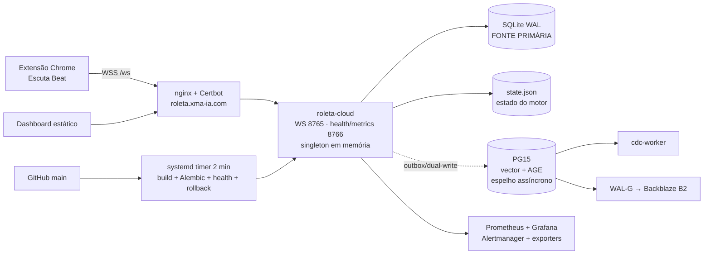
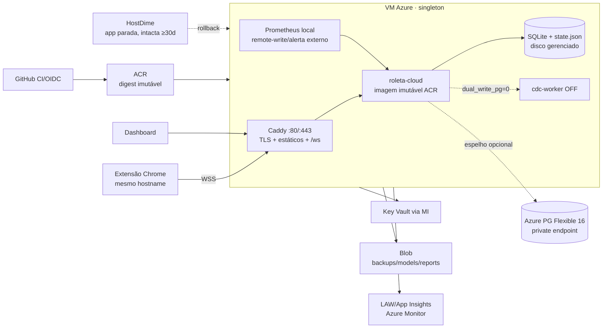

# Plano de Migração HostDime → Azure — 03/08/2026

> **Status:** proposta executável, ainda não iniciada.
> **Revisão:** auditoria técnica aplicada em 03/08/2026. Os achados, as decisões
> e a justificativa de cada uma estão em **§13**; as correções já foram
> incorporadas ao corpo do plano. Toda afirmação da auditoria está marcada como
> `PROVADO` (reproduzida por execução) ou `ESPERADO` (a validar em ensaio).
> **Origem:** HostDime `187.45.181.75` (produção ativa).
> **Destino:** Azure RG `maquina_roleta_cloud`, Brazil South.
> **Princípio:** reconstruir a infraestrutura declarativamente, copiar o runtime
> exato e migrar os dados sob congelamento. **Não clonar o disco da VPS.**
>
> Este documento substitui o estado e o veredito Azure descritos em
> `balanco_evolucao_agosto_26.md`: em 03/08/2026 foi confirmado que a
> infraestrutura Azure já existe, embora a aplicação ainda não tenha sido
> implantada.

---

## 0. Decisão executiva

A forma mais segura de migrar não é copiar a máquina inteira como imagem. O
correto é copiar sua **função operacional** em quatro camadas:

1. **Runtime idêntico:** transferir a imagem Docker que está rodando na
   HostDime para a Azure, com digest e checksum registrados.
2. **Configuração declarativa:** reproduzir compose, flags, proxy, timers,
   healthchecks e alertas como código, sem levar o drift do sistema operacional.
3. **Estado consistente:** migrar SQLite, `state.json`, artefatos de modelo e
   dados úteis do PostgreSQL somente após congelar o escritor da HostDime.
4. **Serviços gerenciados:** usar imediatamente ACR, Key Vault, Blob, Log
   Analytics/App Insights e PostgreSQL Flexible já provisionados; adiar a
   decomposição serverless do engine.

### Recomendação

- **Fase 1 — agora:** paridade funcional em **uma VM Azure**, ainda como
  singleton, mantendo SQLite como fonte primária.
- **Fase 2 — após 7 dias estáveis:** endurecimento, backup, observabilidade e
  esteira ACR/OIDC.
- **Fase 3 — projeto separado:** promover PostgreSQL a primário, externalizar o
  estado e só então avaliar Container Apps.

O cutover deve ser **all-or-nothing**. Não pode haver canário de tráfego entre
HostDime e Azure porque as duas instâncias manteriam estados e bancos SQLite
divergentes.

---

## 1. Evidências, ferramentas e limitações

### 1.1 Fontes consultadas

- Grafo local do projeto via Graphify, atualizado e consultado para runtime,
  persistência, deploy, backups e plano Azure.
- Grafo MCP global apenas como visão cross-project; ele não foi tratado como
  fonte do repositório corrente.
- `docker-compose*.yml`, Dockerfile, migrations 0001–0010, código de
  persistência/estado/WS/CDC e scripts de deploy/backup.
- `server_snapshot/*`, runbooks e ADENDOs ISO.
- Produção externa em 03/08: HTTPS 200 e WSS `/ws` conectado.
- Inventário Azure real por `az`, inclusive VM Run Command read-only.
- Revisão independente do desenho por arquiteto estratégico e rubber-duck.
- Auditoria de 03/08/2026 sobre este próprio documento, com reexecução dos
  comandos de inventário e revisão independente dos achados (§13).

### 1.2 MCP filesystem

O MCP filesystem está autorizado apenas para `C:\Users\Windows\Desktop`. Este
worktree isolado está em `C:\Users\Windows\Mendix\copilot-worktrees\...`.
Conforme least privilege e as regras do workspace, o checkout principal no
Desktop não foi lido. O MCP foi usado para validar o escopo; a árvore deste
worktree foi lida pelas ferramentas nativas.

### 1.3 Bloqueio atual

O arquivo `GUIA_ACESSO_AGENTICO_AZURE` não existe neste worktree, em
`origin/main` nem nas branches remotas. O agente possui acesso Azure
control-plane (Owner) e VM Run Command, mas **ainda não possui acesso comprovado
à HostDime**. Sem chave/usuário SSH e acesso ao DNS, nenhuma cópia de produção
pode começar.

---

## 2. Estado atual

### 2.1 Máquina local — desenvolvimento e controle

| Item | Estado |
|---|---|
| Sistema | Windows, worktree Git isolado |
| Runtime local ativo | `roleta-pg-dev`, PG15 custom com AGE/Timescale, healthy |
| Aplicação local | Não está rodando continuamente |
| Compose base | Um serviço `roleta-cloud` |
| Compose dev | Um serviço PostgreSQL |
| Papel na migração | Testes, geração dos artefatos, Azure CLI, checksums e coordenação |

A máquina local **não é fonte de dados de produção**. Ela deve ser usada apenas
como plano de controle e área de validação.

### 2.2 HostDime — produção efetiva

| Componente | Estado observado |
|---|---|
| Aplicação | Python/WebSockets; singleton com eleição MASTER/SLAVE |
| Persistência primária | `/app/data/decisions.db`, SQLite WAL |
| Estado do motor | `state.json`, salvamento atômico + fallback |
| PG | PG15, ~13 MB no snapshot; espelho incompleto/assíncrono |
| Containers | 8: app, CDC, PG, Prometheus, Grafana, Alertmanager e exporters |
| Frontend/TLS | nginx do host + Certbot; `/ws` → `127.0.0.1:8765` |
| Deploy | pull de `main` a cada 2 min, build local, Alembic, health e rollback |
| Backups | SQLite diário/7 dias; PG WAL-G/B2 com restore drill |
| Artefato fora do Git | `models/spin_autoencoder.joblib` |
| Dados conhecidos | snapshot 22/06: SQLite 11,8 MB e 9.471 decisões; medir novamente |

Os snapshots internos são de junho. Antes de executar, a HostDime precisa de um
novo inventário ao vivo.

### 2.3 Azure — recursos já disponíveis

A assinatura contém 75 recursos; 31 pertencem à Roleta.

| Recurso | Estado em 03/08/2026 | Lacuna |
|---|---|---|
| RG `maquina_roleta_cloud` | `Succeeded`, Brazil South | — |
| VM `vm-roleta-app-01` | Running, Debian 12, `Standard_L2as_v4`, 2 vCPU/16 GB | Aplicação ausente |
| Discos ativos | OS 64 GB + data 64 GB | — |
| Docker data | `/mnt/docker` em `/dev/nvme0n2`, ext4, UUID no `fstab` | **Durabilidade confirmada** |
| Disco local NVMe | 447 GB `/dev/nvme1n1`, não montado | Efêmero; não usar |
| Docker/Caddy | Ativos; 80/443 abertos | Caddy só responde placeholder |
| SSH | Chave, senha OFF; NSG porta 22 limitada a um `/32` | Sessão atual não alcança SSH |
| Managed Identity da VM | `AcrPull`, Blob Contributor, KV get/list | Boa base |
| ACR `acrroletaprod` | Basic, `Succeeded` | **0 imagens**; admin habilitado — o pull deve usar a Managed Identity, nunca a credencial de admin |
| PG `pg-roleta-prod` | PG16 B1ms, 32 GB, private-only, Ready | HA/geo OFF; espelho vazio/não validado |
| Extensões permitidas | AGE, TimescaleDB, vector e outras aparecem em `allowedValues` | `azure.extensions` não autoriza AGE/Timescale hoje; consultar `pg_extension` |
| Key Vault | 16 secrets, soft-delete 30d | Public network ON, purge protection OFF, access policies |
| Blob `stroletaprod` | containers `backups`, `models`, `reports` | Default network Allow; conteúdo não auditado pelo usuário |
| Rede | VNet `10.20.0.0/16`, subnets app/db/PE; PG privado | Correta |
| Observabilidade | LAW 30d + App Insights 90d | App/alerta ainda não conectados |
| DNS público | Continua em `187.45.181.75` | Cutover não feito |
| Resíduos | 6 discos soltos + 10 snapshots completos | Custo; não apagar durante migração |
| Azure Backup | Não encontrado | Criar depois do cutover |

**Reconciliação (reexecutada em 03/08/2026, `PROVADO`).** Os números acima foram
conferidos, não estimados:

| Afirmação | Comando | Resultado |
|---|---|---|
| 31 recursos no RG | `az resource list -g maquina_roleta_cloud -o json` | 31 |
| 16 secrets no Key Vault | `az keyvault secret list --vault-name kv-roleta-prod -o json` | 16 |
| ACR vazio | `az acr repository list -n acrroletaprod` | saída vazia |
| VM viva | `az vm get-instance-view … --query instanceView.statuses[1].displayStatus` | `VM running` |
| 6 discos soltos | `az disk list -g maquina_roleta_cloud -o json` | 8 discos, 2 `Attached`, 6 `Unattached` |
| 10 snapshots | `az snapshot list -g maquina_roleta_cloud -o json` | 10 no RG (13 na assinatura) |

Quem reexecutar a migração deve rodar estes comandos de novo e anexar a saída:
números sem data e sem comando envelhecem em silêncio.

### 2.4 Gap para ficar operacional

1. ACR vazio e VM sem imagem/container da aplicação.
2. `/opt/roleta` contém apenas um script preliminar.
3. Caddy não tem vhost de produção nem TLS válido para o domínio.
4. SQLite, `state.json`, modelo e frontend não existem na VM.
5. PG Azure não recebeu schema/dados comprovados.
6. Timer de deploy Azure está inativo.
7. Backups Blob e alertas Azure não foram testados.
8. Acesso HostDime e DNS não foi entregue ao agente — **bloqueio de viabilidade**,
   não apenas de cronograma: o congelamento do escritor, o checkpoint do WAL e a
   captura do último delta só existem com acesso à HostDime (§13, A10).

---

## 3. Arquitetura alvo

### 3.1 Alvo imediato — paridade segura

### 3.2 Mudanças permitidas no cutover

- nginx/Certbot → Caddy.
- PG container local → PG Flexible privado.
- secrets locais → Key Vault via Managed Identity.
- backup SQLite/modelos → Blob.
- build local → imagem imutável no ACR.
- alertas críticos → destino externo à própria VM.

### 3.2.1 Mudança permitida, porém **antes** do cutover

- `state.json` sai do bind de arquivo único (`./state.json:/app/state.json`) e
  passa a viver dentro do volume nomeado `roleta-data`, via
  `STATE_FILE=/app/data/state.json`.

Essa mudança **não entra na janela**. Ela é entregue por PR próprio (`MIG-0`),
aplicada primeiro na HostDime e observada em soak; a Azure só herda uma
configuração já comprovada. O porquê está em §13, A3. A alteração no código é
somente a declaração explícita do alias de ambiente; nenhuma lógica do motor
muda.

### 3.3 Mudanças proibidas no mesmo evento

- Alterar estratégia, stake, geometria ou INV-3.
- Ligar `dual_write_pg`.
- Subir NumPy 2/torch/faiss.
- Trocar SQLite por PG primário.
- Habilitar AGE/TimescaleDB sem consumidor comprovado.
- Mover o engine para Container Apps.
- Apagar HostDime, discos ou snapshots.
- Ligar flags hoje OFF.
- **Estrear** o novo caminho de `state.json` (§3.2.1) na janela: se `MIG-0` não
  tiver soak na HostDime, o cutover mantém o bind atual e o risco é aceito
  explicitamente.

---

## 4. O que faz sentido como gerenciado/serverless

| Componente | Agora | Futuro | Veredito |
|---|---|---|---|
| Engine WebSocket | VM, 1 réplica | Container Apps após refatorar estado | **Não serverless agora** |
| SQLite + `state.json` | Disco gerenciado da VM | PG primário + estado externo | Bloqueador de escala |
| PostgreSQL | Flexible Server privado | GP/HA se virar primário | **Usar agora como gerenciado** |
| Frontend | Caddy na VM | Static Web Apps/Blob `$web` | Depois de separar `ws.` e versionar extensão |
| CDC worker | VM, desligado | Container Apps Job | Só quando `dual_write_pg` tiver valor |
| Backfills/relatórios/ML | Manual/VM | Container Apps Jobs ou Azure Batch | Bom candidato futuro |
| Vision OCR online | Mesmo processo | Serviço dedicado apenas se houver carga | Manter junto por enquanto |
| Secrets | Key Vault | Key Vault | **Usar agora** |
| Imagens | ACR | ACR + GitHub OIDC | **Usar agora** |
| Backups/artefatos | Blob | Blob com versionamento/imutabilidade | **Usar agora** |
| Logs | Docker | AMA → LAW/App Insights | Adotar após estabilizar |
| Métricas | Prometheus/Grafana atuais | Grafana Cloud ou Azure Managed Prometheus | Migrar alerta externo primeiro |
| SignalR | Não usar | Só se protocolo for redesenhado | Não resolve singleton |
| Azure Functions | Não usar | Jobs curtos sem OCR/WS | Inadequado ao hot path |
| Container Apps eastus2 existente | Não usar | Criar ambiente dedicado se necessário | RG/região dev incompatíveis |

### Pré-requisitos para mover o engine a Container Apps

1. PostgreSQL tornar-se a fonte primária.
2. Remover escrita local SQLite.
3. Externalizar `game_state` e eleição de master com lease distribuído.
4. Garantir idempotência por evento/`trace_id`.
5. Tornar o processo stateless e tolerante a restart.
6. Começar com `minReplicas=1`, `maxReplicas=1`; escalar só depois.

---

## 5. Estratégia de banco de dados

### 5.1 Papel durante a migração

- **SQLite continua autoritativo.**
- PG Azure continua espelho e não participa da decisão crítica.
- `dual_write_pg` permanece OFF.
- PG B1ms é suficiente para um espelho pequeno; não é aprovado como banco
  primário sem benchmark.

### 5.2 PG15 HostDime → PG16 Flexible

AGE e TimescaleDB aparecem nos `allowedValues` do serviço Azure, mas não estão
na configuração atual de `azure.extensions`; a instalação real deve ser
confirmada por `pg_extension` a partir da rede privada. Como também não possuem
uso ativo comprovado no código, não são bloqueadores e **não devem ser ativadas
durante o cutover**.

Método recomendado:

1. Gerar um `pg_dump` completo da HostDime como arquivo forense e enviá-lo ao
   Blob.
2. Parar novas escritas e deixar o CDC drenar.
3. Exigir `shared.outbox pending=0` e `failed=0`.
4. Em banco de ensaio, rodar Alembic até `0010_dir3_phase_columns`.
5. Restaurar **dados** dos schemas `shared`, `cw` e `ccw`; excluir catálogos e
   schemas de grafo AGE vazios.
6. Reconciliar sequences/identities, triggers `outbox_new`, row counts e
   checksums.
7. Repetir no banco Azure definitivo.
8. Se a reconciliação falhar, manter o dump como arquivo e iniciar o espelho
   Azure vazio; nunca comprometer o SQLite por causa do espelho.

Não há partições ou jobs `pg_partman`/`pg_cron` criados pelo repositório hoje,
mas o baseline ao vivo deve confirmar isso antes do restore.

### 5.3 Evolução ideal do PG

- Enquanto espelho: manter B1ms, backup 7d e private endpoint.
- Antes de virar primário: benchmark; considerar General Purpose 2 vCPU,
  HA zonal, geo-backup, Entra ID e PITR testado.
- Geo-backup e HA implicam custo/possível recriação; decisão humana separada.

---

## 6. Metodologia por ondas

Legenda:

- **A:** agente pode executar autonomamente em área não produtiva.
- **A+H:** agente executa após confirmação humana explícita.
- **H:** humano precisa agir (MFA, acesso não delegado ou validação de negócio).
- **G:** gate go/no-go; não avançar automaticamente.

### Onda 0 — acesso e baseline vivo

| Passo | Dono | Critério |
|---|---|---|
| Entregar/commitar `GUIA_ACESSO_AGENTICO_AZURE` ou guia equivalente HostDime/DNS | H | Arquivo disponível sem secrets em texto |
| Validar SSH HostDime e privilégios Docker/systemd/nginx | A+H | Comando read-only completo |
| Capturar `docker inspect`, compose renderizado e env **redigido** | A | Flag-set canônico salvo |
| Capturar digest da imagem, `pip freeze`, OS, timers, cron, volumes e mounts | A | Baseline versionado/assinado |
| Medir SQLite/estado/modelo e hashes | A | Tamanho e SHA-256 |
| Capturar schemas, Alembic, rows, outbox e extensões PG | A | Relatório reconciliável |
| Validar atualização real do bind `state.json` | A | mtime/hash muda após save; registrar se a escrita cai no caminho atômico ou no fallback |
| Enumerar **todas** as units/cron que tocam a aplicação | A | `roleta-deploy.service` **e** `roleta-deploy.timer` mapeados, mais qualquer cron |
| Registrar o marcador de congelamento: `MAX(rowid)`/contagem de decisões e `spin_seq` do `state.json` | A | Par de valores reconciliável no destino |
| Validar DNS provider, TTL real e acesso de alteração | A+H | TTL observável |

**G0:** nenhum passo seguinte sem acesso HostDime funcional e cópia seca
completa. A durabilidade de `/mnt/docker` Azure já foi comprovada por UUID.

### Onda 1 — artefatos de migração por PR

Criar em sprint/PR separado:

0. **`MIG-0` — mover `state.json` para o volume nomeado** (§3.2.1): definir
   `STATE_FILE=/app/data/state.json`, remover o bind `./state.json` e migrar o
   arquivo existente. Entregue e observado **na HostDime** antes de qualquer
   passo Azure. Sem alteração na lógica do motor; apenas configuração explícita
   do alias `STATE_FILE` (§13, A3).
1. `docker-compose.azure.yml` como arquivo **standalone**, nunca como overlay do
   compose base:
   - **sem chave `build:`** — a imagem vem só por digest do ACR;
   - PG externo;
   - volumes no disco gerenciado;
   - `stop_grace_period: 60s`;
   - health/metrics somente loopback.

   O motivo é mecânico e foi reproduzido: `docker compose -f docker-compose.yml
   -f overlay.yml config` devolve `build.context` **e** `image:` no mesmo
   serviço, porque o merge do Compose não remove chaves do arquivo base
   (`PROVADO`). Um `build`/`up --build`, ou um `up` sem a imagem local,
   reconstruiria na VM com dependências `>=` e sobrescreveria a tag do digest —
   destruindo exatamente a garantia que o plano existe para proteger.
   Contrapartida assumida: um arquivo standalone pode driftar do base, por isso
   a DoD exige o diff dos dois `config` renderizados (§10).
2. Caddyfile:
   - `/` serve o frontend a partir de `/var/www/roleta` (`root * /var/www/roleta`);
   - `/ws` faz proxy WebSocket com timeouts longos;
   - `/healthz` expõe apenas readiness mínima (o servidor HTTP já aceita
     `/health` e `/healthz` — `server/health_server.py:372`);
   - `/metrics`, `/api/*` e porta 8766 não ficam públicos.
3. Script Managed Identity → Key Vault → `.env` (`0600`), sem logar valores,
   gravado em **`$REPO_DIR/.env`**: o Compose só lê o `.env` do diretório do
   projeto, então escrevê-lo em `/opt/roleta` não teria efeito.
4. Backup SQLite via `.backup` → Blob e cópia do modelo com checksums.
5. Deploy Azure que **puxa digest ACR** autenticando pela MI em dois comandos —
   `az login --identity` e depois `az acr login -n acrroletaprod` (§14, A20:
   `az acr login` **não** aceita `--identity`) — seguido de
   `docker compose -f docker-compose.azure.yml pull` +
   `up -d --no-build`; nunca `docker compose build` e nunca a credencial de
   admin do ACR. Antes do `alembic upgrade head`, o script **aborta** se
   `ROLETA_PG_DSN` estiver vazio (§13, A7).
6. Scripts de baseline, paridade, cutover, fencing e rollback.
7. Teste do caminho de estado no ambiente-alvo: container Linux, escrita, kill
   -TERM, releitura e `shutdown` de 60s — provando que a gravação é atômica no
   volume e que nenhuma escrita cai no fallback não atômico.

**G1:** suíte completa verde, lint verde, nenhuma alteração de estratégia e
diff de flags vazio.

### Onda 2 — preparação Azure sem produção

| Ação | Dono |
|---|---|
| Criar layout `/opt/roleta`, volumes e permissões | A+H |
| Validar leitura do Key Vault por MI | A |
| Validar `docker pull` do ACR autenticado **pela Managed Identity** (`az login --identity` seguido de `az acr login -n acrroletaprod` — §14/A20), sem usar admin | A |
| Reconciliar nomes dos 16 secrets com o env HostDime, sem ler/exibir valores | A |
| Validar escrita/leitura de teste no Blob por MI | A |
| Configurar Caddy para hostname temporário `azure-canary.*` | A+H (DNS) |
| Corrigir alerta externo/Action Group que falhou no provisionamento | A+H |
| Instalar unit/timer Azure, **mantê-los desabilitados** | A |
| Configurar PG DSN privado com `sslmode=require` | A |
| Criar backup de VM/data disk | A+H (custo) |

Não é necessário abrir SSH ao agente: Azure CLI + Run Command já funcionam.
Qualquer alteração de NSG exige aprovação.

### Onda 3 — imagem e banco

1. Congelar/taguear a imagem que roda na HostDime.
2. `docker save` + compressão + SHA-256.
3. Transferir por Blob/SAS temporário ou canal SSH aprovado.
4. `docker load` na VM e publicar no ACR.
5. Conceder `AcrPush` temporário à identidade que publica; revogar depois.
6. Registrar digest `hostdime-cutover-<git-sha>-<timestamp>`.
7. Comparar `pip freeze` da imagem transferida com build atual de `main`.
8. Preparar PG Azure conforme §5.

Se as dependências divergirem, o corte usa a imagem transferida. A correção de
pin/lockfile acontece depois por PR; nunca se muda dependência durante o
cutover.

**G2:** imagem idêntica no ACR, pull por MI, PG ensaiado e checksums registrados.

### Onda 4 — ensaio completo

A HostDime continua servindo produção.

1. Gerar snapshot SQLite consistente via `sqlite3 backup API` e confirmar o
   `wal_checkpoint` (mesmo procedimento de C-14/C-15).
2. Copiar `state.json` apenas para ensaio; marcar como potencialmente defasado.
   **Ensaiar o caminho de restore no destino efetivo** e provar que o app não
   sobe com estado default (o marcador de C-13 tem de bater).
3. Subir Azure no hostname canário, sempre por `pull` do digest — nunca por
   build local.
4. Executar cliente WS sintético:
   - conexão;
   - eleição master;
   - spin;
   - sugestão;
   - resultado;
   - reconexão;
   - restart.
5. Validar round-trip de todos os campos persistidos, especialmente
   `spin_seq`, `seed_parity`, `block_gale` e estado adaptativo.
6. Comparar flags, env redigido, versão, schema SQLite, `pip freeze` e respostas.
7. Comparar timezone, locale, NTP e relógio; testar carga/latência e OCR.
8. Provar que 8766, `/metrics` e `/api/*` não são públicos.
9. Testar backup Blob e restore em diretório/banco isolado.
10. Rehearsar rollback sem mexer no DNS de produção.

**G3:** paridade completa + restore + rollback ensaiados. O humano assina RPO,
RTO e janela.

### Onda 5 — cutover

Ver §7. O agente pode executar comandos aprovados, mas o go/no-go é humano.

### Onda 6 — estabilização

- T+0–24h: sem deploy funcional, sem flags novas, sem `dual_write_pg`.
- T+24h: habilitar deploy Azure após três ciclos testados.
- T+7d: revisar CPU, RAM, latência, WS, backups e alertas.
- HostDime permanece write-fenced e intacta.

### Onda 7 — encerramento e otimização

Após no mínimo 30 dias e aprovação humana:

- encerrar HostDime;
- desabilitar ACR admin e usar OIDC/MI;
- ativar KV purge protection;
- restringir rede pública de KV/Storage;
- criar/revisar Azure Backup;
- remover 6 discos soltos e 10 snapshots após inventário;
- redimensionar VM apenas com métricas de 7–30 dias;
- decidir futuro de PG, observabilidade e serverless.

---

## 7. Runbook do cutover

### 7.1 Preparação

| Quando | Ação |
|---|---|
| T−7d | Aprovar janela, RPO/RTO e responsável pelo DNS |
| T−48h | Reduzir TTL para 60s e confirmar em resolvers externos |
| T−24h | Congelar `main`, bloquear merges e avisar manutenção |
| T−2h | Backup/restore final de ensaio; Azure canário 100% verde |

### 7.2 Janela operacional

Os passos usam **IDs estáveis** (`C-xx`), não posições numéricas: inserir um
passo novo não pode invalidar as referências do runbook, da DoD e do rollback.

| ID | Ação | Verificação objetiva |
|---|---|---|
| **C-01** | Mascarar **as duas** units de deploy da HostDime: `systemctl disable --now roleta-deploy.timer` e `systemctl mask roleta-deploy.timer roleta-deploy.service` | `systemctl is-enabled` devolve `masked` para ambas |
| **C-02** | Neutralizar o executável como fence de última instância: `chmod 000 /usr/local/bin/roleta-deploy-pull.sh` | `test ! -x` |
| **C-03** | Confirmar que nenhum cron/unit alternativo executa `docker compose up` | `crontab -l`, `systemctl list-timers --all` e `grep -r 'compose up' /etc` sem resultado ativo |
| **C-04** | Desabilitar o timer Azure | `systemctl is-enabled` = `disabled` |
| **C-05** | Remover a política de restart do container: `docker update --restart=no roleta-cloud` | `docker inspect -f '{{.HostConfig.RestartPolicy.Name}}' roleta-cloud` = `no` |
| **C-06** | Pedir ao operador para fechar clientes; esperar quiescência | `roleta_ws_connections == 0` |
| **C-07** | Parar a aplicação HostDime com timeout de 60s | `docker compose stop -t 60` retorna 0 |
| **C-08** | Confirmar salvamento do estado | log `state_saved`, JSON parseável e mtime/hash atualizados |
| **C-09** | Deixar o CDC drenar e depois pará-lo | `shared.outbox` com `pending=0` e `failed=0` |
| **C-10** | **Write-fence de ingress:** parar nginx e bloquear 80/443, mantendo SSH | conexão externa a 443 recusada |
| **C-11** | Verificar externamente que HTTPS/WSS da HostDime falham | teste a partir de outra rede |
| **C-12** | Esperar mais de dois ciclos antigos do timer (≥5 min) e provar não-ressurreição | `docker ps` vazio, row count e mtime inalterados |
| **C-13** | **Registrar o marcador de congelamento:** `MAX(rowid)`/contagem de decisões do SQLite e `spin_seq` do `state.json` | par de valores anotado; é o que prova consistência no destino |
| **C-14** | Backup final do SQLite pela **backup API**, em container efêmero com o volume montado; nunca `cp` do `.db` | arquivo gerado + `PRAGMA integrity_check` = `ok` |
| **C-15** | Confirmar que o WAL foi absorvido: `PRAGMA wal_checkpoint(TRUNCATE)` na origem e ausência de `-wal` órfão na cópia | checkpoint devolve `0` na primeira coluna |
| **C-16** | Copiar `state.json`, modelo, frontend e dumps; gerar SHA-256 na origem | hashes registrados |
| **C-17** | Preservar a cópia `hostdime-pre-cutover`, que nunca será sobrescrita | cópia em Blob com nome imutável |
| **C-18** | Transferir para Blob/Azure; validar SHA-256 e permissões | hash de destino == hash de origem |
| **C-19** | Restaurar SQLite, estado e modelo **no caminho efetivo do destino** | se `MIG-0` estiver aplicado, o estado vai para dentro do volume `roleta-data` (`/app/data/state.json`); caso contrário, para `$REPO_DIR/state.json`. Verificar com `test -f` no caminho correto **antes** de qualquer `up` |
| **C-20** | Autenticar no ACR pela MI e puxar a imagem por digest | `az login --identity` → `az acr login -n acrroletaprod` → `docker compose -f docker-compose.azure.yml pull` (§14/A20) |
| **C-21** | Subir com `up -d --no-build`; validar container, `/healthz` e logs | `docker compose config` do arquivo Azure sem `build:` |
| **C-22** | Reconciliar o marcador de C-13 no destino | contagem e `spin_seq` idênticos |
| **C-23** | Testar WSS pelo hostname canário e validar continuidade de `spin_seq` | handshake e primeiro frame OK |
| **C-24** | **G4 humano:** autorizar ou abortar o DNS | decisão registrada |
| **C-25** | Alterar A de `roleta.xma-ia.com` para `20.226.77.194` | propagação observada |
| **C-26** | Validar HTTPS/WSS em múltiplas redes/resolvers | 200 + WSS conectado |
| **C-27** | Operador realiza um teste real controlado; INV-3 e stake conferidos | indicação `APOSTAR` presente |

**Ponto de não-retorno = C-25.** Até C-24 nenhuma escrita de produção chegou à
Azure e o rollback é trivial (§8). A partir da primeira escrita aceita pela
Azure, voltar exige transportar o estado de volta.

**Sobre a propagação de DNS.** O fence de ingress (C-10) acontece **antes** do
flip (C-25) de propósito. Durante a propagação, o cliente que ainda resolve o IP
antigo recebe recusa de conexão — não uma segunda instância aceitando escrita.
Isso troca disponibilidade por consistência de forma deliberada: é a razão de o
plano recusar canário de tráfego.

### 7.3 TLS

Ordem preferida:

1. **DNS-01 pré-emitido**, se houver API segura do provedor DNS.
2. Certificado atual transferido temporariamente via Key Vault, sem gravar
   chave privada em Git/log, seguido de rotação pelo Caddy.
3. Último recurso: emissão HTTP-01 após o flip, aceitando curta indisponibilidade.

O Caddy não deve tentar repetidamente o domínio de produção antes do cutover,
evitando rate limit ACME.

### 7.4 Objetivos

- **RPO alvo para dados já confirmados:** 0.
- **Risco residual declarado:** até um evento/spin ainda não confirmado no
  momento da quiescência.
- **RTO planejado:** 60–90 minutos de indisponibilidade percebida, recalculado
  após a auditoria. A conta: C-01…C-12 (fence e prova de não-ressurreição) já
  consomem ≥5 min só de espera obrigatória; C-13…C-22 dependem do volume do
  SQLite e da banda de transferência; e a partir de C-25 ainda há a propagação
  de DNS. O TTL de 60s só vale se a redução em T−48h tiver sido confirmada em
  resolvers externos — sem isso, some o TTL antigo ao RTO.
- **Downtime deliberado:** preferível a split-brain.

---

## 8. Rollback

### Antes do DNS (até C-24)

1. Parar Azure.
2. Reabrir ingress HostDime.
3. Reiniciar HostDime com as duas units ainda mascaradas.
4. Nenhum dado novo foi aceito pela Azure; rollback simples.

### Depois de a Azure aceitar escritas (a partir de C-25)

1. Declarar manutenção e desconectar clientes.
2. Parar Azure graciosamente, com o mesmo timeout de 60s.
3. Criar `azure-pre-rollback` de SQLite + estado + checksums, usando **a mesma
   backup API e o mesmo checkpoint de WAL** de C-14/C-15 — um rollback feito com
   `cp` desfaz a garantia que o cutover construiu.
4. **Não sobrescrever** a cópia `hostdime-pre-cutover`.
5. Restaurar o estado Azure no volume HostDime em área temporária.
6. Validar JSON, integridade SQLite, schema e hashes; reconciliar o marcador de
   C-13 acrescido do que a Azure aceitou.
7. Reverter DNS.
8. Reabrir HostDime e iniciar app com as units ainda mascaradas.
9. Validar WSS e primeiro evento.

Isso é **rollback quase-zero**, não garantia matemática de zero: pode haver um
evento em voo e haverá janela de indisponibilidade DNS. O PG não bloqueia o
rollback porque continua espelho e `dual_write_pg=0`.

### Fencing obrigatório

Um lock file local não protege duas máquinas. O fence mínimo é:

- **as duas** units (`roleta-deploy.timer` **e** `roleta-deploy.service`)
  mascaradas — mascarar só o timer deixa a unit oneshot startável à mão, e é
  exatamente isso que `docs/DEPLOY.md` documenta como procedimento manual;
- executável de deploy neutralizado (C-02);
- política de restart do container removida (C-05);
- container parado;
- nginx/443 bloqueado;
- teste de não-ressurreição;
- apenas uma origem aceita escrita.

Um lease distribuído/epoch em Blob ou PG pode ser implementado futuramente,
atrás de flag default-OFF, mas não deve ser introduzido no hot path durante o
lift-and-shift.

---

## 9. Agente × humano

### 9.1 O agente pode fazer

Sem nova confirmação:

- inventário read-only local/Azure;
- criar scripts, compose Azure, Caddyfile, testes e runbooks em branch/PR;
- validar hashes, schemas, imagens e backups não produtivos;
- usar Azure CLI e VM Run Command read-only.

Com confirmação humana explícita:

- alterar RBAC/NSG/Key Vault/Storage;
- preparar VM e PG;
- publicar ACR;
- executar comandos HostDime após receber acesso;
- parar/iniciar produção;
- executar cutover/rollback;
- alterar DNS se a API/credencial for delegada.

### 9.2 O humano precisa confirmar

1. Entrega do acesso HostDime e DNS.
2. RPO residual (até um evento em voo) e RTO.
3. Janela de manutenção.
4. Freeze de `main`.
5. Mudanças de custo, segurança, RBAC e NSG.
6. G4 go/no-go do DNS.
7. Rollback após produção.
8. Decomissionamento e exclusões.

### 9.3 O humano pode ter que fazer pessoalmente

- login/MFA Azure ou registrador DNS;
- disponibilizar a chave SSH HostDime;
- fechar/reabrir a extensão no momento da janela;
- validar um giro real controlado;
- aprovar qualquer cobrança/contrato.

Se HostDime e DNS forem delegados por credencial não interativa segura, o agente
pode executar quase toda a operação; o humano continua Accountable nos gates.

---

## 10. Definition of Done

### Paridade

- [ ] Imagem ACR por digest = imagem HostDime verificada.
- [ ] `docker compose -f docker-compose.azure.yml config` **não contém** `build:`.
- [ ] Diff entre o `config` renderizado da Azure e o de produção só mostra
      `build`/`image`, PG externo, `stop_grace_period` e proxy — nada de flags.
- [ ] Pull do ACR feito pela Managed Identity; credencial de admin nunca usada.
- [ ] Diff de flags = vazio.
- [ ] INV-3 preservado.
- [ ] Todas as flags OFF continuam OFF.
- [ ] Round-trip `save/load/reset_session` preserva campos
      (`tests/test_game_state.py::test_save_load_roundtrip` verde).
- [ ] SQLite `integrity_check=ok`.
- [ ] `state.json` válido, atual e **no caminho efetivo** (volume se `MIG-0`
      aplicado; repo caso contrário) — verificado por `test -f` antes do `up`.
- [ ] Nenhuma escrita de estado caiu no fallback não atômico durante o ensaio.
- [ ] Modelo carrega ou degrada explicitamente conforme baseline.
- [ ] Mapeamento Key Vault ↔ env HostDime completo, sem valores em logs.
- [ ] `.env` gerado em `$REPO_DIR/.env` e sobrevivente a um `git reset --hard`
      de teste (é ignorado pelo `.gitignore` e o deploy não roda `git clean`).

### Dados

- [ ] Backup SQLite e restore testados.
- [ ] `PRAGMA wal_checkpoint(TRUNCATE)` confirmado antes da cópia final.
- [ ] Marcador de congelamento (C-13) reconciliado no destino (C-22).
- [ ] PG Alembic em `0010`.
- [ ] Extensões necessárias presentes e conferidas em `pg_extension` **antes**
      do restore, para não falhar em objetos AGE/Timescale ausentes.
- [ ] Outbox pending=0 e failed=0 no freeze.
- [ ] Rows/sequences/triggers reconciliados.
- [ ] Backups Blob e PITR PG restaurados em ensaio.

### Rede/operação

- [ ] HTTPS 200 no domínio.
- [ ] WSS conecta e mantém heartbeat.
- [ ] Eleição MASTER funciona após reconnect.
- [ ] `/metrics`, `/api/*` e 8766 não públicos.
- [ ] Frontend servido pelo Caddy a partir de `/var/www/roleta`, com uma
      alteração de teste em `frontend/` chegando ao navegador.
- [ ] Alerta externo detecta app/VM indisponível — **testado desligando a VM em
      ensaio** e observando o disparo fora dela.
- [ ] Timer Azure passa 3 ciclos.
- [ ] `roleta-deploy.timer` **e** `roleta-deploy.service` permanecem `masked`.
- [ ] Rollback foi ensaiado.

### Estabilização

- [ ] 24h sem P1.
- [ ] Primeiro backup **pós-cutover** restaurado com sucesso.
- [ ] 7 dias com backups, métricas e alertas verdes.
- [ ] HostDime intacta por ≥30 dias.
- [ ] Nenhum recurso excluído sem aprovação.

---

## 11. Riscos prioritários

| Risco | Severidade | Como detectar | Controle |
|---|---|---|---|
| Sem acesso à HostDime, o freeze e o último delta não executam | **Bloqueante** | G0 não fecha | Entregar credencial antes de qualquer sprint MIG |
| `.service` de deploy ressuscita o app mesmo com o timer mascarado | Crítica | `systemctl is-enabled roleta-deploy.service` | Mascarar as duas units + `chmod 000` no script (C-01/C-02) |
| `restart: unless-stopped` traz o container de volta | Crítica | `docker inspect … RestartPolicy` | `docker update --restart=no` (C-05) |
| Duas máquinas aceitam escrita | Crítica | teste externo a 443 em C-11 | Fence de ingress antes do flip; nunca canário de tráfego |
| Overlay mantém `build:` e a VM reconstrói a imagem | Crítica | `config` do arquivo Azure contém `build:` | Arquivo standalone + `pull` + `up --no-build` |
| `state.json` gravado pelo caminho não atômico | Crítica | escrita não usa `os.replace` | **Resolvido no código por `MIG-0` e provado em 03/08** (§14.2/T1): dentro do volume o `os.replace` executa; no bind antigo falhava com `EBUSY`. Falta aplicar na HostDime |
| Estado presente porém **corrompido** sobe como default, com health verde | **Crítica** | `state.json` truncado/`{}` e mesmo assim `/healthz` verde e `spin_seq` zerado | `MIG-0` **não** cobre: `GameState.load()` engole o erro e devolve estado vazio (§14/A19). Exigir validação de conteúdo no preflight e repropagar erro quando `STATE_FILE` estiver definido |
| Escrita atômica no namespace mas **não durável** a power-loss | Alta | corte de energia/reset da VM logo após uma escrita | `save()` não faz `fsync` do arquivo nem do diretório (§14/A23); tratar antes de depender do estado como fonte única |
| Runbook manda autenticar no ACR com comando inexistente | Alta | `az acr login --identity` retorna erro de parâmetro | Corrigido para `az login --identity` + `az acr login -n acrroletaprod` (§14/A20) |
| ACR sem nenhuma imagem publicada no dia do cutover | **Bloqueante para G2** | `az acr repository list` devolve `[]` | Onda 3 precisa publicar e fixar o digest antes de qualquer ensaio de pull (§14/A21) |
| Restore do estado no caminho errado (sobe com default, sem erro) | Crítica | `spin_seq` do destino ≠ marcador de C-13 | `test -f` no caminho efetivo (C-19) + reconciliação (C-22) |
| `cp` cru do SQLite WAL | Crítica | ausência de checkpoint | Backup API + `wal_checkpoint(TRUNCATE)` (C-14/C-15) |
| Dependências flutuantes mudam OCR/WS | Alta | diff de `pip freeze` | Imagem runtime exata + digest |
| Deploy Azure sem PG DSN entra em loop | Alta | `alembic` falha por conexão recusada | Abortar fail-fast se `ROLETA_PG_DSN` vazio |
| Credencial no default versionado de `migrations/env.py` | Alta | leitura do arquivo | Trocar por erro explícito; rotacionar se já usada |
| Frontend nunca chega ao navegador na Azure | Média | alteração de teste não aparece | Caddy com `root * /var/www/roleta`; remover o `nginx -t` do deploy Azure |
| TLS não emite no cutover | Alta | Caddy sem cert válido | DNS-01 ou cert temporário via KV |
| PG espelho inconsistente | Média | row counts divergentes | drain + dump + reconcile; SQLite permanece SoT |
| Alertmanager morre com a VM | Alta | alerta não dispara com VM desligada | Alerta externo Azure/Grafana Cloud, testado |
| VM/PG subdimensionados | Média | métricas de 7–30 dias | Benchmark; não redimensionar no cutover |
| Secrets em logs/repo | Crítica | revisão de log/diff | MI/KV; redaction; valores nunca exibidos |
| Secret ausente/mapeado errado | Alta | smoke de integração falha | Paridade de nomes + smoke de cada integração |
| Recursos órfãos geram custo | Média | inventário mensal | Limpar só após 30d e aprovação |

---

## 12. Ordem recomendada a partir de agora

1. Tornar o guia de acesso HostDime/DNS disponível neste worktree.
2. Executar somente a **Onda 0** e atualizar este plano com fatos ao vivo.
3. Abrir sprints de migração:
   - `MIG-0` mover `state.json` para o volume nomeado (§3.2.1), aplicado na
     HostDime e em soak **antes** de qualquer passo Azure;
   - `MIG-1` baseline/fencing;
   - `MIG-2` compose Azure standalone + Caddy + KV;
   - `MIG-3` ACR+imagem;
   - `MIG-4` PG/backup;
   - `MIG-5` rehearsal;
   - `MIG-6` cutover;
   - `MIG-7` estabilização/decommission.
4. Só agendar cutover após G3 aprovado.

**Resultado esperado:** a mesma aplicação e o mesmo estado operando no mesmo
hostname, sobre a VM Azure já paga, com runtime reproduzível, dados íntegros,
rollback real e um caminho posterior — separado — para arquitetura serverless.

---

## 13. Auditoria de 03/08/2026 — achados, decisões e porquês

Auditoria feita com o grafo Graphify do projeto (atualizado antes da leitura:
1034 nós / 1224 arestas / 114 comunidades), leitura direta do código e da
infraestrutura, reexecução dos comandos `az` (§2.3) e uma revisão independente
do próprio relatório.

**Método e honestidade das evidências.** Cada achado é marcado `PROVADO` quando
foi reproduzido por execução nesta auditoria, e `ESPERADO` quando decorre de
leitura de código ou de comportamento documentado, mas ainda não foi reproduzido
no ambiente-alvo. Nenhum passo deste plano depende de um `ESPERADO` sem ter um
ensaio correspondente na Onda 4.

### 13.1 Achados corrigidos

| ID | Achado | Evidência | Decisão adotada | Por quê |
|---|---|---|---|---|
| **A1** | O overlay `docker-compose.azure.yml` não removeria o `build:` do compose base | `docker compose -f docker-compose.yml -f overlay.yml config` devolve `build.context` **e** `image:` no mesmo serviço — `PROVADO` | Arquivo **standalone**, `pull` + `up -d --no-build`, DoD checando ausência de `build:` | O objetivo nº1 do plano é runtime idêntico. Com `build:` presente, um `docker compose build` — que é literalmente o que o deploy atual faz — reconstruiria na VM com dependências `>=` e sobrescreveria a tag do digest. A garantia seria perdida em silêncio, sem nenhum passo do runbook falhando |
| **A2** | Mascarar só `roleta-deploy.timer` deixa `roleta-deploy.service` startável | São duas units (`docs/DEPLOY.md:29-30`) e o `start` manual do `.service` é procedimento documentado (`docs/DEPLOY.md:57`) — `PROVADO` por leitura | Mascarar as duas units + `chmod 000` no executável (C-01/C-02) | O fence precisa cobrir o caminho que um humano usa por hábito sob pressão, não só o automático. Um `systemctl start roleta-deploy.service` durante a janela executaria `git reset --hard` + `up -d` e ressuscitaria o escritor congelado |
| **A3** | A mitigação de `state.json` era só "testar o bind" — detecta, não corrige | `state/game.py:1371-1382`: `os.replace()` com `except OSError` caindo em escrita in-place não atômica. Com bind de arquivo único, `os.replace()` falha com `EBUSY` (errno 16) e a produção grava pelo caminho não atômico — **`PROVADO` em 03/08 com o código real de produção em container Linux** (§14.2/T1: inode do alvo inalterado antes/depois no bind; inode trocando a cada escrita dentro do volume) | `MIG-0`: `STATE_FILE=/app/data/state.json`, arquivo dentro do volume `roleta-data`, bind removido. Deploy e retomada têm preflight; `GameState.load()` também falha fechado quando o override aponta para arquivo ausente. Entregue **antes** do cutover, na HostDime, com soak | Se toda escrita de estado em produção usa o caminho não atômico, um crash no meio do `json.dump` trunca o JSON. O `STATE_FILE` agora tem `validation_alias="STATE_FILE"` explícito em `Settings`; a mudança não altera a lógica de estratégia. O guard de aplicação cobre subida manual/restart, enquanto o preflight cobre deploy. **Ressalvas apuradas em §14:** a atomicidade provada é de *namespace* (`rename`), não de durabilidade — não há `fsync` (A23); e o fail-closed cobre ausência, não corrupção (A19) |
| **A4** | `state.json` não é rastreado pelo Git, então uma VM nova sem restore faria o Docker criar um **diretório** com esse nome | `.gitignore` lista `state.json`; `git ls-files state.json` devolve vazio — `PROVADO` | C-19 exige `test -f` **no caminho efetivo** antes de qualquer `up` | Com `MIG-0` aplicado a armadilha do diretório desaparece, mas surge outra pior: restaurar no lugar antigo faz o app subir com estado **default**, sem crash e sem alerta. Um passo de verificação que aponta para o caminho errado é pior que nenhum, por isso C-19 é condicional ao estado de `MIG-0` |
| **A5** | "Volumes no disco gerenciado" só valia para o volume nomeado | O bind `./state.json` vive no `REPO_DIR`, no disco de SO, não em `/mnt/docker` | Redação corrigida em §3.2.1 e no C-19; `MIG-0` resolve na raiz | Um backup só do data disk perderia o estado do motor. Depois de `MIG-0` os dois artefatos críticos ficam no mesmo volume, e a política de backup passa a ter um alvo só |
| **A6** | O deploy sincroniza `frontend/` e recarrega **nginx**; com Caddy o passo vira no-op silencioso | `scripts/roleta-deploy-pull.sh:96-107`: `command -v nginx` falha e o script loga "reload pulado (não-fatal)" — `PROVADO` por leitura | Caddy com `root * /var/www/roleta`; deploy Azure faz só o `cp -a`; DoD exige alteração de teste chegando ao navegador | Foi exatamente esse gap que já quebrou o deploy do dashboard em 17/06 na HostDime. Repetir o erro na Azure daria um backend saudável servindo um frontend congelado — o pior tipo de falha, porque o healthcheck fica verde |
| **A7** | `ROLETA_PG_DSN` ausente não gera erro de configuração, gera loop de rollback | `migrations/env.py:18-21` tem default hardcoded para `127.0.0.1:5432` — `PROVADO` por leitura | Deploy Azure aborta fail-fast se o DSN estiver vazio | Sem o fail-fast, o sintoma é "conexão recusada" a cada 2 minutos e um rollback automático que reverte código bom. O operador perde tempo investigando o app quando o problema é uma variável ausente |
| **A8** | O default de `migrations/env.py` embute usuário e senha num arquivo versionado | mesmo trecho — `PROVADO` | Substituir por ausência de default + erro explícito; rotacionar a credencial se ela já foi usada em algum ambiente | É credencial em repositório. Mesmo sendo um valor de desenvolvimento, ele viola a regra de não commitar secrets e cria o hábito de assumir que "o default funciona" |
| **A9** | Não estava afirmado que o `.env` gerado do Key Vault sobrevive ao deploy | `.gitignore` cobre `.env` e `.env.*`; o script não executa `git clean` — `PROVADO` | Afirmado na DoD, com a exigência de gravar em `$REPO_DIR/.env` | A dúvida "o `git reset --hard` apaga minha configuração?" trava a execução. Além disso, o Compose só lê o `.env` do diretório do projeto: escrevê-lo em `/opt/roleta` produziria um deploy que sobe sem nenhuma flag |
| **A10** | A falta de acesso à HostDime estava registrada como contexto, não como bloqueio | §1.3 | Elevado a bloqueio de viabilidade em §2.4 e primeira linha de §11 | Congelar o escritor, rodar o checkpoint do WAL e capturar o último delta dependem de acesso ao servidor. Sem ele não existe "metade do plano": existe um plano que não roda |
| **A11** | Passos do cutover referenciados por número | §7.2 | Convertidos em IDs estáveis `C-01…C-27` | A auditoria inseriu passos no meio da lista. Referências posicionais em runbook apodrecem na primeira revisão, e um runbook com referência errada é executado errado às 3h da manhã |
| **A12** | RTO de 30–60 min incompatível com o runbook | §7.4 | Recalculado para 60–90 min, com a conta explícita | Uma DoD que promete um RTO que o próprio runbook não alcança treina a equipe a ignorar a DoD |

### 13.2 Reforços de verificação (o plano já acertava; faltava a prova)

| ID | Ponto | Reforço | Por quê |
|---|---|---|---|
| **A13** | Backup do SQLite | Além da backup API já exigida, C-15 pede `PRAGMA wal_checkpoint(TRUNCATE)` confirmado e proíbe copiar `-wal`/`-shm` avulsos | A backup API já lida com o WAL corretamente, mas o runbook não tinha como **provar** que lidou. Um check barato transforma uma premissa em evidência |
| **A14** | Consistência entre SQLite e `state.json` | C-13 registra `MAX(rowid)`/contagem e `spin_seq`; C-22 reconcilia no destino | Parar a aplicação já garante o mesmo ponto de congelamento por construção. O marcador serve para **demonstrar** isso no destino e para detectar restore no caminho errado (A4) |
| **A15** | Propagação de DNS | Explicitado que C-10 precede C-25 de propósito e que o cliente antigo recebe recusa, não uma segunda instância | É a pergunta que sempre aparece no go/no-go. Deixá-la implícita convida alguém a "amenizar o downtime" mantendo a HostDime no ar — que é precisamente o split-brain que o plano recusa |
| **A16** | Extensões PG | Conferir `pg_extension` **antes** do restore | Confirmado em 03/08: `azure.extensions` do `pg-roleta-prod` é `vector,pg_partman,pg_cron,pgcrypto,pg_stat_statements,uuid-ossp` — **sem `age` e sem `timescaledb`**, enquanto a produção roda a imagem custom `roleta/postgres-stack:pg15-age15`. O risco foi **rebaixado de bloqueante para condicional** (§14/A24): as migrations já envolvem `CREATE EXTENSION age` e `timescaledb` em blocos `DO $$ … EXCEPTION`, e nenhum caminho de produção importa `database/age/queries.py`. Ainda assim, um `pg_dump` integral pode arrastar `ag_catalog`, tipos `agtype`, grafos e dependências: a conferência ao vivo continua obrigatória e o restore deve ser seletivo |
| **A17** | Alerta externo | DoD exige testar desligando a VM em ensaio | Um alerta que nunca disparou é uma suposição com dashboard bonito |
| **A18** | Autenticação no ACR | Pull pela Managed Identity, nunca pela credencial de admin | O admin do ACR é uma senha estática de longa vida. A VM já tem `AcrPull` na identidade: usar a senha seria criar um secret novo tendo a solução sem secret pronta |

### 13.3 Contrapartidas assumidas conscientemente

- **Arquivo Azure standalone (A1) permite drift** em relação ao compose base.
  Aceito porque a alternativa comprovadamente não funciona; mitigado pelo diff
  dos dois `config` renderizados na DoD.
- **`MIG-0` (A3) adiciona um sprint antes da migração.** Aceito porque o modo de
  falha que ele remove é silencioso, e o cutover não tem tempo de detectar perda
  de estado do motor.
- **RTO maior (A12).** Aceito: o plano já escolheu downtime deliberado em vez de
  split-brain; prometer menos tempo não muda a física, só piora a expectativa.
- **Nada disso toca estratégia, stake, geometria ou INV-3.** Todas as correções
  são de infraestrutura, configuração e procedimento — condição para que a
  migração continue sendo uma migração, e não uma mudança de comportamento
  disfarçada.

---

## 14. Auditoria de execução — o que foi construído, o que foi provado e o que falta (03/08/2026)

Esta seção audita o **incremento já entregue** (MIG-0, PR #43) contra o que este
plano prometia, submete as estruturas construídas a **teste empírico** e
consolida as pendências reais até o cutover. Diferente da §13, que auditou o
*plano*, a §14 audita a *execução*.

### 14.1 Escopo e método

**O que foi entregue no MIG-0 (PR #43, commit `eb410d7`, CI verde):**

| Artefato | Papel |
|---|---|
| `docker-compose.yml` | `STATE_FILE=/app/data/state.json`; bind `./state.json` removido; estado passa a viver no volume `roleta-data` |
| `scripts/migrate-state-to-volume.sh` | Move o estado legado para dentro do volume com validação, checksum e idempotência |
| `scripts/roleta-deploy-pull.sh`, `tools/deploy_pull.sh`, `scripts/resume_app.sh` | Preflight fail-closed: recusam subir se o volume não contiver `state.json` |
| `state/game.py` | `GameState.load()` levanta `FileNotFoundError` quando `STATE_FILE` está definido e o arquivo não existe |
| `tests/test_state_persistence_config.py` | 5 testes de regressão da configuração |
| `docs/DEPLOY.md` | Procedimento de migração e rollback |

**Método de teste.** O obstáculo era que o comportamento em disputa só se
manifesta em Linux com Docker real — não no Windows nem em mock. Foram usados
dois ambientes:

1. **Imagem real do projeto** (`docker build` do `Dockerfile` do repositório,
   `python:3.12-slim`), executando o **código de produção** `state/game.py`.
   Nenhuma réplica, nenhum stub.
2. **Simulador de host Debian** — container `docker:cli` + `bash` + `python3`,
   com `/var/run/docker.sock` e `/var/lib/docker/volumes` montados **no mesmo
   caminho de dentro do container**. Esse detalhe é o que torna o ensaio válido:
   sem ele, o `mountpoint` devolvido por `docker volume inspect` aponta para um
   caminho dentro da VM do Docker Desktop, inacessível ao script, e o teste
   passaria a medir o simulador em vez do produto.

Mantém-se a convenção da §13: `PROVADO` = reproduzido por execução nesta
auditoria; `ESPERADO` = derivado de leitura de código.

### 14.2 Banco de provas

| ID | O que foi testado | Resultado | Veredito |
|---|---|---|---|
| **T1** | Atomicidade de `GameState.save()` nas duas topologias, com o código real em container Linux | Bind de arquivo único: `os.replace()` falha com **`EBUSY` (errno 16)** e cai no fallback in-place — inode do alvo **idêntico** antes/depois (`dev=66`, `ino=66428094503791451`). Volume nomeado: inode **muda a cada escrita** (`ino=655783` → `655784`), `os.replace()` real, sem resíduo `.tmp` | **15/15 PASS.** A3 vira `PROVADO` |
| **T2** | `scripts/migrate-state-to-volume.sh`, 11 cenários no simulador de host | Caminho feliz com checksum origem == destino e permissão `600`; idempotência; recusa de divergência **preservando o destino**; JSON inválido não contamina o volume; origem ausente; volume inexistente; fallback por label; recusa de label ambíguo; resolução via `docker compose config`; guarda de container em execução; container parado libera a migração | **22/22 PASS** |
| **T3** | Guards de preflight nos três scripts de subida | Comportamento idêntico nos três: recusa volume sem `state.json`, aceita volume migrado, recusa volume inexistente, resolve label único, recusa label ambíguo | **21/21 PASS** |
| **T4** | Contrato de estado do app (mesma execução de T1) | `STATE_FILE` definido + arquivo ausente ⇒ `FileNotFoundError` citando o caminho; round-trip `save`→`load` em processo novo preserva o valor; sem `STATE_FILE` o default continua `BASE_DIR/state.json` e o início vazio local segue funcionando | **PASS** (contido nas 15 de T1) |
| **T5** | O fail-closed cobre **corrupção**, e não só ausência? | **Não.** JSON truncado, `{}` e JSON de tipo errado ⇒ `load()` **não levanta** e devolve estado default | **4 falhas — achado A19** |

**Falso alarme investigado e descartado.** Uma primeira medição sugeriu CRLF nos
scripts commitados; era artefato do `Out-String` do PowerShell. `git ls-files
--eol` confirma `i/lf w/lf attr/text eol=lf` em todos. Da mesma forma, a primeira
execução do T3 acusou 3 falhas — eram contaminação do próprio fixture (volumes
rotulados sobreviventes tornavam o label ambíguo, e o guard **corretamente**
recusou). Ambos ficam registrados porque um relatório que só mostra o que deu
certo não é auditoria.

### 14.3 Achados novos

| ID | Achado | Evidência | Decisão | Por quê |
|---|---|---|---|---|
| **A19** | **O fail-closed do MIG-0 cobre ausência, não corrupção.** Com `STATE_FILE` definido, um `state.json` truncado, vazio (`{}`) ou estruturalmente errado faz o app subir com estado **default**, health verde e `spin_seq` zerado | `state/game.py:1507-1516` captura `Exception`, salva `.corrupted` e devolve `cls()`. `PROVADO` (T5): três cenários distintos, nenhum levantou | Repropagar o erro quando `STATE_FILE` estiver explicitamente definido; validar conteúdo (versão, campos obrigatórios, `spin_seq`) nos preflights, não apenas `test -f`; alerta sobre a existência de `*.corrupted` | É **exatamente o modo de falha que o MIG-0 existe para eliminar**, sobrevivendo do outro lado do problema: o MIG-0 fechou a escrita e deixou a leitura aberta. Pior, é silencioso — o operador vê container up e `/healthz` 200 enquanto o motor perdeu a história. E o estado legado da HostDime foi gravado até hoje pelo caminho não atômico, então a chance de já existir truncamento não é teórica |
| **A20** | O runbook manda autenticar no ACR com um comando que **não existe** | `az acr login --help`: exige `-n/--name` e **não possui** `--identity`. `PROVADO` | Substituído por `az login --identity` seguido de `az acr login -n acrroletaprod`, nas três ocorrências (§6/Onda 1, §6/Onda 2 e **C-20**) | Um comando inválido em runbook não falha na revisão: falha às 3h da manhã, no passo C-20, com a produção já congelada e o relógio do RTO correndo |
| **A21** | **O ACR não tem nenhuma imagem publicada** | `az acr repository list -n acrroletaprod` ⇒ `[]`. `PROVADO` | Publicar e fixar o digest é pré-condição de G2, não do dia do cutover | Toda a garantia de "runtime idêntico" repousa em puxar um digest imutável. Enquanto o registry está vazio, os passos de pull do ensaio e do cutover não têm o que exercitar — e um ensaio que não exercita o passo real não é ensaio |
| **A22** | O rollback do MIG-0 aponta para uma cópia de origem que **envelhece** | `docs/DEPLOY.md:86-88`: "a cópia de origem permanece intacta e o compose antigo volta a montá-la". `PROVADO` por leitura | Durante rollback de código, **manter a topologia nova**; se for imprescindível voltar ao bind, copiar o estado atual do volume de volta ao caminho legado sob fence, antes de reverter. Ensaiar o rollback **depois** de gerar escritas novas | "Intacta" e "atual" não são sinônimos. Depois do primeiro spin do soak, a cópia legada é um retrato velho: o rollback funcionaria e ainda assim perderia o progresso — falha silenciosa outra vez |
| **A23** | A escrita é atômica no **namespace**, não **durável** | `state/game.py:1364-1383`: `NamedTemporaryFile` + `os.replace()` sem `flush`/`fsync` do arquivo nem do diretório. `PROVADO` por leitura | Acrescentar `fsync` do temporário antes do `replace` e `fsync` do diretório depois; restringir o fallback ao legado, registrando `errno` e métrica | `os.replace()` garante que ninguém observe um arquivo pela metade; não garante que o conteúdo tenha chegado ao disco. Num reset de VM, o estado pode voltar ao conteúdo anterior. Como o fallback engole qualquer `OSError`, hoje também não há como o soak **provar** que nenhuma escrita caiu no caminho ruim |
| **A24** | Extensões PG: o problema não é a aplicação, é o **dump integral** | `azure.extensions` do `pg-roleta-prod` = `vector,pg_partman,pg_cron,pgcrypto,pg_stat_statements,uuid-ossp`; produção usa `roleta/postgres-stack:pg15-age15`. `PROVADO`. Contudo `migrations/versions/0001_baseline.py:23-31` e `docker/postgres/init/03-timescale-optional.sql` envolvem `CREATE EXTENSION` em `DO $$ … EXCEPTION`, e `database/age/queries.py` só é importado por `tests/test_s7_s14_skeletons.py`. `PROVADO` | A16 rebaixado de bloqueante para **condicional**: manter a conferência de `pg_extension` ao vivo e fazer **restore seletivo**, nunca `pg_dump` integral | O plano tratava AGE como bomba-relógio no meio do restore. O código já degrada sozinho e o grafo está vazio — mas isso só cobre o *bootstrap*. Se o dump da HostDime carregar `ag_catalog`, tipos `agtype`, grafos ou views dependentes, o restore quebra igual. A mitigação muda de "bloquear" para "não dumpar o que não se usa" |
| **A25** | A imagem "runtime exato" pode carregar segredo | `Dockerfile:22` faz `COPY . .`; `.dockerignore` exclui `.env` mas **não** `.env.*`, chaves ou certificados. `PROVADO` por leitura | Antes de publicar no ACR, inspecionar filesystem e history da imagem; se houver segredo, ajustar `.dockerignore`, reconstruir e **rotacionar** | Publicar no ACR transforma um arquivo local em artefato distribuível e versionado. Um `.env.producao` esquecido vira um segredo com retenção e réplica |
| **A26** | Exposição desnecessária no registry e no runtime | ACR `acrroletaprod` com `adminUserEnabled=true`; container do app roda como `uid=0`. `PROVADO` | Desabilitar o admin **depois** de comprovar pull por MI e confirmar que nenhuma automação legada depende dele — antes da produção, não 30 dias depois | Não contradiz A18: ter a capacidade habilitada não é o mesmo que usá-la. Mas é uma senha estática de longa vida ao lado de uma solução sem segredo já funcionando — a diferença entre risco aceito e risco esquecido é a data em que se decide fechá-lo |
| **A27** | Custo corrente sem dono e capacidade **não medida** | 6 discos gerenciados `Unattached` (4 `PremiumV2_LRS`, 1 `Premium_LRS`, 1 `StandardSSD_LRS`) e 10 snapshots de 26/05/2026; a VM roda em `StandardSSD_LRS`. PG `Standard_B1ms` (Burstable, 1 vCPU/2 GB), HA `Disabled`, backup 7 dias. `PROVADO` | Inventariar **origem e dependências** antes de excluir qualquer coisa; sem Azure Backup configurado, tratar os snapshots como possíveis únicos recovery points. Separar "capacidade não medida" (SKU do PG) de "disponibilidade reduzida" (HA off), que é fato | `Unattached` prova custo, não orfandade — apagar um disco que era o único retrato de um ensaio é irreversível. E B1ms pode até bastar para um espelho pequeno: sem métrica, "subdimensionado" é palpite. O que **não** é palpite é HA desligada num serviço que o plano quer tornar autoritativo depois |

### 14.4 Correções aplicadas a este documento nesta rodada

- **A3** (§13.1): evidência promovida de `ESPERADO` para `PROVADO`, com o
  `EBUSY` e os inodes, e acrescidas as ressalvas A19 e A23.
- **A16** (§13.2): rebaixado de bloqueante para condicional, com a evidência das
  extensões e a redação de restore seletivo.
- **§6/Onda 1, §6/Onda 2 e C-20**: `az acr login --identity` substituído pela
  sequência válida (A20).
- **§11**: a linha do `state.json` não atômico passa a registrar a resolução; e
  entram quatro riscos novos — corrupção subindo como default, ausência de
  `fsync`, comando inválido no runbook e ACR vazio.

### 14.5 Inventário Azure reconferido (fatos de 03/08/2026)

Subscription `c7318da1-eb26-4a67-9826-c63e68112390`, grupo
`maquina_roleta_cloud` (brazilsouth):

| Recurso | Estado |
|---|---|
| VM `vm-roleta-app-01` | `Standard_L2as_v4`, **running**, público `20.226.77.194`, privado `10.20.1.4`, sem zona; OS + 1 data disk `StandardSSD_LRS` |
| PG `pg-roleta-prod` | **PG 16**, `Standard_B1ms` Burstable, 32 GB, HA **Disabled**, backup 7 d, acesso público **Disabled** (só VNet + private DNS) |
| ACR `acrroletaprod` | Basic, admin **habilitado**, **0 repositórios** |
| Identidade da VM | SystemAssigned com **`AcrPull`** no ACR e **`Storage Blob Data Contributor`** no storage — o pull sem segredo é viável hoje |
| Restante | `kv-roleta-prod`, `stroletaprod`, `roleta-vnet-prod`, `nsg-app-prod`, `pip-roleta-app-01`, private DNS de Postgres, `ai-roleta-prod`, `law-roleta-prod` |
| Resíduo | 6 discos `Unattached` + 10 snapshots de 26/05 |

Confirma-se a premissa central do plano: **a VM está paga, ligada e ociosa** — o
custo já existe e a migração não o cria.

### 14.6 Pendências até o cutover

**Bloqueios humanos** (nenhum passo do agente os contorna):

| # | Pendência | Por que trava |
|---|---|---|
| H1 | **Acesso SSH à HostDime** | Sem ele o MIG-0 não é aplicado nem observado em soak, o freeze não roda e o último delta não é capturado. Continua sendo o bloqueio nº 1 da §2.4 |
| H2 | Controle de DNS e TTL do hostname de produção | C-10 e C-25 dependem disso |
| H3 | Aprovação da janela de manutenção e dos gates G0–G4 | Downtime deliberado exige decisão registrada |
| H4 | Autorização para tratar discos/snapshots residuais (A27) | Exclusão é irreversível |

**Pendências de código/artefato** (executáveis pelo agente, sem produção):

| # | Pendência | Origem |
|---|---|---|
| C1 | Fail-closed de **conteúdo**: repropagar erro de leitura com `STATE_FILE` definido + validação nos preflights | A19 |
| C2 | `fsync` do arquivo e do diretório em `save()`; instrumentar o fallback | A23 |
| C3 | `docker-compose.azure.yml` **standalone**, sem `build:` | A1 |
| C4 | Fail-fast se `ROLETA_PG_DSN` vazio, antes do `alembic upgrade head` | A7 |
| C5 | Remover o default hardcoded de `migrations/env.py:18-21` e rotacionar a credencial | A8 |
| C6 | Corrigir rollback do MIG-0 em `docs/DEPLOY.md` | A22 |
| C7 | Endurecer `.dockerignore` (`.env.*`, chaves, certificados) | A25 |
| C8 | Unificar os nomes de variável entre os scripts (`VOLUME_NAME` × `STATE_VOLUME_NAME`) | code-review do PR #43 |

**Ensaios ainda não executados:** publicação da imagem no ACR e pull por digest
pela MI (A21/A20); restore drill do SQLite e do estado; teste do alerta externo
com a VM desligada (A17); soak do MIG-0 na HostDime (depende de H1).

### 14.7 Veredito

O MIG-0 está **implementado e validado em laboratório** — 58 asserções verdes
entre T1, T2 e T3, com o código real de produção — e **não está concluído
segundo a DoD deste plano**, que exige aplicação na HostDime e soak. A distinção
importa: o que falta não é qualidade de implementação, é acesso ao servidor.

A auditoria também mostra que o MIG-0, sozinho, **não fecha o risco de estado**.
Ele eliminou a escrita não atômica (provado) e deixou intactos dois caminhos:
subir com estado corrompido como se fosse novo (A19) e perder a última escrita
num corte de energia (A23). Ambos são baratos de corrigir agora e caros de
descobrir no cutover.

**Ordem sugerida:** C1 e C2 (fecham o risco de estado sem depender de ninguém) →
C3–C5 (destravam a Onda 2/3) → publicar imagem no ACR (A21) → H1 → soak do MIG-0
→ ensaio → cutover. Nada disso toca estratégia, stake, geometria ou INV-3.

