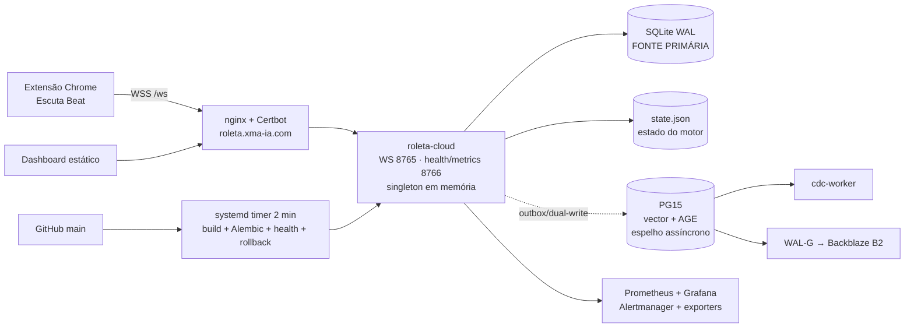
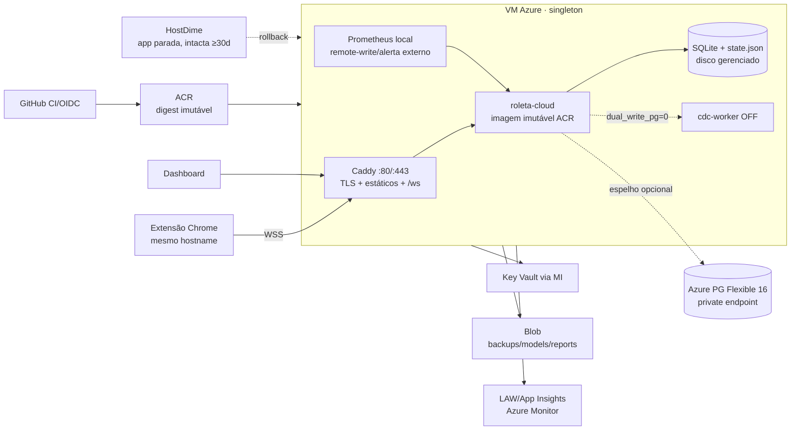

# Plano de Migração HostDime → Azure — 03/08/2026

> **Status:** proposta executável, ainda não iniciada.
> **Origem:** HostDime `187.45.181.75` (produção ativa).
> **Destino:** Azure RG `maquina_roleta_cloud`, Brazil South.
> **Princípio:** reconstruir a infraestrutura declarativamente, copiar o runtime
> exato e migrar os dados sob congelamento. **Não clonar o disco da VPS.**
>
> Este documento substitui o estado e o veredito Azure descritos em
> `balanco_evolucao_agosto_26.md`: em 03/08/2026 foi confirmado que a
> infraestrutura Azure já existe, embora a aplicação ainda não tenha sido
> implantada.

---

## 0. Decisão executiva

A forma mais segura de migrar não é copiar a máquina inteira como imagem. O
correto é copiar sua **função operacional** em quatro camadas:

1. **Runtime idêntico:** transferir a imagem Docker que está rodando na
   HostDime para a Azure, com digest e checksum registrados.
2. **Configuração declarativa:** reproduzir compose, flags, proxy, timers,
   healthchecks e alertas como código, sem levar o drift do sistema operacional.
3. **Estado consistente:** migrar SQLite, `state.json`, artefatos de modelo e
   dados úteis do PostgreSQL somente após congelar o escritor da HostDime.
4. **Serviços gerenciados:** usar imediatamente ACR, Key Vault, Blob, Log
   Analytics/App Insights e PostgreSQL Flexible já provisionados; adiar a
   decomposição serverless do engine.

### Recomendação

- **Fase 1 — agora:** paridade funcional em **uma VM Azure**, ainda como
  singleton, mantendo SQLite como fonte primária.
- **Fase 2 — após 7 dias estáveis:** endurecimento, backup, observabilidade e
  esteira ACR/OIDC.
- **Fase 3 — projeto separado:** promover PostgreSQL a primário, externalizar o
  estado e só então avaliar Container Apps.

O cutover deve ser **all-or-nothing**. Não pode haver canário de tráfego entre
HostDime e Azure porque as duas instâncias manteriam estados e bancos SQLite
divergentes.

---

## 1. Evidências, ferramentas e limitações

### 1.1 Fontes consultadas

- Grafo local do projeto via Graphify, atualizado e consultado para runtime,
  persistência, deploy, backups e plano Azure.
- Grafo MCP global apenas como visão cross-project; ele não foi tratado como
  fonte do repositório corrente.
- `docker-compose*.yml`, Dockerfile, migrations 0001–0010, código de
  persistência/estado/WS/CDC e scripts de deploy/backup.
- `server_snapshot/*`, runbooks e ADENDOs ISO.
- Produção externa em 03/08: HTTPS 200 e WSS `/ws` conectado.
- Inventário Azure real por `az`, inclusive VM Run Command read-only.
- Revisão independente do desenho por arquiteto estratégico e rubber-duck.

### 1.2 MCP filesystem

O MCP filesystem está autorizado apenas para `C:\Users\Windows\Desktop`. Este
worktree isolado está em `C:\Users\Windows\Mendix\copilot-worktrees\...`.
Conforme least privilege e as regras do workspace, o checkout principal no
Desktop não foi lido. O MCP foi usado para validar o escopo; a árvore deste
worktree foi lida pelas ferramentas nativas.

### 1.3 Bloqueio atual

O arquivo `GUIA_ACESSO_AGENTICO_AZURE` não existe neste worktree, em
`origin/main` nem nas branches remotas. O agente possui acesso Azure
control-plane (Owner) e VM Run Command, mas **ainda não possui acesso comprovado
à HostDime**. Sem chave/usuário SSH e acesso ao DNS, nenhuma cópia de produção
pode começar.

---

## 2. Estado atual

### 2.1 Máquina local — desenvolvimento e controle

| Item | Estado |
|---|---|
| Sistema | Windows, worktree Git isolado |
| Runtime local ativo | `roleta-pg-dev`, PG15 custom com AGE/Timescale, healthy |
| Aplicação local | Não está rodando continuamente |
| Compose base | Um serviço `roleta-cloud` |
| Compose dev | Um serviço PostgreSQL |
| Papel na migração | Testes, geração dos artefatos, Azure CLI, checksums e coordenação |

A máquina local **não é fonte de dados de produção**. Ela deve ser usada apenas
como plano de controle e área de validação.

### 2.2 HostDime — produção efetiva

| Componente | Estado observado |
|---|---|
| Aplicação | Python/WebSockets; singleton com eleição MASTER/SLAVE |
| Persistência primária | `/app/data/decisions.db`, SQLite WAL |
| Estado do motor | `state.json`, salvamento atômico + fallback |
| PG | PG15, ~13 MB no snapshot; espelho incompleto/assíncrono |
| Containers | 8: app, CDC, PG, Prometheus, Grafana, Alertmanager e exporters |
| Frontend/TLS | nginx do host + Certbot; `/ws` → `127.0.0.1:8765` |
| Deploy | pull de `main` a cada 2 min, build local, Alembic, health e rollback |
| Backups | SQLite diário/7 dias; PG WAL-G/B2 com restore drill |
| Artefato fora do Git | `models/spin_autoencoder.joblib` |
| Dados conhecidos | snapshot 22/06: SQLite 11,8 MB e 9.471 decisões; medir novamente |

Os snapshots internos são de junho. Antes de executar, a HostDime precisa de um
novo inventário ao vivo.

### 2.3 Azure — recursos já disponíveis

A assinatura contém 75 recursos; 31 pertencem à Roleta.

| Recurso | Estado em 03/08/2026 | Lacuna |
|---|---|---|
| RG `maquina_roleta_cloud` | `Succeeded`, Brazil South | — |
| VM `vm-roleta-app-01` | Running, Debian 12, `Standard_L2as_v4`, 2 vCPU/16 GB | Aplicação ausente |
| Discos ativos | OS 64 GB + data 64 GB | — |
| Docker data | `/mnt/docker` em `/dev/nvme0n2`, ext4, UUID no `fstab` | **Durabilidade confirmada** |
| Disco local NVMe | 447 GB `/dev/nvme1n1`, não montado | Efêmero; não usar |
| Docker/Caddy | Ativos; 80/443 abertos | Caddy só responde placeholder |
| SSH | Chave, senha OFF; NSG porta 22 limitada a um `/32` | Sessão atual não alcança SSH |
| Managed Identity da VM | `AcrPull`, Blob Contributor, KV get/list | Boa base |
| ACR `acrroletaprod` | Basic, `Succeeded` | **0 imagens**, admin habilitado |
| PG `pg-roleta-prod` | PG16 B1ms, 32 GB, private-only, Ready | HA/geo OFF; espelho vazio/não validado |
| Extensões permitidas | AGE, TimescaleDB, vector e outras aparecem em `allowedValues` | `azure.extensions` não autoriza AGE/Timescale hoje; consultar `pg_extension` |
| Key Vault | 16 secrets, soft-delete 30d | Public network ON, purge protection OFF, access policies |
| Blob `stroletaprod` | containers `backups`, `models`, `reports` | Default network Allow; conteúdo não auditado pelo usuário |
| Rede | VNet `10.20.0.0/16`, subnets app/db/PE; PG privado | Correta |
| Observabilidade | LAW 30d + App Insights 90d | App/alerta ainda não conectados |
| DNS público | Continua em `187.45.181.75` | Cutover não feito |
| Resíduos | 6 discos soltos + 10 snapshots completos | Custo; não apagar durante migração |
| Azure Backup | Não encontrado | Criar depois do cutover |

### 2.4 Gap para ficar operacional

1. ACR vazio e VM sem imagem/container da aplicação.
2. `/opt/roleta` contém apenas um script preliminar.
3. Caddy não tem vhost de produção nem TLS válido para o domínio.
4. SQLite, `state.json`, modelo e frontend não existem na VM.
5. PG Azure não recebeu schema/dados comprovados.
6. Timer de deploy Azure está inativo.
7. Backups Blob e alertas Azure não foram testados.
8. Acesso HostDime e DNS não foi entregue ao agente.

---

## 3. Arquitetura alvo

### 3.1 Alvo imediato — paridade segura

### 3.2 Mudanças permitidas no cutover

- nginx/Certbot → Caddy.
- PG container local → PG Flexible privado.
- secrets locais → Key Vault via Managed Identity.
- backup SQLite/modelos → Blob.
- build local → imagem imutável no ACR.
- alertas críticos → destino externo à própria VM.

### 3.3 Mudanças proibidas no mesmo evento

- Alterar estratégia, stake, geometria ou INV-3.
- Ligar `dual_write_pg`.
- Subir NumPy 2/torch/faiss.
- Trocar SQLite por PG primário.
- Habilitar AGE/TimescaleDB sem consumidor comprovado.
- Mover o engine para Container Apps.
- Apagar HostDime, discos ou snapshots.
- Ligar flags hoje OFF.

---

## 4. O que faz sentido como gerenciado/serverless

| Componente | Agora | Futuro | Veredito |
|---|---|---|---|
| Engine WebSocket | VM, 1 réplica | Container Apps após refatorar estado | **Não serverless agora** |
| SQLite + `state.json` | Disco gerenciado da VM | PG primário + estado externo | Bloqueador de escala |
| PostgreSQL | Flexible Server privado | GP/HA se virar primário | **Usar agora como gerenciado** |
| Frontend | Caddy na VM | Static Web Apps/Blob `$web` | Depois de separar `ws.` e versionar extensão |
| CDC worker | VM, desligado | Container Apps Job | Só quando `dual_write_pg` tiver valor |
| Backfills/relatórios/ML | Manual/VM | Container Apps Jobs ou Azure Batch | Bom candidato futuro |
| Vision OCR online | Mesmo processo | Serviço dedicado apenas se houver carga | Manter junto por enquanto |
| Secrets | Key Vault | Key Vault | **Usar agora** |
| Imagens | ACR | ACR + GitHub OIDC | **Usar agora** |
| Backups/artefatos | Blob | Blob com versionamento/imutabilidade | **Usar agora** |
| Logs | Docker | AMA → LAW/App Insights | Adotar após estabilizar |
| Métricas | Prometheus/Grafana atuais | Grafana Cloud ou Azure Managed Prometheus | Migrar alerta externo primeiro |
| SignalR | Não usar | Só se protocolo for redesenhado | Não resolve singleton |
| Azure Functions | Não usar | Jobs curtos sem OCR/WS | Inadequado ao hot path |
| Container Apps eastus2 existente | Não usar | Criar ambiente dedicado se necessário | RG/região dev incompatíveis |

### Pré-requisitos para mover o engine a Container Apps

1. PostgreSQL tornar-se a fonte primária.
2. Remover escrita local SQLite.
3. Externalizar `game_state` e eleição de master com lease distribuído.
4. Garantir idempotência por evento/`trace_id`.
5. Tornar o processo stateless e tolerante a restart.
6. Começar com `minReplicas=1`, `maxReplicas=1`; escalar só depois.

---

## 5. Estratégia de banco de dados

### 5.1 Papel durante a migração

- **SQLite continua autoritativo.**
- PG Azure continua espelho e não participa da decisão crítica.
- `dual_write_pg` permanece OFF.
- PG B1ms é suficiente para um espelho pequeno; não é aprovado como banco
  primário sem benchmark.

### 5.2 PG15 HostDime → PG16 Flexible

AGE e TimescaleDB aparecem nos `allowedValues` do serviço Azure, mas não estão
na configuração atual de `azure.extensions`; a instalação real deve ser
confirmada por `pg_extension` a partir da rede privada. Como também não possuem
uso ativo comprovado no código, não são bloqueadores e **não devem ser ativadas
durante o cutover**.

Método recomendado:

1. Gerar um `pg_dump` completo da HostDime como arquivo forense e enviá-lo ao
   Blob.
2. Parar novas escritas e deixar o CDC drenar.
3. Exigir `shared.outbox pending=0` e `failed=0`.
4. Em banco de ensaio, rodar Alembic até `0010_dir3_phase_columns`.
5. Restaurar **dados** dos schemas `shared`, `cw` e `ccw`; excluir catálogos e
   schemas de grafo AGE vazios.
6. Reconciliar sequences/identities, triggers `outbox_new`, row counts e
   checksums.
7. Repetir no banco Azure definitivo.
8. Se a reconciliação falhar, manter o dump como arquivo e iniciar o espelho
   Azure vazio; nunca comprometer o SQLite por causa do espelho.

Não há partições ou jobs `pg_partman`/`pg_cron` criados pelo repositório hoje,
mas o baseline ao vivo deve confirmar isso antes do restore.

### 5.3 Evolução ideal do PG

- Enquanto espelho: manter B1ms, backup 7d e private endpoint.
- Antes de virar primário: benchmark; considerar General Purpose 2 vCPU,
  HA zonal, geo-backup, Entra ID e PITR testado.
- Geo-backup e HA implicam custo/possível recriação; decisão humana separada.

---

## 6. Metodologia por ondas

Legenda:

- **A:** agente pode executar autonomamente em área não produtiva.
- **A+H:** agente executa após confirmação humana explícita.
- **H:** humano precisa agir (MFA, acesso não delegado ou validação de negócio).
- **G:** gate go/no-go; não avançar automaticamente.

### Onda 0 — acesso e baseline vivo

| Passo | Dono | Critério |
|---|---|---|
| Entregar/commitar `GUIA_ACESSO_AGENTICO_AZURE` ou guia equivalente HostDime/DNS | H | Arquivo disponível sem secrets em texto |
| Validar SSH HostDime e privilégios Docker/systemd/nginx | A+H | Comando read-only completo |
| Capturar `docker inspect`, compose renderizado e env **redigido** | A | Flag-set canônico salvo |
| Capturar digest da imagem, `pip freeze`, OS, timers, cron, volumes e mounts | A | Baseline versionado/assinado |
| Medir SQLite/estado/modelo e hashes | A | Tamanho e SHA-256 |
| Capturar schemas, Alembic, rows, outbox e extensões PG | A | Relatório reconciliável |
| Validar atualização real do bind `state.json` | A | mtime/hash muda após save |
| Validar DNS provider, TTL real e acesso de alteração | A+H | TTL observável |

**G0:** nenhum passo seguinte sem acesso HostDime funcional e cópia seca
completa. A durabilidade de `/mnt/docker` Azure já foi comprovada por UUID.

### Onda 1 — artefatos de migração por PR

Criar em sprint/PR separado:

1. `docker-compose.azure.yml` como overlay, sem alterar flags do compose base:
   - imagem por digest ACR;
   - PG externo;
   - volumes no disco gerenciado;
   - `stop_grace_period: 60s`;
   - health/metrics somente loopback.
2. Caddyfile:
   - `/` serve frontend;
   - `/ws` faz proxy WebSocket com timeouts longos;
   - `/healthz` expõe apenas readiness mínima;
   - `/metrics`, `/api/*` e porta 8766 não ficam públicos.
3. Script Managed Identity → Key Vault → `.env` (`0600`), sem logar valores.
4. Backup SQLite via `.backup` → Blob e cópia do modelo com checksums.
5. Deploy Azure que **puxa digest ACR**; não reconstrói dependências na VM.
6. Scripts de baseline, paridade, cutover, fencing e rollback.
7. Teste específico do `state.json` em bind mount e shutdown de 60s.

**G1:** suíte completa verde, lint verde, nenhuma alteração de estratégia e
diff de flags vazio.

### Onda 2 — preparação Azure sem produção

| Ação | Dono |
|---|---|
| Criar layout `/opt/roleta`, volumes e permissões | A+H |
| Validar leitura do Key Vault por MI | A |
| Reconciliar nomes dos 16 secrets com o env HostDime, sem ler/exibir valores | A |
| Validar escrita/leitura de teste no Blob por MI | A |
| Configurar Caddy para hostname temporário `azure-canary.*` | A+H (DNS) |
| Corrigir alerta externo/Action Group que falhou no provisionamento | A+H |
| Instalar unit/timer Azure, **mantê-los desabilitados** | A |
| Configurar PG DSN privado com `sslmode=require` | A |
| Criar backup de VM/data disk | A+H (custo) |

Não é necessário abrir SSH ao agente: Azure CLI + Run Command já funcionam.
Qualquer alteração de NSG exige aprovação.

### Onda 3 — imagem e banco

1. Congelar/taguear a imagem que roda na HostDime.
2. `docker save` + compressão + SHA-256.
3. Transferir por Blob/SAS temporário ou canal SSH aprovado.
4. `docker load` na VM e publicar no ACR.
5. Conceder `AcrPush` temporário à identidade que publica; revogar depois.
6. Registrar digest `hostdime-cutover-<git-sha>-<timestamp>`.
7. Comparar `pip freeze` da imagem transferida com build atual de `main`.
8. Preparar PG Azure conforme §5.

Se as dependências divergirem, o corte usa a imagem transferida. A correção de
pin/lockfile acontece depois por PR; nunca se muda dependência durante o
cutover.

**G2:** imagem idêntica no ACR, pull por MI, PG ensaiado e checksums registrados.

### Onda 4 — ensaio completo

A HostDime continua servindo produção.

1. Gerar snapshot SQLite consistente via `sqlite3 backup API`.
2. Copiar `state.json` apenas para ensaio; marcar como potencialmente defasado.
3. Subir Azure no hostname canário.
4. Executar cliente WS sintético:
   - conexão;
   - eleição master;
   - spin;
   - sugestão;
   - resultado;
   - reconexão;
   - restart.
5. Validar round-trip de todos os campos persistidos, especialmente
   `spin_seq`, `seed_parity`, `block_gale` e estado adaptativo.
6. Comparar flags, env redigido, versão, schema SQLite, `pip freeze` e respostas.
7. Comparar timezone, locale, NTP e relógio; testar carga/latência e OCR.
8. Provar que 8766, `/metrics` e `/api/*` não são públicos.
9. Testar backup Blob e restore em diretório/banco isolado.
10. Rehearsar rollback sem mexer no DNS de produção.

**G3:** paridade completa + restore + rollback ensaiados. O humano assina RPO,
RTO e janela.

### Onda 5 — cutover

Ver §7. O agente pode executar comandos aprovados, mas o go/no-go é humano.

### Onda 6 — estabilização

- T+0–24h: sem deploy funcional, sem flags novas, sem `dual_write_pg`.
- T+24h: habilitar deploy Azure após três ciclos testados.
- T+7d: revisar CPU, RAM, latência, WS, backups e alertas.
- HostDime permanece write-fenced e intacta.

### Onda 7 — encerramento e otimização

Após no mínimo 30 dias e aprovação humana:

- encerrar HostDime;
- desabilitar ACR admin e usar OIDC/MI;
- ativar KV purge protection;
- restringir rede pública de KV/Storage;
- criar/revisar Azure Backup;
- remover 6 discos soltos e 10 snapshots após inventário;
- redimensionar VM apenas com métricas de 7–30 dias;
- decidir futuro de PG, observabilidade e serverless.

---

## 7. Runbook do cutover

### 7.1 Preparação

| Quando | Ação |
|---|---|
| T−7d | Aprovar janela, RPO/RTO e responsável pelo DNS |
| T−48h | Reduzir TTL para 60s e confirmar em resolvers externos |
| T−24h | Congelar `main`, bloquear merges e avisar manutenção |
| T−2h | Backup/restore final de ensaio; Azure canário 100% verde |

### 7.2 Janela operacional

1. **Mascarar o timer HostDime:**
   `systemctl disable --now roleta-deploy.timer` e
   `systemctl mask roleta-deploy.timer`.
2. Confirmar que nenhum cron/unit alternativo executa `docker compose up`.
3. Desabilitar timer Azure.
4. Pedir ao operador para fechar clientes; esperar
   `roleta_ws_connections == 0`.
5. Parar a aplicação HostDime com timeout de 60s.
6. Confirmar log `state_saved`, JSON válido e mtime/hash atualizado.
7. Deixar CDC drenar; exigir outbox pending/failed = 0; parar CDC.
8. **Write-fence HostDime:** parar nginx e bloquear 80/443, mantendo SSH.
9. Verificar externamente que HTTPS/WSS da HostDime falham.
10. Esperar mais de dois ciclos antigos do timer (≥5 min) e provar que a
    aplicação não ressuscitou nem alterou row count/mtime.
11. Criar backup final SQLite pela API em container efêmero com o volume
    montado; não usar `cp` cru do `.db`.
12. Copiar `state.json`, modelo, frontend e dumps; gerar SHA-256 na origem.
13. Preservar uma cópia `hostdime-pre-cutover` que nunca será sobrescrita.
14. Transferir para Blob/Azure; validar SHA-256 e permissões.
15. Restaurar SQLite/estado/modelo no disco gerenciado.
16. Subir a imagem ACR por digest; validar container, `/healthz` e logs.
17. Testar WSS pelo hostname canário e validar continuidade de `spin_seq`.
18. **G4 humano:** autorizar ou abortar o DNS.
19. Alterar A de `roleta.xma-ia.com` para `20.226.77.194`.
20. Validar HTTPS/WSS em múltiplas redes/resolvers.
21. Operador realiza um teste real controlado; INV-3 e stake conferidos.

### 7.3 TLS

Ordem preferida:

1. **DNS-01 pré-emitido**, se houver API segura do provedor DNS.
2. Certificado atual transferido temporariamente via Key Vault, sem gravar
   chave privada em Git/log, seguido de rotação pelo Caddy.
3. Último recurso: emissão HTTP-01 após o flip, aceitando curta indisponibilidade.

O Caddy não deve tentar repetidamente o domínio de produção antes do cutover,
evitando rate limit ACME.

### 7.4 Objetivos

- **RPO alvo para dados já confirmados:** 0.
- **Risco residual declarado:** até um evento/spin ainda não confirmado no
  momento da quiescência.
- **RTO planejado:** 30–60 minutos, mais caches DNS fora do TTL.
- **Downtime deliberado:** preferível a split-brain.

---

## 8. Rollback

### Antes do DNS

1. Parar Azure.
2. Reabrir ingress HostDime.
3. Reiniciar HostDime com timer ainda mascarado.
4. Nenhum dado novo foi aceito pela Azure; rollback simples.

### Depois de a Azure aceitar escritas

1. Declarar manutenção e desconectar clientes.
2. Parar Azure graciosamente.
3. Criar `azure-pre-rollback` de SQLite + estado + checksums.
4. **Não sobrescrever** a cópia `hostdime-pre-cutover`.
5. Restaurar o estado Azure no volume HostDime em área temporária.
6. Validar JSON, integridade SQLite, schema e hashes.
7. Reverter DNS.
8. Reabrir HostDime e iniciar app com timer ainda mascarado.
9. Validar WSS e primeiro evento.

Isso é **rollback quase-zero**, não garantia matemática de zero: pode haver um
evento em voo e haverá janela de indisponibilidade DNS. O PG não bloqueia o
rollback porque continua espelho e `dual_write_pg=0`.

### Fencing obrigatório

Um lock file local não protege duas máquinas. O fence mínimo é:

- timer HostDime mascarado;
- container parado;
- nginx/443 bloqueado;
- teste de não-ressurreição;
- apenas uma origem aceita escrita.

Um lease distribuído/epoch em Blob ou PG pode ser implementado futuramente,
atrás de flag default-OFF, mas não deve ser introduzido no hot path durante o
lift-and-shift.

---

## 9. Agente × humano

### 9.1 O agente pode fazer

Sem nova confirmação:

- inventário read-only local/Azure;
- criar scripts, overlays, Caddyfile, testes e runbooks em branch/PR;
- validar hashes, schemas, imagens e backups não produtivos;
- usar Azure CLI e VM Run Command read-only.

Com confirmação humana explícita:

- alterar RBAC/NSG/Key Vault/Storage;
- preparar VM e PG;
- publicar ACR;
- executar comandos HostDime após receber acesso;
- parar/iniciar produção;
- executar cutover/rollback;
- alterar DNS se a API/credencial for delegada.

### 9.2 O humano precisa confirmar

1. Entrega do acesso HostDime e DNS.
2. RPO residual (até um evento em voo) e RTO.
3. Janela de manutenção.
4. Freeze de `main`.
5. Mudanças de custo, segurança, RBAC e NSG.
6. G4 go/no-go do DNS.
7. Rollback após produção.
8. Decomissionamento e exclusões.

### 9.3 O humano pode ter que fazer pessoalmente

- login/MFA Azure ou registrador DNS;
- disponibilizar a chave SSH HostDime;
- fechar/reabrir a extensão no momento da janela;
- validar um giro real controlado;
- aprovar qualquer cobrança/contrato.

Se HostDime e DNS forem delegados por credencial não interativa segura, o agente
pode executar quase toda a operação; o humano continua Accountable nos gates.

---

## 10. Definition of Done

### Paridade

- [ ] Imagem ACR por digest = imagem HostDime verificada.
- [ ] Diff de flags = vazio.
- [ ] INV-3 preservado.
- [ ] Todas as flags OFF continuam OFF.
- [ ] Round-trip `save/load/reset_session` preserva campos.
- [ ] SQLite `integrity_check=ok`.
- [ ] `state.json` válido e atual.
- [ ] Modelo carrega ou degrada explicitamente conforme baseline.
- [ ] Mapeamento Key Vault ↔ env HostDime completo, sem valores em logs.

### Dados

- [ ] Backup SQLite e restore testados.
- [ ] PG Alembic em `0010`.
- [ ] Extensões necessárias presentes.
- [ ] Outbox pending=0 e failed=0 no freeze.
- [ ] Rows/sequences/triggers reconciliados.
- [ ] Backups Blob e PITR PG restaurados em ensaio.

### Rede/operação

- [ ] HTTPS 200 no domínio.
- [ ] WSS conecta e mantém heartbeat.
- [ ] Eleição MASTER funciona após reconnect.
- [ ] `/metrics`, `/api/*` e 8766 não públicos.
- [ ] Alerta externo detecta app/VM indisponível.
- [ ] Timer Azure passa 3 ciclos.
- [ ] Timer HostDime permanece mascarado.
- [ ] Rollback foi ensaiado.

### Estabilização

- [ ] 24h sem P1.
- [ ] Primeiro backup **pós-cutover** restaurado com sucesso.
- [ ] 7 dias com backups, métricas e alertas verdes.
- [ ] HostDime intacta por ≥30 dias.
- [ ] Nenhum recurso excluído sem aprovação.

---

## 11. Riscos prioritários

| Risco | Severidade | Controle |
|---|---|---|
| Timer HostDime ressuscita app | Crítica | disable + mask + teste ≥5 min |
| Duas máquinas aceitam escrita | Crítica | process + ingress fence; nunca canário de tráfego |
| `state.json` stale/torn | Crítica | stop 60s, log, mtime/hash/JSON e teste do bind |
| `cp` cru do SQLite WAL | Crítica | SQLite backup API |
| Dependências flutuantes mudam OCR/WS | Alta | imagem runtime exata + digest + `pip freeze` |
| Deploy Azure sem PG DSN entra em loop | Alta | DSN/KV antes de timer |
| TLS não emite no cutover | Alta | DNS-01 ou cert temporário via KV |
| PG espelho inconsistente | Média | drain + dump + reconcile; SQLite permanece SoT |
| Alertmanager morre com a VM | Alta | alerta externo Azure/Grafana Cloud |
| VM/PG subdimensionados | Média | benchmark; não redimensionar no cutover |
| Secrets em logs/repo | Crítica | MI/KV; redaction; valores nunca exibidos |
| Secret ausente/mapeado errado | Alta | paridade de nomes + smoke de cada integração |
| Recursos órfãos geram custo | Média | limpar só após 30d e aprovação |

---

## 12. Ordem recomendada a partir de agora

1. Tornar o guia de acesso HostDime/DNS disponível neste worktree.
2. Executar somente a **Onda 0** e atualizar este plano com fatos ao vivo.
3. Abrir sprints de migração:
   - `MIG-1` baseline/fencing;
   - `MIG-2` overlay+Caddy+KV;
   - `MIG-3` ACR+imagem;
   - `MIG-4` PG/backup;
   - `MIG-5` rehearsal;
   - `MIG-6` cutover;
   - `MIG-7` estabilização/decommission.
4. Só agendar cutover após G3 aprovado.

**Resultado esperado:** a mesma aplicação e o mesmo estado operando no mesmo
hostname, sobre a VM Azure já paga, com runtime reproduzível, dados íntegros,
rollback real e um caminho posterior — separado — para arquitetura serverless.
