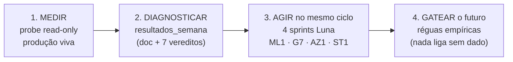

# Proposta 16/08 — do diagnóstico à ação: o que foi feito, por quê, e o que vem

> **Autor:** Diretor de Sprints (sessão 16/08 noite) · **Par deste documento:**
> `resultados_semana_10_08_16_08.md` (o DIAGNÓSTICO). Este arquivo é a **AÇÃO**: registra tudo
> que foi executado no mesmo ciclo, por que cada caminho foi escolhido (e quais foram rejeitados),
> e o que mudou entre a primeira análise (21:40) e a análise refinada (22:30).
> **Janela do ciclo:** 16/08 ~21:00 → ~23:00 BRT · PRs #90, #92, #93, #94, #95*, #96, #98, #99, #100
> (*#95 = outra sessão, citado por impacto). Executores: 4 sessões `gpt-5.6-luna`, todas
> integradas por auto-merge com `ci-ok` e arquivadas.

---

## 1. A pergunta que abriu o ciclo e o plano que a respondeu

O dono pediu: *"a estratégia vale a pena? as estruturas de IA/ML funcionam? o povoamento local e o
espelho Azure estão em tempo real? a print povoa o dealer? a assinatura é validada e usada como
vantagem? dá lucro ou prejuízo? e martingale ×2 (5 normais → 5 dobrados → 5 dobrados) adaptado?"*

O plano executado teve 4 movimentos, em ordem deliberada:

**Princípio de projeto do ciclo:** nenhuma opinião entra em produção — só medição. Toda mudança
nasce atrás de flag default-OFF (invioláveis), e a ATIVAÇÃO de cada flag tem uma régua numérica
publicada (§6). O martingale — o pedido mais "quente" — foi o único deliberadamente **não**
implementado, porque o backtest o reprovou (§4.2).

---

## 2. O que a medição encontrou (resumo do diagnóstico — detalhe no doc par)

| Pergunta | Veredito (evidência no doc par §) |
|---|---|
| Estruturas IA/ML funcionais? | ✅ ponta-a-ponta: SQLite→outbox(backlog 0)→CDC→PG+pgvector; 54.350 linhas DNA, 81,6% com lift realizado (§3) |
| Povoamento Debian em tempo real? | ✅ id 12.004 gravando; 4.176 eventos outbox no dia (§3) |
| Semana 10→16/08? | ⚠️ **só 1 dia de dados** — blackout 502 comeu 06→16/08 (§2) |
| Print povoa dealer? | ✅ 100% (301/301; PG 0 nulos) (§5) |
| Assinatura validada e usada? | ❌ coletada e **desperdiçada** (flags shadow OFF, DNA sem feature dealer) (§5) |
| Lucro? | ✅ no dia: positivo; mas com 2 vazamentos (cobertura-21 e dealers fracos) (§6) |
| Azure em tempo real? | ❌ standby frio (snapshot 10min); gate de imagem inexistente (§8) |
| Martingale 5-5-5? | ≈ flat na prática (só engaja no 6º miss; streak máx do dia = 5) (§7) |

---

## 3. A correção que muda os números: E7 (e a comparação honesta com o doc anterior)

O doc anterior reportou **+168,6u** somando `pnl_units` cru — e ele mesmo registrou a ressalva E7:
a coluna mistura **duas escalas** (linhas com PnL por-unidade e linhas com PnL total). Depois do
doc, o Diretor rodou a análise **normalizada** (payout verdadeiro 1u/número: 17# → +19/−17 ·
21# → +15/−21) e com mais ~30 min de giros acumulados (243 → 276 resolvidas):

| Métrica (dia 16/08) | `resultados_semana` (21:40, pnl cru) | Análise normalizada (22:30, payout real) |
|---|---|---|
| Jogadas resolvidas | 243 | 276 |
| PnL total | +168,6u (escala mista — subestimado) | **+476u** |
| Cobertura-17 | +247,4u (145 giros) | **+560u** (164 giros) |
| Cobertura-21 | −78,9u (98 giros) | **−84u** (112 giros) |
| Contrafactual sempre-17 | não medido | **+564u** (+88u sobre o real) |
| Contrafactual sempre-21 | não medido | +396u |
| r (giros salvos pelos 4 extras) | não medido | **9,4%** (26/276) vs breakeven **11,1pp** |

**As duas leituras concordam na direção** (17 lucra, 21 vaza) — a normalizada quantifica o quanto:
o seletor v5 atual deixou **+88u/dia na mesa** escalando para 21 num regime onde os 4 números
extras só salvam 9,4% dos giros (a spec de 03/08 exige >11,1pp para a escalada pagar: E[Δ]=36r−4).
Essa quantificação é o que transformou "achado" em **sprint com régua** (ST1, §4.4).

---

## 4. O que foi construído, caminho por caminho (e as alternativas rejeitadas)

### 4.1 SPR-ML1 — assinatura do dealer ENTRA no loop de ML (PR #93, MERGED)
- **Feito:** `SDA_ERROR_ENGINE=1` + `SDA_R2_DEALER_SHADOW=1` como default nas duas composes
  (paridade Azure no mesmo PR) + teste do funil (DNA passa a receber `r2_source`/`error_class`).
  Diff cirúrgico; suíte 1255 verde.
- **Por quê este caminho:** o dado do dealer já custava OCR em 100% dos giros e não alimentava
  nada — o desperdício nº 1. Política da casa: flag **shadow liga imediatamente** (zero efeito em
  aposta, INV-3 intacto), e só a janela shadow autoriza o live.
- **Rejeitado:** ligar direto o `SDA_R2_DEALER` (live) — vetado; o bandit dealer×sentido precisa
  provar o funil em paper antes de mover aposta real.

### 4.2 SPR-G7 — martingale: backtest honesto ANTES de código (PR #94, MERGED, decisão NEGATIVA)
- **Feito:** normalização E7 com teste; `tools/backtest_staking_tiers.py` (read-only, `TOTAL n`
  anti-skip); relatório `docs/backtests/2026-08-16-staking-tiers.md`.
- **Resultado:** o esquema do dono (5×1→5×2→5×4) ≈ flat (quase nunca engaja). O melhor candidato
  (1-2-4 cap2) venceu o flat em PnL nos dois períodos, **mas** maxDD = 1,574× o do flat — acima do
  teto pré-declarado de 1,5×. **Veredito: NÃO adotar tiers agora.**
- **Por quê este caminho:** a régua foi escrita ANTES do resultado (SDD) — o executor não podia
  "achar bonito" e implementar. Martingale não cria edge; move variância. Com 1 dia de dados novos,
  a variância é o inimigo.
- **Rejeitado:** implementar `GALE_TIERS` flag-OFF "já que estava lá" — recusado até a régua passar;
  código dormindo sem dado que o valide é passivo, não ativo. **Re-teste automático:** quando
  houver ≥2 semanas de povoamento contínuo pós-self-heal.

### 4.3 SPR-AZ1 — espelho Azure: medir, expor e destravar (PR #92 + issue #91, MERGED)
- **Feito:** sonda `/healthz` do standby no kickoff (best-effort, 3s); relatório de freshness
  (lag snapshot→restore não-medível de fora — registrado com honestidade; SSH da VM expirado);
  issue #91 com o passo-a-passo OIDC para o dono.
- **Efeito imediato:** o dono destravou o gate na sequência (outra sessão, PRs #89+#95): ACR
  `success`, `SDA_PG_FEATURE_CONTEXT=1`, `SDA_DNA_REALIZE=1`, backfill 5.949 linhas.
- **Por quê este caminho:** a pergunta "Azure está povoando em tempo real?" tinha resposta de
  engenharia ("não — e o elo faltante é X"), não de opinião. O sprint entregou o X.
- **Rejeitado:** ligar dual-write/cutover — fora de questão sem freeze formal; HostDime segue
  único escritor.

### 4.4 SPR-ST1 — trava de cobertura 17 + régua contínua (PR #99, MERGED, flag OFF)
- **Feito:** `SDA_V5_COVERAGE_LOCK` (`""`=atual · `"17"` · `"21"`, leitura por-chamada) no seletor
  v5_1721 — 5 linhas no `message_handler`, INV-3 intocado, byte-idêntico com flag vazia (suíte
  passa sem alterar testes existentes); `tools/coverage_gate_report.py` (r, E[Δ]=36r−4, veredito
  `ESCALADA_PAGA/NAO_PAGA`); paridade Azure; adendo com a régua.
- **Por quê este caminho (a alavanca nº 1):** +88u/dia de upside medido, risco de implementação
  ~zero (flag OFF), reversível em minutos, e com validação contínua embutida — os contrafactuais
  `v5_would_hit_17/21` continuam logando com a trava ligada, então a régua pode mandar DESLIGAR
  se o regime mudar (r≥11,1pp sustentado).
- **Rejeitado:** mudar o default do flip-puro direto (sem trava nem régua) — seria opinião no
  hot path; e "default-17 com 21 pós-miss" (+444u no contrafactual, PIOR que sempre-17).

### 4.5 Governança que o ciclo produziu de brinde
- Conflitos add/add (brief na main × brief com Log do executor) — resolvidos com regra explícita
  ("mantenha a versão do executor") e a regra entrou nos briefs seguintes (ST1 já nasceu com ela).
- Board com relógios REAIS (probe, não suposição): `ativado_dealer_shadow=16/08`,
  `ativado_dados_total=16/08`, gate T4 contando de 16/08 (blackout zerou a trilha).
- 4 executores arquivados após closeout aceito; `main-red` = zero no ciclo inteiro.

---

## 5. Balanço do ciclo em números

| Item | Valor |
|---|---|
| PRs mergeados na main (este ciclo/sessão) | 8 (#90 #92 #93 #94 #96 #98 #99 #100) |
| Código de estratégia alterado | 5 linhas (ST1, atrás de flag OFF) |
| Extensão Chrome alterada | 0 linhas |
| Flags LIGADAS em produção | 2, ambas shadow (`SDA_ERROR_ENGINE`, `SDA_R2_DEALER_SHADOW`) |
| Flags criadas DESLIGADAS | 1 (`SDA_V5_COVERAGE_LOCK`) |
| Ferramentas novas de análise | 2 (`backtest_staking_tiers.py`, `coverage_gate_report.py`) |
| Decisões NEGATIVAS documentadas | 1 (tiers/martingale — maxDD 1,574×>1,5×) |
| Upside identificado e gateado | +88u/dia (coverage lock) + células dealer (+352u vs −184u) |

---

## 6. O plano à frente — cada passo com gate numérico (nada liga por opinião)

| # | Ação | Gate para executar | Mecanismo |
|---|---|---|---|
| 1 | **Ativar `SDA_V5_COVERAGE_LOCK=17`** | ≥3 dias de `coverage_gate_report.py` com r<11,1pp sustentado | PR `flag/ativar-coverage-lock-17` (Diretor) |
| 2 | **Dealer-aware LIVE** (`SDA_R2_DEALER=1`) | janela shadow limpa: funil `r2_source` populado + would-hit do bandit ≥ baseline por ≥7d | PR de ativação + adendo |
| 3 | **Stake por dealer** (reduzir stake em células HR<50%) | mesmos dados da janela shadow do ML1; entra como `min()` no stake (INV-3) | sprint novo (BLK-G) |
| 4 | **Re-teste multi-tier** (martingale) | ≥2 semanas de povoamento contínuo pós-self-heal | `backtest_staking_tiers.py` re-rodado; teto maxDD 1,5× mantido |
| 5 | **Reload da extensão 3.11.0** (Chrome, Profile 3) | — (única ação humana pendente) | destrava PR do gate temporal (`SDA_MIN_SPIN_INTERVAL_MS=15000`) |
| 6 | **SPR-REL1** — relatório diário automatizado | brief a escrever | remove o gargalo "Diretor manual" desta análise |

**Ordem importa:** 1 é o maior retorno/risco; 2–3 dependem da mesma janela de dados que já está
correndo; 4 só faz sentido DEPOIS do 1 (o lock muda a distribuição de PnL sobre a qual os tiers
seriam calibrados).

---

## 7. Comparação final: `resultados_semana_10_08_16_08.md` × este documento

| Dimensão | resultados_semana (par) | proposta_16_08 (este) |
|---|---|---|
| Papel | Diagnóstico: o que os dados dizem | Ação: o que foi feito com isso e por quê |
| PnL do dia | +168,6u (pnl cru, escala mista E7) | +476u normalizado; contrafactual sempre-17 +564u |
| Martingale | Simulações preliminares (9 esquemas) | Decisão formal NEGATIVA (G7, régua maxDD) |
| Dealer | "coletado e desperdiçado" | Shadow LIGADO em produção (#93) |
| Cobertura 17/21 | Vazamento identificado (−78,9u) | Trava construída + régua contínua (#99, OFF) |
| Azure | "standby frio, gate ausente" | Sonda no kickoff + issue #91; gate destravado (#89/#95) |
| Estado ao fim | 3 sprints DOING | 4 sprints MERGED/DONE, board consolidado, 0 main-red |

O par de documentos forma o registro completo do ciclo: **medição → diagnóstico → ação gateada**.
Quando o povoamento acumular (agora sem blackouts, graças ao self-heal do D1/D2), os gates do §6
convertem o upside medido em lucro efetivo — ou o negam com dados, que é o mesmo tipo de vitória.
