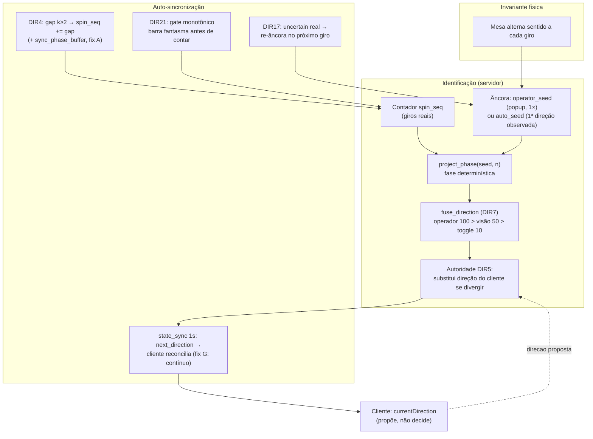

# Proposta — Seletor de Sentido (horário ⇄ anti-horário): diagnóstico e correção definitiva
**Data:** 03/08 · **Status:** REVISADA — 3 pareceres independentes incorporados (servidor, extensão MV3, rollout/risco) · **Veredito unânime:** APROVAR COM MUDANÇAS (todas incorporadas nesta versão) · **Escopo:** extensão Chrome (`extension/background.js`, `popup`) + engine (`server/message_handler.py`, `state/game.py`, `state/phase_metrics.py`, `server/health_server.py`, `app_config/settings.py`, `obs/alerts.yml`)

---

## 1. O sintoma relatado pelo operador

> "Quando sai um resultado do horário a extensão presume que o próximo é anti-horário e o seletor muda.
> Ultimamente tem acontecido algum bug/delay em que o seletor **para de mudar** — e as informações
> começam a chegar do que era horário no anti-horário e vice-versa. A extensão fica às vezes minimizada."

## 2. Evidência quantificada em produção (medida em 03/08, mesa ao vivo)

A alternância cw⇄ccw é uma lei física da mesa (um giro por sentido). Qualquer sequência
`cw,cw` ou `ccw,ccw` no banco é **dado corrompido na fonte**. Auditoria no Postgres:

| Métrica (janela) | Valor | Leitura |
|---|---|---|
| Violações de alternância **hoje** (`LAG` sobre `cw+ccw.spin_features`) | **17 / 420 giros (~4% dos pares)** | bug ativo, recorrente |
| Violações 02/08 | 5 / 81 | idem |
| `phase_uncertain` (logs 7d) | **91×, em rajadas consecutivas** (a cada giro ~44s) | shift falhando em série, não é troca de mesa |
| `DIR17: seed zerado` (logs 7d) | **91×** (1:1 com uncertain) | autoridade re-ancorando **no cliente** a cada giro |
| Divergências corrigidas pela autoridade (7d) | 6× | autoridade funciona quando o seed sobrevive |
| Giro fantasma | nº 20 às 20:40:49 (ccw) **e** 20:40:51 (cw) | mesmo número, 2s de intervalo, direções opostas — fisicamente impossível (ciclo real ~44s) |

> ⚠️ **Sobre o "~4%" (achado da revisão):** a janela `LAG` mede os *pares* que violam — ou seja, as
> **entradas/saídas** do estado de fase invertida. Entre a violação de entrada e a de saída, todos os
> giros alternam certinho **com o rótulo invertido**, e a query não os vê. As 17 violações/dia podem
> representar ~8 janelas de N giros cada: a contaminação real pode ser **10–20% do dia**, não 4%.
> A quantificação por janelas é parte obrigatória desta proposta (§6).

**Conclusão da auditoria:** o sistema DIR1–DIR19 (sentido-fase) já blindou a maior parte do fluxo,
mas **quatro furos específicos** deixam o bug passar — dois no servidor, dois no cliente.

## 2.5 Verificação técnica (05/08): como o sentido é identificado e como o sistema se auto-sincroniza

> Seção adicionada em 05/08 respondendo às duas perguntas fundamentais do operador, com cada
> afirmação verificada no código real (arquivo:linha). É o "manual do mecanismo" que os furos do §3
> exploram e que os fixes do §4 blindam.

### 2.5.1 Como o sentido é identificado — não é leitura, é INFERÊNCIA determinística

**O DOM da Evolution NÃO expõe o sentido.** O extrator lê apenas os números do histórico
(`allNumbers`, 12 últimos) — e o próprio código documenta isso: `state/game.py` l.459–464 marca o
histórico como "contexto NÃO-DIRECIONAL. O histórico do DOM não carrega o sentido real". Não existe
sensor; existe uma **invariante física da mesa**: a roleta gira UM sentido por vez, alternando a cada
giro (horário → anti-horário → horário…).

Disso deriva o modelo de **fase alternada** (DIR3, `state/phase.py` l.1–13):

```
fase(n) = seed_parity            se (n − seed_n) é par
        = oposto(seed_parity)    se (n − seed_n) é ímpar
```

A cadeia de identificação em produção (`SDA_SENTIDO_AUTORITATIVO=1`), na ordem:

| Etapa | Onde vive | O que faz |
|---|---|---|
| **1. Âncora (seed)** | `handle_set_seed`, `message_handler.py` l.1556–1575 | Operador define a fase UMA vez no popup → `seed_parity`+`seed_n`+`source="operator_seed"` (+lock opcional). Persistido (round-trip save/load). |
| **1b. Auto-seed** (fallback) | `message_handler.py` l.782–786 | Sem seed do operador: a **primeira direção observada do cliente** vira âncora (`source="auto_seed"`). |
| **2. Contador** | `spin_seq` (`game.py` l.246), incrementado em l.824 do handler | Conta giros REAIS ao vivo. É o `n` da fórmula. |
| **3. Projeção** | `project_phase`, `phase.py` l.34–44 | Fase determinística de qualquer giro a partir de (seed, n). Função pura, 100% testável. |
| **4. Fusão de fontes** (DIR7) | `fuse_direction`, `phase.py` l.80–122 | Prioridades: `operator_seed`/`manual_fix`=100 > `vision`=50 (conf ≥ 0.7) > `dom_hint`=20 > `deterministic_toggle`=10. O módulo de vídeo ainda NÃO publica sinais — estrutura em stand-by. |
| **5. Autoridade** | `message_handler.py` l.811–818 | Se a projeção divergir do `direcao` enviado pelo cliente → **substitui** e incrementa `direction_divergence_total`. O cliente apenas *propõe*; o servidor *decide*. |

**Papel do cliente na identificação:** `currentDirection` local flipa após cada envio
(`background.js` l.1782) e corrige por paridade quando detecta k giros num tick
(l.1713: `sendDir = k ímpar ? currentDirection : flip`). Mas com autoridade ligada isso é só a
proposta — o valor gravado no SQLite/PG é o projetado pelo servidor.

**Limite honesto do modelo (importante):** se a âncora estiver invertida (operador clicou o sentido
errado no seed), o sistema inteiro fica **espelhado de forma consistente** — a alternância continua
perfeita, nenhuma violação aparece, e nada interno detecta. Os únicos corretores de espelho são
**externos**: (a) o operador re-ancorando com 1 clique (`set_seed` re-ancora sem reset — é
re-ancoragem, não recálculo cego); (b) o futuro módulo de visão (DIR7 pronto para recebê-lo). O gate
DIR21/DIR22 desta proposta detecta **quebra de alternância** (fantasma/duplicata), não espelho.

### 2.5.2 Como se auto-sincroniza — 6 camadas hoje, cada uma com gatilho e alcance próprios

| # | Camada | Onde | Gatilho | O que corrige | Latência |
|---|---|---|---|---|---|
| 1 | **Shift/gap** (DIR4) | servidor, a cada giro | `reconcile_shift` acha k≥2 (`phase.py` l.47–77) | contagem: `spin_seq += gap` → a paridade avança sozinha pelos giros perdidos (handler l.739–747) | imediata |
| 2 | **Re-âncora** (DIR17) | servidor | `phase_uncertain` (shift sem alinhamento) | âncora: zera `seed_parity` → próximo giro alinhado faz auto-seed (l.753–762) | 1 giro |
| 3 | **Autoridade** (DIR5) | servidor, a cada giro | projeção ≠ direção do cliente | a direção do spin individual (l.811–818) | imediata |
| 4 | **Resync por state_sync** (DIR1/DIR6) | cliente | conexão, reset, ou `resync_advised=true` | `currentDirection` ← `sentido.next_direction` do servidor (`background.js` l.576–599) | ≤1s **quando armado** |
| 5 | **Paridade de k local** | cliente, a cada leitura | k par no `countNewSpins` | fase do envio (flip local, l.1713) | imediata |
| 6 | **Re-hidratação do SW** | cliente, boot | service worker acorda | `currentDirection`/`directionSeed` do storage (l.971–976) | no boot |

**Por que mesmo com 6 camadas o seletor quebra** (o elo com o §3):

- A camada 2 re-ancora **na fonte errada**: quando o `uncertain` foi fabricado pelo Furo A (buffer
  `_phase_results` dessincronizado gera uncertain FALSO em série), o DIR17 zera o seed e adota a
  direção do **cliente defasado** como nova verdade. A autoridade passa a projetar a fase invertida
  — com convicção.
- A camada 4 **não é contínua**: só arma em 3 eventos. Se o cliente perder o `resync_advised` (SW
  dormindo no instante do state_sync), fica defasado indefinidamente — exatamente o sintoma
  relatado ("o seletor era para mudar e não muda").
- O giro fantasma (Furos B/C/C2) **incrementa `spin_seq`** — quebra a paridade de TODAS as camadas
  que dependem da contagem (1, 2, 3 e 5 de uma vez).

### 2.5.3 O que a proposta muda em cada camada

| Camada | Hoje | Com a proposta (§4) |
|---|---|---|
| 1 (shift) | recupera gap mas dessincroniza o próprio buffer de comparação (Furo A) | `sync_phase_buffer()` fecha a assimetria → uncertain falso desaparece |
| 2 (re-âncora) | dispara em rajada por uncertain falso; re-ancora no cliente contaminado | volta a disparar **só em troca de mesa real** → âncora estável |
| 3 (autoridade) | projeta certo, mas sobre `spin_seq` corrompível por fantasma | gate DIR21 (relógio monotônico do servidor) barra o fantasma **antes** de incrementar → contador íntegro |
| 4 (resync cliente) | eventual (3 gatilhos) | **contínua**: reconcilia a cada state_sync (1s), condicionada ao capability handshake `sentido.buffer_sync` — auto-desarma em rollback do servidor (fix G) |
| 5 (paridade k) | `countNewSpins` retorna "1 conservador" sem alinhamento → flip errado | retorna `{k, matched}`; sem matched → re-baseline sem flipar às cegas (fix D) |
| 6 (boot SW) | corrida: alarme lê antes da re-hidratação completar | gate de boot: 1º tick espera a re-hidratação (fix F) |

**Hierarquia final de autoridade (quem manda, em ordem):** operador (seed/lock) → vídeo futuro
(conf ≥ 0.7) → projeção determinística do servidor → cliente (apenas propõe). E a
auto-sincronização passa a ter **fechamento de malha em ≤1s** (camada 4 contínua) com fonte de
verdade que não se contamina (camadas 1–3 blindadas).



## 3. Causa-raiz — a cadeia completa (4 furos que se retroalimentam)

### Furo A (servidor, o mais grave): assimetria de buffer na recuperação de gap — DIR4/DIR19
`server/message_handler.py` l.745–746: quando um gap é recuperado, o código sincroniza os números
intermediários em `recent_results`, **mas não em `_phase_results`** — que é exatamente o buffer
que o DIR19 usa como `prev` na comparação do shift (l.737):

```python
if _gap > 0:
    self.game_state.spin_seq += _gap
    for _n in _inter:
        self.game_state.recent_results.appendleft(_n)   # ← _phase_results NÃO recebe!
```

**Verificação exaustiva da revisão (rev-server):** todos os demais sítios de escrita são simétricos —
`process_spin` (`game.py:423/426`), `register_history_number` (`game.py:465/468`), `reset_session`
(`game.py:337/341`), `save`/`load` round-trip (`game.py:1355/1449/1464-1467`). **A recuperação de gap
é a ÚNICA assimetria do repo.** Agravante: o comentário nas l.740–742 está obsoleto — afirma que
sincronizar `recent_results` evita phase_uncertain falso, mas desde a DIR19 o alinhamento lê
`_phase_results`; a sincronização existente não cumpre mais o propósito declarado.

**Efeito dominó, quantitativamente consistente com os logs:** após 1 gap, `_phase_results` fica com
um "buraco". Como o cliente manda `allNumbers` de **12 itens** (`background.js:1756`) e o reconcile
compara `m = min(len(prev), len(new)-k)` posições (`state/phase.py:47-77`), o buraco só sai da janela
comparada após **~10–11 giros ao vivo** → exatamente as rajadas de `phase_uncertain` consecutivas dos
logs (91×). Com `SDA_UNCERTAIN_REANCORA=1` e `SDA_SENTIDO_AUTORITATIVO=1` (defaults de produção,
compose l.109/140), cada uncertain zera o seed (`message_handler.py:759-762`) e o giro seguinte
auto-seeda **na direção que o cliente mandou** (l.782-786). Ou seja: **a autoridade do servidor é
neutralizada exatamente na janela em que o cliente pode estar defasado.** Se o cliente estiver com a
fase trocada (furos C/C2), o servidor aceita e ancora a fase errada — que persiste até alguém notar.
São os `cw,cw`/`ccw,ccw` do banco.

### Furo B (servidor): dedup não pega o fantasma com direção invertida
O fantasma das 20:40 passou pelos dois guards existentes (`message_handler.py:154-162`):
- guard 1 (`is_duplicate_spin`): mesmo número no **mesmo segundo** — 2s de intervalo escapa;
- guard 2 (`SDA_DEDUP_PHANTOM`, OFF em prod): exige mesmo número **e mesma direção** — o fantasma
  chegou com a direção **oposta** (o cliente flipou a fase no re-envio), então nem ON pegaria.

Falta um guard de **plausibilidade física**: nenhum giro real acontece a menos de ~15s do anterior
(ciclo ~42–48s). Um `novo_resultado` < N segundos após o último aceito é lixo de leitura, sempre.
**Correção factual da revisão:** o `timestamp` que chega ao dedup é `data.get("timestamp", now_ms())`
(`message_handler.py:409`) e a extensão **sempre** envia `Date.now()` do cliente (`background.js:1755`)
— portanto o gate NÃO pode usar esse campo (relógio do Windows do operador; um ajuste NTP > 15s
burlaria a proteção). O gate usa **relógio monotônico do servidor** (§4.1-B).

### Furo C (cliente): leitura parcial/truncada de frame gera reenvio com fase flipada
`extension/background.js` l.1492–1500: entre os frames retornados por `executeScript(allFrames:true)`,
o código pega **o primeiro** que tiver números (`break`). Com a janela minimizada, o Chrome pausa rAF
e aplica throttling intensivo aos timers da página — o app da Evolution re-renderiza em lotes
atrasados, deixando o DOM em estados intermediários entre leituras.

**Mecanismo confirmado pela revisão (rev-extension), variante de cauda** — é a que explica o fantasma
real do banco:

```
leitura N   : [20,5,9,2,7]  → envia 20, fase flipa
leitura N+1 : [20,5,9,2]    (lista truncada na cauda — re-render parcial)
              hash difere (l.1704) → countNewSpins([20,5,9,2],[20,5,9,2,7]):
              k=1..3 falham, k=4 → overlapLen=0 → break (l.122-123) → retorna 1 "conservador"
              → REENVIA o 20 com a fase JÁ FLIPADA  ← o fantasma das 20:40 (2s, direção oposta)
```

`countNewSpins` retorna `1` conservador quando não há alinhamento (l.130) — mas "não alinhou"
significa "leitura suspeita", não "1 giro novo". Cada flap = 1 giro fantasma + 1 flip espúrio.
O caso `k=0` (lista idêntica/truncada — nenhum giro novo) nem existe no loop atual (começa em k=1).
Há ainda a corrida de boot do SW MV3: o alarme pode disparar `readResults` **antes** do callback de
re-hidratação de `currentDirection` (l.974) completar — o primeiro envio pós-acordar pode sair com a
fase literal `'horario'`.

### Furo C2 (cliente, descoberto na revisão): reentrância de `readResults`
`onAlarm` chama `readResults()` **sem await** (l.1063) a cada ~2s. Com o frame throttled
(minimizado), `executeScript` pode levar >2s → **duas execuções concorrentes** leem o mesmo
`lastHash`, ambas detectam o "novo" giro, e **enviam o mesmo giro 2× com 2 flips de fase**.
Mecanismo alternativo/complementar do fantasma de 2s — o fix D sozinho não o cobre; precisa de
guard de reentrância (§4.2-D0).

### Por que "minimizado" piora tudo
Minimizar **não** afeta alarms nem `executeScript` (fatos MV3 verificados) — afeta o **render da
página** (rAF pausado, timers throttled = DOM parcial, furo C), aumenta a duração do `executeScript`
(reentrância, furo C2), mata as globals do SW (corrida de re-hidratação) e gera gaps de leitura cuja
recuperação dispara o furo A no servidor. Os quatro furos se encadeiam.
Nota MV3: `periodInMinutes: 0.0333` (2s) só é honrado em extensão **unpacked** (o deploy real do
operador); empacotada, o Chrome clampa para 30s — premissa documentada no PR (§4.2-H).

## 4. Proposta de correção (cirúrgica, flag-gated, zero mudança de comportamento com flags OFF)

### 4.1 Servidor — `message_handler.py` + `state/game.py` + `state/phase_metrics.py` + `server/health_server.py` + `app_config/settings.py` + `obs/alerts.yml`

**A) Sincronizar o buffer de fase na recuperação de gap** (fix do furo A) — via método público novo
`GameState.sync_phase_buffer(nums)` (encapsula `_phase_results`, com try/except defensivo e
`getattr`-guard, tolerante a atributo ausente — padrão DIR19, compatível com
`test_fallback_phase_advance_se_phase_results_ausente`):

```python
# state/game.py
def sync_phase_buffer(self, nums: list[int]) -> None:
    """DIR20: espelha números recuperados de gap no buffer de fase (_phase_results).
    Sem isso o próximo reconcile_shift nunca alinha → rajada de phase_uncertain →
    DIR17 re-ancora a autoridade no cliente a cada giro (neutralizada)."""
    try:
        buf = getattr(self, "_phase_results", None)
        if buf is None:
            return
        for _n in nums:
            buf.appendleft(int(_n))
    except Exception:  # noqa: BLE001 — observabilidade nunca quebra fluxo de aposta
        pass
```

```python
# server/message_handler.py (~l.739) — comentário obsoleto das l.740-742 atualizado no mesmo diff
if _gap > 0:
    self.game_state.spin_seq += _gap
    phase_metrics.incr("gap_recuperado_total", _gap)
    for _n in _inter:
        self.game_state.recent_results.appendleft(_n)
    if phase_buffer_sync():          # flag SDA_PHASE_BUFFER_SYNC, leitura per-call
        self.game_state.sync_phase_buffer(_inter)
```

Ordem verificada: `phase_advance` devolve `_inter` do mais antigo→mais recente (`phase.py:148`);
`appendleft` em loop nessa ordem + o atual em `[0]` via `process_spin` produz o buffer idêntico ao
`allNumbers` do cliente → próximo shift alinha com k=1 (asserção central do teste novo).
Flag: `SDA_PHASE_BUFFER_SYNC` (default **OFF** na compose, liga via `.env` do host). OFF = byte-idêntico.

**B) Gate de plausibilidade física — DIR21** (fix do furo B) em `is_duplicate_spin`, com **relógio
monotônico do servidor** (nunca o `timestamp` do payload, que é `Date.now()` do cliente):

```python
# DIR21: nenhum giro físico acontece < N ms após o anterior (ciclo ~42-48s).
# Relógio MONOTÔNICO do servidor: imune a NTP/ajuste do relógio do cliente E do host.
_min_iv = min_spin_interval_ms()          # flag SDA_MIN_SPIN_INTERVAL_MS, per-call
_now_mono = time.monotonic()
if (_min_iv > 0 and self._last_accept_srv_mono is not None
        and (_now_mono - self._last_accept_srv_mono) * 1000.0 < _min_iv):
    _delta_ms = int((_now_mono - self._last_accept_srv_mono) * 1000)
    logger.warning(f"[FASE] DIR21 spin fisicamente implausivel ignorado: "
                   f"{numero}/{direcao} ({_delta_ms}ms apos o ultimo aceito)")
    phase_metrics.incr("spin_implausivel_total")
    return True
...
self._last_accept_srv_mono = _now_mono    # armar SOMENTE no aceite (nunca na rejeição)
```

- Campo **novo** `_last_accept_srv_mono` — NÃO reaproveita `_last_accept_ts_ms` (que é client-time e
  alimenta o phantom-dedup existente; mudar sua semântica alteraria uma flag já em produção).
- `handle_new_session` zera `_last_accept_srv_mono` junto do clear de trace_ids (DIR14,
  `message_handler.py:1490-1497`) — sem isso o 1º giro legítimo da mesa nova chegando <15s do último
  da mesa anterior seria engolido.
- Custo aceito e documentado: em troca de mesa **sem** reset (rara), 1 giro real pode ser descartado
  (~44s de atraso; o `historico_inicial` subsequente re-ancora). Não viola INV-3 — indicação nunca é
  suprimida; perde-se 1 avaliação de outcome, benigno.
- Escopo confirmado: só `novo_resultado` passa pelo dedup (l.428-438); `historico_inicial`/
  `correcao_historico` usam `register_history_number` e são imunes.
- Flag: `SDA_MIN_SPIN_INTERVAL_MS` (default **0=OFF**; produção sugerida: `15000`).

**C) Métrica de violação de alternância — DIR22** (telemetria permanente, sem flag — precedente
DIR3): capturar `prev_last_direction = self.game_state.last_direction` **antes** de `process_spin`;
após o processamento com a direção final (pós-autoridade — é o que chega ao SQLite/PG):

```python
# DIR22: alternância é lei física; violação = corrupção na fonte. Só telemetria.
# Mede PÓS-autoridade: é a métrica da meta "violações no PG por dia".
if prev_last_direction and direcao == prev_last_direction:
    phase_metrics.incr("alternancia_violada_total")
    logger.warning(f"[FASE] DIR22 alternancia violada: {direcao} 2x seguidas (seq={self.game_state.spin_seq})")
```

**Plumbing obrigatório das métricas (sem isso os counters são no-op silencioso):**
- `state/phase_metrics.py`: adicionar `spin_implausivel_total` e `alternancia_violada_total` ao dict
  `_COUNTERS` (l.10-14 — `incr()` ignora chaves desconhecidas!);
- `server/health_server.py` (DIR12): registrar as 2 gauges novas em `_PROM_METRICS`/refresh;
- `tests/test_dir12_metrics_exporter.py`: atualizar o assert do **set exato** de chaves (ficaria
  vermelho sem isso — inviolável "suíte verde antes do PR");
- `obs/alerts.yml` (hoje: **zero** regras de fase): adicionar
  `RoletaAlternanciaViolada: increase(roleta_phase_alternancia_violada_total[1h]) > 2 → warning` e
  `RoletaPhaseUncertainBurst: increase(roleta_phase_uncertain_total[30m]) > 5 → warning` (rajada =
  furo A regrediu; detecção em ~30min em vez de auditoria manual D+7). Counters são em memória e
  zeram a cada restart do container — leitura absoluta engana; só `increase()/rate()` é confiável.

**D) Capability handshake para o fix G do cliente** (1 linha aditiva): quando
`SDA_PHASE_BUFFER_SYNC=1`, o bloco `sentido` do state_sync/overlay passa a incluir
`"buffer_sync": true`. Cliente antigo ignora; o cliente novo só ativa a reconciliação contínua (G)
se o capability estiver presente → **G se auto-desarma em qualquer rollback do servidor** (flag OFF
ou `git revert`), eliminando a dependência meramente procedural da ordem de rollout.

### 4.2 Cliente — `extension/background.js` + popup (v3.8.0 "DIR20-client")

**D0) Guard de reentrância em `readResults`** (fix do furo C2 — barato, ataca o fantasma de 2s):

```js
let _readBusy = false;
async function readResults() {
  if (_readBusy) return;          // tick anterior ainda rodando (frame throttled >2s)
  _readBusy = true;
  try {
    await rehydrated;             // fix F — nunca envia com a fase literal do boot
    ...
  } finally { _readBusy = false; }
}
```

**D) Guard de rollback/leitura parcial** (fix do furo C). `countNewSpins` devolve `{k, matched}`,
com `k=0` incluso (lista idêntica/truncada deslocada = re-render, nenhum giro novo) e proteção
contra falso alinhamento em k alto:

```js
function countNewSpins(newArr, oldArr) {
  if (!Array.isArray(newArr) || newArr.length === 0) return { k: 1, matched: false };
  if (!Array.isArray(oldArr) || oldArr.length === 0) return { k: 1, matched: true }; // 1ª leitura: fluxo intacto
  const maxK = Math.min(newArr.length, 12);
  for (let k = 0; k <= maxK; k++) {
    const overlapLen = Math.min(oldArr.length, newArr.length - k);
    if (overlapLen <= 0) break;
    if (k > 6 && overlapLen < 2) break;   // k alto com 1 número de overlap = 1/37 de falso positivo
    let match = true;
    for (let i = 0; i < overlapLen; i++) {
      if (newArr[k + i] !== oldArr[i]) { match = false; break; }
    }
    if (match) return { k, matched: true };
  }
  return { k: 1, matched: false };        // sem alinhamento = leitura suspeita
}
```

No fluxo (l.~1704), leitura sem alinhamento **não envia, não flipa, não atualiza baseline** — e o
contador de skips é **consecutivo e persistido** (`state.unalignedStreak`, zerado em tick alinhado;
o SW dorme entre ticks, um global não sobreviveria):

```js
const { k: _novos, matched: _aligned } = countNewSpins(newNumbers, _prevResults);
if (!_aligned) {
  state.unalignedStreak = (state.unalignedStreak || 0) + 1;
  state.debug.skippedUnaligned = (state.debug.skippedUnaligned || 0) + 1;
  console.warn(`⚠️ DIR20: leitura sem alinhamento (${state.unalignedStreak}/${DIR20_MAX_SKIPS}) — tick ignorado`);
  if (state.unalignedStreak >= DIR20_MAX_SKIPS) {
    // Re-baseline: aceita a lista como novo estado SEM enviar giro.
    // historico_inicial SÓ com evidência de troca de mesa (table/round mudou em sessionData);
    // gap na mesma mesa = re-baseline SILENCIOSO (o servidor já tem o histórico e recupera gaps).
    ...
    state.unalignedStreak = 0;
  }
  await saveState(state);
  return;
}
state.unalignedStreak = 0;
if (_novos === 0) { await saveState(state); return; }  // re-render idêntico: nada novo
const sendDir = (_novos % 2 === 1) ? currentDirection : phaseFlip(currentDirection);
```

`DIR20_MAX_SKIPS=5` (≈10s no tick de 2s). Kill-switch: constante `DIR20_ENABLED` no topo do
`background.js` — `false` + reload restaura o comportamento v3.7.0 em ~30s, sem git (§5, rollback).

**E) Seleção de frame: sticky-first** (prioridade invertida vs a 1ª versão desta proposta — o
lobby da Evolution pode ter lista MAIS LONGA de outra mesa; "maior lista vence" poderia re-baselinar
na mesa errada em 10s quando combinado com D):

```js
// Prioridade: (1) o MESMO frame da última leitura boa (sticky), se respondeu com números;
//             (2) fallback: a lista mais longa entre os demais.
let best = null, sticky = null;
for (const result of injectionResults) {
  const r = result.result;
  if (!r || !r.numbers || r.numbers.length === 0) continue;
  if (result.frameId === state.lastGoodFrameId) sticky = { ...r, frameId: result.frameId };
  if (!best || r.numbers.length > best.numbers.length) best = { ...r, frameId: result.frameId };
}
const chosen = sticky || best;
if (chosen) { newNumbers = chosen.numbers; totalElementsFound = chosen.elementsFound; state.lastGoodFrameId = chosen.frameId; }
```

`frameId` é estável durante a vida do frame; recriação do iframe = id novo → sticky falha → fallback
pega — degrada com graça.

**F) Eliminar a corrida de boot do SW** — re-hidratação como promise de topo (recriada a cada wake
do SW; `storage.get` resolve `{}` se vazio — sem deadlock), aguardada em **todos** os consumidores:
`readResults` (D0 acima), `socket.onmessage` (l.550 — cobre os handlers de `state_sync`/
`sessao_resetada` que leem `currentDirection`) e `setDirection` (l.1243):

```js
const rehydrated = chrome.storage.local.get(['currentDirection', 'directionSeed']).then((data) => {
  if (data.directionSeed === 'horario' || data.directionSeed === 'anti-horario') directionSeed = data.directionSeed;
  if (data.currentDirection === 'horario' || data.currentDirection === 'anti-horario') currentDirection = data.currentDirection;
});
```

**G) Reconciliação contínua com o servidor — condicionada por capability**: reconciliar
`currentDirection` com `sentido.next_direction` a cada state_sync **somente se**
`sentido.buffer_sync === true` (handshake do §4.1-D) **e** `!sentido.locked` **e** fora da seção
crítica de envio. Seção crítica delimitada explicitamente: flag setada **antes** de computar
`sendDir` e limpa **após** o `storage.set` que persiste o flip — senão um state_sync entre o flip e
a persistência regravaria a direção velha. Com o handshake, `DIR20_TRUST_SERVER` local pode nascer
ON com segurança (auto-desarma em rollback do servidor). Sinergia: quando o DIR21 rejeitar um
fantasma, o state_sync re-cola o cliente na fase autoritativa em ≤1s.

**H) Popup (gate operacional do rollout)**: expor 3 contadores + versão — `skippedUnaligned`,
`rebaselines`, `unalignedStreak` atual e `v3.8.0` (hoje o popup só mostra elements/numbers/error —
sem isso o passo 4 do rollout não tem validação prática). Documentar no PR a premissa **unpacked**
(alarm de 2s; empacotada clampa a 30s → D continua correto, mas re-baseline vira 150s e k>1 vira
norma). Follow-ups aceitos (fora do escopo v3.8.0, registrados): botão de **lock** DIR13 no popup
(pipeline servidor existe fim-a-fim, falta só UI) e aviso visual de flatline do seletor (N giros
sem flip).

### 4.3 O que NÃO muda (garantias)
- **INV-3 intocado**: nada altera indicação/stake — só rotulagem do sentido e dedup de lixo de leitura.
- **Contrato WS intocado**: `novo_resultado{direcao}` idêntico; único campo novo é `sentido.buffer_sync`
  no state_sync (aditivo, cliente antigo ignora).
- **Fluxo de dados intocado**: SQLite → outbox → CDC → PG idêntico; o fix é a montante (fonte).
- **Flags server default-OFF na compose** (`SDA_PHASE_BUFFER_SYNC`, `SDA_MIN_SPIN_INTERVAL_MS=0`),
  padrão `${VAR:-default}` + comentário de rollback, leitura per-call (inviolável do repo).
- **Matriz de coexistência (4 células, verificada):** cliente antigo+servidor novo = seguro (B até
  protege contra os fantasmas do cliente antigo — valor antecipado antes do passo 4); cliente
  novo+servidor antigo = seguro (D/E/F client-side puros; G auto-desarmado pelo handshake ausente).
- **DIR13 lock total respeitado**: com `locked=true`, nem G nem reancoragem tocam a fase do operador.

## 5. Plano de rollout (ordem, critérios falseáveis, stop-conditions)

| # | Passo | Validação (falseável) | Rollback |
|---|---|---|---|
| 1 | PR servidor (A+B+C+D-handshake + plumbing métricas + alertas) com flags OFF → merge → deploy automático | `pytest tests/` verde; caminho de decisão/aposta byte-idêntico com flags OFF (delta permitido: telemetria DIR22 + gauges novas) | `git revert` via PR |
| 2 | Ligar `SDA_PHASE_BUFFER_SYNC=1` no `.env` do host + `docker compose up -d roleta-cloud` | **48h** com exposição mínima de ≥5 `gap_recuperado_total` (provocar: minimizar a janela 10–15min, 2–3×/dia — cenário real). **Passa se:** `increase(phase_uncertain[48h]) ≤ 2` E zero rajadas de `DIR17 seed zerado` ≥3 giros consecutivos E `direction_divergence_total` > 0 nas janelas de gap (autoridade corrigindo = sinal positivo). **Aborta se:** uncertain nas janelas de gap ≥ baseline (~13/dia) | flag `=0` + `up -d` (minutos) |
| 3 | Ligar `SDA_MIN_SPIN_INTERVAL_MS=15000` | +48h: `spin_implausivel_total` conta fantasmas (esperado >0 com janela minimizada); violação de alternância no PG cai; zero descartes com delta >20s no log (falso positivo) | flag `=0` + `up -d` |
| 4 | Extensão v3.8.0 (D0+D+E+F+G+H) no Chrome do operador | contadores novos no popup; roteiro numerado (§7); fantasmas somem | zip/tag `ext-v3.7.0` (artefato no PR) + "Load unpacked" (3 linhas documentadas); ou kill-switch `DIR20_ENABLED=false` + reload (~30s) |
| 5 | Auditoria D+1/D+3/D+7 (query LAG **automatizada** — cron diário no host, resultado em log/Grafana) | metas escalonadas: D+1 ≤4 violações; D+3 ≤2; D+7 **≤1/dia com causa atribuída** (cruzar ts com logs DIR22 + resets/trocas de mesa; violação SEM causa = regressão) | — |

> Meta "0/dia" foi rejeitada na revisão: trocas de mesa reais e correções manuais do operador geram
> violações **legítimas** na query agregada (~N/2 por N trocas). O critério final é "≤1/dia com causa
> atribuída" — ou, melhor ainda, 0 violações **intra-sessão** se a query for particionada por sessão.

Query de auditoria contínua (mesma do diagnóstico; agendar via cron):
```sql
WITH seq AS (
  SELECT ts, dir, LAG(dir) OVER (ORDER BY ts) AS prev_dir
  FROM (SELECT ts, 'cw' AS dir FROM cw.spin_features
        UNION ALL SELECT ts, 'ccw' FROM ccw.spin_features) u
  WHERE ts > now() - interval '1 day')
SELECT count(*) FILTER (WHERE dir = prev_dir) AS violacoes, count(*) AS total FROM seq;
```

## 6. Remediação dos dados já contaminados (reformulada pela revisão)

A 1ª versão propunha uma view de *pares* violadores — **subestima estruturalmente**: o par marca a
entrada/saída do estado invertido; os giros DENTRO da janela alternam certinho com rótulo trocado.
Para features per-direction (cw/ccw.spin_features, spins_vectors, lifts), rótulo invertido é
**cross-contamination sistemática** entre as duas populações que o ML trata como distintas — não é
ruído aleatório.

Plano revisado (aditivo, não-destrutivo, ordem obrigatória):
1. **Quantificar primeiro**: view `shared.vw_spins_janela_suspeita` por **janelas entre violações
   consecutivas** (início, fim, n_giros) e medir ∑ giros suspeitos ÷ total (30d). Só então decidir
   materialidade — "4% imaterial" era premissa não verificada.
2. **Anotação durável**: tabela aditiva `shared.spin_quality(ts, flag, motivo)` (migração Alembic
   aditiva; não toca tabelas quentes; sobrevive ao rollback de deploy que não faz downgrade).
   Notebooks/AEs fazem anti-join — sem depender de disciplina de uso de view.
3. **Decisão humana**: excluir vs re-rotular vs ignorar nos lifts/AEs é do **dono do modelo**, após
   o número real do item 1 — não é default embutido nesta proposta. Histórico permanece imutável.

## 7. Testes (matriz ampliada pela revisão)

Servidor (CI, `pytest`):
- `test_dir20_phase_buffer_sync.py` — gap recuperado sincroniza `_phase_results` **na ordem exata**
  (buffer resultante idêntico ao `allNumbers` do cliente — é essa igualdade que faz o shift alinhar);
  próximo giro alinha sem uncertain; flag OFF = comportamento atual; atributo ausente não explode.
- `test_dir21_min_spin_interval.py` — spin < N ms rejeitado (número/direção diferentes); N=0 desliga;
  relógio de cliente **adulterado/regressivo/saltando não afeta o gate** (monotônico do servidor);
  rejeição **não** atualiza `_last_accept_srv_mono`; `handle_new_session` limpa a âncora (1º giro da
  mesa nova aceito); `historico_inicial` imune.
- `test_dir22_alternancia_metrica.py` — incrementa em `cw,cw`; não incrementa em `cw,ccw`, com
  `prev=None` (histórico não-direcional) nem no 1º giro pós-reset (DIR16 zera `last_direction`).
- `test_dir12_metrics_exporter.py` — **atualizar** o set exato de chaves (+2) e gauges expostas.

Cliente (sem harness JS — roteiro **numerado e determinístico** no PR, resultado esperado por passo):
1. Minimizar janela 2min → `skippedUnaligned > 0` no popup e **zero** envio não-alinhado no log do SW.
2. Troca de mesa real → re-baseline em ≤5 ticks + `historico_inicial` (com evidência de troca) e
   **nenhum** `novo_resultado` espúrio.
3. Matar o SW via `chrome://serviceworker-internals` durante giro → 1º envio pós-boot com a fase do
   storage (nunca a literal `'horario'`).
4. Toggle manual de direção durante state_sync divergente → seção crítica respeitada (sem regravação).
5. Contrato: testes existentes `test_dir5/6/8/13/17/19` continuam verdes (fixtures reutilizadas).

## 8. Revisão por agentes em paralelo (03/08) — o que mudou da v1 para esta versão

3 revisores independentes, todos **APROVAR COM MUDANÇAS** (incorporadas):

**Revisor servidor** (verificou linha a linha; confirmou o furo A como única assimetria do repo e a
consistência quantitativa rajada⇔janela-12):
1. *Erro factual na v1*: "timestamp do servidor" — na real é `Date.now()` do cliente
   (`message_handler.py:409` + `background.js:1755`) → gate reescrito com `time.monotonic()` do
   servidor em campo novo `_last_accept_srv_mono` (§4.1-B).
2. Métricas novas seriam **no-op silencioso** (`_COUNTERS` é dict fechado; `incr` ignora chave
   desconhecida) → plumbing obrigatório em `phase_metrics` + `health_server` + `test_dir12` (§4.1-C).
3. Reset não limpava a âncora do gate → clear no `handle_new_session` (§4.1-B).
4. Escrita direta em `_phase_results` de fora → método público `sync_phase_buffer()` (§4.1-A).
5. Comentário obsoleto l.740-742 → atualizado no mesmo diff.

**Revisor extensão MV3** (confirmou o furo C no código com trace exato; refinou o mecanismo):
1. Fantasma real explicado pela variante de **cauda truncada** (não só cabeça) — k=0 no loop pega.
2. **Furo C2 descoberto**: reentrância de `readResults` (onAlarm sem await + executeScript >2s
   quando throttled) = mesmo giro 2× com 2 flips → guard `_readBusy` (§4.2-D0).
3. Prioridade do fix E invertida: sticky frame **antes** de "maior lista" (lobby Evolution pode ter
   lista maior de OUTRA mesa → re-baseline na mesa errada) (§4.2-E).
4. Contador de skips deve ser **consecutivo e persistido** no state (SW dorme) (§4.2-D).
5. `historico_inicial` no re-baseline só com evidência de troca de mesa; senão silencioso (§4.2-D).
6. `await rehydrated` também em `onmessage` e `setDirection` (§4.2-F).
7. Seção crítica de G delimitada explicitamente; falso alinhamento k>6/overlap=1 bloqueado (1/37).
8. Fatos MV3: alarm 2s só unpacked (packed=30s); minimizar não afeta executeScript, afeta o render
   da página (fonte do DOM parcial); keepAlive 15s suficiente; Memory Saver cai no catch sem fantasma.

**Revisor rollout/risco** (verificou compose, alerts.yml, popup, testes):
1. Critério "byte-idêntico" do passo 1 era falso por construção (DIR22 sem flag) → reformulado com
   delta permitido explícito.
2. Passo 2 sem janela/exposição/abort = falso verde por ausência de tráfego → 48h + ≥5 gaps
   provocados + critérios passa/aborta (§5).
3. `obs/alerts.yml` tinha **zero** regras de fase → 2 alertas novos; detecção de regressão em ~30min
   em vez de D+7; counters zeram no restart → só `increase()/rate()`.
4. G dependia da ORDEM do rollout (frágil; rollback do servidor deixaria o cliente novo reconciliando
   contra autoridade neutralizada a cada 1s) → **capability handshake** `sentido.buffer_sync` (§4.1-D).
5. Extensão sem rollback executável → zip/tag `ext-v3.7.0` + kill-switch `DIR20_ENABLED` (§5).
6. Remediação por pares subestima contaminação (real pode ser 10–20%) → janelas entre violações +
   `shared.spin_quality` + quantificação antes da decisão (§6).
7. Meta "0 violações/dia" instável (trocas de mesa legítimas ≈ N/2) → metas escalonadas com
   atribuição de causa (§5).
8. Popup não expunha os contadores do gate do passo 4 → §4.2-H.
9. Gaps registrados como follow-up: botão de lock DIR13 no popup; aviso de flatline do seletor.

**Decisões humanas pendentes (registrar no ADENDO ISO ao implementar):** valor final de
`SDA_MIN_SPIN_INTERVAL_MS` (15000 sugerido) e aceite do custo de 1 giro em troca de mesa sem reset;
meta final de violações/dia com regra de atribuição; destino dos dados históricos contaminados
(dono do modelo, após quantificação §6.1); inclusão do botão de lock na v3.8.0 ou follow-up.

## 9. Resumo executivo

O seletor não "para de mudar" por um único bug: é um **acoplamento de 4 furos** — leitura
parcial/truncada de frame minimizado (cliente fabrica giro fantasma com fase flipada), reentrância
do loop de leitura (mesmo giro 2× com 2 flips), dedup sem plausibilidade física (servidor aceita o
fantasma), e assimetria de buffer no shift (servidor entra em rajada de `phase_uncertain` e re-ancora
a autoridade **no próprio cliente defasado** — a única assimetria de buffer do repo, verificada
exaustivamente). O fix fecha os quatro, atrás de flags com capability handshake, sem tocar contrato
WS, estratégia (INV-3) nem o fluxo SQLite→PG, com alertas de regressão (~30min), rollback executável
em cada etapa (inclusive da extensão) e metas falseáveis: **≤1 violação/dia com causa atribuída**
(hoje: 17 sem causa) e `phase_uncertain` só em troca de mesa real.
