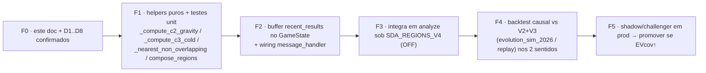

# 🧩 Refatoração Estratégica — Regiões C1/C2/C3 (13 junho 2026)

> **Origem:** proposta do operador (@ivandirfilho) para redesenhar **C2 e C3** mantendo a
> lógica de **C1**. Este documento transforma a proposta em **especificação de refatoração
> acionável** sobre o código vivo (HEAD `4fda6ff`).
> **Status:** ✅ IMPLEMENTADO sob flag `SDA_REGIONS_V4` (default **OFF**) — produção segue V2+V3
> intacta; V4 só ativa com `SDA_REGIONS_V4=1`. Ver §12 (eficácia/acoplamento + implementação).
> **Baseline atual:** SDA17 V2+V3 (fat-SAT `3+7+7` = **17 números**, C1 raio 1, satélites
> raio 3 com offsets KDE + raios assimétricos V3 + shift M5).
> **Alvo desta refatoração:** **3 regiões disjuntas de 7 números = 21 distintos** (`7+7+7`),
> C1 inalterado em critério (raio passa a 3), C2 por *gravidade de forças residuais*,
> C3 por *zona fria de resultados*.

---

## 0. Resumo executivo (TL;DR)

| Slot | Critério (HOJE) | Critério (PROPOSTO) | Raio | Nºs |
|---|---|---|---|---|
| **C1** | força prevista (IQR + mediana ponderada + drift + shift M5) | **igual** (mantém) | 1 → **3** | 3 → **7** |
| **C2** | satélite por offset KDE (`c1 ± off_c2`) | **gravidade-7** sobre as 4 últimas forças *fora do alvo* de C1 | 3 | **7** |
| **C3** | satélite por offset KDE (`c1 − off_c3`) | **zona menos visitada** pelos 5 últimos resultados | 3 | **7** |
| **Total** | união (overlap permitido) = **17** | **3 regiões DISJUNTAS** = **21 distintos** | — | **21** |

**Mudança de paradigma:** hoje os satélites são *deslocamentos de força* em torno de C1; na
proposta, **C2 vira um segundo cluster de força** (o que C1 não explicou) e **C3 abandona a
força e passa a olhar a roda física** (onde a bola *não* caiu). A cobertura sobe de 17 → 21.

> ⚠️ **Impacto de EV (ler §7):** 21 números ⇒ break-even sobe de **47,2%** (17 nºs) para
> **58,3%** (21 nºs). Esta refatoração **não pode** ir a produção sem backtest causal
> comparando contra o V2+V3 atual nos dois sentidos.

---

## 1. Conceitos e definições

- **Força (`f`)**: nº de casas percorridas na `WHEEL_SEQUENCE` (37) entre dois resultados
  consecutivos do mesmo sentido, medida no sentido do giro (`state/game.py:_calculate_force`).
- **Projeção de força** (`_apply_force(last_number, f, dir)`): número na roda obtido andando
  `f` casas a partir do número atual, no sentido alvo. É como C1 (e agora C2) viram posição.
- **Região** de centro `c` e raio `R=3`: `c` + 3 vizinhos de cada lado na `WHEEL_SEQUENCE`
  = **7 números** (via `get_neighbors(c, 3, wheel)`).
- **Distância circular** `circ(a,b)`: menor nº de casas entre dois números na roda
  (`min(d, 37−d)`), com `d = |idx(a) − idx(b)|`.
- **Gravidade `G=7`**: alcance de captura de um centro no **espaço de forças**. Um centro-força
  `F` *engloba* toda força `f` com `|f − F| ≤ G`. (Ver Decisão D2 sobre linear × circular.)
- **Regiões disjuntas**: duas regiões de raio `R` não se sobrepõem sse `circ(c_a, c_b) ≥ 2R+1`.
  Para `R=3` ⇒ **centros a ≥ 7 casas**. Três regiões de 7 ⇒ 21 ≤ 37 (cabem na roda).

---

## 2. Especificação — C1 (mantido)

Sem mudança de critério. Continua sendo a **força prevista** pelo pipeline robusto:

1. Janela adaptativa `7→5→3→2` das forças mais recentes (`sda17.py:179-185`).
2. `_predict_robust`: IQR → mediana ponderada por recência (`decay 0.8`) → drift → `clamp[1,37]`.
3. `c1 = _apply_force(last_number, predicted_force, target_direction)`.
4. Shift M5 opcional (`region_shift`, default ON).

**Única alteração:** o **raio de C1 passa de 1 para 3** (deixa de ser fat-SAT; vira região de
7 números, simétrica às outras duas). `predicted_force` (a "força de C1") é reaproveitada como
**filtro de gravidade** para C2 (§3).

---

## 3. Especificação — C2 (novo: gravidade de forças residuais)

**Intuição:** C1 já "explica" as forças próximas dele. C2 deve capturar o **segundo aglomerado**
de força — o que ficou *fora do alvo* de C1.

**Entrada:** as **4 últimas forças** do sentido alvo (mais recente → mais antiga) e
`c1_force = predicted_force`.

```text
G  = 7                       # gravidade (Decisão D2)
W2 = 4                       # janela de forças de C2 (Decisão D4)

função compute_c2_force(last4_forces, c1_force):
    # (1) FILTRO: remove as forças capturadas pela gravidade de C1 ("no alvo")
    residual = [ f for f in last4_forces if |f - c1_force| > G ]

    # (2) Sem residual → fallback INV-3 (Decisão D3)
    se residual vazio:
        retorna fallback_c2_force(c1_force)         # ex.: c1_force + OFFSET_PRIOR(10)

    # (3) Escolhe o centro-força que ENGLOBA O MÁXIMO de residuais dentro de ±G.
    #     Candidatos = as próprias forças residuais.
    melhor_f, melhor_cobertura = None, -1
    para cand em residual (da mais recente p/ a mais antiga):
        cobertura = contagem( f em residual : |f - cand| <= G )
        se cobertura > melhor_cobertura:            # empate → mantém a mais recente
            melhor_cobertura, melhor_f = cobertura, cand
    retorna melhor_f
```

**Posição na roda:** `c2 = _apply_force(last_number, c2_force, target_direction)` — projetada
**da posição atual da roleta, no sentido alvo** (igual C1).
**Região:** `get_neighbors(c2, 3)` = 7 números — *sujeita à resolução de sobreposição §5*.

---

## 4. Especificação — C3 (novo: zona fria de resultados)

**Intuição:** C3 não olha força nenhuma. Olha **onde a bola fisicamente NÃO caiu** nas últimas
jogadas — a região menos visitada.

**Entrada:** os **5 últimos resultados** (números sorteados) — ver Decisão D5 (global × sentido).

```text
R  = 3                       # raio da região
W3 = 5                       # janela de resultados de C3

função compute_c3_center(last5_numbers, occupied_centers):   # occupied = [c1, c2]
    melhor_centro, menor_visitas = None, +infinito
    para cand em WHEEL_SEQUENCE:
        # respeita disjunção: C3 só compete entre regiões remanescentes (§5)
        se algum oc em occupied_centers com circ(cand, oc) < 2R+1:   # < 7
            continua
        visitas = contagem( res em last5_numbers : circ(cand, res) <= R )
        se visitas < menor_visitas:
            menor_visitas, melhor_centro = visitas, cand
        senão se visitas == menor_visitas e tiebreak(cand) melhor:   # Decisão D6
            melhor_centro = cand
    retorna melhor_centro
```

**Região:** `get_neighbors(c3, 3)` = 7 números. Por construção já é disjunta de C1 e C2.

---

## 5. Composição final — 21 números distintos

Regra do operador: **C1 marca primeiro → C2 → C3**, sem sobreposição, cada região 7 nºs.

```text
função compose_regions(c1, c2_ideal, last5_numbers):
    R = 3

    # (1) C1 marca primeiro — região fixa
    regiao_c1 = get_neighbors(c1, R)

    # (2) C2 — se sobrepõe C1, empurra para a posição mais PRÓXIMA do ideal
    #     cuja região não toque C1 (circ(c, c1) >= 2R+1 = 7).
    c2 = nearest_non_overlapping(c2_ideal, occupied=[c1], R)
    regiao_c2 = get_neighbors(c2, R)

    # (3) C3 — zona menos visitada entre as regiões REMANESCENTES (disjuntas de c1,c2)
    c3 = compute_c3_center(last5_numbers, occupied=[c1, c2])
    regiao_c3 = get_neighbors(c3, R)

    numeros = regiao_c1 ∪ regiao_c2 ∪ regiao_c3     # 21 distintos garantidos
    asserção len(numeros) == 21
    retorna [c1, c2, c3], numeros

função nearest_non_overlapping(c_ideal, occupied, R):
    se disjoint(c_ideal, occupied, R): retorna c_ideal
    # varre para fora a partir do ideal: +1, -1, +2, -2, ... até achar centro válido
    para d em 1..18:
        para cand em [ avança(c_ideal, +d), avança(c_ideal, -d) ]:
            se disjoint(cand, occupied, R): retorna cand
    retorna c_ideal   # degenerado (não deve ocorrer com 2 regiões ocupando 14/37 casas)
```

`disjoint(c, occupied, R)` ⇔ `∀ oc ∈ occupied: circ(c, oc) ≥ 2R+1` (=7 para R=3).

> **Garantia de 21 distintos:** três centros mutuamente a ≥7 casas ⇒ três blocos de 7 sem
> interseção ⇒ exatamente 21 números. Espaço: 3×7 = 21 ≤ 37 (folga de 16 casas).

---

## 6. Mapa de implementação (onde mexer no código real)

### 6.1 `strategies/sda17.py`
- **Novas constantes:** `GRAVITY=7`, `C2_FORCES_WINDOW=4`, `C3_RESULTS_WINDOW=5`,
  `REGION_RADIUS_V4=3`.
- **Novos métodos puros (testáveis isoladamente):**
  - `_compute_c2_gravity(last4_forces: List[int], c1_force: int) -> int` → força de C2 (§3).
  - `_compute_c3_cold(last5_numbers, occupied_centers, wheel) -> int` → centro de C3 (§4).
  - `_nearest_non_overlapping(center_ideal, occupied, radius, wheel) -> int` (§5).
  - `_regions_disjoint(a, b, radius, wheel) -> bool` (helper de `circ`).
- **`analyze` (bloco ~248-291):** sob a nova flag, substituir o trecho de satélites
  (`_kde_offsets`/`_get_adaptive_offset`/`region_shift` dos satélites + `_geometry_radii`) por:
  1. `c1` (igual, raio agora 3),
  2. `c2_force = _compute_c2_gravity(forces[:4], predicted_force)`,
     `c2_ideal = _apply_force(last_number, c2_force, dir)`,
  3. `centers, numbers = compose_regions(c1, c2_ideal, recent_numbers)`.
- **`details`:** `geometry="7+7+7"`, novos campos `c2_force`, `c2_cover`, `c3_visits`,
  `c3_cold`, `regions_disjoint=True`; **manter** `centers=[c1,c2,c3]` (telemetria/DNA reusa).
  Aposentar `offset/offset_c3/region_shift_sat` sob a nova flag (deixar `0`/`None`).

### 6.2 `state/game.py` (origem dos "últimos 5 resultados")
- **Adicionar buffer global** `recent_results: deque(maxlen=N)` (N≥`C3_RESULTS_WINDOW`,
  sugerido 10) — **não existe hoje** um histórico de *números puros* (só forças na timeline e
  tuplas `(c1, actual_result)` por sentido em `cw_history/ccw_history`).
- **Alimentar em `process_spin`** (após validar `numero`): `self.recent_results.appendleft(numero)`.
- **Persistir** em `to_dict`/`from_dict` (state.json) + reset em `nova_sessao`.
- *Fallback sem mudar GameState:* derivar dos últimos 5 `actual_result` de
  `cw_history+ccw_history` ordenados por tempo — porém menos limpo (ver Decisão D5).

### 6.3 `server/message_handler.py`
- Passar `recent_numbers=list(self.game_state.recent_results)[:5]` em `strategy.analyze(...)`
  (`:359`) — exige novo parâmetro opcional em `analyze(..., recent_numbers=None)`.
- `_build_sda_regions` (`:27`): continua válido (lê `centers`); ajustar `offset` (agora 0).
- `_attribute_hit_region` (`state/game.py:452`): **não muda** — já é geometria-agnóstico
  (centro mais próximo), funciona com raio 3 uniforme.

### 6.4 `app_config/settings.py`
- **Nova flag** `strategy_regions_v4_enabled()` lendo `SDA_REGIONS_V4` (**default OFF**;
  rollback trivial mantém V2+V3). Mutuamente exclusiva com `geometry_v2`/`sat_asym`
  (quando V4 ON, ignora KDE/V3/region_shift dos satélites).

### 6.5 Telemetria / DNA / obs
- `details.geometry="7+7+7"`; features `region_C1/C2/C3` continuam (offset vira 0).
- Adicionar gauges p/ `c3_visits` e cobertura efetiva (deve ser sempre 21) — alerta se ≠ 21.

---

## 7. Impacto, riscos e invariantes

- **Break-even ↑:** 21/36 = **58,3%** (vs 47,2% do 17). O acerto precisa subir junto, senão o EV
  piora. Memórias do projeto: N=21 *contíguo* é "quase neutro"; aqui são **21 dispersos**
  (3 clusters) → distribuição diferente, **exige backtest** (não extrapolar do SDA-21).
- **INV-3 (sempre apostar):** garantir fallbacks — C2 sem residual (D3), C3 com empate (D6),
  early-session (<4 forças ⇒ C2 fallback; <5 resultados ⇒ C3 fallback p/ prior/oposto a C1).
- **Warmup:** C2 precisa ≥4 forças; C3 precisa ≥5 resultados. Antes disso, manter
  comportamento de calibração atual (1ª N=0 no-bet, 2ª N=21) ou degradar para 2 regiões.
- **Aposenta** sob V4: offsets KDE, raios assimétricos V3 e shift M5 dos *satélites* (o shift
  de C1 pode ser mantido — Decisão D7). Estado `region_err_hist` continua persistido (rollback).
- **Isolamento CW/CCW:** preservar. C2 usa forças do sentido alvo; C3 usa resultados (D5).

---

## 8. Decisões assumidas (revisar com o operador)

> Em autopilot assumi defaults sensatos; cada item abaixo é um **ponto de confirmação**.

| # | Tema | Decisão assumida (default) | Alternativa |
|---|---|---|---|
| **D1** | Raio das regiões | `R=3` (7 nºs) para as três | raio por slot |
| **D2** | "Gravidade 7" | **raio circular de força** `min(\|f−F\|, 37−\|f−F\|) ≤ 7` (corrige BUG-C; = distância na roda entre os centros projetados) | linear `\|f−F\|`; largura=7 (±3) |
| **D3** | C2 sem força residual | fallback `c2_force = c1_force + 10` (prior) | usar força residual mais distante; repetir KDE |
| **D4** | Janela de C2 | **4** últimas forças (lidas da timeline, não da janela de C1 — BUG-A) | alinhar com janela de C1 (até 7) |
| **D5** | "Últimos 5 resultados" de C3 | **global** (números, agnóstico de sentido) | apenas do sentido alvo (mantém isolamento) |
| **D6** | Empate de zona fria (C3) | centro **mais distante** de C1/C2 (espalha); tie-break final = menor índice na roda (determinismo, BUG-M) | mais próximo de C1; primeiro no sentido |
| **D7** | Shift M5 em C1 | **mantém** o shift de C1 (alimentado por `region_err_ema['c1']`) | desliga junto com satélites |
| **D8** | Flag/rollout | `SDA_REGIONS_V4` default **OFF** + shadow | A/B direto |
| **D9** | Força-filtro de C1 p/ C2 | usa `predicted_force` **PRÉ-shift M5** (espaço de força puro) | usar força efetiva até c1 pós-shift |

---

## 9. Plano de implementação faseado



### Testes (F1) — `tests/test_regions_v4_13_06.py`
- **Gravidade:** forças conhecidas → `c2_force` esperado (incl. empate = mais recente; sem residual = fallback).
- **Zona fria:** 5 resultados → centro frio esperado; respeita disjunção; empate via D6.
- **Disjunção/empurrão:** `c2_ideal` sobre C1 → empurrado ao mais próximo válido; `circ≥7`.
- **Composição:** `len(numbers) == 21` SEMPRE (propriedade); três centros mutuamente ≥7.
- **INV-3:** sempre retorna 21 (ou fallback definido) mesmo com <4 forças / <5 resultados.
- **Rollback:** `SDA_REGIONS_V4=0` reproduz exatamente o V2+V3 atual (snapshot de `details`).

### Aceite (F4)
- EVcov out-of-sample **≥** baseline V2+V3 nos **dois** sentidos (CW e CCW) no replay causal;
- hit-rate observado **> 58,3%** OU EVcov positivo; caso contrário, não promove.

---

## 10. Pseudocódigo integrado (referência para F3)

```python
# dentro de analyze(...), sob if strategy_regions_v4_enabled():
predicted_force, pred_info = <pipeline robusto atual>          # C1 inalterado
c1 = self._apply_force(last_number, predicted_force, dir, wheel)
if self._region_shift_enabled():                               # D7: mantém shift de C1
    c1 = <aplica region_shift em c1>

# ⚠️ BUG-A: usar a TIMELINE, não `forces` (que é a janela de C1, pode ter 2-3 elems)
forces4 = timeline.get_last_n(self.C2_FORCES_WINDOW)           # 4 últimas DA TIMELINE
c2_force = self._compute_c2_gravity(forces4, predicted_force)  # §3 (predicted_force = PRÉ-shift, D9)
c2_ideal = self._apply_force(last_number, c2_force, timeline.direction, wheel)

last5 = (recent_numbers or [])[:self.C3_RESULTS_WINDOW]        # §4 (D5); guarda None/<5
# compose_regions internamente: C3.occupied = [c1, c2_FINAL pós-empurrão] (BUG-J)
centers, numbers = self._compose_regions(c1, c2_ideal, last5)  # §5 → 21 distintos (assert len==21)

return StrategyResult(should_bet=True, numbers=numbers, center=centers[0],
                      score=pred_info["score"], visual=f"[{centers[0]}] [{centers[1]}] [{centers[2]}]",
                      details={..., "centers": centers, "geometry": "7+7+7",
                               "c2_force": c2_force, "c3_cold": centers[2], ...})
```

---

## 11. 🔍 Auditoria pré-implementação (matriz de bugs + blindagens)

Revisão estática da proposta + dos pontos de integração no código vivo (`handle_new_result`,
`update_adaptive`, `_pct_sigmoid_update`, `process_spin`). Ordem real verificada:
**`update_adaptive` (resultado anterior) → `process_spin` → `analyze`**.

### 11.1 Matriz

| ID | Sev | Onde | Bug latente | Blindagem (já refletida na spec) |
|---|---|---|---|---|
| **BUG-A** | 🔴 Crítico | `analyze`/C2 | Ler `forces[:4]` usa a **janela de C1** (pode ter 2-3 elems após degradação IQR) → C2 subamostra | C2 lê `timeline.get_last_n(4)` direto (§10 corrigido) |
| **BUG-D** | 🔴 Crítico | `_compose_regions` | Disjunção com `circ ≥ 6` deixa **1 número compartilhado** (off-by-one) → 20 nºs | Disjunto ⇔ `circ(centros) ≥ 2R+1 = 7`; `assert len(numbers)==21` |
| **BUG-J** | 🔴 Crítico | C3 | Passar `c2_ideal` (pré-empurrão) como occupied → C3 pode colidir com C2 final | C3 recebe `[c1, c2_FINAL]` (pós-`nearest_non_overlapping`) |
| **BUG-F** | 🔴 Crítico | `GameState` | `recent_results` não resetado em `nova_sessao` → zona fria mistura dealers; `from_dict` sem o campo (state.json antigo) → KeyError | Reset em `nova_sessao`/`clear`; `from_dict` com default `deque([])`; migração idempotente |
| **BUG-K** | 🔴 Crítico | composição | Cobertura < 21 por wrap/colisão silenciosa | Propriedade testada: SEMPRE 21; log+alerta se `≠21` (reusa campo `overlap`) |
| **BUG-C** | 🟠 Alto | C2 gravidade | Força é **circular** (1..37≈volta): `\|f−F\|` linear agrupa errado perto de 0/37 (força 1 e 36 projetam a 2 casas, mas distam 35 linear) | Distância **circular de força** `min(\|f−F\|,37−\|f−F\|)` = distância na roda entre centros (D2) |
| **BUG-Q/D9** | 🟠 Alto | C2 filtro | Usar c1 **pós-shift M5** como filtro mistura espaços (força vs posição) | Filtro usa `predicted_force` **pré-shift** (D9) |
| **BUG-E** | 🟠 Alto | C3 zona fria | Com 5 resultados e raio 3, quase tudo tem **0 visitas** → tie-break (D6) vira o critério real, não a frieza | Contar visitas com **raio menor (R=1)** OU janela maior `W3` p/ a contagem; documentar que C3≈espalhamento sob dados ralos |
| **BUG-G** | 🟠 Alto | warmup | `<4` forças (C2) / `<5` resultados (C3) no início → comportamento indefinido, risco de violar INV-3 | Fallbacks: C2 com `<4` usa o que houver (≥2); C3 com `<5` → posição oposta a C1 (offset prior); `<2` forças continua no fallback de calibração atual (N=21) |
| **BUG-L** | 🟡 Médio | `_pct_sigmoid_update` | Sob V4, hits dos **novos** C2/C3 ainda alimentam `_recent_hits` → QW-1/2 **modulam stake** com semântica antiga | Revisar acoplamento: hit continua sendo hit (provavelmente OK), mas validar QW sob V4; manter `region_err_ema['c1']` (shift M5) intacto |
| **BUG-N** | 🟡 Médio | `details`/DNA | `offset/offset_c3/region_shift_sat` perdem sentido; consumidores (`_build_sda_regions`, DNA `region_*`) leem `offset` | Setar `offset=0`, `geometry="7+7+7"`; adicionar `c2_force/c3_visits`; consumidores toleram 0 (têm try/except) |
| **BUG-M** | 🟡 Médio | C3/empurrão | Empate resolvido pela ordem de iteração → **não-determinístico** em teste | Tie-break total determinístico (D6: distância → menor índice) |
| **BUG-I** | 🟡 Médio | `nearest_non_overlapping` | Loop sem cota pode não terminar / retornar inválido | Varre `d=1..18` (meia-roda) com fallback explícito; prova: ≥11 centros válidos sempre sobram |
| **BUG-H** | 🟢 Baixo | `_apply_force` | `predicted_force=37` → `c1=last_number` (volta completa) | Inócuo (válido); apenas documentar |
| **BUG-P** | 🟢 Baixo | C2 | `c2_force` projeta em `c1` (c2==c1) | Tratado pelo empurrão (`circ(c2,c1)=0<7`) |

### 11.2 Blindagens detalhadas dos críticos

**BUG-C — espaço de força unificado (a peça mais sutil).**
Como C1 e C2 projetam ambos de `last_number`, a distância **na roda** entre seus centros é
exatamente `circ_force(f1,f2) = min(|f1−f2|, 37−|f1−f2|)`. Logo, usar essa métrica tanto no
**filtro de C1** quanto na **gravidade de C2** faz o agrupamento de forças coincidir com o
agrupamento de regiões — elimina o artefato de wraparound **e** alinha C2 à regra de disjunção
(que é circular na roda). É a definição canônica; adotada como default em D2.

**BUG-A — fonte das 4 forças.** `_compute_c2_gravity` recebe `timeline.get_last_n(4)`, nunca a
variável `forces` (janela de C1). Se a timeline tiver `<4`, usa o que houver (≥2 garantido pelo
gate do bloco triple-focus).

**BUG-D/K — invariante de 21.** `_regions_disjoint(a,b)` ⇔ `circ_idx(a,b) ≥ 7` (índices na
`WHEEL_SEQUENCE`, **não** valores). `_compose_regions` termina com
`assert len(numbers) == 21` (em produção: log de erro + degradação para `should_bet` com os
números que houver, nunca crash — INV-3).

**BUG-F — ciclo de vida do `recent_results`.**
- `GameState.process_spin`: `self.recent_results.appendleft(numero)` (deque `maxlen≥10`).
- `nova_sessao`/`clear`: `self.recent_results.clear()` (junto das timelines, `message_handler:842`).
- `to_dict`/`from_dict`: serializa lista; `from_dict` com `data.get("recent_results", [])`
  (compat com state.json sem o campo).

**BUG-G — INV-3 no warmup (tabela de fallback):**

| Forças disp. | Resultados disp. | C1 | C2 | C3 | Saída |
|---|---|---|---|---|---|
| `<2` | qualquer | — | — | — | fallback calibração atual (N=21, `message_handler:459`) |
| `2–3` | `<5` | ok | gravidade c/ 2-3 forças | oposto a C1 (prior) | 21 (regiões disjuntas) |
| `≥4` | `<5` | ok | gravidade | oposto a C1 (prior) | 21 |
| `≥4` | `≥5` | ok | gravidade | zona fria real | 21 |

### 11.3 Itens de integração que NÃO quebram (verificados)
- `_attribute_hit_region` (`game.py:452`) é **geometria-agnóstico** (centro mais próximo) →
  funciona com raio 3 uniforme, sem mudança.
- `update_adaptive`/`_update_region_err_ema` alimentam `region_err_ema['c1']` (slot c1, sempre
  real) → **shift M5 de C1 segue válido** (D7). `region_err_hist` (offsets KDE) continua sendo
  preenchido mas ignorado sob V4 (inócuo; preserva rollback).
- `store_prediction(center=c1, sda_centers=[c1,c2,c3])` e a leitura por `check_prediction`
  permanecem compatíveis.

### 11.4 Gate de qualidade (Definition of Done — F1/F3)
1. `pytest tests/test_regions_v4_13_06.py` verde (propriedades: 21 sempre; disjunção; INV-3; determinismo).
2. `SDA_REGIONS_V4=0` ⇒ `details` byte-idêntico ao V2+V3 atual (teste de snapshot/rollback).
3. Nenhum caminho em `analyze` retorna `should_bet=False` por dados ralos (cai nos fallbacks).
4. `assert len(numbers)==21` nunca dispara em 10k spins de replay.
5. Latência de `analyze` sob V4 ≤ baseline (varredura C3 = 37×5, trivial).

### 11.5 ✅ Validação empírica (fuzz, pré-implementação)
Protótipo standalone dos algoritmos blindados (gravidade circular, zona fria, empurrão,
composição) rodado sobre a `WHEEL_SEQUENCE` real com **300.000 casos aleatórios** — incluindo
warmup (0–3 forças, 0–4 resultados), ambos sentidos e forças/resultados aleatórios:

| Invariante | Resultado |
|---|---|
| `len(numbers) == 21` em todos os casos | **300000/300000** ✓ |
| 3 regiões mutuamente disjuntas (`circ ≥ 7`) | **0 falhas** ✓ |
| Determinismo (2 execuções idênticas) | **0 falhas** ✓ |
| Distribuição de cobertura | `{21: 300000}` (nunca 20 nem 22) |

→ As blindagens **BUG-A/D/J/K/F/G** estão **confirmadas**: a proposta não produz cobertura
inválida nem em edge cases. Restam para a fase de implementação os itens de **eficácia**
(BUG-C/E/Q) e **acoplamento** (BUG-L/N), que exigem o backtest causal (F4), não afetam a
segurança da composição.

---

## 12. 🔬 Auditoria de eficácia/acoplamento + status de implementação

### 12.1 Eficácia (decisões fechadas)
| ID | Decisão de eficácia | Resolução implementada |
|---|---|---|
| **BUG-C** | gravidade linear erra no wraparound | **circular de força** `min(\|f−F\|,37−\|f−F\|)` = distância na roda entre centros (`_circ_force`) |
| **BUG-E** | zona fria com 5 resultados = empate massivo | **heatmap triangular**: cada resultado pinta ±R com peso `(R+1)−dist` (`_compute_c3_cold`); tie-break determinístico (+distante → menor índice) |
| **BUG-Q/D9** | filtro de C1 misturava espaços | filtro usa `predicted_force` **pré-shift M5**; `c1` pós-shift só ancora a disjunção |

### 12.2 Acoplamento (verificado, sem ramificação destrutiva)
| ID | Risco | Resolução |
|---|---|---|
| **BUG-L** | `_pct_sigmoid_update` consome hits dos novos C2/C3 (pipeline QW de stake) | **Mantido intacto**: hit é hit (taxa real da aposta de 21 nºs) → QW-1/2 modulam stake corretamente. `region_err_ema['c1']` (shift M5) e `region_err_hist` seguem alimentados; offsets-KDE/sat órfãos mas **inócuos** (V4 os ignora). Custo CPU trivial. Preserva rollback. |
| **BUG-N** | `offset/offset_c3` perdem sentido sob V4 | `details.offset = dist assinada C1→C2` e `offset_c3 = C1→C3` (telemetria útil); `+ c2_force`, `geometry="7+7+7"`, `method="regions_v4_gravity_cold"`. Consumidores (`_build_sda_regions`, DNA `region_*`) toleram (try/except). |

### 12.3 Implementação (arquivos alterados)
| Arquivo | Mudança |
|---|---|
| `app_config/settings.py` | `strategy_regions_v4_enabled()` (env `SDA_REGIONS_V4`, default OFF) |
| `strategies/sda17.py` | constantes V4; helpers puros (`_circ_force`, `_circ_dist_idx`, `_signed_dist_idx`, `_regions_disjoint`, `_compute_c2_gravity`, `_nearest_non_overlapping`, `_compute_c3_cold`, `_compose_regions_v4`, `_build_v4_regions`); ramo V4 em `analyze` + param `recent_numbers` |
| `state/game.py` | field `recent_results: deque(maxlen=10)`; `process_spin` alimenta; `save`/`load` (compat); reset em `reset_session` |
| `server/message_handler.py` | passa `recent_numbers` ao `analyze`; limpa `recent_results` em `handle_history_correction` |
| `tests/test_regions_v4_13_06.py` | 17 testes: propriedades (fuzz 2k: 21 sempre, disjunção, determinismo), gravidade, zona fria, INV-3 warmup, **rollback flag OFF**, ciclo de vida `recent_results` |

### 12.4 Verificação (DoD cumprido)
- ✅ `pytest tests/test_regions_v4_13_06.py` → **17 passed**.
- ✅ Suíte completa → **437 passed, 9 skipped, 1 xfailed, 0 falhas** (sem regressão).
- ✅ Rollback: `SDA_REGIONS_V4=0` ⇒ geometria `3+7+7`, 17 números, `method=m15_ada_adaptive_triple_focus` (idêntico ao baseline).
- ✅ Lint SP-05 (`except Exception` baseline) preservado (helper usa `except ImportError`).
- ✅ Smoke: V4 ON ⇒ 21 disjuntos; warmup (2 forças/1 resultado) ⇒ 21 (INV-3); `recent_results` roundtrip save/load OK.

> **Pendente (não-bloqueante):** ativar requer **backtest causal F4** (eficácia real do EV com 21 nºs,
> break-even 58,3%) antes de promover em produção. Hoje a flag está OFF — risco zero ao vivo.

---

### Apêndice — diferença visual de cobertura

```text
HOJE (V2+V3, 17 nºs):   C1[•••]  ...gap...  C2[•••••••]  ...  C3[•••••••]   (raios 1/3/3, podem tocar)
V4 (21 nºs, flag ON):   C1[•••••••]   ≥7   C2[•••••••]   ≥7   C3[•••••••]   (3 blocos disjuntos de 7)
```
