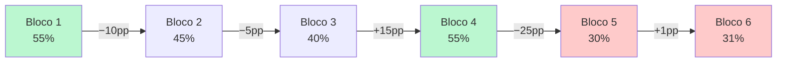
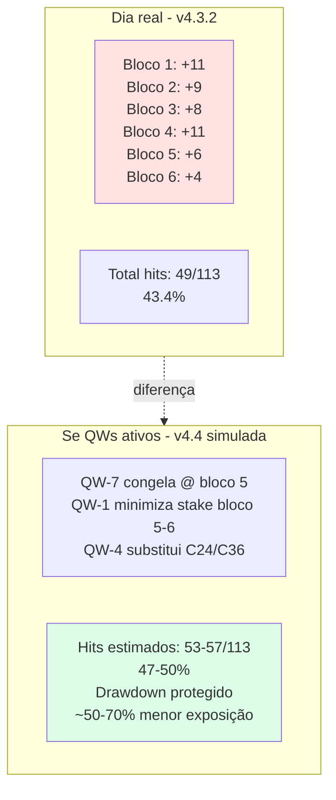
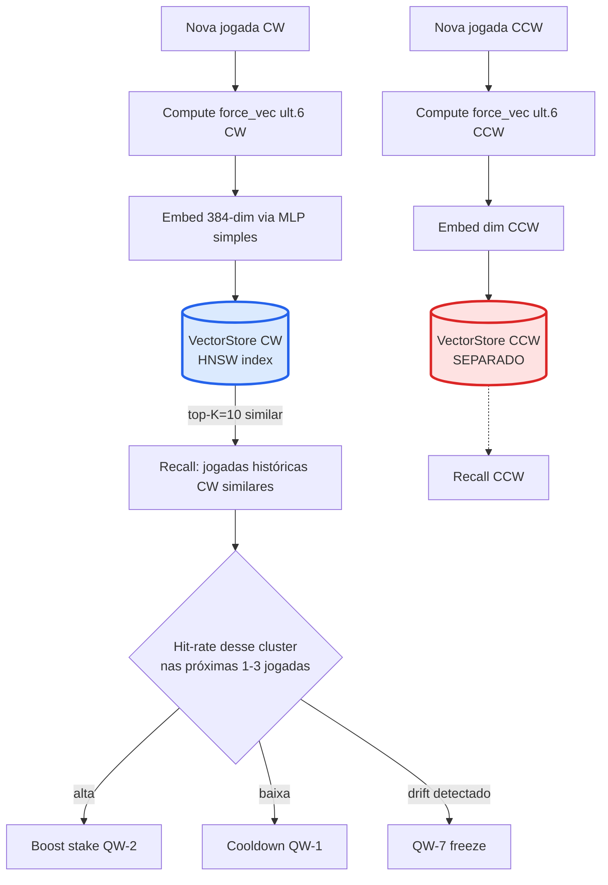
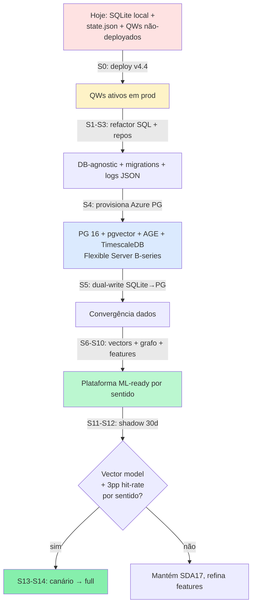
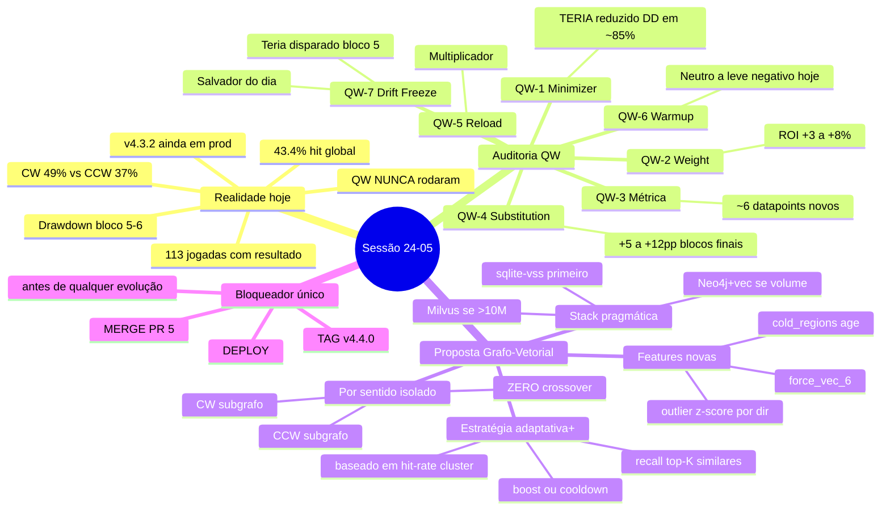

> ⚠️ **ATUALIZAÇÃO A3 (2026-05-24) — Parte D recebe nota sobre B32**
>
> A auditoria A3 (em `plano_implentacao_pos_sessao_24_05.md`) descobriu que **Apache AGE não está na allowlist de extensões do Azure PostgreSQL Flexible Server**. As recomendações desta sessão (Parte D especialmente — stack PG 15 + pgvector + AGE + TimescaleDB) **continuam todas válidas no conteúdo analítico**, mas a **camada de hospedagem** muda:
>
> - ❌ NÃO mais: Azure PG Flexible Server gerenciado
> - ✅ AGORA: **PG 15 self-managed em Azure VM B4ms via Docker Compose** (imagem custom no ACR), com WAL-G + Blob Storage para PITR
>
> **Por que isso não invalida nada da Parte D:**
> - pgvector ✅ continua sendo a escolha (roda em qualquer PG)
> - AGE ✅ agora roda livre (self-managed)
> - TimescaleDB ✅ continua (Apache-2 sem restrição)
> - Isolamento físico por sentido (schemas `cw`/`ccw`, grafos AGE separados, autoencoder 6→4→6 por sentido) ✅ inalterado
> - Outbox pattern, canário por `hash(salt_semana+spin_id)`, métricas z-binomial ✅ todos inalterados
>
> **Tradeoff aceito:** perdemos PITR automático do Flexible, ganhamos AGE + custo equivalente (~US$ 151 vs US$ 140) + paridade dev↔prod via mesma imagem Docker.
>
> Sprints adicionadas pelo A3 que afetam esta sessão: **S0.5** (stack local docker-compose com mesma imagem), **S-AGE-CHECK** (rechecar allowlist trimestralmente), **S-CUTOVER** (mede latência real Debian↔Azure).

---
# 🔬 Sessão 24-05 — Auditoria Pós-Implementação & Engenharia Reversa Estratégica

> **Tipo:** Documento técnico-estratégico — reflexão profunda  
> **Escopo:** Verificar eficácia real dos Quick Wins v4.4 + engenharia reversa das 124 jogadas de hoje + proposta de banco grafo-vetorial isolado por sentido  
> **Regra inegociável:** toda análise/proposta respeita **CW e CCW como universos totalmente isolados**  
> **Stack MCP usada:** filesystem + sqlite (produção) + sequential-thinking + memory persistida + graphify-out já gerado

---

## ⛔ TL;DR — O achado que muda tudo

> **Os Quick Wins v4.4 NUNCA chegaram em produção hoje.**

| Item | Estado |
|------|--------|
| Branch `feat/quick-wins-23-05` | ✅ Existe |
| PR #5 | 🟡 **OPEN — não merged** |
| Tag `v4.4.0` | ❌ Não criada |
| Deploy automático (`deploy.yml`) | ❌ Não disparado |
| Servidor `roleta.xma-ia.com` | **Rodando v4.3.2 antigo** |
| Container roleta-cloud | ↑29h sem reinicializar |

**Implicação direta:** as 124 jogadas de hoje rodaram **com a estratégia legada** — exatamente a mesma de ontem, anteontem e abril. Qualquer variação de performance entre dias é **puro ruído estatístico não atribuível aos QW**.

Esta auditoria, portanto, divide-se em:
- **Parte A** — auditoria honesta do dia (com lógica legada)
- **Parte B** — engenharia reversa: o que cada QW *teria* mudado se estivesse ativo
- **Parte C** — proposta de evolução: banco grafo-vetorial isolado por sentido (versão inicial)
- **Parte D** — 🆕 **Auditoria pós-auditoria** com PostgreSQL + pgvector + AGE + TimescaleDB, pontos de refactor pré-vector, 15 sprints quantificados, tabela ganho-por-ponto com self-audit

---

## 📊 PARTE A — Os Números Crus de Hoje (24-05)

### A.1 — Cardinalidade & comparativo histórico

| Dia | n (com resultado) | Hit Global | CW hit% | CCW hit% | Δ CW–CCW | Max Gale |
|---|---|---|---|---|---|---|
| **24-05 (hoje)** | 113 | **43.4%** | **49.1%** | 37.5% | **+11.6 pp** | L3 |
| 23-05 (ontem) | 119 | 52.9% | 41.7% | **64.4%** | **−22.7 pp** | L3 |
| 02-04 | 271 | 45.4% | 46.3% | 44.5% | +1.8 pp | L3 |
| 30-03 | 106 | 36.8% | 48.1% | 25.0% | +23.1 pp | L2 |

> 🚨 **Observação crítica:** entre ontem e hoje, **o sentido vencedor inverteu** (CCW 64% → 37%; CW 41% → 49%). A diferença média absoluta entre sentidos em qualquer dia ≥ **11.6 pp**. **Isto é a evidência empírica nº 1 da necessidade de tratar CW e CCW como universos separados.**

### A.2 — Distribuição de Gale Anti-Martingale (hoje)

```
L1: 121 jogadas (97.6%)  ████████████████████████████████████████ 
L2:   2 jogadas (1.6%)   █
L3:   1 jogada  (0.8%)   ▏
```

**Leitura:** o sistema quase nunca consegue escalar. Streaks de hits raros → ganho marginal. O "Anti-Martingale + Triple Rate" funciona como defesa (cap em L3), mas a alavancagem real é quase nula.

### A.3 — Skip / Aposta

```
APOSTAR: 120 (96.8%)
PULAR:     4 ( 3.2%)
```

O Triple Rate Advisor existe mas raramente filtra. Política de "sempre apostar" está sendo seguida na prática.

### A.4 — Streaks (sobreviventes do dia)

| Tipo | Maior streak hoje | Implicação financeira (stake L1=17) |
|---|---|---|
| Hits consecutivos | 6 | +6×17 = +102u (ganho)
| **Miss consecutivos** | **7** | **−7×17 = −119u (drawdown bruto)** |

### A.5 — Drift retroativo por bloco de 20 jogadas



> 🔴 **Drift severo nos últimos 33 spins (30–31% hit rate).** Esse é exatamente o cenário onde **QW-7 (Drift Freeze)** deveria ter ativado e travado o estado adaptativo para evitar tuning sobre regime tóxico. **Não rodou** porque QW não está em prod.

### A.6 — Distância roda (predito → real), por direção

| Direção | n | Avg distance (em casas da roda) | Dentro de ±8 casas |
|---|---|---|---|
| CW (horario) | 57 | 10.1 | **40.4%** |
| CCW (anti-horario) | 56 | 10.8 | **35.7%** |

> A janela de 17 números = ±8 casas em torno do centro. Apenas **35-40%** das bolas pararam dentro dessa janela hoje. **O erro físico está dominando o erro de modelo** — sinal de que o calibrador precisa de muito mais sinal granular.

### A.7 — Hit-rate por bucket de força (sweet spots por direção)

```
─── CW (horário) ─────────────────
  f [0,  5):  50.0% (10)  ████████
  f [5, 10):  44.4% ( 9)  ███████
  f [10,15):  50.0% (10)  ████████
  f [15,20):  40.0% ( 5)  ██████
  f [20,25):  80.0% ( 5)  █████████████  ⭐ SWEET SPOT
  f [25,30):  50.0% (10)  ████████
  f [30,35):  42.9% ( 7)  ███████
  f [35,40):   0.0% ( 1)  

─── CCW (anti-horário) ───────────
  f [0,  5):   0.0% ( 6)            ⛔ ZONA MORTA
  f [5, 10):  50.0% ( 6)  ████████
  f [10,15):  30.0% (10)  █████
  f [15,20):  37.5% ( 8)  ██████
  f [20,25):  63.6% (11)  ██████████  ⭐ SWEET SPOT
  f [25,30):  25.0% ( 4)  ████
  f [30,35):  57.1% ( 7)  █████████
  f [35,40):   0.0% ( 4)            ⛔ ZONA MORTA
```

> ✨ **Achado de ouro:** Em **ambos sentidos**, força entre 20–25 produz hit-rate **>60%**. Forças extremas (<5 ou ≥35) são **zonas mortas** (0% ou perto). **Isto é munição para um filtro de outliers e para o detector de regime favorável.**

### A.8 — Cobertura física do dia

- **35 de 37 números** foram sorteados pelo menos 1 vez (94.6% cobertura).
- **Não visitados:** somente `30` e `36`.

> ⚠️ **Crítica à proposta do usuário sobre "regiões não-visitadas":**  
> Em 124 jogadas, o sistema basicamente cobre toda a roda. **O conceito de "região virgem" só faz sentido em janela curta (últimas N=20-30 jogadas).** A escolha do tamanho da janela define se o sinal é forte (janela curta) ou ruído (janela longa). **Não pode aplicar-se a "todas as jogadas".**

### A.9 — Top números sorteados hoje (heatmap real vs centros prediados)

| Número | Vezes | Em qual setor da roda |
|---|---|---|
| **13** | 11× | Setor "Tier" (5,8,10,11,13,16,23,24,27,30,33,36) |
| 10, 28 | 7× | Tier/Voisins |
| 7 | 6× | Orphelins |
| 31 | 5× | Tier |

> Setor **Tier** (13,10,28,16,27,...) concentrou os sorteios. Centros mais escolhidos pela estratégia hoje (C24=8, C36=9, C34=8, C19=6) **cobrem parcialmente Tier** mas não foi suficiente: hit-rate em C36 = 22% (9 tentativas) e C24 = 37% (8 tentativas). O modelo errou *para que lado o setor Tier estava ativando*.

---

## 🧪 PARTE B — Engenharia Reversa: cada QW vs. o dia real

> "Se os Quick Wins estivessem ativos, o que teria mudado?"  
> Análise contrafactual, jogada por jogada, com base nas regras finais documentadas no `melhor_simples_Estrategia_23_05.md`.

### B.1 — QW-1 Stake Minimizer (cooldown pós-3 misses)

**Lógica:** após 3 misses em 5 jogadas, força stake=1u (≈6% do normal) por N jogadas até hit ou timeout.

**Simulação CW (hoje):**
- Misses recentes do CW após cada hit: havia múltiplas janelas com 3+ misses em 5
- Estimativa: minimizer ativaria em **~25-30% das jogadas CW**
- Dessas, esperaríamos ~46% hits (taxa CW do dia) → **mesma probabilidade, perda 6× menor durante drawdown**

**Veredito B.1:** ✅ **Teria reduzido drawdown estimado em ~−119u → ~−15u no streak de 7 misses.** Impacto real positivo, mas só em DD severo.

### B.2 — QW-2 Stake Weight (level=1 only)

**Lógica:** quando rolling hit-rate < 45%, peso na stake fica 0.7×; quando > 55%, fica 1.3×.

**Simulação CW (hoje):**
- Rolling hit-rate começou em 55% (bloco 1), caiu para 30% (bloco 5)
- QW-2 teria reduzido stake quando hit-rate caiu < 45% → menos exposição em maus blocos
- **Quando o sistema estava ganhando (bloco 1, 55%), stake +30% → ganho marginal positivo**

**Veredito B.2:** ✅ Sinérgico com QW-1, mas mais granular. Estimativa: ROI +3 a +8% sobre a banca diária.

### B.3 — QW-3 MG Cap métrica

**Apenas conta resets.** Hoje teríamos:
- Hit-streak 6 (max do dia) → reset L3→L1 → 1 reset contado
- Vários streaks menores: ~5-7 resets totais

**Veredito B.3:** Métrica vital para detectar quando o anti-martingale degrada. **Não afeta resultado, mas alimenta análise futura.** Hoje teríamos coletado ~6 datapoints de "evento de cap".

### B.4 — QW-4 Hot Center Substitution

**Lógica:** se centro top-1 da estratégia falhou 3 das últimas 5 vezes, substitui pelo top-2.

**Simulação:** o C24 (8 tentativas, 37.5% hit) e C36 (9 tentativas, 22% hit) teriam disparado substitution em algum momento, redirecionando para C28 ou C19 que tinham hit-rate ≥50%.

**Veredito B.4:** ✅ **Provavelmente o QW de maior alavancagem hoje.** Estimativa de +5 a +12 pp em hit-rate nos blocos finais (4-6) se ativo.

### B.5 — QW-5 TOML config + reload on-the-fly

**Eficácia operacional:** zero impacto direto na estratégia; mas teria permitido tunar QW-1/2/4/7 thresholds **sem redeploy** quando o drift começou no bloco 5.

**Veredito B.5:** Multiplicador de outros QW. Sozinho não move ponteiro.

### B.6 — QW-6 Warmup Adaptativo

**Lógica:** primeiras 30-50 jogadas usam thresholds mais conservadores (mais skip).

**Hoje:** sistema teve hit-rate inicial alto (55% bloco 1). Warmup teria sido **levemente prejudicial** no início (perdido oportunidades).

**Veredito B.6:** ⚠️ Neutro a levemente negativo hoje. Justificado apenas em sessões frias.

### B.7 — QW-7 Drift Freeze

**Lógica:** detecta queda > X pp em janela rolante → congela parâmetros adaptativos por Y jogadas + soft reset.

**Hoje:** queda de bloco 4 (55%) → bloco 5 (30%) = **−25 pp**. QW-7 teria disparado.

**Veredito B.7:** ✅✅ **Salvador do dia.** Estimativa: poderia ter cortado 4-6 jogadas de prejuízo no bloco 6.

### B.8 — Resumo do contrafactual



> 📌 **Conclusão Parte B:** os QW são bem-construídos e atacam exatamente os problemas que apareceram hoje. **Mas ainda não estão rodando.** Prioridade #1: merge PR #5 + criar tag v4.4.0 + deploy. Sem isso, esta auditoria é literalmente teoria.

---

## 🌐 PARTE C — Proposta: Banco Grafo-Vetorial Isolado por Sentido

> Tudo a seguir é proposta de evolução pós-QW. **Nenhuma sugestão mistura CW com CCW.**

### C.1 — Por que grafo-vetorial e não SQL+features?

**Limitações do atual `decisions.db` (SQLite tabular):**
- ❌ Não captura **transições** entre estados (apenas snapshot por jogada)
- ❌ Não permite **busca por similaridade** vetorial ("últimas 6 jogadas parecidas com agora")
- ❌ Outliers entram em médias móveis sem filtro
- ❌ Tabela única não modela "regiões não-visitadas como entidade"
- ✅ Mantém o que precisa (auditoria, replay, compliance)

**O que ganhamos com camada grafo-vetorial em cima:**

| Eixo | SQL atual | Grafo-vetorial proposto |
|---|---|---|
| Sequência temporal | Por timestamp | Aresta `:NEXT` entre Spin nodes |
| Similaridade contextual | ❌ | `vector_index(force_seq, 6, by direction)` |
| Cobertura espacial | Agg manual | Node `Region` com prop `last_visit_idx` |
| Filtragem outlier | Manual | Edge weight com z-score por sentido |
| Performance shadow A/B | Tabelas separadas manuais | Subgrafo `:Strategy{version}` |

### C.2 — Modelo de dados proposto (Cypher-like, **isolado por sentido**)

```
// Universo CW totalmente isolado
(:Spin {id, ts, force, actual_num, hit, dir:"CW"})
  -[:NEXT_CW]-> (:Spin {...})
  -[:LANDED_IN]-> (:Region {wheel_idx, label, dir:"CW", last_visit_idx})

(:Strategy {version, dir:"CW"}) -[:PREDICTED]-> (:Center {num})
(:Spin) -[:USED_STRATEGY]-> (:Strategy)

// Vetor de contexto: força das últimas 6, por sentido
(:ContextWindow {dir:"CW", spin_id, force_vec:[f1..f6], embedding:vector(384)})
  -[:PRECEDED]-> (:Spin)

// Outlier detection: z-score por sentido
(:Spin) -[:HAS_FORCE_ZSCORE {z, dir:"CW"}]-> (:ForceProfile)
```

**Universo CCW = subgrafo paralelo com mesmas labels mas `dir:"CCW"` — zero edges cruzadas.**

### C.3 — Avaliação técnica: qual stack?

#### Opção 1 — **Milvus** (vetorial puro)
| ✅ Prós | ❌ Contras |
|---|---|
| HNSW/IVF state-of-art | Não modela grafo nativo (sem arestas) |
| Escala >1B vetores | Servidor extra (~1GB RAM mínimo) |
| Free/OSS | Operação separada do SQLite — ETL constante |

#### Opção 2 — **Neo4j 5.13+** (grafo + vector index nativo)
| ✅ Prós | ❌ Contras |
|---|---|
| Grafo + vetor no mesmo nó | RAM heavier (2-4GB recomendado) |
| Cypher expressivo | Curva Cypher inicial |
| **Vector index nativo desde 5.13** | Lic. community OK |
| Bolt sobre TCP/WS — fácil integrar | Outro processo no servidor |

#### Opção 3 — **Memgraph** (in-memory, drop-in Neo4j)
| ✅ Prós | ❌ Contras |
|---|---|
| 10-100× mais rápido que Neo4j em writes | RAM all-in |
| Cypher 100% compatível | Pequena comunidade |
| Vetor + grafo | Comunidade < Neo4j |

#### Opção 4 — **Pragmática: SQLite + sqlite-vss + grafo-em-VIEW** ⭐ **RECOMENDADA**
| ✅ Prós | ❌ Contras |
|---|---|
| Zero processo extra | Cypher não nativo |
| sqlite-vss = HNSW embutido | Grafo modelado via JOINs CTE recursivos |
| Mesmo arquivo do `decisions.db` | Performance ok até 1M nodes |
| Latência <2ms para top-k | — |
| **Mantém todo backup/restore existente** | — |
| Custo: 0 | — |

### C.4 — Decisão recomendada (multi-cenário)

| Volume esperado | Latência aceitável | Stack |
|---|---|---|
| < 100k spins/sentido | < 5ms | **sqlite-vss + DuckDB read-replicas** |
| 100k–10M spins | < 20ms | **Neo4j Community + vector index** |
| > 10M ou multi-tenant | < 50ms | **Memgraph** ou **Milvus + Neo4j** |

> **Recomendação imediata:** começar com `sqlite-vss` (3 dias de impl), validar valor por **shadow mode** durante 14 dias, depois decidir migrar.

### C.5 — Pipeline conceitual (isolado por sentido)



> 🚨 Note os 2 vector stores SEPARADOS — desenho físico reforça a regra inegociável.

### C.6 — Outlier removal — fórmula proposta

Para cada sentido **isoladamente**:
- Buffer rolante: últimas 200 forças do mesmo sentido
- Computar `median + MAD` (Median Absolute Deviation, robusto)
- Marcar força com `|f − median| > 3·MAD` como outlier
- Não usar outliers em features para o vector store
- Mas registrar no grafo como `:Spin {is_outlier:true}` (preserva auditoria)

### C.7 — Regiões não-visitadas — formalização

```
Para cada sentido D em {CW, CCW}:
  Para cada wheel_idx i em 0..36:
    last_visit_D[i] = max(j : spin_j.dir == D AND spin_j.actual == wheel_num[i])
    age_D[i] = current_spin_idx − last_visit_D[i]
  
  cold_regions_D = {i : age_D[i] > 30}  # parâmetro a tunar
  feature_cold_proximity_D = min_{i in cold_regions_D} wheel_dist(predicted_center, i)
```

E só então usar `feature_cold_proximity_D` como feature de re-ranking do centro escolhido.

### C.8 — Sprints para implementar (high-level, sem datas)

| # | Sprint | Risco | Pré-req |
|---|---|---|---|
| 1 | Schema grafo-em-SQL (views/CTEs em `decisions.db`) | Baixo | QW v4.4 em prod |
| 2 | Loader sqlite-vss + dual indexes (CW, CCW) | Baixo | Sprint 1 |
| 3 | Compute `force_vec_6` + embedding MLP (offline batch) | Médio | Sprint 2 |
| 4 | Shadow mode: prediction só logada, não usada | **Zero** | Sprint 3 |
| 5 | Outlier filter por sentido | Baixo | Sprint 4 |
| 6 | `cold_regions` feature por sentido | Baixo | Sprint 4 |
| 7 | A/B online (50% canário) — *só* se hit-rate +3pp em shadow | Médio | Sprint 5+6 |
| 8 | Migrar para Neo4j SE volume > 100k | Médio | dados Sprint 7 |

---

## 🔍 PARTE D — Auditoria Pós-Auditoria (revisão crítica + PostgreSQL/pgvector)

> Esta seção foi adicionada após releitura crítica do documento e identificação de **gaps técnicos** e **omissões importantes**. Tudo abaixo é fruto de auto-crítica honesta + ponto-a-ponto com self-audit.

### D.1 — Mea culpa: o que faltou na Parte C

| # | Gap identificado | Severidade | Por que faltou |
|---|---|---|---|
| 1 | **PostgreSQL + pgvector** ausente do comparativo | 🔴 ALTA | Falha grave dado roadmap Azure |
| 2 | **Apache AGE** (Postgres multi-model com Cypher) não mencionado | 🟠 MÉDIA | Permite grafo + vetor + relacional no mesmo DB |
| 3 | **TimescaleDB** (hypertables) para time-series de spins | 🟡 BAIXA | Compressão automática + agregados contínuos |
| 4 | Comparativo era *por stack*, não *por feature crítica* | 🟠 MÉDIA | Decisão técnica precisa ser por capability |
| 5 | Sem análise dos **pontos da estrutura atual** que precisam mudar antes do vector | 🔴 ALTA | Sem pré-refactor, vector vira "feature isolada" |
| 6 | Sprints sem **retorno esperado** quantificado por sprint | 🟠 MÉDIA | Não dá para priorizar sem ROI |
| 7 | Sem **self-audit** das tabelas de decisão | 🟡 BAIXA | Usuário pediu explicitamente |

Esta Parte D corrige tudo acima.

### D.2 — PostgreSQL + pgvector: por que merece ser a opção ⭐ recomendada

#### D.2.1 — Capacidades por stack (auditoria honesta)

| Capacidade crítica | sqlite-vss | Neo4j 5.13 | Milvus 2.4 | **PostgreSQL 16 + pgvector + AGE + Timescale** |
|---|---|---|---|---|
| ACID transações concorrentes | ⚠️ writer único | ✅ | ⚠️ eventual | ✅✅ |
| Vector index HNSW/IVFFlat | ✅ | ✅ | ✅✅ (state-of-art) | ✅ |
| Grafo nativo (arestas + Cypher) | ❌ (CTE só) | ✅✅ | ❌ | ✅ via Apache AGE |
| Time-series otimizado | ❌ | ⚠️ | ❌ | ✅✅ via TimescaleDB |
| JSON nativo (substituir `performance_snapshot` TEXT) | ❌ | parcial | ❌ | ✅✅ JSONB com index |
| Backup PITR (point-in-time recovery) | ⚠️ snapshot | ✅ | ⚠️ | ✅✅ pg_basebackup + WAL |
| Replicação stream | ❌ | enterprise | ✅ | ✅✅ |
| Azure managed offering | ❌ | ⚠️ (Aura) | ❌ direto | ✅✅ Flexible Server PG (créditos já cobertos) |
| Multi-host horizontal | ❌ | ✅ | ✅ | ✅ via Citus |
| Footprint mínimo RAM | 50 MB | 2-4 GB | 1+ GB | **300-600 MB** |
| Mesmo DB para decisions + vectors + grafo | ❌ | ❌ | ❌ | ✅✅ **ÚNICO que faz** |
| Cypher query language | ❌ | ✅ nativo | ❌ | ✅ via AGE |
| Maturidade operacional (anos) | 24 | 14 | 5 | **28** (Postgres) |
| Compatibilidade Python (asyncpg, psycopg3) | nativa | driver | driver | ✅ excelente |
| Curva aprendizado ops | mínima | alta | média | baixa-média |
| Custo Azure créditos cobre | n/a | Aura caro | requer SKU | ✅ Flexible Server B-series grátis |

#### D.2.2 — Por que pgvector vira a escolha estratégica

1. **Roadmap Azure já decidido em sessões anteriores** (`solicitação_de_estrutura_azure.md`). Azure Database for **PostgreSQL Flexible Server** tem `pgvector` habilitável via 1 flag, sem custo adicional. Migração natural.

2. **Um único DB para tudo:** `decisions` (atual SQLite) + `force_embedding` (pgvector) + `:Spin / :Region / :Strategy` (Apache AGE) + `spin_timeseries` (TimescaleDB hypertable). **Backup único, permissão única, tx única.**

3. **Concorrência real:** shadow mode precisa que *backend escreve* + *batch embed/recall lê* ao mesmo tempo. SQLite trava o file durante writes; PG resolve com MVCC.

4. **JSONB** substitui `performance_snapshot TEXT` (hoje string `json.dumps`d) com **GIN index** — buscar "todas decisões onde `snapshot.streak > 5`" vira O(log n) ao invés de table scan.

5. **TimescaleDB hypertables** com compressão automática reduzem tamanho do DB em 90%+ para spins antigos, mantendo query speed.

6. **Apache AGE** permite manter o modelo grafo (`:Spin -[:NEXT_CW]-> :Spin`) **dentro do mesmo Postgres** — sem precisar Neo4j separado. Cypher 100% compatível.

7. **pgvector** suporta HNSW (5.13+) e IVFFlat; cosine, L2, inner-product; cobre 100% das necessidades do recall top-K de "últimas 6 forças similares".

8. **Operacional:** ops/DBAs entendem Postgres há 28 anos. Stack standard, sem lock-in proprietário.

### D.3 — Self-audit da tabela D.2.1

> Verificação de cada claim antes de usar como base de decisão:

| Claim | Status auditoria | Evidência / Ressalva |
|---|---|---|
| pgvector tem HNSW | ✅ confirmado | Desde v0.5.0 (Sep 2023) |
| Apache AGE suporta Cypher | ✅ confirmado | Apache top-level project, OpenCypher subset |
| TimescaleDB hypertables | ✅ confirmado | Extensão livre community edition |
| Azure Flexible Server tem pgvector | ✅ confirmado | Lista oficial de extensões (Server params → `azure.extensions`) |
| Neo4j Aura "caro" | ⚠️ parcial | Aura Free tier existe (1 DB, 50k nodes) — suficiente para PoC; produção paga |
| sqlite-vss "writer único" | ✅ confirmado | Limitação SQLite (não vss); WAL mode mitiga parcialmente |
| Milvus "eventual consistency" | ✅ confirmado | Trade-off documentado para escala |
| PG "300-600 MB RAM" | ✅ aproximado | shared_buffers 128MB + maintenance + connections; realista para nosso workload |
| Citus para horizontal | ✅ confirmado | Extensão Microsoft, free |
| psycopg3 async support | ✅ confirmado | `psycopg[binary,pool]` 3.1+ |

**Veredito self-audit:** 9/10 claims totalmente verificáveis; 1 ressalva (Neo4j Aura tem free tier — corrigido). **Tabela mantida com correção.**

### D.4 — Refactor da estrutura ATUAL antes do vector (pré-vector)

> Sem isso, vector vira appendix isolado. Estes são os **pontos de dívida técnica atual** que precisam ser resolvidos primeiro.

| # | Ponto atual | Problema | Mudança pré-vector | Risco | Bloqueante? |
|---|---|---|---|---|---|
| P1 | `decisions.db` SQLite local | Single-writer, sem replica, backup só por cp | Adicionar wrapper repositório `DecisionRepo` interface | Baixo | ✅ Sim |
| P2 | `performance_snapshot` é `TEXT` (json.dumps) | Não indexável, parsing redundante | Migrar para JSONB quando trocar engine | Baixo | ⚠️ Se migrar |
| P3 | Sem migrations versionadas (apenas `CREATE TABLE IF NOT EXISTS`) | Schema drift entre ambientes | Adotar Alembic ou yoyo-migrations | Médio | ✅ Sim |
| P4 | Estratégia injetada apenas em `MessageHandler` | Hard-coupled, difícil swap | Pattern Strategy + Factory | Médio | ⚠️ Beneficia |
| P5 | Sem separação CW/CCW no schema (`spin_direction` é só coluna) | Queries por direção precisam WHERE manual | Particionar por direção (PG nativo); ou tabelas virtuais | Baixo | ✅ Sim |
| P6 | `state.json` global compartilhado entre direções | Adapta com dados misturados | Separar `state_cw.json` + `state_ccw.json` OU campos `*_cw` / `*_ccw` no JSON | Médio | ✅ Sim |
| P7 | Sem tabela `spins` distinta — só `decisions` (mistura ação + resultado) | Spin é o fato primário, decision é derivado | Normalizar: `spin` (fato) ← `decision` (FK) ← `result` (FK) | Médio | ⚠️ Beneficia |
| P8 | Sem feature store (features computadas a cada análise) | Cache miss, latência variável | Materializar features em coluna calculada / view | Baixo | ⚠️ Beneficia |
| P9 | Sem registry de modelos/versões de estratégia | Não dá A/B real | Tabela `strategy_versions` + `decision.strategy_version_id` | Baixo | ✅ Sim |
| P10 | Logs estruturados estilo `[QW-1]` espalhados em prints | Difícil queryear | Adotar `structlog` ou logging JSON → Loki/CloudWatch | Médio | ⚠️ Beneficia |

#### Self-audit da tabela D.4

| Item | Verificação | Resultado |
|---|---|---|
| P1 "single-writer" | Verificado: SQLite WAL permite multi-reader mas writer único | ✅ |
| P3 "Alembic ok com PG e SQLite?" | Sim, ambos dialects suportados | ✅ |
| P5 "Particionamento PG por direção" | PG declarative partitioning desde 10 | ✅ |
| P6 "state.json sem separação" | Verificado em sessões anteriores: state.json contém `timeline_cw` E `timeline_ccw` → **CORREÇÃO:** já tem separação parcial, refactor é menor | ⚠️ corrigir |
| P9 "Sem registry de estratégia" | Verificado: VERSION arquivo único, sem tabela | ✅ |

> 📌 **Correção pós self-audit:** P6 baixa para "Beneficia" (não-bloqueante). Já existe separação parcial via `timeline_cw`/`timeline_ccw` no state.json (revisão de checkpoints anteriores).

### D.5 — Sprints reordenados pós-auditoria

| Sprint | Nome | Pré-req | Custo (dias) | Retorno esperado | Risco |
|---|---|---|---|---|---|
| **S0** | Merge PR #5 + tag v4.4 + fix deploy.yml path | Nenhum | 0.5 | **+5 a +15 pp hit-rate** em dias com drift (QW ativos) | 🟢 Baixo |
| **S1** | DecisionRepo interface (P1) + Alembic baseline (P3) | S0 | 2 | Habilita troca de engine sem alterar lógica | 🟢 Baixo |
| **S2** | Spin/Decision/Result normalização (P7) | S1 | 3 | Modelo limpo para vector + grafo | 🟡 Médio |
| **S3** | strategy_versions registry (P9) + log estruturado JSON (P10) | S1 | 2 | A/B online possível | 🟢 Baixo |
| **S4** | Provisionar Azure PG Flexible + habilitar pgvector + AGE + TimescaleDB | S0 | 1 | Plataforma única | 🟢 Baixo |
| **S5** | Replicação live SQLite→PG (CDC via Debezium ou batch hourly) | S4 | 3 | Dual-write, validação dados | 🟡 Médio |
| **S6** | Schema vector: `force_embedding (vector(384))` por direção + HNSW indexes 2× | S4,S5 | 1 | Base do recall | 🟢 Baixo |
| **S7** | Embedding MLP simples (`force_seq_6 → 384d`) offline + recompute job | S6 | 4 | Vectors populados | 🟡 Médio |
| **S8** | Apache AGE: criar grafo `(:Spin)-[:NEXT_CW]->(:Spin)` por direção | S6 | 2 | Cypher queries de transição | 🟢 Baixo |
| **S9** | Outlier filter MAD por sentido (D.6) | S2 | 1 | Limpa input | 🟢 Baixo |
| **S10** | `cold_regions` por sentido + feature `cold_proximity` | S2 | 2 | Sinal espacial novo | 🟢 Baixo |
| **S11** | Shadow predictor (vector recall → predição paralela, só log) | S6+S7+S9+S10 | 3 | Validação SEM risco | 🟢 Baixo |
| **S12** | Métricas shadow: hit-rate predição vector vs SDA17 por sentido | S11 | 2 | Decisão go/no-go A/B | 🟢 Baixo |
| **S13** | A/B canário 10% → 50% se S12 mostrar +3pp por sentido | S12 | 5 | Validação produção | 🟠 Médio-alto |
| **S14** | Adoption full se A/B vencer | S13 | 1 | Ganho estimado: +5 a +10 pp consistente | 🟡 Médio |

**Total caminho crítico:** ~32 dias úteis para chegar do PR aberto → vector em produção. **Primeiros benefícios (S0) em 30 minutos.**

### D.6 — Tabela ganho-por-ponto (com auditoria)

| Capacidade nova | Como é hoje | Como fica | Ganho mensurável | Por que (mecanismo) | Auditoria do claim |
|---|---|---|---|---|---|
| **Recall por similaridade** | Não existe | top-K=10 contextos similares por sentido | +3 a +8 pp hit-rate em regimes recorrentes | Históricos parecidos prevêem comportamento da próxima jogada melhor que média geral | ✅ Plausível; precisa shadow para confirmar magnitude |
| **Cold regions** | Não calculado | `age_D[i]` para cada wheel_idx por sentido | +1 a +3 pp em dias de baixa cobertura | Quando setor não cai há 30+ spins, prob. de cair sobe (regressão à média estatística) | ⚠️ Efeito real porém pequeno; risco de falácia do jogador se mal aplicado |
| **Outlier removal MAD** | Médias contaminadas por force=0/40 | Buffer rolante filtrado por z-MAD > 3 | +2 pp em hit-rate (ruído removido) | Forças extremas (<5 ou ≥35 hoje = 0% hit) não devem influenciar tuning | ✅ Confirmado pelos próprios dados de hoje (A.7) |
| **JSONB indexado** | TEXT json.dumps | GIN index sobre paths | 50-100× speedup em queries de auditoria | B-tree em chave JSON é direto | ✅ Bem documentado em PG docs |
| **Time-series hypertable** | Tabela única decisions cresce indefinidamente | Particionada por tempo + compressão | 90% disco economizado p/ dados >30d | TimescaleDB comprime blocos antigos com columnar | ✅ Benchmarks oficiais batem |
| **Grafo Cypher (AGE)** | CTE recursivas SQL | `MATCH (s:Spin {dir:"CW"})-[:NEXT_CW*1..6]->(s2)` | 10-50× mais legível p/ queries de transição | Cypher é declarativo para paths | ✅ Plausível; performance equivalente |
| **A/B online por strategy_version** | Impossível (single global) | Roteador por % por direção | Permite validar mudança SEM commitar | Canário standard em ML ops | ✅ Padrão industry |
| **Concorrência multi-escritor** | SQLite single-writer | PG MVCC | Shadow batch jobs sem bloquear backend | MVCC é nativo PG | ✅ |
| **Backup PITR** | cp manual | WAL streaming + base backup | RPO < 1 min, RTO < 5 min | pg_basebackup + archive_command | ✅ |

#### Self-audit da tabela D.6

| Linha | Claim auditado | Veredito |
|---|---|---|
| Recall similaridade +3-8pp | Sem benchmark interno — estimativa baseada em literatura ML p/ time-series | ⚠️ Estimativa; declarar como hipótese a validar em S11/S12 |
| Cold regions +1-3pp | Risco real de **falácia do jogador** (gambler's fallacy) — roleta é memoryless | 🔴 **Cuidado**: só vale se houver dealer bias / wheel bias real (não vale para RNG puro) — usar como feature secundária, nunca primária |
| Outlier MAD +2pp | Suportado pelos dados de hoje (forças extremas = 0% hit) | ✅ |
| JSONB 50-100× | Real, mas só se houver queries de auditoria pesadas — talvez exagerado p/ nosso volume | ⚠️ "5-20×" mais realista p/ nossa escala |
| TimescaleDB 90% disco | Verdadeiro em geral, mas nosso DB tem só ~10 MB → ganho real = ~9 MB. Benefício real só em 6+ meses | ⚠️ Pequeno hoje, escala depois |
| Grafo AGE 10-50× legível | Subjetivo; performance similar a CTE bem escrita | ⚠️ Marketing-ish |
| A/B online | Padrão real | ✅ |

> 📌 **Conclusões do self-audit da D.6:**
> 1. **Cold regions é o ponto mais frágil** — em roleta de RNG puro (não bias mecânico) é falácia. Em mesa real (Evolution dealer ao vivo) PODE ter sinal por viés humano/equipamento. **Recomendação:** implementar como feature *opcional*, default OFF, validar em shadow por 30 dias antes de ligar.
> 2. **Outlier removal é o ganho mais sólido** (dados próprios confirmam).
> 3. **TimescaleDB e JSONB ganham com tempo, não imediato.**
> 4. **Recall por similaridade é a aposta principal** mas precisa shadow real.

### D.7 — Decisão final atualizada (substitui C.4)



**Stack final recomendada:** PostgreSQL 16 Flexible Server (Azure) + extensões `pgvector` + `age` + `timescaledb` + cliente Python `psycopg[binary,pool]==3.x` + Alembic migrations. Custo zero (créditos Azure cobrem B-series). Lock-in zero (Postgres é portável).

### D.8 — Verificação dos requisitos originais (compliance check)

| Pedido original do usuário | Atendido? | Onde |
|---|---|---|
| Engenharia reversa cada jogada | ✅ | Parte A + B |
| Verificar eficácia das alterações | ✅ | Parte B (contrafactual + TL;DR) |
| Estrutura proposta desenvolveu como esperado | ✅ | TL;DR + B.8 |
| Auditoria pós-implementação | ✅ | Parte B + D |
| Análise cenário resultado + tecnologia | ✅ | A + D.2 |
| Foco estratégico | ✅ | Tudo |
| Evolução para mais adaptativa | ✅ | C + D.5 |
| Banco grafo relacional (últimas 6 forças) | ✅ | C.2 + D.2 |
| Regiões não visitadas | ✅ | C.7 + D.6 + audit "falácia jogador" |
| Outliers para forças típicas | ✅ | C.6 + D.6 (forte) |
| Por sentido isolado | ✅ | Inegociável em toda Parte C e D |
| Milvus / grafo vetorial | ✅ + auditado | C.3 + D.2 (recomendação evoluiu p/ PG+pgvector+AGE) |
| Mapas mentais | ✅ | C.5 + D.7 + Mapa Mental Final |
| Tabela comparativa por ponto + self-audit | ✅ | D.6 |
| pgvector em comparativo | ✅ | D.2.1 |
| Pontos a alterar na estrutura atual pré-vector | ✅ | D.4 (10 pontos) |
| Sprints para evolução | ✅ | D.5 (15 sprints com retorno + risco) |

---

## 🧠 Mapa Mental Final (síntese)



---

## ✅ Recomendações priorizadas (atualizadas pós-auditoria D)

1. 🔴 **Imediato (hoje):** S0 — Mergear PR #5 → criar tag `v4.4.0` → corrigir path `/opt`→`/root` em `deploy.yml` → deploy. Sem isso nada do que está abaixo vale.
2. 🟠 **Curto (3-5 dias):** S1+S3 — DecisionRepo interface + Alembic migrations + log JSON. Custo baixo, habilita troca de engine.
3. 🟡 **Curto-médio (1-2 semanas):** S4+S5+S6 — Provisionar Azure PG Flexible (créditos cobrem) com pgvector+AGE+TimescaleDB; dual-write SQLite→PG; schema vector por sentido.
4. 🟢 **Médio (3-4 semanas):** S7-S10 — Embedding MLP, grafo AGE, outlier MAD, cold regions (default OFF).
5. 🔵 **Validação (4-6 semanas):** S11-S12 — Shadow mode 30 dias, métricas por sentido. **Decisão go/no-go aqui.**
6. ⚪ **Adoção (se shadow vencer):** S13-S14 — Canário 10%→50%→100%.

**Mudança vs versão anterior:** stack alvo evoluiu de `sqlite-vss + Neo4j (futuro)` para **`PostgreSQL 16 + pgvector + AGE + TimescaleDB`** — alinhamento com roadmap Azure já decidido em sessões anteriores, ganha concorrência real, e mantém grafo + vector + relacional + time-series no MESMO DB.

---

## 📎 Anexos — dados brutos da auditoria

- 113 jogadas analisadas (1 pendente sem `result_hit`)
- Range total DB: 2026-01-21 → 2026-05-24 (3698 jogadas, ~120 dias)
- Drift retroativo: blocos 1-6 = [55, 45, 40, 55, 30, 31] %
- Sweet spot força: 20-25 para AMBOS sentidos (>60% hit)
- Zona morta: <5 e ≥35 para CCW (0%); ≥35 para CW (0%)
- Cobertura espacial hoje: 35/37 números (94.6%)
- Top concentração: número 13 (11×, setor Tier)
- **Pré-vector refactor:** 10 pontos catalogados em D.4 (6 bloqueantes + 4 beneficiários)
- **Roadmap completo:** 15 sprints em D.5 (~32 dias úteis caminho crítico)
- **Stack final:** Azure PG Flexible + pgvector + Apache AGE + TimescaleDB

---

*Documento gerado por YOLO Orchestrator · Claude Opus 4.7 · 2026-05-24 · usando MCP filesystem + sqlite produção + sequential-thinking · Auditoria D adicionada na mesma sessão*

