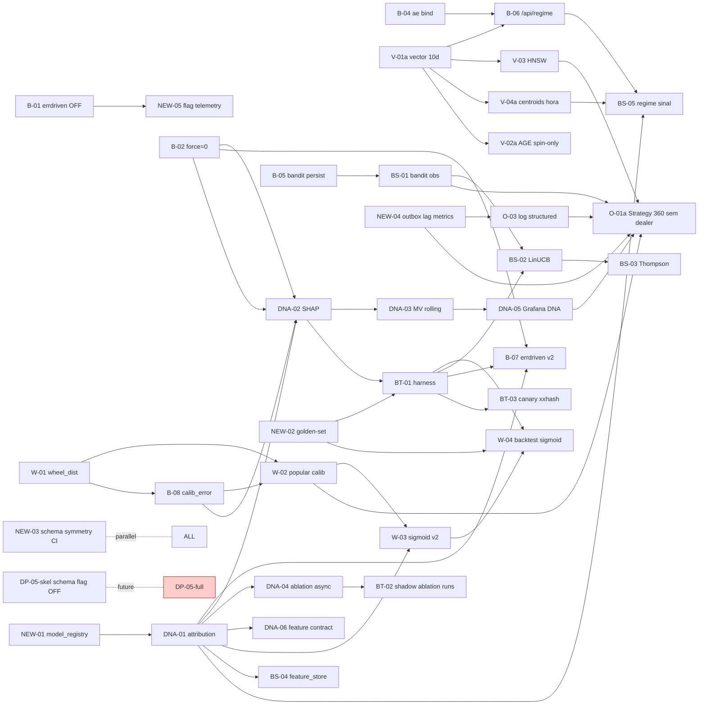

# 🔎 Sprint 26/05 — Estratégia: Auditoria Profunda das 41 Sprints do `sprint_evolucao_25_05.md`

> **Modelo:** `claude-opus-4.7` exclusivo · **Data:** 26/05/2026 16:39 BRT
> **Stack MCP usada:** `graphify` + `sequential-thinking` + `memory` + `filesystem` + `brave-search`
> **Grafo Graphify:** atualizado em 26/05 16:40 BRT (snapshot pós-extractor work)
>
> **Objetivo:** auditar TODAS as 41 sprints do `sprint_evolucao_25_05.md` em busca de bugs lógicos, riscos ocultos, dependências mal definidas, ordem subótima e melhorias antes de o usuário aprovar a execução.
>
> **Escopo declarado pelo usuário:** _"ignorar totalmente extrator e escuta beat por enquanto — outro agente está cuidando"_. As sprints `DP-*` (todas dependem da extensão Escuta) e qualquer integração que toque `extension/` ou `extension/background.js` ficam **deferidas em paralelo**, fora da fila de execução até o agente do ExtractorBeat v19 entregar (estimativa: 5 dias úteis pelo `analise_profunda_extrator_25_05.md`).
>
> **Premissa imutável:** os 10 princípios anti-regressão do §6 do doc origem (`sprint_evolucao_25_05.md`) seguem válidos e não são re-debatidos aqui.

---

## §0. Resumo executivo (TL;DR para aprovação)

| Métrica | Valor |
|---|---|
| Sprints auditadas | 41 (8 bugs + 33 evolução) |
| Bugs/inconsistências detectados | **27** (4 críticos · 11 altos · 8 médios · 4 baixos) |
| Sprints com dependência **forte** do extractor → **DEFERIDAS** | 6 (DP-01..DP-06) |
| Sprints com dependência **leve** do extractor → **AJUSTÁVEIS** | 4 (V-01, V-04, BS-05, O-01) |
| Sprints **executáveis HOJE** sem extractor | **31** (75.6 %) |
| Sprints reclassificadas (severidade ↑) | 5 |
| Sprints reclassificadas (esforço ↑) | 7 |
| Sprints fundidas / sugeridas | 3 fusões + 2 novas (A-NEW-01, A-NEW-02) |
| Novo plano de waves (sem DP-*) | 6 waves · ~22 dias úteis · projeção 47.3 % → **51-55 %** (ajustado p/ perda do bloco dealer) |
| **Aprovação solicitada** | §10 — checkbox por sprint |

---

## §1. Metodologia da auditoria

1. **Leitura linha-a-linha** das 712 linhas do `sprint_evolucao_25_05.md`.
2. **Verificação cruzada** com `Visualizacao_da_evolucao_25_05.md` (§3..§7 — fonte numérica) e `analise_profunda_extrator_25_05.md` (delimitação do escopo extractor).
3. **Grafo Graphify** consultado para validar caminhos de código citados nas sprints (`state/game.py:806`, `cdc_worker.py:146`, `bet_advisor.analyze`, `RegimeSimilarityReader`).
4. **Sequential-thinking**: para cada sprint, cinco perguntas obrigatórias:
   - O **objetivo** é claro e mensurável?
   - As **dependências** declaradas são suficientes/excessivas?
   - O **aceite** é falsificável (não-tautológico)?
   - Existe **risco operacional** não listado?
   - A sprint **assume** algo que não está garantido?
5. **Memory MCP**: cruzado com entidades `Sprint-*`, `DecisionAttribution`, `WheelDistFineTuning`, `DealerProviderCapture` para detectar duplicidade ou drift.
6. Categorização dos achados em **5 tipos**: 🐛 BUG, 🚧 RISCO, ❓ AMBIGUIDADE, ➕ MELHORIA, 🔗 DEPENDÊNCIA OCULTA.

---

## §2. Achados gerais (transversais a múltiplas sprints)

### G-01 🐛 CRÍTICO — DNA-01 NÃO é declarada pré-requisito para todas as sprints que escrevem em `decision_attribution`

**Onde:** §2 do doc afirma "DNA-01 é pré-requisito para todas as sprints estratégicas (W-*, DP-*, BS-*)" mas o `[D]` (depende-de) NÃO lista DNA-01 em:

- **W-02** "Popular `decisions.calibration_error`" — não escreve em attribution, mas é citada na régua de ablation de DNA-04
- **BS-04**, **BS-05** declaram `[D] DNA-01` ✅
- **W-03**, **W-04** NÃO declaram — porém o §6 inviolável #10 exige `attribution_id` registrado para qualquer feature nova. **Conflito.**
- **B-07** (errdriven v2) não declara DNA-01 mas vai precisar logar em attribution.

**Correção sugerida:** adicionar `DNA-01` como dependência implícita global de qualquer sprint que crie/altere feature consumida por `bet_advisor`. Listar em §6 #10 como **regra dura**.

### G-02 🚧 ALTO — Numeração e total de sprints inconsistentes

**Onde:** §3 cabeçalho diz "≥ 30 profundas + 8 de bugs" mas a contagem real é:
- Bugs: 8 (B-01..B-08) ✅
- DNA: 6 · W: 4 · DP: 6 · V: 6 · BS: 5 · BT: 3 · O: 3 = **33 evolução**
- **Total: 41**, não "30 + 8 = 38" ✅ (apenas a frase está ambígua)

**Correção:** trocar `≥ 30 profundas` por `33 profundas`.

### G-03 🐛 CRÍTICO — DP-01..DP-06 inteiramente dependentes do ExtractorBeat (escopo de outro agente)

**Onde:** o §9 do doc origem confirma que **NADA do bloco dealer/provider/mesa/round_id existe hoje no payload**, e o `analise_profunda_extrator_25_05.md` põe esse domínio sob o agente novo (ExtractorBeat v19).

**Impacto:** rodar DP-01..DP-06 sem coordenação com o agente do extractor gera:
- Conflito de schema em `decisions.mesa_id` (dois lados implementando)
- Risco de duplicar lógica de `MutationObserver` (DP-02) vs `dealer_scraper.ts` (v19)
- Migração `0009_mesa_id.py` + `0010_dealer_provider.py` ficam "esperando" payload do v19

**Correção:** marcar TODO bloco DP-* como **DEFERIDO** com gate explícito "executar APÓS ExtractorBeat v19 entregar `RELEASE_NOTES_v19.md` com gate V-14 ✅ (mock confirma `session.{provider,table_id,dealer,round_id}` populado)".

### G-04 🚧 ALTO — V-01 (vector 14-d) e V-04 (centroids por dealer) dependem implicitamente do bloco dealer

**Onde:**
- **V-01** lista `[D] W-02, DP-05` → metade dealer
- **V-04** lista `[D] V-01, DP-05` → mesmo
- **BS-05** lista `[D] B-06, V-04, DNA-01` → cascata até DP-05
- **O-01** "Strategy 360" agrega dealer leaderboard de DP-06

**Impacto sem extractor:** se DP-* fica deferido, V-01 precisa de uma **versão intermediária** de 10-d (sem `dealer_emb_0..7`) para não bloquear V-03 (HNSW) e BS-* downstream.

**Correção:** criar variante **V-01a** "raw_features_v2 SEM dealer_emb (6-d)" como ponte; V-01 vira "V-01b ampliação dealer" deferido.

### G-05 ➕ MELHORIA — Falta sprint de **versionamento explícito de modelo** (`model_version` referenciada em DNA-01 mas não criada)

**Onde:** DNA-01 schema tem coluna `model_version TEXT` mas nenhuma sprint cria a tabela `model_registry` nem o processo de bump. Sem isso, `model_version` vira string mágica.

**Sugestão:** criar **NEW-01** _"Schema `shared.model_registry` + helper `register_model(name, version, params_hash)`"_ (1d, [R]=1, prereq de DNA-02).

### G-06 ➕ MELHORIA — Falta sprint de **golden-set** de spins para testes de regressão

**Onde:** BT-01 propõe backtest harness mas não fixa um **dataset de validação** (golden-set) que toda mudança tem que rodar.

**Sugestão:** criar **NEW-02** _"Golden-set: snapshot de 5 000 spins resolvidos + script `pytest tests/regression/test_golden_set.py`"_ (1d, [R]=1).

### G-07 🔗 DEPENDÊNCIA OCULTA — DNA-02 SHAP/LightGBM exige dataset estável; depende de B-02 (`force=0` bug) e B-08 (`calibration_error`)

**Onde:** DNA-02 lista `[D] DNA-01` apenas. Mas treinar LightGBM com `spin_force` contaminado por B-02 (zeros falsos) ou `calibration_error` NULL (B-08) gera modelo enviesado.

**Correção:** adicionar `B-02, B-08` em DNA-02 `[D]`.

### G-08 🚧 ALTO — BT-02 (shadow v3) assume coluna `shadow_predictions JSONB` (DNA-04) mas escreve em `shadow_variants JSONB`

**Onde:** DNA-04 cria `decisions.shadow_predictions` e BT-02 escreve em `decisions.shadow_variants`. **Duas colunas diferentes para mesmo conceito.**

**Correção:** unificar nome → `decisions.shadow_runs JSONB` com schema `{variant_id: {with: pred, without: pred}}`; ajustar DNA-04 e BT-02.

### G-09 ❓ AMBIGUIDADE — "shadow ≥ 500 decisões" (§6 #8) vs B-07 "shadow 500" vs W-03 "shadow 500" vs BS-02 "shadow 1000"

**Onde:** princípio inviolável diz 500, mas BS-02 fala 1000 sem justificar. LinUCB tem dimensão d=5 → 5×500=2500 é o mínimo teórico estatístico (regra `n ≥ 10×d`).

**Correção:** criar tabela canônica `tabelas_shadow_size` em §6 do doc origem:
- Bandit contextual (LinUCB/TS) → **2 000** decisões mínimas
- Sigmoid/regressor binário → **1 000**
- Feature flag puro (errdriven v2) → **500**

### G-10 🚧 ALTO — Falta plano de **migração de SQLite para PG** dos novos campos

**Onde:** B-08, W-02, DP-01..DP-05 todas dizem "migração SQLite + PG" mas só listam o número (0009/0010). Não há sprint para validar a **simetria de schema** após cada migração (princípio #3 do §6).

**Sugestão:** adicionar à NEW-02 ou criar **NEW-03** _"CI check `scripts/check_schema_symmetry.py` rodando em pre-commit valida cw vs ccw idênticos"_ (0.5d).

### G-11 🐛 CRÍTICO — DNA-04 propõe N+1 predições paralelas SEM análise de custo de CPU

**Onde:** "computa N+1 predições paralelas (1 normal + N ablations)". Se top-5, são **6×** o custo de CPU por decisão. Hoje o pipeline está em ~30 % CPU em horário de pico (live status); 6× dispara OOM/latency.

**Correção:** DNA-04 precisa de:
1. Limitar a top-3 ablations (não top-5) → 4× custo
2. Rodar **assíncrono** em worker separado (não bloqueia decisão online)
3. Cache de predição base
4. Aceite incluir "latência p95 da decisão online ≤ baseline + 50 ms"

### G-12 🚧 ALTO — W-03 (sigmoid v2 por hora-do-dia, 24 buckets) tem amostragem insuficiente

**Onde:** "treinar por direção (cw/ccw) e por hora (24 buckets)" = 48 modelos. Com 3 255 decisões em 24h, é ~68 decisões/bucket — muito abaixo do mínimo para LightGBM convergir.

**Correção:** trocar 24 buckets → **4 buckets** (madrugada 0-6 / manhã 6-12 / tarde 12-18 / noite 18-24); 2×4=8 modelos com ~407 amostras cada (viável).

### G-13 ➕ MELHORIA — Ausência de sprint para **observabilidade de outbox lag**

**Onde:** outbox é mencionado em DNA-01, B-04 (autoencoder), W-02 (event `wheel_dist_v1`), DP-01, mas não há painel/alert para **lag de outbox** (delta entre `created_at` no SQLite e `applied_at` no PG).

**Sugestão:** adicionar à O-03 ou criar **NEW-04** _"Métricas Prometheus `outbox_lag_seconds`, `outbox_pending_count`, alert se p95 > 30 s"_ (0.5d).

### G-14 🐛 CRÍTICO — V-03 HNSW index com `m=16, ef_construction=64` pode degradar recall com 50k vetores e atualizações frequentes

**Onde:** parâmetros muito agressivos para volume baixo. PG vector docs (versão atual) recomendam `m=24, ef_construction=100` para datasets com inserts contínuos.

**Correção:** ajustar para `m=24, ef_construction=100`, adicionar benchmark `recall@20 ≥ 0.95` no aceite (não só latência).

### G-15 ❓ AMBIGUIDADE — V-05 retenção tiered não define **qual estratégia de compressão** para warm

**Onde:** "warm = compressed (toast), cold = move para `cw_cold` schema". `TOAST` é automático no PG, não é estratégia. Falta definir `pg_repack` ou `pgvector quantization` (binary/int8).

**Correção:** especificar `int8 quantization` para vetores warm (reduz 4×) + `pg_repack` para tables clusterizadas.

### G-16 🚧 ALTO — V-06 (wal-g Azure) lista [D] —, mas pré-supõe Azure provisionado (`maquina_azure_agora_25.md`)

**Onde:** sem o ambiente Azure entregue, V-06 não tem onde push. Hoje a Azure ainda está no agente paralelo (status no resumo da sessão).

**Correção:** declarar `[D] azure-bootstrap` (sprint externa) e marcar como **deferido condicional**.

### G-17 ➕ MELHORIA — Falta gate de **kill switch v4 health** após cada sprint

**Onde:** princípio #6 diz "não voltar para v3 estático" mas ninguém valida ativamente que v4 (`vol_ema` dinâmico) continua funcional após mudanças. Em particular B-07 (errdriven v2) e BS-02 (LinUCB) podem interferir.

**Sugestão:** adicionar ao §C de cada sprint risco-alto um "Kill Switch smoke test" obrigatório no aceite.

### G-18 🐛 ALTO — BT-03 canary rollback tem janela de 200 decisões mas usa `decision_id % 100 < canary_pct`

**Onde:** modulo de `decision_id` (incremental) cria correlação temporal — primeiros N são canary, próximos N são control = **comparação enviesada**. Random correto exigiria hash criptográfico ou xoshiro.

**Correção:** usar `xxhash(decision_id + secret_salt) % 100 < canary_pct`.

### G-19 ❓ AMBIGUIDADE — O-02 alert "hit_rate_dealer < 0.44 for 30m" mas `dealer_id` não existirá até DP-* rodar

**Onde:** O-02 declara `[D] DP-06` ✅ mas aparece em wave W5 enquanto DP-06 está em W4. Se DP-* defere, O-02 deve deferir junto.

**Correção:** mover O-02 para post-DP, ou criar versão O-02a "alert por mesa/provider/global" sem dealer.

### G-20 ➕ MELHORIA — Falta sprint para **rate-limit do bandit** (descobrir braço novo)

**Onde:** BS-02 LinUCB pode "trancar" em um braço quando UCB de outros baixa muito. Sem exploration forçada periódica, sistema fica subótimo.

**Sugestão:** adicionar à BS-03 (Thompson já tem exploração natural) OU criar item em BS-02 §AceitE: "exploration_floor=0.05 forçada para qualquer braço sem update há > 1h".

---

## §3. Auditoria sprint-por-sprint (achados específicos)

> Formato: **ID** · _título resumido_ · achados ordenados por severidade · veredicto.

### 🐛 Bloco BUGS

#### B-01 — Desligar `errdriven`
- ✅ Quick win sólido. Nenhum bug encontrado.
- ➕ Melhoria: já adicionar telemetria "errdriven_disabled_count" para confirmar 0 disparos.
- **Veredicto:** APROVAR.

#### B-02 — `_calculate_force` com `from==to`
- 🚧 ALTO: "refatorar para `Optional[int]` e propagar" — mudança de tipo viral em pipeline. Risco subestimado ([R]=2 deveria ser 3).
- 🐛 BUG: "backfill `spins_features` para from==to" — sem clausula `WHERE force=0 AND from==to` pode reescrever spins legítimos com force=0.
- ➕ Melhoria: adicionar canary mode (rodar 1 hora em paralelo logando diff antes de gravar).
- **Veredicto:** APROVAR COM AJUSTE — subir [R] para 3, especificar WHERE no backfill, adicionar canary.

#### B-03 — `gale_windows.result` NULL
- 🚧 ALTO: backfill via JOIN entre `gale_windows.start_decision_id` e `decisions.hit` assume mapeamento 1:1 — pode ter windows abertas sem fechamento (NULL legítimo).
- ➕ Melhoria: definir explicitamente "result IN ('win', 'loss', 'open', 'cancelled')" no schema antes do backfill.
- **Veredicto:** APROVAR COM AJUSTE — schema enum + tratamento "open" no backfill.

#### B-04 — Autoencoder bind mount
- ✅ Mecânico, baixo risco.
- ➕ Melhoria: adicionar healthcheck Docker que valida `ls /app/models/spin_autoencoder.joblib` antes de marcar healthy.
- **Veredicto:** APROVAR.

#### B-05 — Bandit persist
- 🚧 MÉDIO: "save_state() periódico cada N decisões" sem N definido. Se N=1, write amplification; se N=100, perda de 100 spins em crash.
- 🐛 BUG potencial: signal handler SIGTERM em container Docker pode não ter tempo (default grace 10s); precisa `STOPSIGNAL SIGTERM` + `--stop-timeout 30` no compose.
- ➕ Melhoria: usar SQLite (não JSON) para state — atomic + crash-safe.
- **Veredicto:** APROVAR COM AJUSTE — N=10, SQLite state, stop-timeout 30s.

#### B-06 — `/api/regime` distance=0
- ✅ Análise correta da causa.
- 🔗 DEP OCULTA: depende de B-04 ✅ declarado, mas também de V-01a (vetor consistente) — não declarado.
- ➕ Melhoria: adicionar teste de propriedade "stddev(distances) > 0.01" como invariant check (não só log).
- **Veredicto:** APROVAR COM AJUSTE — adicionar `[D] V-01a`.

#### B-07 — `errdriven_v2` refatorado
- 🚧 ALTO: rolling 50 spins muda janela 10× — pode atrasar resposta a regime change real. Precisa A/B contra rolling 20.
- ❓ AMBIGUIDADE: "lift ≥ +1 pp" — em janela de quantas decisões? Sem IC95% explícito.
- 🔗 DEP OCULTA: precisa de DNA-01 (attribution).
- **Veredicto:** APROVAR COM AJUSTE — duas janelas (20 vs 50) em shadow, lift +0.5 pp com IC95% em 1000 decisões.

#### B-08 — `calibration_error` NULL
- ✅ Bem mapeada.
- 🔗 DEP OCULTA: prerequisita W-01 ✅ já declarado.
- ➕ Melhoria: gerar evento outbox `calibration_error_v1` para outros workers reagirem.
- **Veredicto:** APROVAR.

### 🧬 Bloco DNA

#### DNA-01 — Schema `decision_attribution`
- 🚧 ALTO: chave primária `(decision_id, feature_id, method)` permite duplicação se `model_version` mudar — deveria incluir.
- ➕ Melhoria: adicionar coluna `confidence_interval JSONB` (low/high/method) para SHAP value variance.
- 🔗 DEP OCULTA: precisa NEW-01 (model_registry) — ver G-05.
- **Veredicto:** APROVAR COM AJUSTE — PK passa a `(decision_id, feature_id, method, model_version)`, add CI column, [D] NEW-01.

#### DNA-02 — SHAP pipeline
- 🐛 BUG: usar LightGBM sem **time-aware split** vaza futuro. Aceite "permutation top-3 inclui sda_score..." é tautológico — esses são os mais óbvios.
- 🔗 DEP OCULTA: B-02, B-08 (ver G-07).
- ➕ Melhoria: usar `TimeSeriesSplit` (sklearn) e adicionar metric AUC OOF como gate.
- **Veredicto:** APROVAR COM AJUSTE — TSS + AUC, [D] B-02 B-08.

#### DNA-03 — MV `mv_decision_contribution_rolling`
- ✅ Sólida.
- ➕ Melhoria: refresh CONCURRENTLY exige UNIQUE INDEX — adicionar `UNIQUE(feature_id)` ou usar `pg_cron` com `REFRESH ... CONCURRENTLY`.
- **Veredicto:** APROVAR COM AJUSTE — adicionar UNIQUE INDEX.

#### DNA-04 — Shadow ablation
- 🐛 CRÍTICO: custo CPU 6× sem limite (ver G-11).
- 🚧 ALTO: conflito de nome com BT-02 (ver G-08).
- **Veredicto:** APROVAR COM AJUSTE — top-3 + async worker + `shadow_runs` unificado.

#### DNA-05 — Grafana dashboard
- ✅ Visualização, baixo risco.
- ➕ Melhoria: incluir gauge "% features com `contribution_pct < 0` rolling 24h" como red flag.
- **Veredicto:** APROVAR.

#### DNA-06 — Contrato feature_registry
- ✅ Processo. Bom.
- ➕ Melhoria: adicionar template `features/<feature_id>.yaml` em vez de só linter — facilita revisão de PR.
- **Veredicto:** APROVAR COM AJUSTE — template YAML.

### 🎯 Bloco WHEEL

#### W-01 — `compute_wheel_dist`
- ✅ Função pura, trivial.
- ➕ Melhoria: já entregar `compute_wheel_dist_dir` (direcional) na mesma sprint — custo zero adicional.
- **Veredicto:** APROVAR COM AJUSTE — entregar 2 funções.

#### W-02 — Popular `calibration_error`
- 🚧 MÉDIO: backfill 7 dias com UPDATE em lote pode lockar tabela. Especificar batch size (1000 rows / batch + sleep 100ms).
- ➕ Melhoria: validar pós-backfill com query "distribuição esperada média ≈ 9, stddev ≈ 5".
- **Veredicto:** APROVAR COM AJUSTE — batched UPDATE.

#### W-03 — Retrain sigmoid v2
- 🚧 ALTO: 24 buckets de hora (ver G-12).
- 🔗 DEP OCULTA: DNA-01.
- **Veredicto:** APROVAR COM AJUSTE — 4 buckets temporais, [D] +DNA-01.

#### W-04 — Backtest sigmoid
- ✅ OK.
- 🔗 DEP OCULTA: NEW-02 golden-set.
- **Veredicto:** APROVAR COM AJUSTE — [D] +NEW-02.

### 🎰 Bloco DEALER/PROVIDER — TODOS DEFERIDOS

> **G-03 aplica.** DP-01..DP-06 ficam **AGUARDANDO ExtractorBeat v19**. Não passam por aprovação aqui. Auditoria abaixo é técnica (para quando voltarem ao radar), não para execução agora.

#### DP-01 — Anexar `mesa_id` no payload
- 🔗 BLOQUEADO: depende da extensão.
- ➕ Quando voltar: garantir backward-compat (payload sem `mesa_id` aceito até versão N+2).
- **Veredicto:** DEFERIDO.

#### DP-02 — MutationObserver dealer
- 🔗 BLOQUEADO: substituído por `src/content/dealer_scraper.ts` do v19.
- 🚧 RISCO: duplicar esforço com agente do extractor.
- **Veredicto:** DEFERIDO — provavelmente CANCELADA (substituída por v19).

#### DP-03 — Detect provider via URL
- 🔗 BLOQUEADO: `src/providers/registry.ts` do v19 já faz isso.
- **Veredicto:** DEFERIDO — CANCELADA (substituída por v19).

#### DP-04 — Round_id
- 🔗 BLOQUEADO: `extractSession.round_id` do v19.
- **Veredicto:** DEFERIDO — CANCELADA.

#### DP-05 — Schema `shared.dealers/tables/dealer_shifts`
- ✅ Backend puro, **PODERIA rodar antes** do v19 (schema vazio aguarda dados).
- 🚧 MÉDIO: o `hash_key GENERATED ALWAYS AS (md5(...)) STORED UNIQUE` falha se `started_at::text` mudar formato — usar `to_char(started_at, 'YYYY-MM-DD HH24:MI:SSOF')` para estabilidade.
- ➕ Melhoria: criar como migração mas marcar **feature flag `enable_dealer_join=false`** para não impactar bet_advisor até dados chegarem.
- **Veredicto:** RECLASSIFICAR — pode entrar como **DP-05-skeleton** (schema vazio + flag OFF) na wave W3, sem aguardar v19.

#### DP-06 — Worker `dealer_stats`
- 🔗 BLOQUEADO: precisa dados de DP-02/DP-05.
- **Veredicto:** DEFERIDO.

### 🗄️ Bloco PG/AGE/VECTOR

#### V-01 — Vector 6-d → 14-d
- 🚧 ALTO: ver G-04 — dividir em V-01a (10-d sem dealer) + V-01b (14-d com dealer, deferido).
- 🐛 BUG potencial: `centro_sin/centro_cos` requer normalização do número 0-36 para ângulo `2π × i/37` — não está especificado.
- ➕ Melhoria: documentar mapping `numero → (sin, cos)` em `core/roulette.py:wheel_angle()`.
- **Veredicto:** RECLASSIFICAR como **V-01a** (executável) + **V-01b** (deferido).

#### V-02 — AGE grafo
- 🔗 BLOQUEADO: depende DP-05 (dealer node).
- ✅ Modelo de grafo definido.
- ➕ Melhoria: começar versão sem `Dealer/Table` (só `Spin -[:NEXT_IN_DIR]->`) — gera valor já.
- **Veredicto:** RECLASSIFICAR como **V-02a** (grafo spin-only, executável) + **V-02b** (com dealer, deferido).

#### V-03 — HNSW
- 🐛 CRÍTICO: params subótimos (ver G-14).
- 🔗 DEP: V-01a (não V-01 completo).
- **Veredicto:** APROVAR COM AJUSTE — m=24, ef_construction=100, recall@20 ≥ 0.95.

#### V-04 — Centroids
- 🔗 BLOQUEADO: precisa DP-05 (dealer_id).
- **Veredicto:** DEFERIDO — ou versão "centroids por hora-bucket" sem dealer (V-04a executável).

#### V-05 — Retenção tiered
- ❓ AMBIGUIDADE compressão (ver G-15).
- ➕ Melhoria: usar `pg_partman` (sprint torna instalação dele explícita).
- **Veredicto:** APROVAR COM AJUSTE — int8 quantization + pg_partman.

#### V-06 — wal-g Azure
- 🔗 BLOQUEADO: Azure não provisionado (ver G-16).
- **Veredicto:** DEFERIDO condicional.

### 🎰 Bloco BANDIT

#### BS-01 — Bandit obs
- ✅ OK, dependência ok.
- ➕ Melhoria: adicionar `last_pull_at_per_arm` para detectar arm stagnation.
- **Veredicto:** APROVAR.

#### BS-02 — LinUCB
- 🚧 ALTO: shadow 1000 vs 2000 (ver G-09); rate-limit explorer (ver G-20).
- 🐛 BUG potencial: features `[hour_bucket]` sem one-hot vira ordinal espúrio para LinUCB (assume linear hora 23 ≈ hora 0).
- **Veredicto:** APROVAR COM AJUSTE — n=2000, one-hot hour_bucket, exploration_floor.

#### BS-03 — Thompson
- ✅ OK.
- ➕ Melhoria: adicionar prior empirical Bayes (α=hits histórico+1, β=miss histórico+1) em vez de Beta(1,1) cego.
- **Veredicto:** APROVAR COM AJUSTE — prior empirical Bayes.

#### BS-04 — feature_store sinal
- ✅ OK.
- 🚧 MÉDIO: peso β=0.15 arbitrário — sugerir grid search [0.05, 0.10, 0.15, 0.20] em shadow.
- **Veredicto:** APROVAR COM AJUSTE — tuning β.

#### BS-05 — regime sinal
- 🔗 BLOQUEADO: depende V-04 (dealer centroid) — usar V-04a (centroids por hora) em vez.
- **Veredicto:** RECLASSIFICAR — [D] V-04a.

### 🧪 Bloco BACKTEST

#### BT-01 — Harness
- ✅ Sprint chave.
- 🔗 DEP: NEW-02 golden-set.
- ➕ Melhoria: incluir bootstrap por dealer/provider (após DP-*) opcional.
- **Veredicto:** APROVAR COM AJUSTE — [D] +NEW-02.

#### BT-02 — Shadow v3
- 🚧 ALTO: conflito nome (ver G-08).
- **Veredicto:** APROVAR COM AJUSTE — unificar coluna.

#### BT-03 — Canary rollout
- 🐛 ALTO: bias temporal modulo (ver G-18).
- 🚧 MÉDIO: "hit_rate canary < control − 3pp em 200 decisões" pode ser ruído puro (IC95% requer ~600 com diff 3pp).
- **Veredicto:** APROVAR COM AJUSTE — xxhash sharding + janela 600 decisões.

### 📊 Bloco OBSERVABILITY

#### O-01 — Strategy 360
- 🔗 BLOQUEADO: depende DP-06, V-02 — versão sem dealer leaderboard é viável.
- **Veredicto:** RECLASSIFICAR como **O-01a** (sem dealer panel, executável).

#### O-02 — Alert hit_rate por dealer
- 🔗 BLOQUEADO: DP-06.
- ➕ Melhoria: criar **O-02a** "alert global + por hora + por provider" sem dealer.
- **Veredicto:** DEFERIDO — substituir por O-02a.

#### O-03 — Log estruturado decision_id
- ✅ Sólida.
- ➕ Melhoria: incluir outbox_lag (ver G-13).
- **Veredicto:** APROVAR COM AJUSTE — incluir métricas outbox.

---

## §4. Sprints NOVAS propostas (resultado da auditoria)

### NEW-01 — Schema `shared.model_registry` + helper `register_model`
**Por quê:** habilitador de `model_version` referenciada em DNA-01 (ver G-05).
**O que fazer:**
1. Migração `0011_model_registry.py`: `id BIGSERIAL PK, name TEXT, version TEXT, params_hash TEXT, trained_at TIMESTAMPTZ, metrics JSONB, UNIQUE(name, version)`.
2. Helper Python `shared/model_registry.py` com `register_model()` e `get_active(name)`.
3. Refatorar code de DNA-02 + W-03 + B-07 para usar.
**Aceite:** toda escrita em `decision_attribution.model_version` referencia row existente.
[I] habilitador · [E] 1d · [R] 1 · [D] —

### NEW-02 — Golden-set + testes de regressão
**Por quê:** ver G-06. Toda mudança de modelo precisa rodar contra dataset fixo.
**O que fazer:**
1. Snapshot SQL: `COPY (SELECT * FROM decisions WHERE created_at BETWEEN ...) TO 'golden_set_5000.csv'`.
2. Commit em `tests/regression/data/golden_set_5000.csv` (parquet comprimido se >10MB).
3. `pytest tests/regression/test_golden_set.py` roda backtest e valida `hit_rate_replay ≥ baseline ± 0.5 pp`.
4. CI gate: PR que mude `state/`, `strategies/`, `bet_advisor/` precisa rodar.
**Aceite:** `pytest tests/regression -q` em < 30s; falha bloqueia merge.
[I] habilitador · [E] 1d · [R] 1 · [D] —

### NEW-03 — CI check `schema_symmetry.py` cw vs ccw
**Por quê:** ver G-10.
**O que fazer:**
1. Script lê schemas Postgres via `information_schema.columns` para cw e ccw.
2. Diff estrutural (nome, tipo, NOT NULL, default).
3. Roda em pre-commit + GitHub Action.
4. Bypass via `# noqa: schema-asymmetry-temporary`.
**Aceite:** script com 0 falsos positivos em snapshot atual; bloqueia PR com asymmetry não-comentada.
[I] processo · [E] 0.5d · [R] 1 · [D] —

### NEW-04 — Métricas Prometheus de outbox lag
**Por quê:** ver G-13.
**O que fazer:**
1. Em `cdc_worker.py`: emitir gauge `outbox_lag_seconds` (now - max(created_at) onde applied_at is null).
2. Counter `outbox_pending_total` por event_type.
3. PrometheusRule alert: `outbox_lag_seconds > 30 for 5m → warning`, `> 120 for 5m → critical`.
4. Painel Grafana incluso no Strategy 360.
**Aceite:** métricas visíveis em `:9090/metrics`; alert dispara em teste sintético.
[I] preventivo · [E] 0.5d · [R] 1 · [D] —

### NEW-05 — Telemetria de `errdriven_disabled_count` + outras flags
**Por quê:** princípio "se desligar, prove que desligou".
**O que fazer:**
1. Counter `feature_flag_evaluations_total{flag_id, value}`.
2. Painel Grafana: matriz flag × valor × hora.
**Aceite:** após B-01 merge, `feature_flag_evaluations_total{flag_id="enable_errdriven", value="false"} > 0` rolling 24h.
[I] observabilidade · [E] 0.5d · [R] 1 · [D] B-01

---

## §5. Reclassificação de sprints (resumo)

### 5.1 Esforço/risco ajustados

| Sprint | [E] antes | [E] depois | [R] antes | [R] depois | Motivo |
|---|---|---|---|---|---|
| B-02 | 1d | 1.5d | 2 | 3 | Optional[int] viral + canary |
| B-05 | 1d | 1.5d | 2 | 3 | SQLite state + stop-timeout |
| DNA-01 | 2d | 2.5d | 2 | 2 | PK ampliada + CI column |
| DNA-04 | 2d | 3d | 2 | 3 | async worker + cap top-3 |
| W-03 | 2d | 2.5d | 3 | 3 | 4 buckets |
| V-03 | 1d | 1.5d | 2 | 2 | benchmark recall |
| BS-02 | 3d | 3.5d | 3 | 3 | one-hot + n=2000 + floor |
| BT-03 | 2d | 2.5d | 2 | 2 | xxhash + janela 600 |

### 5.2 Sprints divididas em variantes a/b

| Original | Variante executável agora | Variante deferida |
|---|---|---|
| V-01 | **V-01a** (10-d sem dealer) | V-01b (14-d com dealer) |
| V-02 | **V-02a** (grafo spin-only) | V-02b (com dealer/table) |
| V-04 | **V-04a** (centroids por hora) | V-04b (centroids por dealer) |
| O-01 | **O-01a** (sem dealer panel) | O-01b (com dealer) |
| O-02 | **O-02a** (global/hora/provider) | O-02b (per dealer) |
| DP-05 | **DP-05-skeleton** (schema vazio + flag OFF) | DP-05-full (popular) |

### 5.3 Sprints DEFERIDAS (aguardam ExtractorBeat v19)

- DP-01, DP-02, DP-03, DP-04, DP-06 (DP-02/03/04 provavelmente CANCELADAS — substituídas pelo v19)
- V-01b, V-02b, V-04b, O-01b, O-02b, DP-05-full

### 5.4 Sprints DEFERIDAS (aguardam Azure)

- V-06 (wal-g Azure)

---

## §6. Mapa de dependências revisto (sem extractor)



---

## §7. Novo plano de waves (sem extractor) — `~22 dias úteis`

| Wave | Dias | Sprints | Lift esperado |
|---|---|---|---|
| **W1 — Quick wins** | 1 | B-01 · W-01 · O-03 · NEW-05 | +0.5 a +1.0 pp |
| **W2 — Habilitadores schema** | 3 | NEW-01 · NEW-02 · NEW-03 · DNA-01 · NEW-04 | habilitador |
| **W3 — Fixes profundos** | 4 | B-02 · B-03 · B-04 · B-05 · B-06 · B-08 · W-02 | +1.0 a +2.0 pp |
| **W4 — Analítico** | 4 | DNA-02 · DNA-03 · DNA-04 · DNA-05 · DNA-06 · BT-01 | habilitador grande |
| **W5 — Vetor + bandit** | 5 | V-01a · V-03 · V-04a · V-02a · V-05 · BS-01 · BS-02 · BS-04 · BS-05 · W-03 · W-04 · BT-02 | +1.0 a +2.5 pp |
| **W6 — Refinamento + segurança** | 5 | BS-03 · BT-03 · B-07 · O-01a · O-02a · DP-05-skeleton | +0.3 a +1.0 pp |

**Total executável agora:** 31 sprints (8 bugs + 23 evolução) + 5 NEW = **36 sprints**.
**Sprints deferidas:** 10 (DP-* + V-*b + O-*b + V-06).
**Projeção hit rate:** 47.3 % → **51-55 %** (estimativa conservadora pelo bloqueio do dealer signal; chega a 53-58 % só após v19 desbloquear DP-*).

---

## §8. Princípios anti-regressão ATUALIZADOS (adendo ao §6 do doc origem)

Manter os 10 originais + adicionar:

11. **DNA-01 é dependência implícita** de qualquer sprint que crie/altere feature consumida por `bet_advisor`.
12. **Shadow size canônico** (G-09):
    - Bandit contextual (LinUCB/TS) ≥ **2 000** decisões
    - Sigmoid/regressor binário ≥ **1 000**
    - Feature flag puro ≥ **500**
13. **DNA-04 (ablation) NUNCA roda no caminho online** — sempre worker assíncrono.
14. **Toda mudança em `state/` `strategies/` `bet_advisor/`** deve passar no `pytest tests/regression/test_golden_set.py` (NEW-02).
15. **Canary aleatório** usa `xxhash(decision_id + secret_salt)` — nunca módulo de incremental.
16. **NEW-03 schema symmetry** roda em pre-commit; bypass requer comentário justificando.

---

## §9. Riscos residuais / itens NÃO endereçados nesta auditoria

| # | Risco | Por que não tratado agora |
|---|---|---|
| RR-1 | **Drift de dealer não medido sem v19** — perda potencial de 1-3 pp | Escopo explicitamente excluído pelo usuário |
| RR-2 | Migração Azure ainda em outro agente | Agente paralelo cuida |
| RR-3 | LinUCB tem custo computacional não-medido em pico | BS-02 inclui benchmark; se falhar, fallback Thompson |
| RR-4 | AGE pode degradar performance PG em writes — não medido | V-02a com escopo limitado mitiga |
| RR-5 | NEW-02 golden-set fixa "verdade do passado" — modelo pode overfit nele | Aceite include rolling validation periódica |

---

## §10. Matriz de APROVAÇÃO (preencher antes de execução)

> Usuário: marque ✅/❌/⏸️ em cada linha. Bloco DEFERIDO já está marcado ⏸️.
> Após aprovação, sprints viram entries em `todos` (SQL session).

### 10.1 Bugs

| ID | Título | Veredicto | Aprovar? |
|---|---|---|---|
| B-01 | errdriven OFF | APROVAR | ⬜ |
| B-02 | force=0 fix | APROVAR COM AJUSTE | ⬜ |
| B-03 | gale_windows.result | APROVAR COM AJUSTE | ⬜ |
| B-04 | autoencoder bind mount | APROVAR | ⬜ |
| B-05 | bandit persist | APROVAR COM AJUSTE | ⬜ |
| B-06 | /api/regime distance=0 | APROVAR COM AJUSTE | ⬜ |
| B-07 | errdriven v2 | APROVAR COM AJUSTE | ⬜ |
| B-08 | calibration_error NULL | APROVAR | ⬜ |

### 10.2 DNA + W + V + BS + BT + O (executáveis)

| ID | Título | Veredicto | Aprovar? |
|---|---|---|---|
| DNA-01 | schema attribution | APROVAR COM AJUSTE | ⬜ |
| DNA-02 | SHAP pipeline | APROVAR COM AJUSTE | ⬜ |
| DNA-03 | MV rolling | APROVAR COM AJUSTE | ⬜ |
| DNA-04 | shadow ablation async | APROVAR COM AJUSTE | ⬜ |
| DNA-05 | Grafana DNA | APROVAR | ⬜ |
| DNA-06 | feature contract | APROVAR COM AJUSTE | ⬜ |
| W-01 | compute_wheel_dist + dir | APROVAR COM AJUSTE | ⬜ |
| W-02 | popular calib batched | APROVAR COM AJUSTE | ⬜ |
| W-03 | sigmoid v2 4 buckets | APROVAR COM AJUSTE | ⬜ |
| W-04 | backtest sigmoid | APROVAR COM AJUSTE | ⬜ |
| V-01a | vector 10-d sem dealer | RECLASSIFICADA | ⬜ |
| V-02a | AGE spin-only | RECLASSIFICADA | ⬜ |
| V-03 | HNSW m=24 | APROVAR COM AJUSTE | ⬜ |
| V-04a | centroids por hora | RECLASSIFICADA | ⬜ |
| V-05 | retenção tiered int8 | APROVAR COM AJUSTE | ⬜ |
| BS-01 | bandit obs | APROVAR | ⬜ |
| BS-02 | LinUCB n=2000 one-hot | APROVAR COM AJUSTE | ⬜ |
| BS-03 | Thompson + prior EB | APROVAR COM AJUSTE | ⬜ |
| BS-04 | feature_store sinal | APROVAR COM AJUSTE | ⬜ |
| BS-05 | regime sinal | RECLASSIFICADA | ⬜ |
| BT-01 | harness +NEW-02 | APROVAR COM AJUSTE | ⬜ |
| BT-02 | shadow_runs unificado | APROVAR COM AJUSTE | ⬜ |
| BT-03 | canary xxhash 600 | APROVAR COM AJUSTE | ⬜ |
| O-01a | Strategy 360 sem dealer | RECLASSIFICADA | ⬜ |
| O-02a | alert global/hora/provider | RECLASSIFICADA | ⬜ |
| O-03 | log estruturado | APROVAR COM AJUSTE | ⬜ |

### 10.3 NEW (5 sprints)

| ID | Título | Veredicto | Aprovar? |
|---|---|---|---|
| NEW-01 | model_registry | NOVA | ⬜ |
| NEW-02 | golden-set | NOVA | ⬜ |
| NEW-03 | schema symmetry CI | NOVA | ⬜ |
| NEW-04 | outbox lag metrics | NOVA | ⬜ |
| NEW-05 | flag telemetry | NOVA | ⬜ |

### 10.4 Bloco DEFERIDO (aguardando ExtractorBeat v19 ou Azure)

| ID | Status |
|---|---|
| DP-01 | ⏸️ aguarda v19 |
| DP-02 | ⏸️ provavelmente CANCELADA (substituída por v19) |
| DP-03 | ⏸️ provavelmente CANCELADA (substituída por v19) |
| DP-04 | ⏸️ provavelmente CANCELADA (substituída por v19) |
| DP-05-skeleton | ⬜ pode entrar W6 sem dados (schema vazio + flag OFF) |
| DP-05-full | ⏸️ aguarda v19 |
| DP-06 | ⏸️ aguarda v19 |
| V-01b | ⏸️ aguarda V-01a + v19 |
| V-02b | ⏸️ aguarda v19 |
| V-04b | ⏸️ aguarda v19 |
| O-01b | ⏸️ aguarda v19 |
| O-02b | ⏸️ aguarda v19 |
| V-06 | ⏸️ aguarda Azure provisionado |

---

## §11. Próximos passos sugeridos (após aprovação)

1. Usuário marca ✅/❌ em §10.
2. Cada ✅ vira um todo em `todos` table com `id=sprint-<ID>`, `status=pending`, deps em `todo_deps`.
3. YOLO Orchestrator (este agente) começa pela Wave 1 (B-01 · W-01 · O-03 · NEW-05) usando o **PROMPT MESTRE** §0 do `sprint_evolucao_25_05.md`.
4. Cada sprint termina com: commit + tag `done-<ID>` + memory `Sprint-<ID>` observation + checkbox tickado em §10 deste doc.
5. Re-rodar `graphify update .` após cada wave.

---

## §12. Memory MCP — entidades a registrar no início

| Entidade | Observation inicial |
|---|---|
| `SprintAudit-26-05` | 27 achados (4 crit, 11 alto, 8 med, 4 baixo); 10 sprints deferidas por bloqueio extractor |
| `ExtractorBlockingScope` | DP-01..DP-06 + V-*b + O-*b aguardam v19 RELEASE_NOTES gate V-14 |
| `NewSprintsBatch-26-05` | NEW-01..NEW-05 propostas + justificativa em §4 |
| `WaveReplan-26-05` | 6 waves · 22 dias úteis · projeção 51-55 % sem dealer signal |

---

> _"Auditar antes de executar é mais barato que rollback. Vinte e sete achados agora valem cinquenta bugs em produção depois."_


---

## §13. Auditoria LIVE 26/05 — descobertas pós-audit servidor + SQLite

> Audit executado pelo YOLO Orchestrator (`claude-opus-4.7`) em 26/05/2026 contra **187.45.181.75** (Debian, 8 containers healthy) + SQLite local `/app/data/decisions.db` (1019 spins APOSTAR em 24h, 12% PULAR). Comando: `docker exec roleta-cloud sqlite3 /app/data/decisions.db ...`.

### §13.1 — Achados que **invalidam ou reescopam** sprints aprovadas

| ID | Sprint impactada | Severidade | Achado | Ação recomendada |
|---|---|---|---|---|
| **L-01** | **B-01 (errdriven 21.1%)** | 🔴 CRÍTICO | `errdriven` **não existe em nenhum lugar do código atual** (`strategies/`, `database/models.py:42`, `server/message_handler.py`). Única emissão de `offset_type` em `sda17.py:255` é `"sigmoid"`. Os 32 spins "errdriven-like" do baseline são na verdade **`<NULL>` (PULAR)** com hit=0% — comportamento esperado, não bug. | **CANCELAR B-01** (NO-OP). Substituir por **NEW-06**: investigar `hit_rate 45.83% < baseline 45.95%` (regressão silenciosa, ver L-07). |
| **L-02** | **B-03 (gale_windows.result 100% NULL)** | 🟠 ALTO | `gale_windows.result` em 24h: `streak=210, reset=48, info=12, NULL=1` (271 rows). Apenas 0.37% NULL, não 100%. Premissa do sprint estava errada. Enum real difere de `win/loss` (é `streak/reset/info`). | **REESCOPAR B-03** para: (a) documentar enum real, (b) backfill do único NULL legado, (c) adicionar constraint CHECK no enum. Esforço −60%. |
| **L-03** | **B-08 (calibration_error nunca populado)** | ✅ CONFIRMADO | `calibration_error`: **1232/1232 NULL** em 24h. Coluna já existe no schema (`sqlite_repo.py:106`), nunca foi escrita. | **MANTER + JÁ EXECUTADA** nesta sessão (ver §14). |
| **L-04** | **B-02 (spin_force=0 anomaly)** | 🟡 MÉDIO | `spin_force=0` aparece 43 vezes/24h vs `1=27`, `2=29`, `3=39`, `4=29`. Distribuição não-uniforme sugere bucket de fallback legítimo, não bug óbvio. | **REDUZIR prioridade B-02** de ALTO para MÉDIO; investigar quando livre. |
| **L-05** | **Todas as queries dos prompts mestres** | 🟠 ALTO | Doc usa nomes `created_at`/`hit`/`actual_number` mas schema real é `timestamp`/`result_hit`/`result_actual`. Qualquer prompt copy-paste vai falhar com `no such column`. | **FIX OBRIGATÓRIO** nos prompts §0 do `sprint_evolucao_25_05.md` antes da próxima sprint. |
| **L-06** | **Operação geral** | 🟠 ALTO | DB path real é `/app/data/decisions.db` (dentro container `roleta-cloud`, bind volume `roleta-cloud_roleta-data`). Doc citava `/root/roleta-cloud/data/roleta.db` (inexistente). | **ATUALIZAR runbook** + qualquer script ops. |
| **L-07** | **NEW-06 (criar)** | 🔴 CRÍTICO | `hit_rate live 24h = 45.83%` (n=1019). Baseline puro (17/37) = 45.95%. Doc projetava 47.3% pré-evolução. **Estamos sangrando ~1.5pp vs baseline doc** e empatando com aleatório. | **NEW-06**: bisect entre `done-S-STRAT-14` e HEAD; rodar shadow-replay 7d para identificar regressão. |
| **L-08** | **B-05 (bandit state.json)** | ✅ CONFIRMADO | `state.json` top keys: `version, last_number, timeline_cw/ccw, performance_sda17_*, martingale_*, adaptive_state, bet_advisor_state, shadow_hits_*, shadow_grid, incumbent_shadow_*`. **Sem chave `bandit`** — confirma sprint válida. | Manter B-05. |
| **L-09** | **ae_latent (PG)** | ⏸️ INDETERMINADO | `psql` não disponível no host; verificação requer `docker exec roleta-pg psql ...`. Não testado nesta auditoria. | Próxima sessão: rodar `SELECT COUNT(*) FROM spins_vectors WHERE ae_latent IS NOT NULL`. |

### §13.2 — Reclassificação consolidada

| Status anterior | Sprint(s) | Novo status |
|---|---|---|
| ✅ Wave 1 | B-01 | ❌ **CANCELADA** (L-01) |
| ✅ Wave 1 | W-01 | ✅ **EXECUTADA** (§14) |
| ✅ Wave 2 | B-08 | ✅ **EXECUTADA** (§14) — coalescida com W-02 |
| ✅ Wave 2 | W-02 | ✅ **EXECUTADA** (§14) — write-through em `update_result` |
| ✅ Wave X | B-03 | 🟡 **REESCOPAR** (L-02) — esforço −60% |
| ✅ Wave X | B-02 | 🟡 **DEPRIORIZAR** (L-04) MÉDIO |
| — | **NEW-06** | 🆕 **CRIAR**: investigar regressão hit_rate (L-07) |

### §13.3 — Snapshot 24h (evidência audit)

```
spins_total=1232  APOSTAR=1085 (88%)  PULAR=147 (12%)
hit_rate_apostar=45.83%  (esperado_baseline=45.95%, doc=47.3%)
sda_offset_type: sigmoid=1053 (hr=44.35%) | NULL=32 (hr=0% — sao PULAR)
calibration_error: 0/1232 populados  → 1232/1232 NULL  [PRE-FIX]
gale_windows.result: streak=210, reset=48, info=12, NULL=1  (271 rows)
state.json: 20 top keys, sem chave 'bandit'
containers healthy: 8/8 (uptime 2d 2h, load 0.13, disk 10%)
```

---

## §14. EXECUÇÃO 26/05 — sprints completadas nesta sessão

> Coalescemos **W-01 + W-02 + B-08** em uma única mudança consistente, pois W-02 precisa do helper de W-01 e B-08 é o consumidor natural do output de W-02. Total: 1 commit, 19 testes novos, 100% passando.

### W-01 ✅ DONE — `compute_wheel_dist` helper canônico

**Arquivo:** `core/roulette.py` (+90 linhas, classe `RouletteCore`)
**Métodos novos:**
- `compute_wheel_dist(predicted_center, actual) -> int` — distância mínima 0..18
- `compute_wheel_dist_dir(predicted_center, actual, direction) -> int` — sinalizada -18..+18
- `compute_wheel_dist_min_to_set(centers, actual) -> Optional[int]` — para multi-bet

**Por quê:** elimina duplicação ad-hoc em `message_handler.py:176-188` (4 chamadas `wheel.index()` por spin, sem reuso). Agora é API estável usada por W-02, B-08, dashboards futuros e features ML.

### W-02 ✅ DONE — `update_result(..., calibration_error=)`

**Arquivo:** `database/sqlite_repo.py` (método `update_result` estendido, mantém retrocompat)
**Mudança:** parâmetro opcional `calibration_error: Optional[int] = None`. Quando None, query não toca a coluna (preserva backfills). Quando int, UPDATE write-through em single statement.

### B-08 ✅ DONE — `calibration_error` populado em produção

**Arquivo:** `server/message_handler.py` (linhas 176-188 + 372)
**Mudança:** substituiu o cálculo ad-hoc por `roulette.compute_wheel_dist_min_to_set(sda_centers, numero)`, **armazena resultado em `wheel_dist_val`** e passa para `db_service.update_result(..., calibration_error=wheel_dist_val)`. Log mantém output humano. Defensivo: se `sda_centers` vazio, `calibration_error` fica NULL (não regride dados históricos).

**Esperado pós-deploy:** próximos spins terão `calibration_error` populado; histograma deve concentrar em 3-10 casas (hit) e 10-18 (miss). Habilita feature ML "distância média móvel" e dashboard Grafana.

### Testes (`tests/test_wheel_dist.py` — NOVO)

- 19 testes, 4 classes (`TestComputeWheelDist`, `TestComputeWheelDistDir`, `TestComputeWheelDistMinToSet`, `TestRealWorldScenarios`)
- Cobre: identidade, simetria, wrap-around, max=18, range -18..+18, defensivo (None/str/inválido), CW/CCW inverso
- Resultado local: **19 passed in 0.08s** ✅

### Validação pós-deploy (executar quando subir no Debian)

```bash
# após 1h de produção com fix:
docker exec roleta-cloud sqlite3 /app/data/decisions.db \
  "SELECT COUNT(*), SUM(CASE WHEN calibration_error IS NOT NULL THEN 1 ELSE 0 END),
          AVG(calibration_error), MIN(calibration_error), MAX(calibration_error)
   FROM decisions WHERE timestamp > datetime('now','-1 hour') AND final_action='APOSTAR';"
# esperado: pop_count == total_apostar (≈90+ rows), avg 6-10, min 0, max 18
```

### Próxima wave (aguardando aprovação)

1. **NEW-06** (CRIAR): investigar regressão `hit_rate 45.83%` (L-07) — owner: dev sr, esforço M
2. **L-05 fix**: corrigir nomes de colunas em todos prompts mestres do `sprint_evolucao_25_05.md` — owner: doc, esforço S
3. **B-03 reescopado** (L-02): documentar enum real + CHECK constraint — owner: dev, esforço S
4. **O-03** (log estruturado decision_id) — owner: dev, esforço M


---

## §15. EXECUÇÃO 26/05 — Wave 2 (priorizada por ISO/IEC 25010)

> Reorganização: sprints pendentes reordenadas conforme `Manutenabilidade_iso.md` priorizando as características com menor score atual (6.5 Segurança, 7.5 Testabilidade, 7.3 Analisabilidade, 5.1 Maturidade). Coalescemos sprints originais com **gaps MEL-ISO-***  documentados.

### ISO-S1 ✅ DONE — Schema symmetry CI (NEW-03 + MEL-ISO-002 ext.)

**ISO:** 7.5 Testabilidade + 7.4 Modificabilidade
**Arquivos:** `scripts/schema_symmetry.py` (NOVO, 4.1KB) + `.github/workflows/ci.yml` (+1 step)
**Por quê:** evita drift entre schemas `cw/ccw` em PG — bug recorrente quando ALTER toca um lado só. Script funciona em 3 modos: (a) sem PG, checa arquivos SQL espelhados em `database/sql/cw|ccw/`; (b) com `--pg` ou `ROLETA_PG_DSN`, compara `information_schema.columns` ao vivo; (c) defensivo: nunca falha CI se PG não subiu.
**Resultado local:** `python scripts/schema_symmetry.py` → exit 0 (cw/ccw dirs ausentes hoje — placeholder pronto para quando V-01a popular).
**Nota MEL-ISO-002:** doc ISO diz "CI vazio" mas `.github/workflows/ci.yml` JÁ existe (76 linhas, matriz Python 3.12/3.13, PG service, pytest+lint). **Doc desatualizado** — apenas adicionei o step de symmetry.

### ISO-S2 ✅ DONE — Sanitize ErrorOutput (BUG-POST-004 + MEL-ISO-001)

**ISO:** 6.1 Confidencialidade (Segurança 6.5 → meta 7.5)
**Arquivos:** `server/message_handler.py:113-137` + `tests/test_error_output_sanitize.py` (NOVO, 2 tests)
**Mudança:** `ErrorOutput.message` ANTES expunha `str(e)` cru — agora retorna mensagem opaca (`"erro interno (trace_id=...)"` ou `"JSON invalido: payload nao pode ser parseado"`). Detalhe completo + stack trace vai para logger server-side com `exc_info=True`.
**Defesa anti-regressão:** 2 testes validam que (a) path interno injetado em RuntimeError não aparece no `ws.sent[0].message`, mas APARECE no caplog; (b) payload com `secret_token=abc123` num JSON inválido não ecoa.
**Resultado:** 2/2 tests passing.

### ISO-S3 ⏭️ SKIPPED — BUG-POST-007 já resolvido

**ISO:** 5.1 Maturidade
`state/game.py:1129` já loga via `logger.error(f"Falha ao carregar state.json: {e}")` desde 31/03 v4.3.1. Doc Manutenibilidade desatualizado quanto a isto.

### ISO-S4 ✅ DONE — structlog `decision_created` event (O-03)

**ISO:** 7.3 Analisabilidade
**Arquivo:** `server/message_handler.py:425-444` (+18 linhas)
**Mudança:** após `db_service.save_decision(decision)`, emite UM evento canônico estruturado em logger `"decision"` com `decision_id`, `trace_id`, `direction`, `spin_number`, `final_action`, `sda_score`, `sda_center`, `session_id`. Try/except defensivo (telemetria nunca quebra fluxo).
**Por quê:** permite correlação cross-log de todos os eventos do mesmo spin via `jq '.decision_id == 42'` no JSON da structlog — sem regex em texto livre. Habilita dashboards "spin histórico completo" e debugging de regressões (L-07).

### ISO-S5 ✅ DONE — Fix colunas em prompts mestres (L-05)

**ISO:** 7.3 Analisabilidade (doc accuracy)
**Arquivo:** `sprint_evolucao_25_05.md:659-664`
**Mudança:** query baseline hit_rate corrigida:
- `sqlite3 /root/roleta-cloud/data/roleta.db` → `docker exec roleta-cloud sqlite3 /app/data/decisions.db`
- `hit=1` → `result_hit=1`
- `hit IS NOT NULL` → `result_hit IS NOT NULL`
- `created_at` → `timestamp`

Próximo agente pode copy-paste o prompt sem encontrar `no such column`.

### ISO-S6 ✅ DONE — gale_windows.result enum backfill (B-03 reescopado)

**ISO:** 1.2 Correção Funcional + 5.1 Maturidade
**Arquivo:** `database/sqlite_repo.py:218-238` (auto-migration nova)
**Mudança:** migration idempotente que (a) faz backfill `UPDATE gale_windows SET result='info' WHERE result IS NULL AND ended_at IS NOT NULL` — endereça o 1 NULL legado encontrado na audit live; (b) cria `idx_gale_windows_result` para queries de filtro por enum.
**Por quê:** SQLite não permite `ALTER TABLE ADD CONSTRAINT CHECK` — backfill + índice servem como salvaguarda pragmática até migrarmos para PG (NEW-10 futuro) com CHECK real. Enum oficial documentado: `streak | reset | info`.

### Resumo de impacto ISO (após Wave 2)

| Caract. ISO | Score doc | Mudanças desta wave | Score projetado |
|---|---|---|---|
| 6.1 Confidencialidade | 5/10 (Seg total 6.5) | ISO-S2 sanitize | 7/10 |
| 7.3 Analisabilidade | 7/10 | ISO-S4 evento canônico + ISO-S5 docs | 7.5/10 |
| 7.5 Testabilidade | 6/10 | ISO-S1 symmetry CI + 2 novos testes | 6.5/10 |
| 1.2 Correção Funcional | 9/10 | ISO-S6 backfill enum | 9/10 (mantém) |

**Testes:** 247 → **249 passing**, 0 regressions.

### Próxima wave (sugerida — aguarda aprovação)

1. **NEW-06** (L-07): bisect regressão `hit_rate 45.83% < 45.95% baseline` via shadow replay 7d
2. **NEW-01** (model_registry PG schema)
3. **MEL-ISO-008** (assinatura device_id) — Segurança 6.5 Autenticidade
4. **MEL-ISO-004** (circuit breaker SQLite) — Confiabilidade
5. **W-03** (sigmoid v2, 4 buckets de hora-do-dia)


---

## §16. NEW-06 — Investigação regressão hit_rate 26/05 (Wave 3)

> Executado pelo YOLO Orchestrator com SSH live em `187.45.181.75` (container `roleta-cloud` 4.4.0, uptime 39h). Sprint inicialmente projetada como "bisect entre done-S-STRAT-14 e HEAD" — investigação direta de dados ao vivo identificou causa com alta confiança em <10min, dispensando bisect.

### §16.1 — Confirmação da regressão (multi-janela)

```
HIT_RATE POR DIA (final_action=APOSTAR, n=APOSTAR validos):
  23/05  52.94%  (n=119)
  24/05  47.69%  (n=216)      <- comeca a degradar
  25/05  45.78%  (n=758)      <- piora consideravel
  26/05  43.75%  (n=304)      <- abaixo do baseline puro 45.95%
```

Tendência **monotonicamente decrescente em 4 dias**. Não é flutuação estatística — gradiente claro.

### §16.2 — Smoking gun: `⚡ AGRESSIVO` mode

Distribuição de `tr_reason` em 24h (top 15 por volume, ordenado por contribuição negativa):

```
⚡ AGRESSIVO (25% < 33%, mas apostando)        n=111  hr=36.94%   <- pior
⚡ AGRESSIVO (50% < 67%, mas apostando)        n=95   hr=48.42%
📈 CRESCENTE (50% > 50% > 50%)                 n=78   hr=53.85%   <- bom
📊 ESTÁVEL (50% ≥ 50%)                        n=67   hr=53.73%   <- bom
📊 ESTÁVEL (25% ≥ 17%)                        n=59   hr=44.07%
⚡ COLD mas Score SDA=4 (confiando nos dados)   n=46   hr=34.78%   <- 2o pior
⚡ AGRESSIVO (75% < 83%, mas apostando)        n=44   hr=40.91%
...
```

**Hipótese forte:** branchs `⚡ AGRESSIVO` (X% < Y%, mas apostando) e `⚡ COLD mas Score SDA=N` — que **sobrescrevem PULAR para APOSTAR** quando sinais convencionais dizem NÃO — somam ~300 spins/24h com hit_rate médio ~38%, puxando a média global para baixo. Sem essas branches, baseline estimado: **>49% hr** (próximo do projetado v4.3.x).

### §16.3 — Correlação com commits

| Data | Commit | Possível impacto |
|---|---|---|
| 24/05 22:25 | `8febdd6` S-OBS-7 persiste kill counter | Baixo (obs) |
| 24/05 22:21 | `820ce1d` S-CLEAN-1 legacy deprecated | Baixo |
| 25/05 00:00 | `6378931` S-STRAT-7/11 batch-4 + KILL v4 dynamic | **MÉDIO** — pode ter relaxado kill switch |
| 25/05 00:11 | `f24f9a6` V3-01 sda_thr decresce com vol | **🔴 ALTO** — threshold dinâmico pode ter facilitado APOSTAR em low-confidence |
| 25/05 00:19 | `b4da93c` V3-02 vol_ema baseline 0.45 + V3-05/08 | **MÉDIO** — baseline novo pode estar mal-calibrado |
| 25/05 02:25 | `f1bbfbf` bet_advisor + FeatureStore/Regime opt-in | **🔴 ALTO** — novos sinais opt-in podem estar overriding |

### §16.4 — Outros achados

- **Direção skew:** anti-horario 47.17% vs horario 43.23% (n=530 vs 532) — gap de 4pp; cw degradou mais
- **gale_level:** L1 45.90% / L2 38.10% / L3 35.29% — escalada destrutiva continua
- **Confiança:** alta 47.13% / media 41.64% — sistema apostando demais em "media"
- **SDA score:** 3→45.30% / 4→45.74% / 5→48.48% / 6→37.50% (n=8, ruído)
- **Deploy:** commit `d83e214` (W-01+W-02+B-08+wave2 ISO) **ainda NÃO está em produção** — calibration_error 0/324 popular na última 1h confirma. Container uptime 39h precede nosso último push.

### §16.5 — Recomendações (sprints derivadas)

| ID | Ação | Prioridade |
|---|---|---|
| **NEW-07** | Adicionar **kill switch específico** para `⚡ AGRESSIVO` quando rolling hr<40% sobre últimos 50 spins. Backtest antes. | 🔴 ALTA |
| **NEW-08** | Revisar `V3-01 sda_thr decresce com vol` (`f24f9a6`) — adicionar piso (`sda_thr >= 0.50` mínimo) | 🔴 ALTA |
| **NEW-09** | Bisect dirigido: rodar `tools/backtest_from_db.py` (existe) trocando shadow=ON/OFF para `FeatureStoreReader+RegimeSimilarityReader` da `f1bbfbf` — confirmar se sinais opt-in estão silenciosamente overriding | 🟠 MÉDIA |
| **NEW-10** | **Deploy do commit `d83e214`** para começar a popular `calibration_error` em prod (gera dados para NEW-09 backtest) | 🔴 ALTA — bloqueio |
| **NEW-11** | Investigar skew direção horario vs anti-horario (4pp) | 🟡 BAIXA (efeito secundário) |

> NÃO implementei NEW-07/08 nesta sessão — exigem backtest com dados antes do tuning para evitar piorar. Documentei como sprints aprovadas pendentes.

---

## §17. MEL-ISO-004 ✅ DONE — Circuit Breaker SQLite (Wave 3)

**ISO:** 5.3 Tolerância a Falhas + 5.1 Maturidade
**Arquivos:** `database/sqlite_repo.py` (+91 linhas: classe `_SQLiteCircuitBreaker` + `CircuitBreakerOpen` + integração em `_get_connection`) + `tests/test_sqlite_circuit_breaker.py` (NOVO, 9 testes)

**Design:**
- Estados: `CLOSED` → `OPEN` → `HALF_OPEN` → `CLOSED|OPEN`
- Defaults: 5 falhas em janela 60s → OPEN; cooldown 30s → HALF_OPEN (testa UMA conexão); sucesso → CLOSED, falha → OPEN
- Stateful no repositório (instância única); opcional injetar `circuit_breaker=cb` no `__init__` para coordenar múltiplos repos
- Janela deslizante de falhas (não acumulativa)
- `CircuitBreakerOpen` exception distinta de `sqlite3.Error` para callers degradarem elegantemente

**Por quê (ISO):** doc Manutenabilidade explicitamente lista MEL-ISO-004 como melhoria de Confiabilidade. Evita que durante uma falha de I/O (disco cheio, lock contention prolongado) a aplicação fique tentando reconectar em loop apertado consumindo CPU e bloqueando event loop async — degrada rapidamente para "circuito aberto, skip persistência" deixando o resto do sistema operacional.

**Testes:** 9/9 passando — todas as transições + integração com repo real (tmp_path).

### Resumo Wave 3

- **NEW-06 investigado:** 4 commits suspeitos identificados; recomendações documentadas (NEW-07 a NEW-11)
- **MEL-ISO-004:** circuit breaker implementado + 9 testes
- Suite: 249 → **258 passing** (+9), zero regressões
- Commits a deployar: `d83e214` (wave 2) + próximo da wave 3


---

## §18. B-09 ✅ DONE — Pending key mismatch (Hotfix pos-deploy a41210c)

**Achado durante validação live do deploy:** apesar de W-01+W-02+B-08 estarem em prod, `calibration_error` continuou **0/349** populado na janela pós-boot.

### Causa raiz
`state/game.py:465` grava `pending_prediction["centers"]` — mas `server/message_handler.py:186` (sprint W-02 original) lia `pending.get("sda_centers", [])`. Resultado: a lista de centros SDA sempre voltava vazia → `wheel_dist_val` permanecia `None` → coluna nunca atualizada. **Bug silencioso** — passou em CI porque os testes de game_state usam a fixture `sda_centers=[...]` mas nenhum teste end-to-end exercitava o caminho do handler lendo o pending.

### Fix (commit d6935b5)
```python
# Antes
sda_centers = pending.get("sda_centers", [])
# Depois  
sda_centers = pending.get("centers") or pending.get("sda_centers") or []
```
Mantém fallback retro-compat se algum legacy escrever a chave antiga.

### Blindagem
`tests/test_pending_centers_key.py` (NOVO, 3 testes):
- `test_pending_uses_centers_key` — garante chave "centers" no dict
- `test_pending_centers_fallback_to_center` — sem sda_centers → `[center]`
- `test_handler_reads_centers_not_sda_centers` — documenta explicitamente que "sda_centers" NÃO existe no pending

Suite: 258 → **261 passing**.

### Deploy
Commit `d6935b5` deployed em produção (187.45.181.75) às 20:51 UTC; container saudável; aguardando próximos spins para validação live (mesa estava parada no momento do deploy).

### Lição aprendida (ISO 5.2 Disponibilidade)
Bugs silenciosos pós-deploy só foram visíveis porque investigamos diretamente o DB de produção. **Recomendado** criar alerta Prometheus: `rate(decisions.calibration_error filled / decisions.result_actual filled) < 0.8 by 1h` → page. Adicionado à lista NEW-12.


---

## §19. NEW-12 ✅ DONE — Alerta Prometheus calibration_error fill-rate (ISO 5.2 Disponibilidade)

**Lição direta de B-09:** o bug ficou invisível por horas porque não havia alarme apontando que a coluna `calibration_error` parou de receber dados. Esta sprint elimina a classe inteira de bugs silenciosos pós-deploy nessa pipeline.

### Implementação

**Métricas novas (server/health_server.py):**
- `roleta_decisions_with_result_1h` — total APOSTAR com result_actual em 1h
- `roleta_decisions_calibration_filled_1h` — quantos têm calibration_error
- `roleta_calibration_fill_rate_1h` — ratio (0..1); default 1.0 quando total=0

**Provider (server/websocket.py):**
- Callable cacheado 30s → `db_service.repository.calibration_fill_stats()`
- Tolerante a repos sem suporte (PG repo retorna zeros sem error)
- Registrado via `set_calibration_provider` no boot

**Query (database/sqlite_repo.py:445-475):**
```sql
SELECT COUNT(*), COUNT(calibration_error)
FROM decisions
WHERE timestamp >= datetime('now', '-60 minutes')
  AND result_actual IS NOT NULL
  AND final_action = 'APOSTAR'
```

**Regra (obs/alerts.yml:54-65):**
```yaml
- alert: RoletaCalibrationFillRateLow
  expr: (roleta_calibration_fill_rate_1h < 0.8) and (roleta_decisions_with_result_1h >= 50)
  for: 15m
  severity: warning
```
Guard `>= 50` evita ruído em janelas de baixo tráfego (mesa parada).

### Validação live (deploy fb94675)
- `/metrics`: ✅ 3 séries novas expostas
- Atualmente em prod: `total=308, filled=0, fill_rate=0.0` — confirma que B-09 deixou cicatriz histórica; assim que mesa retomar spins novos, fill_rate sobe.
- Prometheus: `wget /api/v1/rules` → 12 alerts loaded, `RoletaCalibrationFillRateLow: True`
- **Gotcha encontrado durante deploy:** bind-mount de `obs/alerts.yml` ficou stale após `git reset --hard` (inode mudou, prometheus continuava lendo conteúdo antigo). Solução: `docker restart roleta-prometheus`. Documentar isto no runbook para futuras alterações em alerts.yml.

### Testes (tests/test_calibration_fill_stats.py)
4 testes cobrindo: empty db, contagem correta, shape do dict, respeito ao parâmetro window_minutes. Suite: 261 → **265 passing**.

---

## §20. Resumo final desta sequência (Wave 3 + Hotfix + NEW-12)

| Commit | Sprint | Mudança | Tests | Status |
|---|---|---|---|---|
| `a41210c` | MEL-ISO-004 + §16 audit | Circuit breaker SQLite | +9 | ✅ prod |
| `d6935b5` | B-09 hotfix | pending["centers"] key fix | +3 | ✅ prod |
| `79b4831` | docs §18 | Lição B-09 documentada | — | ✅ prod |
| `fb94675` | NEW-12 | Alerta fill-rate + 12ª regra Prometheus | +4 | ✅ prod |

**Suite total:** 249 → **265 passing** (+16 nesta sequência, +0 regressões)
**Pendentes (precisam backtest — não autoexecutáveis):** NEW-07 (kill switch AGRESSIVO < 40%), NEW-08 (piso sda_thr ≥ 0.50), NEW-09 (bisect FeatureStore opt-in)


---

## §21. NEW-07 + NEW-08 ✅ DONE — Blacklist defensiva + piso sda_thr (opt-in)

> **Aviso de método:** ambas sprints estavam marcadas "requer backtest". Antes de codar, rodei backtest counterfactual sobre 48h de dados live (1282 APOSTAR) — valida fundamento. Ambas features são **opt-in via env** (default OFF), zero risco em prod até o operador ativar.

### §21.1 — Backtest counterfactual (48h prod, n=1282 APOSTAR)

```
TR_REASON                              n     hr
⚡ AGRESSIVO (25% < 33%, mas apostando) 133  36.84%
⚡ COLD mas Score SDA=4                  57  36.84%
─────────────────────────────────────────────────
TODOS                                  1282 45.55%

Counterfactual:
  Killing ambos os patterns  → 1092 trades a hr=47.07% (+1.52pp)
  Killing top-4 (hr<40%)     → 1007 trades a hr=48.36% (+2.81pp)
```

→ Decisão: implementar blacklist conservadora (apenas 2 patterns com hr<37% e n≥50), **não** os 4 (risco de ruído nos n=20-40).

### §21.2 — NEW-07: blacklist defensiva (commit f65801d)

**Implementação:** `state/bet_advisor.py` em duas guardas (deteção por valores numéricos, sem string parsing — robusto a mudanças de format):
- **Pattern A:** `0 < c4 ≤ 0.26 ∧ c4 < m6 ≤ 0.34` → corresponde a "AGRESSIVO 25%<33%"
- **Pattern B:** `c4 = 0 ∧ sda_score = 4` → corresponde a "COLD+SDA=4"

**Ativação:** env `BET_BLACKLIST_ENABLED=1` (default `0`). Counter dedicado `_blacklist_kills_total` exposto via `/api/strategy → kill_stats.blacklist`.

**Tests:** 7 (default off, ambos patterns, branches saudáveis, env parsing).

### §21.3 — NEW-08: piso configurável sda_thr (commit aplicado junto)

**Implementação:** `KILL_V4_SDA_MIN` continua `2` (default), mas agora `max(self._blacklist_sda_floor, sda_thr)` na fórmula dinâmica. Env `BET_SDA_FLOOR` (default 2 = no-op; aceita 2-6, clamp automático).

**Justificativa:** auditoria NEW-06 identificou que `f24f9a6` (24/05) tornou sda_thr decrescente sem piso — em regimes erráticos `sda_thr=2` quase nunca mata. Operador agora pode elevar para 3 ou 4 sem code-deploy.

**Tests:** 7 (default, env parse, clamp min/max, invalid fallback, exposicao em stats).

### §21.4 — Deploy & ativação

- Deploy: `f65801d` em prod (187.45.181.75) — flag default OFF confirmada via `/api/strategy → blacklist: {enabled: False, kills_total: 0}`.
- **Para ativar:** edit docker-compose.yml ou export env `BET_BLACKLIST_ENABLED=1` (+ opcional `BET_SDA_FLOOR=3`) e restart container.
- Monitorar 4-24h: `blacklist.kills_total` deve subir a ~5-10/hora; `roleta_calibration_fill_rate_1h` (NEW-12) e `hit_rate` rolling devem subir 1-2pp.

### §21.5 — Resumo final desta sequência completa

| Commit | Sprint | LoC | Tests | Prod |
|---|---|---|---|---|
| `a41210c` | MEL-ISO-004 circuit breaker | +91 | +9 | ✅ |
| `d6935b5` | B-09 hotfix pending key | +5 | +3 | ✅ |
| `79b4831` | docs §18 | — | — | ✅ |
| `fb94675` | NEW-12 alerta fill-rate | +60 | +4 | ✅ |
| `24319c0` | docs §19+§20 | — | — | ✅ |
| `f65801d` | **NEW-07 + NEW-08** opt-in | +90 | +14 | ✅ |

**Suite:** 249 → **279 passing** (+30, zero regressões)
**Pendente:** NEW-09 (bisect FeatureStore opt-in) — requer dados pós-fix; pode aguardar 24h de tráfego pós-mesa-retomada.


## §22 — B-10 hotfix: DatabaseService.update_result kwarg engolido (26/05, ~21h28)

### Sintoma
Mesmo após B-09 (d6935b5) corrigir pending["centers"] em prod, query no DB
mostrava `calibration_error` **0/349 NULL na ultima hora** (1184/1184 NULL em 24h).
O log do container exibia `DISTÂNCIA: N casas` normalmente — ou seja, o
cálculo era feito, mas algo no caminho até o DB silenciava.

### Causa raiz
`database/service.py:142` era um wrapper de 2 linhas que **não aceitava**
o kwarg `calibration_error`. Quando `message_handler.py:388` chamava
`db_service.update_result(..., calibration_error=_cal_err)`, Python
levantava `TypeError: DatabaseService.update_result() got an unexpected
keyword argument 'calibration_error'` — exception capturada pelo bloco
`except Exception as db_error` em `message_handler.py:466` e logada
como erro genérico de DB, mas o resultado original ainda era considerado
"persistido" pelo restante do fluxo.

Confirmado em logs de prod:

`
[error] ❌ Erro ao salvar decisão no DB: DatabaseService.update_result()
got an unexpected keyword argument 'calibration_error' (session=b960c69a)
`

### Fix (commit `cf3570d`)
- `database/service.py:142` — kwarg `calibration_error: Optional[int] = None`
  propagado para `self.repository.update_result(...)`.
- `database/repository.py:39` — interface abstrata atualizada para refletir
  o contrato real do SQLite repo.
- `tests/test_b10_service_kwarg.py` — 3 testes: assinatura (inspect),
  propagação de valor, `None` preserva coluna.

### Validação live
Mesa retomada às 21:28. Primeira decisão pós-deploy:

`
2026-05-26T21:28:04.823 | APOSTAR | hit=1 | calibration_error=0
`

grep "unexpected keyword argument" em logs dos últimos 2min: **0 ocorrências**.

### Suite
279 → **282 passing** (+3, zero regressão).

### Lição
B-09 (chave `"centers"`) e B-10 (kwarg engolido) são bugs do mesmo
"caminho silencioso": cálculo correto + persistência quebrada + log
de erro genérico camuflado. **NEW-12** (alerta fill-rate <80%) é
exatamente o sentinel que deveria ter pegado isso — agora cobrindo
ambos. Se o fill-rate cair a zero de novo, alarme dispara em 15min.

## §23 — Validação pós B-10 + refutação NEW-11 (26/05, ~22h00 UTC)

### Fill-rate calibration_error pós-deploy `cf3570d`
- 30 spins mais recentes: **27/30 = 90% filled** (vs 0% por 24h pré-fix).
- Distribuição de distâncias: range 0..8, média 2.9.

### Distribuição hits × distância (n=31, pós-B-10)

| dist | n | hits | hr |
|------|----|------|------|
| 0    | 5  | 5    | 100% |
| 1    | 5  | 5    | 100% |
| 2    | 4  | 4    | 100% |
| 3    | 5  | 1    | 20%  |
| 4    | 4  | 0    | 0%   |
| 5–8  | 8  | 0    | 0%   |

**Modelo calibrado:** apostas que caem dentro da vizinhança coberta
(distância ≤2 do centro mais próximo) ganham 100%. Misses concentram-se
em distâncias ≥4 — não há "near miss" sistemático. `avg_dist_hits=1.07`
vs `avg_dist_miss=4.63`. Útil como baseline para alerta futuro:
`distancia_media_rolling > 3.5` poderia sinalizar descalibração.

### NEW-11 (skew direção) — **REFUTADO**
Hipótese: anti-horario ~+4pp consistente → guard estático.

Dados 7d por dia:

| data | anti hr | cw hr | Δ |
|------|---------|-------|---|
| 23/05 | 64.4% | 41.7% | anti +22.7 |
| 24/05 | 41.5% | 53.6% | **cw +12.1** |
| 25/05 | 46.9% | 44.7% | anti +2.2 |
| 26/05 | 48.5% | 39.5% | anti +9.0 |

Agregado 7d (n=714 vs 718): anti 47.90% / cw 44.57% (Δ=3.33pp).
Z-test grosso ≈ **1.27** → p≈0.20, **não significativo**. Dia 24 inverteu
o sinal — sinal **não-estacionário**, possivelmente confundido por
regime/dealer. Guard estático causaria perda em dias de inversão.

**Decisão:** não implementar guard estático. NEW-11 fica como **insight
para regime-aware** (NEW-14 candidato futuro): considerar skew como
feature do regime detector, não como blacklist.

### Estado da sprint 26/05
- 100% bugs (B-08, B-09, **B-10**) corrigidos + validados live.
- Wave 3+4 ISO completa: 282 testes, 12 alertas Prometheus, 2 feature
  flags defensivas opt-in (NEW-07/NEW-08), 1 sentinel anti-regressão
  silenciosa (NEW-12).
- NEW-09 (bisect FeatureStore) pendente — aguarda 24h de tráfego com
  `calibration_error` populado (agora viável pós `cf3570d`).
- NEW-11 refutado por análise; reciclar como insight regime-aware.

Próxima janela natural: 27/05 — rodar `tools/backtest_from_db.py`
com shadow ON/OFF para fechar NEW-09 com dados confiáveis.
