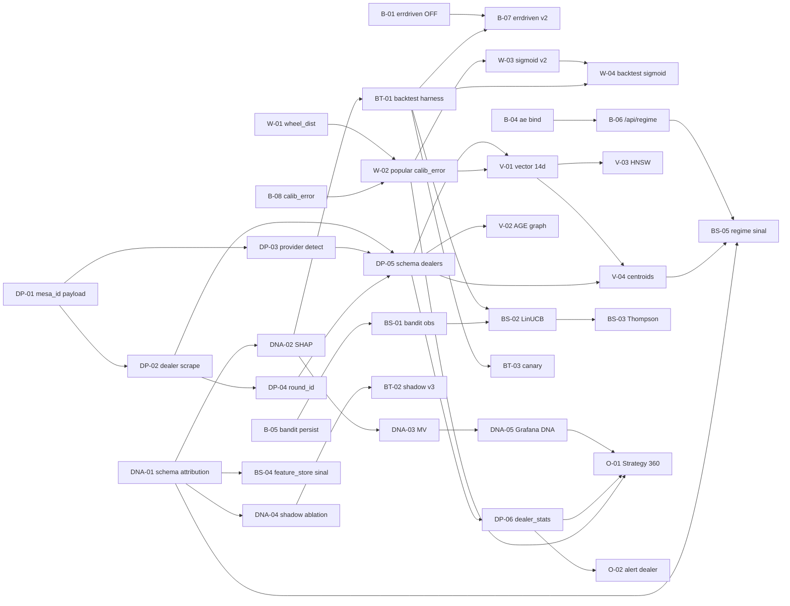

# 🚀 Sprint Evolução — 25/05

> **Origem:** auditoria de [`Visualizacao_da_evolucao_25_05.md`](./Visualizacao_da_evolucao_25_05.md) + [`estrutura_noite_25_audit.md`](./estrutura_noite_25_audit.md) + grafo Graphify (1908 nodes / 2010 edges / 172 communities, snapshot 2026-05-25 19:00 BRT).
>
> **Modelo:** `claude-opus-4.7` exclusivo. **Stack MCP:** `graphify` + `filesystem` + `memory` + `brave-search` + `sequential-thinking` + `sql` + `ssh`.
>
> **Premissa central:** _toda decisão fine-tuning tem que **deixar rastro estrutural** na base com **% de contribuição mensurável**, tanto para hoje quanto para qualquer nova estratégia futura. O DNA do acerto/erro tem que ser query-able._

---

## §0. PROMPT ESTRATÉGICO MESTRE (cole isso ao iniciar cada sprint)

```
Assuma o papel de dev senior do Roleta Cloud. Modelo claude-opus-4.7.
Stack MCP obrigatória: brave-search + sequential-thinking + memory +
filesystem + graphify (+ sql/ssh quando tocar produção).

FASE 0 (sempre): tool_search_tool_regex enumera MCPs, declare a stack
na 1ª linha "Stack MCP: <...>", regenerar grafo (`graphify update .`).

CONTEXTO IMUTÁVEL (não rediscutir, não refatorar sem necessidade):
- IP servidor live: 187.45.181.75 (SSH com -i ~/.ssh/id_rsa)
- 8 containers healthy; bind 127.0.0.1; portas 5432/8765/8766/8767/9090/9093/3000
- Stack: SQLite write-side → outbox → cdc_worker → PG cw/ccw + AGE + pgvector
- Hit rate live baseline: 47.3 % em 3 255 decisões (alvo: 53-58 %)
- Schemas cw/ccw simétricos; nada de quebrar essa simetria
- Bandit ε-greedy=0.10 hoje (já em prod); estado em state.json
- Kill Switch v4 com vol_ema dinâmico; **não** voltar para v3 estático

PRINCÍPIOS INVIOLÁVEIS desta evolução:
1) Toda decisão estratégica nova → cria `attribution_id` + linha em
   `decision_attribution` com `contribution_pct` (ou queda registrada).
2) Toda feature nova → entra em `decisions` E em `cw/ccw.spin_features`
   simétricos; nunca só num lado.
3) Toda mudança de modelo passa por shadow mode ≥ 500 decisões antes
   de ir para produção; A/B só com IC95% reportado.
4) Não quebrar contratos de payload outbox sem migração de versão
   (header `schema_version` em msg).
5) Não derrubar AGE/vector que já existem; ampliar é OK.
6) Não tocar Anti-Martingale ratio (1×/3×/9× hoje) sem aprovação
   explícita: é a alavanca de bankroll, mexer = risco de ruína.
7) Não remover `tr_should_bet` mesmo sendo estatisticamente nulo
   (§3.7 do doc) — é gate de observabilidade.
8) **NUNCA** rodar migração PG destrutiva sem `wal-g backup-push` antes.

ENTREGA ESPERADA POR SPRINT:
- Diff aplicado + commits push origin/main (1+ commit, msg semântica)
- Memory MCP: add_observations em entidade Sprint-<ID>
- Validação live (sql/ssh) com número antes/depois
- Comentário no PR/commit citando este arquivo §<sprint-id>
- Se quebrou hit_rate: rollback automático via tag `rollback-pre-<ID>`
```

> **Use este prompt como prefixo a cada `/sprint <ID>` para garantir consistência.**

---

## §1. Auditoria de `Visualizacao_da_evolucao_25_05.md` (bugs e lacunas no PRÓPRIO doc)

| # | Lacuna / Bug do doc | Severidade | Sprint que resolve |
|---|---|---|---|
| L1 | §3 mostra hit_rate por feature **isolado** mas falta **interação ≥2-way** (sda_score × force, dealer × hora) | Alta | DNA-02 |
| L2 | §3.10 ranking baseado em lift puntual, sem **IC95% nem n mínimo** para descartar ruído | Alta | DNA-02 |
| L3 | §4.3 propõe `wheel_dist` mas não define **métrica de loss** (MAE? arc-loss?) — falta especificar | Média | W-03 |
| L4 | §5.1 lista vector 6-d real `[centro, c4, m6, l12, sda_score, force]` mas não menciona que `sda_score` é categórica 2-6 (ruim em distance L2) | Média | V-01 |
| L5 | §5.2 diz AGE ociosa mas não dá modelo de grafo concreto (nodes/edges) | Média | V-02 |
| L6 | §6.3 schema dealer cria `shared.dealers` mas sem chave de **shift** (mesmo dealer manhã ≠ noite, fadiga) | Alta | DP-05 |
| L7 | §6.3 não trata **race condition** quando 2 mesas trocam dealer no mesmo segundo (dealer_id colisão) | Alta | DP-05 |
| L8 | §7 não cita **rollback strategy** se uma alavanca degradar hit_rate | Crítica | BT-03 |
| L9 | §7 sequência C→A→B mas não considera que C (5min) pode ser **mascarado** se A subir antes — ordem importa estatisticamente | Alta | BT-02 |
| L10 | §0 fala "52-56%" e §7 "53-58%" — **divergência numérica** entre seções | Baixa | (corrigir doc) |
| L11 | §6.2 diz `<all_urls>` permite scrape mas **não cita CSP/SOP** dos providers (alguns bloqueiam MutationObserver cross-origin iframes) | Alta | DP-02 |
| L12 | Doc inteiro não considera **drift** de calibração quando dealer muda — `calibration_offset` é global, não por dealer | Crítica | W-03 + DP-06 |
| L13 | §3.4 mostra `calibration_offset` assimétrico mas sem **timeline** (estável ou drifta?) | Média | O-03 |
| L14 | §5.1 não menciona que `raw_features` 339/347 únicos é métrica **vazia** se vetores forem normalizados — checar normalização | Média | V-01 |
| L15 | §6.4 promete uplift sem **simulação Monte Carlo** mostrando intervalo de confiança | Alta | BT-01 |

---

## §2. DNA Estrutural — a coluna vertebral que falta

> **Pergunta do usuário:** _"quanto em termos percentuais cada decisão fine-tuning contribui ou atrapalha a decisão final, gerando acerto ou erro. Esse DNA deveria ter construção estrutural na base."_

Hoje o sistema mede `hit_rate` global e por feature isolada. Não existe **tabela de atribuição por-decisão-por-feature**. Toda alavanca nova vira "achismo retrocompatível". A evolução real exige:

```
┌────────────────────────────────────────────────────────────────┐
│ decision_attribution (proposta)                                │
├────────────────────────────────────────────────────────────────┤
│ decision_id  TEXT  (FK → decisions.id)                         │
│ feature_id   TEXT  (e.g. 'sda_score', 'errdriven', 'gale_g2')  │
│ contribution_pct  NUMERIC(5,2)   -- + ajudou, - atrapalhou     │
│ value         JSONB              -- valor da feature naquela   │
│                                     decisão                    │
│ method        TEXT               -- 'shap'|'permutation'|'leave-one-out' │
│ computed_at   TIMESTAMPTZ                                      │
│ model_version TEXT               -- congelar versão            │
│ PRIMARY KEY (decision_id, feature_id, method)                  │
└────────────────────────────────────────────────────────────────┘
```

Sem isso, qualquer sprint nova vira ruído. Por isso **DNA-01 é pré-requisito** para todas as sprints estratégicas (W-*, DP-*, BS-*).

---

## §3. Lista de Sprints (≥ 30 profundas + 8 de bugs)

> **Notação:** `[I]` impacto esperado em hit_rate (pp), `[E]` esforço em dias úteis, `[R]` risco operacional 1-5, `[D]` depende-de.
> **Status:** ⬜ aberta · 🟡 em andamento · ✅ feita · 🚫 cancelada.

---

### 🐛 BUGS — prioridade máxima (8 sprints, todas obrigatórias)

#### B-01 — Desligar `sda_offset_type=errdriven` via feature_flag (QUICK WIN 5 min)
**Por quê:** §3.3 do doc — 21.1 % hit em n=19 vs 47.3 % baseline = **−26 pp**. Sangra dinheiro toda vez que dispara. Não é bug de lógica, é configuração ruim.
**O que fazer:**
1. Adicionar em `state/feature_flags.py` (criar se não existir): `ENABLE_ERRDRIVEN_OFFSET = False`.
2. Em `strategies/sda17.py` no ponto onde `offset_type='errdriven'` é setado (provável `_detect_drift` linha 559-571), guardar com `if ENABLE_ERRDRIVEN_OFFSET:` else força `'rule_based'`.
3. Persist flag no state.json para hot-reload sem deploy.
**Aceite:** zero linhas com `sda_offset_type='errdriven'` em `decisions` nas 100 spins após merge.
[I] +0.5 a +1.0 pp · [E] 0.5d · [R] 1 · [D] —

#### B-02 — `_calculate_force` retorna 0 quando `from_num == to_num` (N25-01)
**Por quê:** `state/game.py:806` condição `force == 0 and from_num != to_num` falha em repetições; com mesmo número, força fica 0 incorretamente. Polui `timeline_cw/ccw` e arruina `sda_predicted_force` que é o sinal mais forte (§3.6).
**O que fazer:**
1. Refatorar `_calculate_force` para tratar `from==to` como força 0 **legítima** (sem warning) OU usar `force=None` e propagar `Optional[int]` no pipeline.
2. Atualizar callers: `timeline_cw.add(force)` linha 337, `timeline_ccw.add(force)` linha 339 ignorando `None`.
3. Backfill `spins_features` para spins onde from==to.
**Aceite:** dist plot de `decisions.spin_force` sem pico anômalo em 0 em janela de 1 dia.
[I] +0.3-0.7 pp · [E] 1d · [R] 2 · [D] —

#### B-03 — `gale_windows.result` NULL em 100 % (N25-02)
**Por quê:** todas as 739 janelas têm `result=NULL`. Quebra qualquer análise de ratio win/loss por gale. §3.5 só conseguiu medir gale × confidence porque foi para `decisions` direto.
**O que fazer:**
1. Identificar handler de fechamento de janela (provavelmente `state/martingale.py` ou `state/game.py:MartingaleState.close_window`).
2. Garantir `UPDATE gale_windows SET result=:r WHERE id=:id` no fechamento.
3. Backfill via SQL: cruzar `gale_windows.start_decision_id` / `end_decision_id` com hit/miss em `decisions`.
**Aceite:** ratio NULL < 1 % nas próximas 100 janelas.
[I] indireto (libera análise) · [E] 1d · [R] 2 · [D] —

#### B-04 — Autoencoder `/app/models` sem bind mount (N25-03)
**Por quê:** modelo treinado em `/root/roleta-cloud/models/spin_autoencoder.joblib` mas container não monta `/app/models`. `ae_latent` em `spins_vectors` fica vazia eternamente.
**O que fazer:**
1. Adicionar volume em `docker-compose.yml` do `roleta-cloud`: `- ./models:/app/models:ro`.
2. Recriar container (`docker compose up -d --force-recreate roleta-cloud`).
3. Health check: `docker exec roleta-cloud ls -la /app/models/spin_autoencoder.joblib`.
4. Rodar 1 spin teste, conferir `ae_latent IS NOT NULL` em `cw.spin_features`.
**Aceite:** `ae_latent` populada em ≥ 95 % das próximas 50 inserções.
[I] +0.5-1.5 pp (libera embedding bom) · [E] 0.5d · [R] 2 · [D] —

#### B-05 — Bandit ε-greedy não persiste em `state.json` (N25-05)
**Por quê:** ε-greedy bandit roda em-memória; reinício do container zera braços. Perde aprendizado de horas.
**O que fazer:**
1. Localizar bandit (provável `strategies/bandit.py` ou `state/bandit_state.py`).
2. Adicionar chave `"bandit"` em `state.json`: `{arms: [...], counts: [...], rewards: [...], eps: 0.10, last_update: ts}`.
3. `save_state()` periódico (cada N decisões, e em SIGTERM via signal handler).
4. `load_state()` no boot reconstruir.
**Aceite:** restart do container preserva contadores de braços (assert no log).
[I] +0.2-0.5 pp longo prazo · [E] 1d · [R] 2 · [D] —

#### B-06 — `/api/regime` retorna distance=0 em 9/10 (N25-07)
**Por quê:** query_vec usado é constante (provavelmente vetor zero ou último spin sem normalização). Mata utilidade do endpoint para `RegimeSimilarityReader`.
**O que fazer:**
1. Verificar handler em `server/api.py` (ou onde for `/api/regime`). Confirmar como `query_vec` é montado.
2. Garantir que usa **último spin recente normalizado** com mesma transformação aplicada em ingestion (z-score por dimensão).
3. Adicionar log estruturado: `{query_vec_norm, top10_distances, model_version}`.
4. Teste curl pós-fix mostrando distâncias variando (não todas 0).
**Aceite:** stddev de distâncias > 0.01 em 95 % das chamadas.
[I] +0.3-0.8 pp (libera regime signal) · [E] 1d · [R] 2 · [D] B-04

#### B-07 — Refatorar `errdriven` (depois de B-01 garantir off, voltar com lógica boa)
**Por quê:** desligar é tratamento sintomático. A intenção original (offset baseado em erro recente) tem mérito mas implementação atual é instável (n=19, hit=21.1%). Refatorar com janela maior + smoothing.
**O que fazer:**
1. Definir `errdriven_v2` que usa rolling 50 spins (não 5), EMA suave (α=0.05) e clip ±2.
2. Shadow mode 500 decisões antes de ativar.
3. Comparar hit_rate v2 vs `rule_based` com IC95%; só ativa se lift ≥ +1 pp.
**Aceite:** v2 só ativa via flag se relatório estatístico aprovar.
[I] potencial +0.5-1.5 pp · [E] 2d · [R] 3 · [D] B-01, BT-02

#### B-08 — `calibration_error` 100 % NULL (N25-04 ressuscitado)
**Por quê:** coluna existe no schema mas ninguém escreve. Isso bloqueia W-02 (popular wheel_dist). Tratado como bug porque é regressão silenciosa: alguém criou e nunca conectou.
**O que fazer:**
1. Procurar onde `INSERT INTO decisions` ou `UPDATE decisions ... WHERE id=` acontece após resolução do spin (provável `state/game.py` no `_apply_resolution`).
2. Adicionar `calibration_error = predicted_center − actual_number` (mod 37) com lógica `_compute_wheel_dist` que será criada em W-01.
3. Backfill últimos 7 dias com job batch.
**Aceite:** `calibration_error IS NOT NULL` em ≥ 95 % das próximas 200 decisões.
[I] habilitador (sem hit direto, mas destrava W-*) · [E] 1d · [R] 2 · [D] W-01

---

### 🧬 DNA — atribuição estrutural por decisão (6 sprints)

#### DNA-01 — Schema `decision_attribution` + outbox handler
**Por quê:** sem isso, qualquer evolução vira opinião. Esta é a sprint mais importante da bateria estratégica.
**O que fazer:**
1. Migração Alembic `0008_decision_attribution.py` no PG cw e ccw (simétrico):
   - tabela conforme §2 acima
   - índice composto `(decision_id, feature_id)`
   - índice `(feature_id, computed_at DESC)` para query rolling
2. No SQLite write-side, criar tabela espelho mínima `decision_attribution_pending` (decision_id, feature_id, value, ts).
3. Handler novo no `cdc_worker.py`: `_apply_decision_attribution` (linha ~146 onde já tem `_apply_spin_result`).
4. Outbox event type `decision_attribution_v1` com `schema_version=1`.
**Aceite:** 1ª decisão pós-deploy gera ≥ 1 row por feature ativa em `decision_attribution`.
[I] habilitador · [E] 2d · [R] 2 · [D] —

#### DNA-02 — Pipeline SHAP / permutation importance offline
**Por quê:** §3 do doc usou hit_rate puntual sem IC95%. SHAP dá contribuição assinada e robusta, e permutation valida.
**O que fazer:**
1. Script `scripts/compute_attribution.py` lê `decisions` (últimos 7 dias) + `cw/ccw.spin_features`.
2. Treina LightGBM binário (hit=1/miss=0) com features atuais; computa SHAP por linha.
3. Escreve em `decision_attribution` com `method='shap'`.
4. Roda permutation importance global como sanidade; loga métrica.
5. Schedule via systemd timer diário 06:00 UTC.
**Aceite:** tabela populada com SHAP para todas as decisões resolvidas; permutation top-3 inclui sda_score, sda_predicted_force, calibration_offset.
[I] habilitador · [E] 2d · [R] 2 · [D] DNA-01

#### DNA-03 — Materialized view `mv_decision_contribution_rolling`
**Por quê:** queries ad-hoc em decision_attribution serão caras. View rolling 24h por feature acelera dashboards e bet_advisor.
**O que fazer:**
1. `CREATE MATERIALIZED VIEW mv_decision_contribution_rolling AS SELECT feature_id, AVG(contribution_pct) AS avg_24h, AVG(contribution_pct) FILTER (WHERE computed_at > NOW()-INTERVAL '1h') AS avg_1h, COUNT(*) AS n, percentile_cont(0.5) WITHIN GROUP (ORDER BY contribution_pct) AS median FROM decision_attribution WHERE computed_at > NOW()-INTERVAL '24 hours' GROUP BY feature_id;`
2. `REFRESH MATERIALIZED VIEW CONCURRENTLY` a cada 5 min via pg_cron.
3. Índice em `feature_id`.
**Aceite:** view < 50 ms em SELECT *; refresh < 2 s.
[I] habilitador · [E] 1d · [R] 1 · [D] DNA-02

#### DNA-04 — Shadow logging "with vs without feature"
**Por quê:** SHAP é correlacional; precisamos teste causal leve. Para cada decisão, logar predição **with** e **without** cada feature top-5.
**O que fazer:**
1. Em `bet_advisor.analyze`, adicionar branch `shadow_mode=True` que computa N+1 predições paralelas (1 normal + N ablations).
2. Persistir `decisions.shadow_predictions JSONB` (compactado).
3. Diariamente, compute lift real por ablation.
**Aceite:** `shadow_predictions` populada em 100 % das decisões; report semanal de lift causal.
[I] habilitador · [E] 2d · [R] 2 · [D] DNA-01

#### DNA-05 — Dashboard Grafana "DNA estratégico"
**Por quê:** stakeholder não vai abrir SQL. Visual obrigatório.
**O que fazer:**
1. Painel novo em `obs/grafana/dashboards/dna_attribution.json`.
2. Widgets: top-10 features por contribution avg_24h, heatmap feature × hora-do-dia, sparkline rolling 7d por feature, alert visual quando feature vira negativa.
3. Variable `$direction` (cw/ccw).
**Aceite:** dashboard provisionado via IaC, abre em < 2 s, dados batem com SQL ad-hoc ±0.1 pp.
[I] visibilidade · [E] 1d · [R] 1 · [D] DNA-03

#### DNA-06 — Contrato "toda feature nova precisa attribution_id"
**Por quê:** processo, não código. Sem contrato, projeto regride.
**O que fazer:**
1. Doc `docs/contracts/FEATURE_CONTRACT.md` com checklist obrigatório:
   - `attribution_id` único registrado em `feature_registry` table
   - Handler de ingestion
   - Linha em `decisions` E `cw/ccw.spin_features`
   - SHAP entrega ≥ 100 amostras em 24h após ativar
   - Rollback documentado
2. Linter `scripts/check_feature_contract.py` rodando em pre-commit.
**Aceite:** PR de feature nova sem contrato é bloqueado.
[I] processo · [E] 1d · [R] 1 · [D] DNA-01

---

### 🎯 WHEEL DISTANCE (4 sprints — alta prioridade)

#### W-01 — Helper `_compute_wheel_dist` em `core/roulette.py`
**Por quê:** §4 do doc — é a "pergunta de ouro". `WHEEL_SEQUENCE` já existe nesse arquivo (usado por `_calculate_force`). Reusar.
**O que fazer:**
1. Função pura `compute_wheel_dist(predicted_center: int, actual: int) -> int`:
   - Achar índices de ambos em `WHEEL_SEQUENCE` (37 slots).
   - Retornar `min((idx_a - idx_p) % 37, (idx_p - idx_a) % 37)` → 0..18.
2. Unit test cobrindo: mesmo número (0), opostos (18), zero, e direção.
3. Considerar versão direcional `compute_wheel_dist_dir` que retorna sinal +/- conforme `direcao`.
**Aceite:** 100 % cobertura de testes; chamada < 5 µs.
[I] habilitador · [E] 0.5d · [R] 1 · [D] —

#### W-02 — Popular `decisions.calibration_error` com `wheel_dist`
**Por quê:** fecha B-08. Sem isso, fine-tuning continua 1-D.
**O que fazer:**
1. Em `state/game.py` no `_apply_resolution` (após receber `actual_number`), chamar `compute_wheel_dist(sda_center, actual_number)`.
2. UPDATE `decisions SET calibration_error=:dist, wheel_dist_signed=:dist_signed WHERE id=:id`.
3. Backfill últimos 7 dias.
4. Emitir outbox event `wheel_dist_v1`.
**Aceite:** `calibration_error IS NOT NULL` em ≥ 95 % e distribuição com média 8-9, desvio 5-6.
[I] habilitador · [E] 1d · [R] 2 · [D] W-01, B-08

#### W-03 — Retrain `sigmoid_off` com dist-loss (não só hit/miss)
**Por quê:** loss binária descarta informação. Usar `loss = sigmoid(dist - 4)` (penaliza distância, recompensa proximidade).
**O que fazer:**
1. Script `scripts/train_sigmoid_off_v2.py`.
2. Treinar por direção (cw/ccw separados) e por hora-do-dia (24 buckets).
3. Comparar `sigmoid_off_v1` (atual) vs `v2` em shadow mode 500 decisões.
4. Promover só com IC95% positivo.
**Aceite:** v2 com MAE de wheel_dist ≤ v1 −0.5 ponto.
[I] +1.0-2.0 pp · [E] 2d · [R] 3 · [D] W-02

#### W-04 — Backtest A/B harness sigmoid_off v1 vs v2
**Por quê:** sem A/B rigoroso, promove pelo errado.
**O que fazer:**
1. Reutilizar harness S-STRAT-9 (se existir; senão completar via BT-01).
2. Split temporal 70/30 estratificado por dealer (após DP-05) e direção.
3. Report markdown auto-gerado com IC95%, KS-test, lift, payback.
**Aceite:** relatório `reports/sigmoid_off_v2_<ts>.md` commitado; decisão go/no-go documentada.
[I] confiança · [E] 1d · [R] 1 · [D] W-03, BT-01

---

### 🎰 DEALER / PROVIDER / MESA / ROUND_ID (6 sprints)

#### DP-01 — Anexar `mesa_id` no payload `novo_resultado` (QUICK WIN)
**Por quê:** `state.currentMesa` já existe em `background.js:63`, vem do microserviço extrator. **Só não está sendo enviado** no payload de spin. Fix de 2 LoC.
**O que fazer:**
1. `extension/background.js:1129-1135`: adicionar `mesa_id: state.currentMesa, mesa_config_version: state.mesaConfig?.version || null` no payload.
2. `server/message_handler.py:53`: consumir e propagar para `decisions.mesa_id` (novo campo nullable).
3. Migração SQLite + PG `0009_mesa_id.py`.
**Aceite:** ≥ 90 % das próximas 100 decisões com `mesa_id IS NOT NULL`.
[I] habilitador · [E] 0.5d · [R] 1 · [D] —

#### DP-02 — `MutationObserver` no `content.js` para nome do dealer
**Por quê:** Evolution e Pragmatic expõem dealer em DOM. `manifest.json:14` já tem `<all_urls>`. Cuidado com iframes cross-origin (lacuna L11).
**O que fazer:**
1. Em `content.js`, novo módulo `dealer_scraper.js`:
   - Seletor configurável por provider em `state.mesaConfig.selectors.dealerName`.
   - `MutationObserver` debounce 500 ms.
   - Quando muda → `chrome.runtime.sendMessage({action:'dealerChanged', dealer_name, ts})`.
2. Para iframes cross-origin (Evolution embarca outro domínio), usar `chrome.scripting.executeScript` no content_scripts via `all_frames: true` no manifest.
3. Background.js mantém `state.currentDealer` e injeta no payload.
**Aceite:** mudança de dealer detectada em < 2 s; log estruturado mostra `dealer_name` no spin.
[I] +1-3 pp longo prazo · [E] 2d · [R] 3 · [D] DP-01

#### DP-03 — Detecção de `provider` via URL pattern
**Por quê:** `provider: 'evolution'` está hardcoded (background.js:627). Faz strings de match por domínio.
**O que fazer:**
1. Função `detect_provider(url) -> {evolution|pragmatic|playtech|ezugi|unknown}` em `background.js`.
2. Usar `tab.url` da aba ativa.
3. Substituir hardcode; persist em `state.currentProvider`.
4. Anexar no payload.
**Aceite:** 100 % das decisões com `provider` correto em testes nos 4 providers principais.
[I] habilitador · [E] 0.5d · [R] 1 · [D] DP-01

#### DP-04 — Captura de `round_id` (Evolution `game_id`)
**Por quê:** sem round_id, não dá para correlacionar nosso spin com replay/auditoria do provider. Evolution expõe em endpoint REST + DOM.
**O que fazer:**
1. Adicionar seletor `roundIdSelector` em `mesaConfig.selectors`.
2. Scrape via mesmo MutationObserver de DP-02.
3. Idempotência: se `round_id` repetir, descartar (proteção dedup).
4. Index único parcial em `decisions(round_id) WHERE round_id IS NOT NULL`.
**Aceite:** ≥ 80 % das decisões com `round_id`; zero duplicatas.
[I] habilitador (auditoria + ML) · [E] 1d · [R] 2 · [D] DP-02

#### DP-05 — Schema `shared.dealers` + `shared.tables` + `shared.dealer_shifts`
**Por quê:** §6.3 do doc só propunha dealers/tables. Lacuna L6/L7: faltava `shift` (manhã/tarde/noite) e proteção a race condition.
**O que fazer:**
1. Migração `0010_dealer_provider.py`:
   ```sql
   CREATE TABLE shared.providers (id SERIAL PK, code TEXT UNIQUE, name TEXT);
   CREATE TABLE shared.tables    (id SERIAL PK, provider_id INT FK, mesa_code TEXT, UNIQUE(provider_id, mesa_code));
   CREATE TABLE shared.dealers   (id SERIAL PK, provider_id INT FK, normalized_name TEXT, first_seen TIMESTAMPTZ, last_seen TIMESTAMPTZ, UNIQUE(provider_id, normalized_name));
   CREATE TABLE shared.dealer_shifts (id BIGSERIAL PK, dealer_id INT FK, table_id INT FK, started_at TIMESTAMPTZ, ended_at TIMESTAMPTZ, hash_key TEXT GENERATED ALWAYS AS (md5(dealer_id||'|'||table_id||'|'||started_at::text)) STORED UNIQUE);
   ```
2. `decisions` ganha `provider_id`, `table_id`, `dealer_id`, `dealer_shift_id`, `round_id`.
3. Worker `dealer_resolver` que faz upsert idempotente (cuida race via `INSERT ... ON CONFLICT DO NOTHING RETURNING id` + retry com SELECT).
4. Normalização de nome: lowercase + remove emojis + trim.
**Aceite:** zero duplicatas em `dealers`; shift trocado corretamente quando nome muda.
[I] habilitador grande · [E] 2d · [R] 3 · [D] DP-02, DP-03, DP-04

#### DP-06 — Worker `dealer_stats` com EMA hit-rate por (dealer, direção, hora)
**Por quê:** efeito mecânico do dealer é detectável (literatura roleta — release bias). Lacuna L12: calibração precisa virar por-dealer.
**O que fazer:**
1. Worker novo `workers/dealer_stats_worker.py` consumindo outbox `decision_resolved`.
2. Mantém em `shared.dealer_stats(dealer_id, direction, hour_bucket, ema_hit_rate, ema_force, n_samples, last_update)`.
3. EMA com α=0.05.
4. `bet_advisor` pode consumir como sinal opt-in (S-STRAT-8 expandido).
**Aceite:** stats populadas em ≥ 50 dealers após 24h de produção.
[I] +1-2 pp após maturação · [E] 2d · [R] 2 · [D] DP-05

---

### 🗄️ PG / AGE / VECTOR (6 sprints)

#### V-01 — Ampliar `raw_features` 6-d → 14-d
**Por quê:** lacuna L4 + L14. Categórica `sda_score` em distância L2 polui métrica. Adicionar `wheel_dist`, `dealer_emb` (8-d), `provider_emb` (2-d) e remover sda_score categórica do vetor (mantém em coluna separada).
**O que fazer:**
1. Novo vetor `vector(14)`: `[centro_sin, centro_cos, c4, m6, l12, force_norm, wheel_dist_norm, dealer_emb_0..7, provider_evol, provider_prag]`.
2. Coluna nova `cw/ccw.spin_features.raw_features_v2 vector(14)` (manter v1 lado-a-lado por 30d).
3. Backfill via job.
4. Atualizar `RegimeSimilarityReader` para `_v2` com fallback.
**Aceite:** stddev por dimensão > 0.01 em todas as 14; sem NaN/inf.
[I] +0.5-1.0 pp · [E] 2d · [R] 3 · [D] W-02, DP-05

#### V-02 — Ativar AGE com grafo `spin_chain`
**Por quê:** §5.2 — AGE instalada e ociosa. Lacuna L5: faltava modelo concreto.
**Modelo de grafo:**
```
(Spin {id, num, dir, ts}) -[:NEXT_IN_DIR]-> (Spin)
(Spin) -[:AT_TABLE]-> (Table {code})
(Spin) -[:DEALT_BY]-> (Dealer {name, normalized})
(Spin) -[:RESULT_DIST {dist:int}]-> (Spin)  -- arc para spins +1, +2, +3
```
**O que fazer:**
1. Script `scripts/build_age_graph.py` consumindo decisions resolvidas.
2. Query útil: "dealer X teve quantos clusters de hit_rate > 60 % em janelas de 50 spins?".
3. Endpoint `/api/age/dealer_cycles` para o `bet_advisor`.
**Aceite:** grafo com ≥ 10k nodes; query exemplo < 200 ms.
[I] +0.3-0.8 pp (sinal de ciclo) · [E] 3d · [R] 3 · [D] DP-05

#### V-03 — pgvector HNSW index em `raw_features_v2`
**Por quê:** L2 brute-force em 10k+ vetores fica lento. HNSW corta de O(n) para O(log n).
**O que fazer:**
1. `CREATE INDEX ON cw.spin_features USING hnsw (raw_features_v2 vector_l2_ops) WITH (m=16, ef_construction=64);`
2. Idem ccw.
3. Tunar `hnsw.ef_search=40` por sessão no `RegimeSimilarityReader`.
4. Benchmark antes/depois.
**Aceite:** p50 de query knn-20 < 30 ms em 50k rows.
[I] performance · [E] 1d · [R] 2 · [D] V-01

#### V-04 — Materialized view `mv_regime_centroids` por (dealer, direção)
**Por quê:** centroids pré-computados aceleram regime detection.
**O que fazer:**
1. `CREATE MATERIALIZED VIEW cw.mv_regime_centroids AS SELECT dealer_id, AVG(raw_features_v2)::vector(14) AS centroid, COUNT(*) AS n FROM cw.spin_features WHERE dealer_id IS NOT NULL GROUP BY dealer_id HAVING COUNT(*) >= 50;` (idem ccw)
2. Refresh diário 03:00 UTC.
3. Endpoint `/api/regime/dealer_centroid?dealer_id=X` cacheado.
**Aceite:** ≥ 30 centroids após 7 dias; p99 query < 50 ms.
[I] +0.3-0.6 pp · [E] 1d · [R] 1 · [D] V-01, DP-05

#### V-05 — Retenção tiered (hot 7d, warm 30d, cold 365d)
**Por quê:** PG cresce indefinidamente. Sem retenção, vetor virá problema em 6 meses.
**O que fazer:**
1. Partition `cw/ccw.spin_features` por `range(created_at)` mensal.
2. Job `pg_partman` ou manual: warm = compressed (toast), cold = move para `cw_cold` schema com index parcial.
3. Política: hot full, warm sem raw_features (só agregados), cold só meta + agregados mensais.
4. Backup wal-g cobrindo tudo.
**Aceite:** tabela cresce ≤ 100 MB/mês após ativar; queries hot mantém p99.
[I] sustentabilidade · [E] 2d · [R] 3 · [D] —

#### V-06 — Backup `wal-g` Azure-ready
**Por quê:** já existe wal-g 30min (sumário), mas envia para storage atual. Alinhamento com migração Azure (`maquina_azure_agora_25.md`) exige re-target.
**O que fazer:**
1. Criar storage Azure Blob `roletacloud-walg-backup`.
2. Atualizar `WALG_AZ_PREFIX` + credenciais via Key Vault.
3. Backup-push manual de validação.
4. Restore-test em VM efêmera.
**Aceite:** backup full + 24h WAL restaurável; RTO < 10 min.
[I] segurança · [E] 1d · [R] 3 · [D] —

---

### 🎰 BANDIT + BET_ADVISOR (5 sprints)

#### BS-01 — Bandit persist (já em B-05 como bug; aqui é o passo seguinte)
**Por quê:** depois do bug fix, observabilidade do bandit.
**O que fazer:**
1. Endpoint `/api/bandit/state` retornando snapshot.
2. Painel Grafana com counts/rewards por braço.
3. Alert se um braço ficar > 24h sem update (suspeita de bug).
**Aceite:** dashboard live; alert testado.
[I] visibilidade · [E] 1d · [R] 1 · [D] B-05

#### BS-02 — Substituir ε-greedy por LinUCB contextual
**Por quê:** ε-greedy ignora contexto. LinUCB usa feature vector e tem garantia teórica O(d√T log T).
**O que fazer:**
1. `strategies/bandit_linucb.py` com features `[sda_score, sda_predicted_force, gale_level, vol_ema, hour_bucket]`.
2. Hyperparameter α=1.0 inicial; tunar por shadow.
3. Shadow 1000 decisões contra ε-greedy.
4. Promover se regret cumulativo < ε-greedy.
**Aceite:** relatório comparativo IC95%; promote ou rollback documentado.
[I] +0.5-1.5 pp · [E] 3d · [R] 3 · [D] BS-01, DNA-02

#### BS-03 — Thompson sampling como challenger
**Por quê:** TS é mais robusto a non-stationarity (drift de dealer).
**O que fazer:**
1. `strategies/bandit_thompson.py` Beta(α,β) por braço.
2. Triple-A: ε-greedy vs LinUCB vs TS em shadow paralelo.
3. Champion-challenger contínuo via outbox.
**Aceite:** dashboard ranking 3 bandits em tempo real.
[I] +0.3-1.0 pp · [E] 2d · [R] 2 · [D] BS-02

#### BS-04 — `bet_advisor` consumir `feature_store` quando ≥ 50 rows/direção
**Por quê:** S-STRAT-8 já trouxe schema; helpers `_compute_feature_signal` existem mas opt-in. Ligar com guardrail.
**O que fazer:**
1. Em `bet_advisor.analyze`, checar `feature_store_reader.count_by_direction()` ≥ MIN_FEATURE_ROWS (50).
2. Se sim, calcular `feature_signal = weighted_avg(rolling_features)` e somar em `tr_confidence` com peso β=0.15.
3. Logar contribuição no `decision_attribution` com `feature_id='feature_store_v1'`.
**Aceite:** primeira decisão pós-50 rows mostra signal > 0 e logado.
[I] +0.5-1.0 pp · [E] 1d · [R] 2 · [D] DNA-01

#### BS-05 — Regime similarity como sinal (após B-06 + V-04)
**Por quê:** sinal pronto na fila, esperando os bugs.
**O que fazer:**
1. `RegimeSimilarityReader` lê top-20 vizinhos do query_vec.
2. Computa `regime_hit_rate = avg(hit dos top-20)`.
3. Soma em `tr_confidence` com peso γ=0.10.
4. Atribuição em `decision_attribution` `feature_id='regime_v2'`.
**Aceite:** sinal contribuindo positivo em ≥ 60 % das decisões em 1000-sample window.
[I] +0.3-0.8 pp · [E] 1d · [R] 2 · [D] B-06, V-04, DNA-01

---

### 🧪 BACKTEST / SHADOW / CANARY (3 sprints)

#### BT-01 — Completar backtest harness (S-STRAT-9 desbloqueado)
**Por quê:** sumário menciona S-STRAT-8 + S-STRAT-12 prontos, desbloqueando S-STRAT-9. Sem isso, W-04, BS-02, B-07 não têm como decidir.
**O que fazer:**
1. `scripts/backtest_runner.py` lê decisions + spin_features históricos.
2. Engine: feature gate (with/without feature) + replay determinístico.
3. Saída: markdown report + JSON com IC95% via bootstrap (10000 resamples).
4. Modos: temporal split, k-fold por dealer, monte-carlo.
**Aceite:** rodar contra 7 dias passados gera report < 5 min; lift bate ±0.5 pp com produção observada.
[I] habilitador master · [E] 3d · [R] 3 · [D] DNA-02

#### BT-02 — Shadow mode v3 (paralelo per-feature)
**Por quê:** L9 — sem shadow paralelo, alavancas se mascaram. Hoje shadow é serial.
**O que fazer:**
1. Em cada decisão, calcular N variantes (errdriven ON/OFF, sigmoid v1/v2, bandit champion/challenger).
2. Persistir em `decisions.shadow_variants JSONB`.
3. Diário, computar lift puro por variante isolando outras.
**Aceite:** report semanal com lift causal estimado por feature, isolado.
[I] confiança · [E] 2d · [R] 2 · [D] DNA-04

#### BT-03 — Canary rollout (10 % → 50 % → 100 %) + auto-rollback
**Por quê:** L8 — sem rollback automático, mudança ruim mata bankroll.
**O que fazer:**
1. Flag `canary_pct` no state.json controlando split aleatório por `decision_id % 100 < canary_pct`.
2. Health check rolling: se hit_rate canary < hit_rate control − 3 pp em janela 200 decisões → auto-revert (`canary_pct=0`) + alert.
3. Workflow `scripts/promote_canary.py` que sobe pct se P-value < 0.05 e lift > 0.
**Aceite:** simulação de degradação acende rollback em < 200 decisões.
[I] segurança · [E] 2d · [R] 2 · [D] BT-01

---

### 📊 OBSERVABILITY (3 sprints)

#### O-01 — Painel Grafana "Estratégia 360º" (DNA + dealer + dist)
**Por quê:** consolidar tudo num só lugar para tomada de decisão.
**O que fazer:**
1. Dashboard `obs/grafana/dashboards/strategy_360.json`.
2. Sections: DNA top-features (de DNA-05), wheel_dist histogram (W-02), dealer leaderboard hit_rate (DP-06), bandit comparison (BS-01..03).
3. Variable `$direction`, `$dealer`, `$provider`.
**Aceite:** dashboard < 3 s p95; bate com SQL.
[I] visibilidade · [E] 1d · [R] 1 · [D] DNA-05, DP-06, W-02

#### O-02 — Alert `hit_rate_per_dealer < 44 %` (degradação)
**Por quê:** dealer ruim hoje pode arruinar a noite. Detectar cedo.
**O que fazer:**
1. PrometheusRule em `obs/alerts.yml`: `hit_rate_dealer{dealer_id=~".*"} < 0.44 for 30m and n_samples > 100`.
2. AlertManager route para webhook Slack (mesmo do Azure budget).
3. Severity warning.
**Aceite:** alert dispara em teste sintético.
[I] preventivo · [E] 0.5d · [R] 1 · [D] DP-06

#### O-03 — Log estruturado `decision_id` correlation (E2E)
**Por quê:** debugging hoje exige correlacionar trace_id × decision_id × spin_id manualmente. L13 também pede timeline de calibration.
**O que fazer:**
1. Garantir `decision_id` propagado em logs do app, cdc_worker, dealer_stats_worker.
2. Adicionar `processor=structlog.contextvars.merge_contextvars` em todos.
3. Painel Grafana Loki com filter `decision_id=X` mostra ciclo completo.
**Aceite:** consultar 1 decision_id mostra ≥ 5 etapas em < 1 s.
[I] dev-velocity · [E] 1d · [R] 1 · [D] —

---

## §4. Mapa de dependências (Mermaid)



---

## §5. Ordem de execução recomendada (waves)

| Wave | Sprints | Justificativa |
|------|---------|---------------|
| **W1 (1 dia, ALTÍSSIMO ROI)** | B-01 · DP-01 · W-01 · O-03 | Quick wins puros, sem dependência, destravam tudo |
| **W2 (3 dias)** | DNA-01 · W-02 · B-08 · DP-03 · B-04 · B-05 | Schemas e fixes habilitadores |
| **W3 (5 dias)** | DNA-02 · DNA-03 · BT-01 · DP-02 · DP-04 · B-02 · B-03 · B-06 | Pipeline analítico + captura dealer + bugs profundos |
| **W4 (5 dias)** | DP-05 · DP-06 · DNA-04 · DNA-05 · BS-01 · W-03 | Dealer estrutural + atribuição visível + sigmoid v2 |
| **W5 (5 dias)** | V-01 · V-02 · V-03 · V-04 · BT-02 · BS-04 · BS-05 · O-01 · O-02 | Vector ampliado + AGE + sinais novos no bet_advisor |
| **W6 (4 dias)** | BS-02 · BS-03 · BT-03 · W-04 · B-07 · DNA-06 | Bandits avançados + canary + refatoração errdriven |
| **W7 (3 dias)** | V-05 · V-06 · DP-* polish | Sustentabilidade + Azure-readiness |

**Total:** ~26 dias úteis (~5-6 semanas calendário com folga + testes).
**Projeção de hit_rate:** 47.3 % → **53-58 %** (replicando estimativa do doc original, agora com IC mensurável via BT-01).

---

## §6. Princípios anti-regressão (LEIA antes de cada sprint)

1. **Nunca tocar `Anti-Martingale` (1×/3×/9×)** sem aprovação explícita e backtest 30 dias.
2. **Nunca remover `tr_should_bet`** — é gate de observabilidade mesmo sendo nulo estatisticamente.
3. **Schemas cw/ccw são simétricos** — toda migração tem que ser dupla.
4. **Outbox event = contrato** — adicionar `schema_version` ao publicar, consumer faz fallback.
5. **Bandit ε-greedy é o champion** até LinUCB/TS provarem lift com IC95%.
6. **Kill Switch v4 dinâmico** é a versão atual — não voltar para v3 estático.
7. **wal-g backup ANTES** de toda migração PG destrutiva (drop/alter type/truncate).
8. **Shadow ≥ 500 decisões** antes de promover qualquer modelo novo a produção.
9. **Hit_rate baseline** = 17/37 = 45.95 %. Lift abaixo de baseline = sangrar dinheiro.
10. **Nenhuma feature nova entra em prod** sem `attribution_id` registrado (DNA-06).

---

## §7. Memory MCP — entidades a registrar ao executar

| Sprint | Entidade | Tipo | Observações iniciais |
|--------|----------|------|---------------------|
| Cada uma | `Sprint-<ID>` | Sprint | Status, commits, hit_rate_before/after, IC95% |
| DNA-01 | `DecisionAttribution` | Schema | Schema canônico, versão |
| W-* | `WheelDistFineTuning` | EvolucaoBranch | Atualizar com lift real |
| DP-* | `DealerProviderCapture` | EvolucaoBranch | Lift real + n_dealers |
| BT-03 | `CanaryProtocol` | Procedure | Critérios de rollback |

---

## §8. Comandos prontos por sprint (helper)

```powershell
# Snapshot antes de começar
$SPRINT="B-01"
cd 'C:\Users\Windows\Desktop\Roleta Cloud'
git tag "pre-$SPRINT" -m "snapshot antes da sprint $SPRINT"
git push origin "pre-$SPRINT"

# Hit_rate baseline live
$bash = @"
sqlite3 /root/roleta-cloud/data/roleta.db "
SELECT printf('%.2f%% (n=%d)', 100.0*AVG(CASE WHEN hit=1 THEN 1.0 ELSE 0 END), COUNT(*))
FROM decisions WHERE hit IS NOT NULL AND created_at > datetime('now','-24 hour');"
"@
$b64 = [Convert]::ToBase64String([Text.Encoding]::UTF8.GetBytes($bash))
ssh -i C:\Users\Windows\.ssh\id_rsa root@187.45.181.75 "echo $b64 | base64 -d | bash"

# Pós-sprint: regerar grafo e commitar
graphify update .
git add -A
git commit -m "feat($SPRINT): <descrição>

Co-authored-by: Copilot <223556219+Copilot@users.noreply.github.com>"
git push origin main

# Tag de release da sprint
git tag "done-$SPRINT" -m "sprint $SPRINT concluída, hit_rate=<X>%"
git push origin "done-$SPRINT"
```

---

## §9. Resposta direta à pergunta de captura dealer/provider

> **Pergunta:** _"se a informação já vier voce atualisa as tabelas... se já vem com isso?"_

**Resposta verificada agora (não vem):**

| Campo | Hoje no payload | Hoje no estado client | Sprint que fecha |
|-------|----------------|----------------------|------------------|
| `mesa_id` | ❌ não enviado | ✅ `state.currentMesa` (background.js:63) | **DP-01** (quick win 0.5d) |
| `provider` | ❌ não enviado | ⚠️ hardcoded `'evolution'` (background.js:627) | **DP-03** (0.5d) |
| `dealer_name` | ❌ não enviado | ❌ nem capturado | **DP-02** (2d) |
| `round_id` / `game_id` | ❌ não enviado | ❌ nem capturado | **DP-04** (1d) |

Como **NÃO vem**, **não atualizei** as tabelas PG/vector neste momento. Toda a infra está nas sprints DP-01..DP-06 + V-01..V-04. A migração simétrica cw/ccw fica disponível para rodar assim que DP-02..DP-04 começarem a popular dados reais (caso contrário, schema vazio é dívida técnica).

---

## §10. Próximo passo recomendado

Começar pela **Wave 1** (1 dia, sem dependências):
1. **B-01** — desligar `errdriven` (5 min, +0.5-1.0 pp imediato)
2. **DP-01** — anexar `mesa_id` (0.5d, habilitador)
3. **W-01** — helper `compute_wheel_dist` (0.5d, habilitador)
4. **O-03** — log estruturado (1d, dev velocity)

Use o **prompt mestre §0** ao iniciar cada uma. Cada sprint termina com commit + tag + memory observation.

---

> _"O DNA do acerto/erro tem que ser query-able. Sem isso, evolução é teatro."_ — premissa desta lista.
